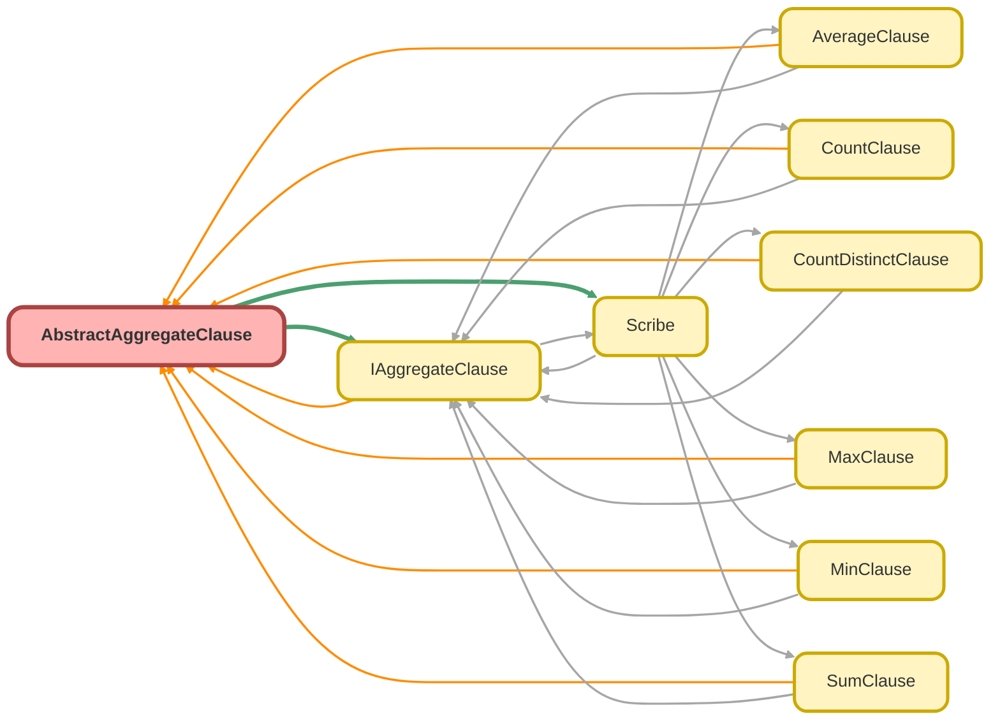

---
hide:
  - path
---

# AbstractAggregateClause Class
`abstract`

An abstract base class that implements the `IAggregateClause` interface. 
 
It provides the common properties and shared functionality for all concrete aggregate 
clause implementations. This includes schema validation and the logic for building 
aggregate clauses on parent relationship fields ( `buildWithChild` ). 
 
Subclasses are responsible for implementing the abstract `build()` method to generate 
the specific syntax for their respective aggregate functions (e.g., `SUM` , `AVG` , `COUNT` ).

**See** [IAggregateClause](IAggregateClause.md)

**See** [Scribe](Scribe.md)

**Implements**

[IAggregateClause](IAggregateClause.md)

## Class Diagram



<!-- Apex description -->

## Apex Code

```java
/**
 * Copyright 2025 Hiroyuki Matsuoka
 *
 * Licensed under the Apache License, Version 2.0 (the "License");
 * you may not use this file except in compliance with the License.
 * You may obtain a copy of the License at
 *
 * http://www.apache.org/licenses/LICENSE-2.0
 *
 * Unless required by applicable law or agreed to in writing, software
 * distributed under the License is distributed on an "AS IS" BASIS,
 * WITHOUT WARRANTIES OR CONDITIONS OF ANY KIND, either express or implied.
 * See the License for the specific language governing permissions and
 * limitations under the License.
 */

/**
 * @description An abstract base class that implements the `IAggregateClause` interface.
 *
 * It provides the common properties and shared functionality for all concrete aggregate
 * clause implementations. This includes schema validation and the logic for building
 * aggregate clauses on parent relationship fields (`buildWithChild`).
 *
 * Subclasses are responsible for implementing the abstract `build()` method to generate
 * the specific syntax for their respective aggregate functions (e.g., `SUM`, `AVG`, `COUNT`).
 * @see IAggregateClause
 * @see Scribe
 */
public with sharing abstract class AbstractAggregateClause implements IAggregateClause {
  protected final Schema.SObjectType sObjectType;
  protected final Map<String, Schema.SObjectField> fieldMap;
  protected final String fieldName;
  protected final String alias;

  /**
   * Constructor for AbstractAggregateClause.
   *
   * @param sObjectType The SObjectType to use for context.
   * @param fieldMap The field map of the relevant SObject.
   * @param fieldName The API name of the field being aggregated.
   * @param alias The alias for the aggregate result.
   */
  public AbstractAggregateClause(
    Schema.SObjectType sObjectType,
    Map<String, Schema.SObjectField> fieldMap,
    String fieldName,
    String alias
  ) {
    if (String.isBlank(fieldName)) {
      throw new IllegalArgumentException('fieldName must not be blank');
    }
    if (String.isBlank(alias)) {
      throw new IllegalArgumentException('alias must not be blank');
    }
    this.sObjectType = sObjectType;
    this.fieldMap = fieldMap;
    this.fieldName = fieldName;
    this.alias = alias;
  }

  /**
   * @inheritDoc
   */
  public String getAlias() {
    return alias;
  }

  /**
   * @inheritDoc
   */
  public String getFieldName() {
    return fieldName;
  }

  /**
   * @inheritDoc
   */
  public abstract IAggregateClause overrideMetaData(
    Schema.SObjectType sObjectType,
    Map<String, Schema.SObjectField> fieldMap
  );

  /**
   * @inheritDoc
   */
  public String buildWithChild(String childRelationName) {
    String buildResult = this.build();
    // The initial `build()` result is in the format "FUNCTION(FieldName) alias", e.g., "SUM(Amount) totalAmount".
    // To create a clause for a parent relationship query, we need to prepend the relationship name to the field name.
    // e.g., "SUM(ParentRelationName.Amount) totalAmount".
    // We achieve this by splitting the string at the opening parenthesis '(',
    // prepending the relationship name to the second part, and then rejoining.
    List<String> buildResultParts = buildResult.split('\\(');
    if (childRelationName != null) {
      buildResultParts[1] = childRelationName + '.' + buildResultParts[1];
    }
    return String.join(buildResultParts, '(');
  }

  /**
   * @inheritDoc
   */
  public abstract String build();

  /**
   * Validates that the specified field name exists in the field map.
   *
   * @param fieldName The field name to validate.
   * @throws QueryException if the field does not exist in the field map.
   */
  protected void validateFieldName(String fieldName) {
    if (!fieldMap.containsKey(fieldName)) {
      String error = String.format(
        'The specified field does not exist in the object\'s fields. object name: {0}, field name: {1}',
        new List<String>{ sObjectType.getDescribe().getName(), fieldName }
      );
      throw new QueryException(error);
    }
  }
}
```

## Constructors
### `AbstractAggregateClause(sObjectType, fieldMap, fieldName, alias)`

Constructor for AbstractAggregateClause.

#### Signature
```apex
public AbstractAggregateClause(Schema.SObjectType sObjectType, Map<String,Schema.SObjectField> fieldMap, String fieldName, String alias)
```

#### Parameters
| Name | Type | Description |
|------|------|-------------|
| sObjectType | Schema.SObjectType | The SObjectType to use for context. |
| fieldMap | Map<String,Schema.SObjectField> | The field map of the relevant SObject. |
| fieldName | String | The API name of the field being aggregated. |
| alias | String | The alias for the aggregate result. |

## Methods
### `getAlias()`

**InheritDoc**

#### Signature
```apex
public String getAlias()
```

#### Return Type
**String**

---

### `getFieldName()`

**InheritDoc**

#### Signature
```apex
public String getFieldName()
```

#### Return Type
**String**

---

### `overrideMetaData(sObjectType, fieldMap)`

**InheritDoc**

#### Signature
```apex
public abstract IAggregateClause overrideMetaData(Schema.SObjectType sObjectType, Map<String,Schema.SObjectField> fieldMap)
```

#### Parameters
| Name | Type | Description |
|------|------|-------------|
| sObjectType | Schema.SObjectType |  |
| fieldMap | Map<String,Schema.SObjectField> |  |

#### Return Type
**[IAggregateClause](IAggregateClause.md)**

---

### `buildWithChild(childRelationName)`

**InheritDoc**

#### Signature
```apex
public String buildWithChild(String childRelationName)
```

#### Parameters
| Name | Type | Description |
|------|------|-------------|
| childRelationName | String |  |

#### Return Type
**String**

---

### `build()`

**InheritDoc**

#### Signature
```apex
public abstract String build()
```

#### Return Type
**String**