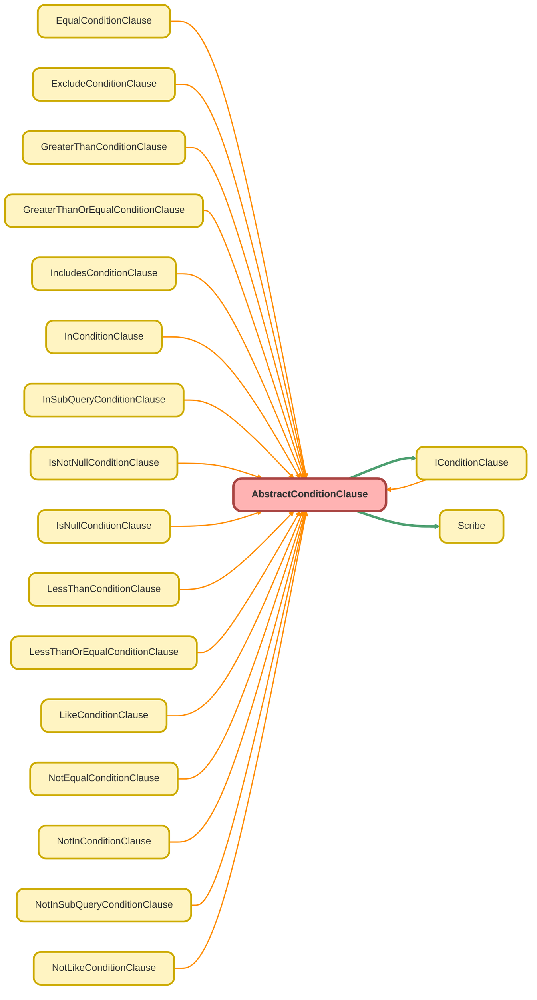

---
hide:
  - path
---

# AbstractConditionClause Class
`abstract`

An abstract base class that implements the `IConditionClause` interface. 
 
It provides the common properties and shared functionality for all concrete condition 
clause implementations. This includes helper methods for schema validation (e.g., `getFieldType` ) 
and for formatting various Apex data types into SOQL-compatible string literals 
(e.g., `formatAndCastToString` ). 
 
Subclasses are responsible for implementing the abstract methods to generate the 
specific syntax for their respective conditions (e.g., `=` , `LIKE` , `IN` ).

**See** [IConditionClause](IConditionClause.md)

**See** [Scribe](Scribe.md)

**Implements**

[IConditionClause](IConditionClause.md)

## Class Diagram



<!-- Apex description -->

## Apex Code

```java
/**
 * Copyright 2025 Hiroyuki Matsuoka
 *
 * Licensed under the Apache License, Version 2.0 (the "License");
 * you may not use this file except in compliance with the License.
 * You may obtain a copy of the License at
 *
 * http://www.apache.org/licenses/LICENSE-2.0
 *
 * Unless required by applicable law or agreed to in writing, software
 * distributed under the License is distributed on an "AS IS" BASIS,
 * WITHOUT WARRANTIES OR CONDITIONS OF ANY KIND, either express or implied.
 * See the License for the specific language governing permissions and
 * limitations under the License.
 */

/**
 * @description An abstract base class that implements the `IConditionClause` interface.
 *
 * It provides the common properties and shared functionality for all concrete condition
 * clause implementations. This includes helper methods for schema validation (e.g., `getFieldType`)
 * and for formatting various Apex data types into SOQL-compatible string literals
 * (e.g., `formatAndCastToString`).
 *
 * Subclasses are responsible for implementing the abstract methods to generate the
 * specific syntax for their respective conditions (e.g., `=`, `LIKE`, `IN`).
 * @see IConditionClause
 * @see Scribe
 */
public with sharing abstract class AbstractConditionClause implements IConditionClause {
  protected final Schema.SObjectType sObjectType;
  protected final Map<String, Schema.SObjectField> fieldMap;
  protected final String field;

  /**
   * A list of Schema.DisplayType values that require single quotes in a SOQL literal.
   */
  protected final List<Schema.DisplayType> TYPES_REQUIRING_SINGLE_QUOTES = new List<Schema.DisplayType>{
    DisplayType.STRING,
    DisplayType.TEXTAREA,
    DisplayType.PICKLIST,
    DisplayType.MULTIPICKLIST,
    DisplayType.ID,
    DisplayType.REFERENCE,
    DisplayType.URL,
    DisplayType.EMAIL,
    DisplayType.PHONE,
    DisplayType.ENCRYPTEDSTRING,
    DisplayType.ANYTYPE
  };

  /**
   * Constructor for the abstract clause.
   *
   * @param sObjectType The SObject type context.
   * @param fieldMap The field map for schema validation.
   * @param field The API name of the field for the condition.
   */
  public AbstractConditionClause(
    Schema.SObjectType sObjectType,
    Map<String, Schema.SObjectField> fieldMap,
    String field
  ) {
    this.sObjectType = sObjectType;
    this.fieldMap = fieldMap;
    this.field = field;
  }

  // Abstract methods to be implemented by subclasses.
  public abstract IConditionClause overrideMetaData(
    Schema.SObjectType sObjectType,
    Map<String, Schema.SObjectField> fieldMap
  );
  public abstract IConditionClause overrideField(String field);
  private abstract String checkAndCast();
  public abstract String build();

  /**
   * @inheritDoc
   */
  public String getFieldName() {
    return this.field;
  }

  /**
   * Gets the Schema.DisplayType of the specified field.
   *
   * @param field The API name of the field.
   * @return The field's display type.
   */
  protected Schema.DisplayType getFieldType(String field) {
    if (this.sObjectType == null) {
      throw new QueryException('The source SObjectType has not been set.');
    }
    if (!this.fieldMap.containsKey(field)) {
      // If the field doesn't exist in the describe map, default to String.
      // This handles special polymorphic fields like 'Queue.Name',
      // which are valid in SOQL but may not appear in the initial describe result.
      return Schema.DisplayType.STRING;
    }
    Schema.DisplayType fieldType = this.fieldMap.get(field).getDescribe().getType();
    return fieldType;
  }

  /**
   * Formats a given value into a SOQL literal string based on its data type.
   * Handles special formatting for Date and Datetime values.
   *
   * @param value The value to format.
   * @return A string representation of the value suitable for a SOQL query.
   */
  protected String formatAndCastToString(Object value) {
    if (value instanceof Date) {
      Date dateValue = (Date) value;
      return dateValue.year() +
        '-' +
        String.valueOf(dateValue.month()).leftPad(2, '0') +
        '-' +
        String.valueOf(dateValue.day()).leftPad(2, '0');
    }
    if (value instanceof Datetime) {
      Datetime datetimeValue = (Datetime) value;
      return dateTimeValue.formatGmt('yyyy-MM-dd\'T\'HH:mm:ss\'Z\'');
    }
    return String.escapeSingleQuotes(String.valueOf(value));
  }
}
```

## Constructors
### `AbstractConditionClause(sObjectType, fieldMap, field)`

Constructor for the abstract clause.

#### Signature
```apex
public AbstractConditionClause(Schema.SObjectType sObjectType, Map<String,Schema.SObjectField> fieldMap, String field)
```

#### Parameters
| Name | Type | Description |
|------|------|-------------|
| sObjectType | Schema.SObjectType | The SObject type context. |
| fieldMap | Map<String,Schema.SObjectField> | The field map for schema validation. |
| field | String | The API name of the field for the condition. |

## Methods
### `overrideMetaData(sObjectType, fieldMap)`

#### Signature
```apex
public abstract IConditionClause overrideMetaData(Schema.SObjectType sObjectType, Map<String,Schema.SObjectField> fieldMap)
```

#### Parameters
| Name | Type | Description |
|------|------|-------------|
| sObjectType | Schema.SObjectType |  |
| fieldMap | Map<String,Schema.SObjectField> |  |

#### Return Type
**[IConditionClause](IConditionClause.md)**

---

### `overrideField(field)`

#### Signature
```apex
public abstract IConditionClause overrideField(String field)
```

#### Parameters
| Name | Type | Description |
|------|------|-------------|
| field | String |  |

#### Return Type
**[IConditionClause](IConditionClause.md)**

---

### `checkAndCast()`

#### Signature
```apex
private abstract String checkAndCast()
```

#### Return Type
**String**

---

### `build()`

#### Signature
```apex
public abstract String build()
```

#### Return Type
**String**

---

### `getFieldName()`

**InheritDoc**

#### Signature
```apex
public String getFieldName()
```

#### Return Type
**String**