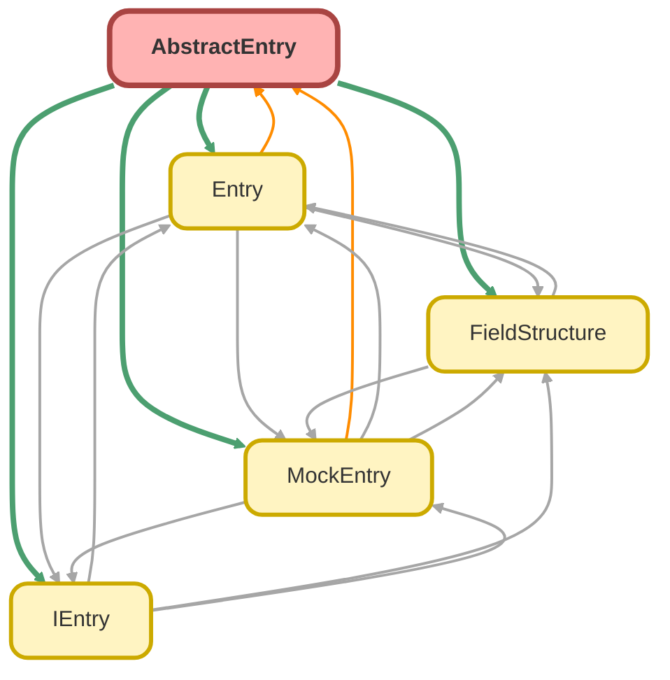

---
hide:
  - path
---

# AbstractEntry Class
`abstract`

An abstract base class that implements the `IEntry` interface. 
It provides a common foundation and shared logic for concrete implementations 
like `Entry` (for real SObjects) and `MockEntry` (for test data). 
This class handles the dual nature of query results, capable of representing both 
standard `SObject` records and `AggregateResult` records.

**Implements**

[IEntry](IEntry.md)

## Class Diagram



<!-- Apex description -->

## Apex Code

```java
/**
 * Copyright 2025 Hiroyuki Matsuoka
 *
 * Licensed under the Apache License, Version 2.0 (the "License");
 * you may not use this file except in compliance with the License.
 * You may obtain a copy of the License at
 *
 * http://www.apache.org/licenses/LICENSE-2.0
 *
 * Unless required by applicable law or agreed to in writing, software
 * distributed under the License is distributed on an "AS IS" BASIS,
 * WITHOUT WARRANTIES OR CONDITIONS OF ANY KIND, either express or implied.
 * See the License for the specific language governing permissions and
 * limitations under the License.
 */

/**
 * @description An abstract base class that implements the `IEntry` interface.
 * It provides a common foundation and shared logic for concrete implementations
 * like `Entry` (for real SObjects) and `MockEntry` (for test data).
 * This class handles the dual nature of query results, capable of representing both
 * standard `SObject` records and `AggregateResult` records.
 */
public abstract class AbstractEntry implements IEntry {
  protected final SObject record;
  protected final AggregateResult aggregateResult;
  protected final FieldStructure fieldStructure;
  protected Schema.DescribeSObjectResult describeResult;
  @TestVisible
  protected Boolean hasAggregateResult = false;

  /**
   * constructor
   *
   * @param record SObject
   */
  protected AbstractEntry(SObject record) {
    this.record = record;
    this.aggregateResult = null;
    this.fieldStructure = new FieldStructure();
    this.hasAggregateResult = this.record == null;
  }

  /**
   * constructor for AggregateResult
   *
   * @param aggregateResult AggregateResult
   */
  protected AbstractEntry(AggregateResult aggregateResult, FieldStructure fieldStructure) {
    this.record = null;
    this.aggregateResult = aggregateResult;
    this.fieldStructure = fieldStructure;
    this.hasAggregateResult = this.record == null;
  }

  /**
   * constructor with selected fields and relation fields
   *
   * @param record SObject
   * @param fieldStructure FieldStructure containing picked fields and relations
   */
  protected AbstractEntry(SObject record, FieldStructure fieldStructure) {
    this.record = record;
    this.fieldStructure = fieldStructure;
    this.hasAggregateResult = this.record == null;
  }

  /**
   * @inheritDoc
   */
  public List<IEntry> getThrough(String junctionObjectName, String relatedKey) {
    List<IEntry> junctionEntries = this.getChildren(junctionObjectName);
    if (junctionEntries.isEmpty()) {
      return new List<IEntry>();
    }

    List<IEntry> relatedEntries = new List<IEntry>();
    Schema.DescribeSObjectResult junctionDescribeResult = junctionEntries[0]
      .getRecord()
      .getSObjectType()
      .getDescribe();
    for (IEntry junctionEntry : junctionEntries) {
      junctionEntry.setDescribeResult(junctionDescribeResult);
      relatedEntries.add(junctionEntry.getParent(relatedKey));
    }
    return relatedEntries;
  }

  public List<IEntry> getThroughByRelationName(String junctionRelationName, String relatedKey) {
    List<IEntry> junctionEntries = this.getChildrenByRelationName(junctionRelationName);
    if (junctionEntries.isEmpty()) {
      return new List<IEntry>();
    }

    List<IEntry> relatedEntries = new List<IEntry>();
    Schema.DescribeSObjectResult junctionDescribeResult = junctionEntries[0]
      .getRecord()
      .getSObjectType()
      .getDescribe();
    for (IEntry junctionEntry : junctionEntries) {
      junctionEntry.setDescribeResult(junctionDescribeResult);
      relatedEntries.add(junctionEntry.getParent(relatedKey));
    }
    return relatedEntries;
  }

  /**
   * Ensure that describeResult is set.
   */
  protected void ensureDescribeResultIfNeeded() {
    if (this.describeResult == null) {
      Schema.DescribeSObjectResult describeResult = this.record.getSObjectType().getDescribe();
      this.setDescribeResult(describeResult);
    }
  }

  /**
   * @inheritDoc
   */
  public void setDescribeResult(Schema.DescribeSObjectResult describeResult) {
    this.describeResult = describeResult;
  }

  /**
   * get child relation name from child object name.
   * If there are multiple relationships with the same child object name, an exception is thrown.
   *
   * @param childObjectName child object name
   * @return child relation name
   * @throws QueryException if the child object name is not exist in the parent object's children relationships
   *                        or if there are multiple relationships with the same child object name
   */
  protected String getChildrenRelationNameFromChildObjectName(String childObjectName) {
    List<Schema.ChildRelationship> childRelationShips = this.describeResult.getChildRelationships();

    Schema.ChildRelationship targetChildRelationShip;
    for (Schema.ChildRelationship childRelationShip : childRelationShips) {
      if (childRelationShip.getChildSObject().getDescribe().getName() == childObjectName) {
        if (targetChildRelationShip != null) {
          String error = String.format(
            'The specified childObjectName has multiple relationships in the parent object\'s children relationships. Please specify the relationship name instead of the object name. parent object name: {0}, child object name: {1}',
            new List<String>{ this.describeResult.getName(), childObjectName }
          );
          throw new QueryException(error);
        }
        targetChildRelationShip = childRelationShip;
      }
    }
    if (targetChildRelationShip == null) {
      String error = String.format(
        'The specified childObjectName does not exist in the parent object\'s children relationships. parent object name: {0}, child object name: {1}',
        new List<String>{ this.describeResult.getName(), childObjectName }
      );
      throw new QueryException(error);
    }

    String childRelationName = targetChildRelationShip.getRelationshipName();

    return childRelationName;
  }

  /**
   * validate the child relation name.
   *
   * @param childRelationName child relation name to be validated
   * @throws QueryException if the child relation name is not exist in the parent object's children relationships
   */
  protected void validateChildRelationName(String childRelationName) {
    List<Schema.ChildRelationship> childRelationShips = this.describeResult.getChildRelationships();

    Boolean found = false;
    for (Schema.ChildRelationship childRelationShip : childRelationShips) {
      if (childRelationShip.getRelationshipName() == childRelationName) {
        found = true;
        break;
      }
    }
    if (!found) {
      String error = String.format(
        'The specified childRelationName does not exist in the parent object\'s children relationships. parent object name: {0}, child relation name: {1}',
        new List<String>{ this.describeResult.getName(), childRelationName }
      );
      throw new QueryException(error);
    }
  }

  // abstract methods to be implemented by subclasses
  public abstract Object get(String fieldName);
  public abstract void put(String fieldName, Object value);
  public abstract IEntry getParent(String parentFieldName);
  public abstract List<IEntry> getChildren(String childObjectName);
  public abstract List<IEntry> getChildrenByRelationName(String childRelationName);
  public abstract SObject getRecord();
  public abstract IEntry setRecord(SObject record);
  public abstract Id getId();
  public abstract String getName();
  public abstract IEntry setFieldStructure(FieldStructure fieldStructure);
}
```

## Methods
### `getThrough(junctionObjectName, relatedKey)`

**InheritDoc**

#### Signature
```apex
public List<IEntry> getThrough(String junctionObjectName, String relatedKey)
```

#### Parameters
| Name | Type | Description |
|------|------|-------------|
| junctionObjectName | String |  |
| relatedKey | String |  |

#### Return Type
**List<IEntry>**

---

### `getThroughByRelationName(junctionRelationName, relatedKey)`

#### Signature
```apex
public List<IEntry> getThroughByRelationName(String junctionRelationName, String relatedKey)
```

#### Parameters
| Name | Type | Description |
|------|------|-------------|
| junctionRelationName | String |  |
| relatedKey | String |  |

#### Return Type
**List<IEntry>**

---

### `setDescribeResult(describeResult)`

**InheritDoc**

#### Signature
```apex
public void setDescribeResult(Schema.DescribeSObjectResult describeResult)
```

#### Parameters
| Name | Type | Description |
|------|------|-------------|
| describeResult | Schema.DescribeSObjectResult |  |

#### Return Type
**void**

---

### `get(fieldName)`

#### Signature
```apex
public abstract Object get(String fieldName)
```

#### Parameters
| Name | Type | Description |
|------|------|-------------|
| fieldName | String |  |

#### Return Type
**Object**

---

### `put(fieldName, value)`

#### Signature
```apex
public abstract void put(String fieldName, Object value)
```

#### Parameters
| Name | Type | Description |
|------|------|-------------|
| fieldName | String |  |
| value | Object |  |

#### Return Type
**void**

---

### `getParent(parentFieldName)`

#### Signature
```apex
public abstract IEntry getParent(String parentFieldName)
```

#### Parameters
| Name | Type | Description |
|------|------|-------------|
| parentFieldName | String |  |

#### Return Type
**[IEntry](IEntry.md)**

---

### `getChildren(childObjectName)`

#### Signature
```apex
public abstract List<IEntry> getChildren(String childObjectName)
```

#### Parameters
| Name | Type | Description |
|------|------|-------------|
| childObjectName | String |  |

#### Return Type
**List<IEntry>**

---

### `getChildrenByRelationName(childRelationName)`

#### Signature
```apex
public abstract List<IEntry> getChildrenByRelationName(String childRelationName)
```

#### Parameters
| Name | Type | Description |
|------|------|-------------|
| childRelationName | String |  |

#### Return Type
**List<IEntry>**

---

### `getRecord()`

#### Signature
```apex
public abstract SObject getRecord()
```

#### Return Type
**SObject**

---

### `setRecord(record)`

#### Signature
```apex
public abstract IEntry setRecord(SObject record)
```

#### Parameters
| Name | Type | Description |
|------|------|-------------|
| record | SObject |  |

#### Return Type
**[IEntry](IEntry.md)**

---

### `getId()`

#### Signature
```apex
public abstract Id getId()
```

#### Return Type
**Id**

---

### `getName()`

#### Signature
```apex
public abstract String getName()
```

#### Return Type
**String**

---

### `setFieldStructure(fieldStructure)`

#### Signature
```apex
public abstract IEntry setFieldStructure(FieldStructure fieldStructure)
```

#### Parameters
| Name | Type | Description |
|------|------|-------------|
| fieldStructure | [FieldStructure](FieldStructure.md) |  |

#### Return Type
**[IEntry](IEntry.md)**