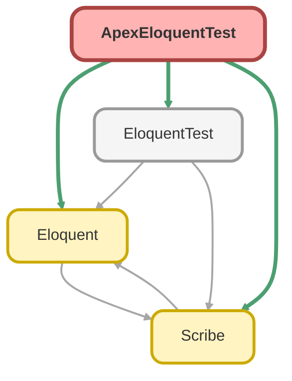

---
hide:
  - path
---

# ApexEloquentTest Class

`ISTEST`

## Class Diagram



<!-- Apex description -->

## Apex Code

```java
@IsTest
private class ApexEloquentTest {
    @IsTest
    static void testBasicQuery() {
        // Arrange
        Account acc = new Account(Name = 'Test Account');
        insert acc;

        // Act
        Scribe scribe = Scribe.source(Account.SObjectType)
            .fields(new List<String>{'Id', 'Name'})
            .whereEqual('Name', 'Test Account');
        
        List<Account> results = (List<Account>) new Eloquent().getAsSObject(scribe);

        // Assert
        Assert.areEqual(1, results.size(), 'Should find one account');
        Assert.areEqual('Test Account', results[0].Name, 'Name should match');
    }
}
```

## Methods
### `testBasicQuery()`

`ISTEST`

#### Signature
```apex
private static void testBasicQuery()
```

#### Return Type
**void**