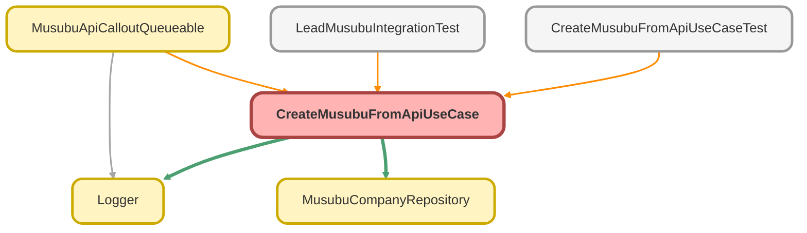

---
hide:
  - path
---

# CreateMusubuFromApiUseCase Class

API 結果から結ぶ法人情報を作成するユースケース

## Class Diagram



<!-- Apex description -->

## Apex Code

```java
/**
 * API 結果から結ぶ法人情報を作成するユースケース
 *
 * @description 外部 API から取得した法人情報をもとに MusubuCompany__c レコードを作成する。
 *              重複チェックを行い、既存レコードがあればそれを返す。
 */
public with sharing class CreateMusubuFromApiUseCase {

    private final MusubuCompanyRepository musubuCompanyRepo;

    /**
     * コンストラクタ
     */
    public CreateMusubuFromApiUseCase() {
        this(new MusubuCompanyRepository());
    }

    /**
     * テスト用コンストラクタ（DI）
     *
     * @param musubuCompanyRepo MusubuCompany リポジトリ
     */
    @TestVisible
    private CreateMusubuFromApiUseCase(MusubuCompanyRepository musubuCompanyRepo) {
        this.musubuCompanyRepo = musubuCompanyRepo;
    }

    /**
     * API 結果から結ぶ法人情報を作成する
     *
     * @param apiResponse API レスポンス
     * @return 作成または既存の結ぶ法人情報
     */
    public CreateResult invoke(CompanyApiResponse apiResponse) {
        Logger.info('CreateMusubuFromApiUseCase を開始します - corporateNumber: ' + apiResponse.corporateNumber + ', companyName: ' + apiResponse.companyName);

        try {
            // 1. 法人番号で既存レコードを検索
            if (String.isNotBlank(apiResponse.corporateNumber)) {
                MusubuCompany__c existingCompany = this.musubuCompanyRepo.findByCorporateNumber(apiResponse.corporateNumber);

                if (existingCompany != null) {
                    Logger.info('既存の結ぶ法人情報が見つかりました - Id: ' + existingCompany.Id);
                    return new CreateResult(existingCompany, false);
                }
            }

            // 2. 新規レコードを作成
            MusubuCompany__c newCompany = new MusubuCompany__c();
            newCompany.Name = apiResponse.companyName;
            newCompany.CorporateNumber__c = apiResponse.corporateNumber;
            newCompany.Address__c = apiResponse.address;
            newCompany.PostalCode__c = apiResponse.postalCode;
            newCompany.Prefecture__c = apiResponse.prefecture;
            newCompany.City__c = apiResponse.city;
            newCompany.Industry__c = apiResponse.industry;
            newCompany.EmployeeCount__c = apiResponse.employeeCount;
            newCompany.Capital__c = apiResponse.capital;
            newCompany.EstablishedDate__c = apiResponse.establishedDate;
            newCompany.Website__c = apiResponse.website;
            newCompany.Phone__c = apiResponse.phone;
            newCompany.DataSource__c = apiResponse.dataSource;
            newCompany.LastApiSyncDate__c = Datetime.now();

            insert Security.stripInaccessible(AccessType.CREATABLE, new List<MusubuCompany__c>{ newCompany }).getRecords();

            // 挿入後に ID を取得するため再クエリ
            MusubuCompany__c insertedCompany = this.musubuCompanyRepo.findByCorporateNumber(apiResponse.corporateNumber);

            Logger.info('結ぶ法人情報を作成しました - Id: ' + insertedCompany.Id);

            return new CreateResult(insertedCompany, true);

        } catch (DmlException e) {
            Logger.error('結ぶ法人情報の作成に失敗しました', e);
            throw new CreateMusubuException('法人情報の作成に失敗しました', e);

        } finally {
            Logger.saveLog();
        }
    }

    /**
     * 複数の API 結果から結ぶ法人情報を一括作成する
     *
     * @param apiResponses API レスポンスのリスト
     * @return 作成結果のリスト
     */
    public List<CreateResult> invokeForMultiple(List<CompanyApiResponse> apiResponses) {
        Logger.info('複数の結ぶ法人情報作成を開始します - count: ' + apiResponses.size());

        List<CreateResult> results = new List<CreateResult>();

        try {
            // 1. 法人番号のセットを作成
            Set<String> corporateNumbers = new Set<String>();
            for (CompanyApiResponse response : apiResponses) {
                if (String.isNotBlank(response.corporateNumber)) {
                    corporateNumbers.add(response.corporateNumber);
                }
            }

            // 2. 既存レコードを一括取得
            Map<String, MusubuCompany__c> existingCompanyMap = new Map<String, MusubuCompany__c>();
            if (!corporateNumbers.isEmpty()) {
                existingCompanyMap = this.musubuCompanyRepo.findByCorporateNumbersAsMap(corporateNumbers);
            }

            // 3. 新規作成が必要なレコードを準備
            List<MusubuCompany__c> newCompanies = new List<MusubuCompany__c>();
            Map<String, CompanyApiResponse> responseMap = new Map<String, CompanyApiResponse>();

            for (CompanyApiResponse response : apiResponses) {
                if (existingCompanyMap.containsKey(response.corporateNumber)) {
                    results.add(new CreateResult(existingCompanyMap.get(response.corporateNumber), false));
                } else {
                    MusubuCompany__c newCompany = new MusubuCompany__c();
                    newCompany.Name = response.companyName;
                    newCompany.CorporateNumber__c = response.corporateNumber;
                    newCompany.Address__c = response.address;
                    newCompany.PostalCode__c = response.postalCode;
                    newCompany.Prefecture__c = response.prefecture;
                    newCompany.City__c = response.city;
                    newCompany.Industry__c = response.industry;
                    newCompany.EmployeeCount__c = response.employeeCount;
                    newCompany.Capital__c = response.capital;
                    newCompany.EstablishedDate__c = response.establishedDate;
                    newCompany.Website__c = response.website;
                    newCompany.Phone__c = response.phone;
                    newCompany.DataSource__c = response.dataSource;
                    newCompany.LastApiSyncDate__c = Datetime.now();
                    newCompanies.add(newCompany);
                    responseMap.put(response.corporateNumber, response);
                }
            }

            // 4. 一括挿入
            if (!newCompanies.isEmpty()) {
                insert Security.stripInaccessible(AccessType.CREATABLE, newCompanies).getRecords();

                // 挿入後のレコードを取得
                for (MusubuCompany__c company : this.musubuCompanyRepo.findByCorporateNumbers(responseMap.keySet())) {
                    results.add(new CreateResult(company, true));
                }
            }

            Logger.info('複数の結ぶ法人情報作成が完了しました - createdCount: ' + newCompanies.size() + ', existingCount: ' + existingCompanyMap.size());

            return results;

        } catch (Exception e) {
            Logger.error('複数の結ぶ法人情報作成に失敗しました', e);
            throw new CreateMusubuException('法人情報の一括作成に失敗しました', e);

        } finally {
            Logger.saveLog();
        }
    }

    /**
     * API レスポンス
     */
    public class CompanyApiResponse {
        public String corporateNumber;
        public String companyName;
        public String address;
        public String postalCode;
        public String prefecture;
        public String city;
        public String industry;
        public Integer employeeCount;
        public Decimal capital;
        public Date establishedDate;
        public String website;
        public String phone;
        public String dataSource;
    }

    /**
     * 作成結果
     */
    public class CreateResult {
        public MusubuCompany__c company;
        public Boolean isNewlyCreated;

        public CreateResult(MusubuCompany__c company, Boolean isNewlyCreated) {
            this.company = company;
            this.isNewlyCreated = isNewlyCreated;
        }
    }

    /**
     * 作成エラー例外
     */
    public class CreateMusubuException extends Exception {}
}
```

## Fields
### `musubuCompanyRepo`

#### Signature
```apex
private final musubuCompanyRepo
```

#### Type
[MusubuCompanyRepository](MusubuCompanyRepository.md)

## Constructors
### `CreateMusubuFromApiUseCase()`

コンストラクタ

#### Signature
```apex
public CreateMusubuFromApiUseCase()
```

---

### `CreateMusubuFromApiUseCase(musubuCompanyRepo)`

`TESTVISIBLE`

テスト用コンストラクタ（DI）

#### Signature
```apex
private CreateMusubuFromApiUseCase(MusubuCompanyRepository musubuCompanyRepo)
```

#### Parameters
| Name | Type | Description |
|------|------|-------------|
| musubuCompanyRepo | [MusubuCompanyRepository](MusubuCompanyRepository.md) | MusubuCompany リポジトリ |

## Methods
### `invoke(apiResponse)`

API 結果から結ぶ法人情報を作成する

#### Signature
```apex
public CreateResult invoke(CompanyApiResponse apiResponse)
```

#### Parameters
| Name | Type | Description |
|------|------|-------------|
| apiResponse | CompanyApiResponse | API レスポンス |

#### Return Type
**CreateResult**

作成または既存の結ぶ法人情報

---

### `invokeForMultiple(apiResponses)`

複数の API 結果から結ぶ法人情報を一括作成する

#### Signature
```apex
public List<CreateResult> invokeForMultiple(List<CompanyApiResponse> apiResponses)
```

#### Parameters
| Name | Type | Description |
|------|------|-------------|
| apiResponses | List<CompanyApiResponse> | API レスポンスのリスト |

#### Return Type
**List<CreateResult>**

作成結果のリスト

## Classes
### CompanyApiResponse Class

API レスポンス

#### Fields
##### `corporateNumber`

###### Signature
```apex
public corporateNumber
```

###### Type
String

---

##### `companyName`

###### Signature
```apex
public companyName
```

###### Type
String

---

##### `address`

###### Signature
```apex
public address
```

###### Type
String

---

##### `postalCode`

###### Signature
```apex
public postalCode
```

###### Type
String

---

##### `prefecture`

###### Signature
```apex
public prefecture
```

###### Type
String

---

##### `city`

###### Signature
```apex
public city
```

###### Type
String

---

##### `industry`

###### Signature
```apex
public industry
```

###### Type
String

---

##### `employeeCount`

###### Signature
```apex
public employeeCount
```

###### Type
Integer

---

##### `capital`

###### Signature
```apex
public capital
```

###### Type
Decimal

---

##### `establishedDate`

###### Signature
```apex
public establishedDate
```

###### Type
Date

---

##### `website`

###### Signature
```apex
public website
```

###### Type
String

---

##### `phone`

###### Signature
```apex
public phone
```

###### Type
String

---

##### `dataSource`

###### Signature
```apex
public dataSource
```

###### Type
String

### CreateResult Class

作成結果

#### Fields
##### `company`

###### Signature
```apex
public company
```

###### Type
[MusubuCompany__c](../objects/MusubuCompany__c.md)

---

##### `isNewlyCreated`

###### Signature
```apex
public isNewlyCreated
```

###### Type
Boolean

#### Constructors
##### `CreateResult(company, isNewlyCreated)`

###### Signature
```apex
public CreateResult(MusubuCompany__c company, Boolean isNewlyCreated)
```

###### Parameters
| Name | Type | Description |
|------|------|-------------|
| company | [MusubuCompany__c](../objects/MusubuCompany__c.md) |  |
| isNewlyCreated | Boolean |  |

### CreateMusubuException Class

作成エラー例外