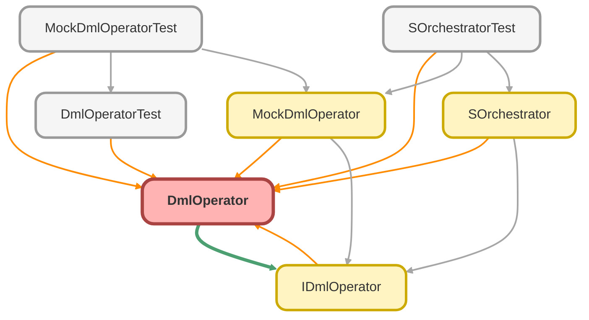

---
hide:
  - path
---

# DmlOperator Class

**Implements**

[IDmlOperator](IDmlOperator.md)

## Class Diagram



<!-- Apex description -->

## Apex Code

```java
public with sharing class DmlOperator implements IDmlOperator {
  public void doInsert(List<SObject> records){
    System.debug('Inserting ' + records.size() + ' records.');
    insert records;
  }
  public void doUpdate(List<SObject> records){
    update records;
  }
  public void doDelete(List<SObject> records) {
    delete records;
  }
}
```

## Methods
### `doInsert(records)`

#### Signature
```apex
public void doInsert(List<SObject> records)
```

#### Parameters
| Name | Type | Description |
|------|------|-------------|
| records | List<SObject> |  |

#### Return Type
**void**

---

### `doUpdate(records)`

#### Signature
```apex
public void doUpdate(List<SObject> records)
```

#### Parameters
| Name | Type | Description |
|------|------|-------------|
| records | List<SObject> |  |

#### Return Type
**void**

---

### `doDelete(records)`

#### Signature
```apex
public void doDelete(List<SObject> records)
```

#### Parameters
| Name | Type | Description |
|------|------|-------------|
| records | List<SObject> |  |

#### Return Type
**void**