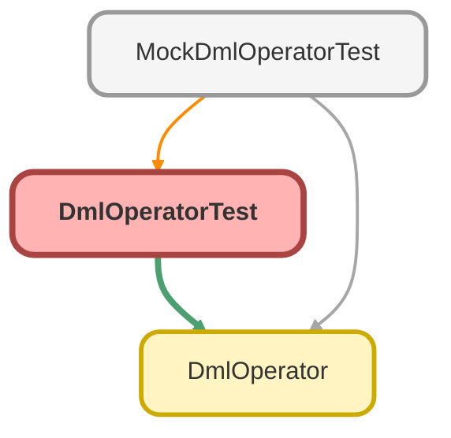

---
hide:
  - path
---

# DmlOperatorTest Class

`ISTEST`

## Class Diagram



<!-- Apex description -->

## Apex Code

```java
@isTest
public with sharing class DmlOperatorTest {
  @isTest
  static void testDoInsertUpdateDelete_WhenExecute_ThenSuccess() {
    // Arrange
    List<Account> accList = new List<Account>{new Account(Name = 'Test Account')};
    DmlOperator dmlOperator = new DmlOperator();

    // Act
    try {
      dmlOperator.doInsert(accList);
      accList[0].Name = 'Updated Account';
      dmlOperator.doUpdate(accList);
      dmlOperator.doDelete(accList);
    } catch (Exception e) {
      // Assert
      Assert.fail('例外が発生しました。' + e.getMessage());
    }
  }
}
```

## Methods
### `testDoInsertUpdateDelete_WhenExecute_ThenSuccess()`

`ISTEST`

#### Signature
```apex
private static void testDoInsertUpdateDelete_WhenExecute_ThenSuccess()
```

#### Return Type
**void**