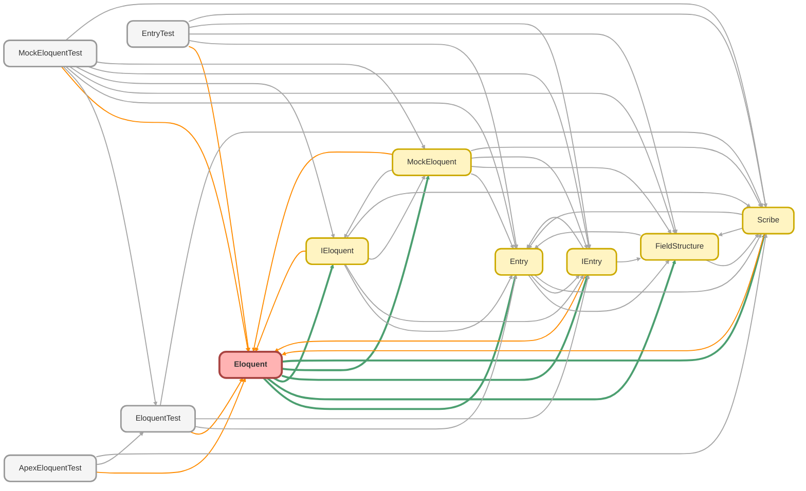

---
hide:
  - path
---

# Eloquent Class

The concrete production implementation of the `IEloquent` interface. 
 
This class is responsible for interacting with the live Salesforce database. It takes a 
 `Scribe` instance, converts it into an executable SOQL string, and performs the 
query or DML operation using the standard `Database` methods. Query results are wrapped 
in `Entry` instances to provide a consistent data access experience.

**See** [IEloquent](IEloquent.md)

**See** [Scribe](Scribe.md)

**See** [Entry](Entry.md)

**See** [MockEloquent](MockEloquent.md)

**Implements**

[IEloquent](IEloquent.md)

## Class Diagram



<!-- Apex description -->

## Apex Code

```java
/**
 * Copyright 2025 Hiroyuki Matsuoka
 *
 * Licensed under the Apache License, Version 2.0 (the "License");
 * you may not use this file except in compliance with the License.
 * You may obtain a copy of the License at
 *
 * http://www.apache.org/licenses/LICENSE-2.0
 *
 * Unless required by applicable law or agreed to in writing, software
 * distributed under the License is distributed on an "AS IS" BASIS,
 * WITHOUT WARRANTIES OR CONDITIONS OF ANY KIND, either express or implied.
 * See the License for the specific language governing permissions and
 * limitations under the License.
 */

/**
 * @description The concrete production implementation of the `IEloquent` interface.
 *
 * This class is responsible for interacting with the live Salesforce database. It takes a
 * `Scribe` instance, converts it into an executable SOQL string, and performs the
 * query or DML operation using the standard `Database` methods. Query results are wrapped
 * in `Entry` instances to provide a consistent data access experience.
 * @see IEloquent
 * @see Scribe
 * @see Entry
 * @see MockEloquent
 */
public with sharing class Eloquent implements IEloquent {
  private final Integer MAX_DML_CHUNKING = 10;

  /**
   * @inheritDoc
   */
  public List<IEntry> get(Scribe scribe) {
    List<IEntry> entries = new List<IEntry>();
    for (SObject record : (List<SObject>) Database.query(scribe.toSoql())) {
      entries.add(new Entry(record));
    }

    return entries;
  }

  /**
   * @inheritDoc
   */
  public List<IEntry> getAggregate(Scribe scribe) {
    if (!scribe.isAggregate()) {
      throw new QueryException(
        'The provided Scribe instance does not represent an aggregate query: ' + scribe.toSoql()
      );
    }
    FieldStructure fieldStructure = null;
    List<IEntry> entries = new List<IEntry>();
    for (AggregateResult aggregateResult : (List<AggregateResult>) Database.query(scribe.toSoql())) {
      fieldStructure = fieldStructure == null ? scribe.buildAggregateFieldStructure() : fieldStructure;
      entries.add(new Entry(aggregateResult, fieldStructure));
    }
    return entries;
  }

  /**
   * @inheritDoc
   */
  public List<SObject> getAsSObject(Scribe scribe) {
    return (List<SObject>) Database.query(scribe.toSoql());
  }

  /**
   * @inheritDoc
   */
  public IEntry first(Scribe scribe) {
    List<SObject> records = (List<SObject>) Database.query(scribe.toSoql());
    if (records.isEmpty()) {
      return null;
    }
    return new Entry(records[0]);
  }

  /**
   * @inheritDoc
   */
  public SObject firstAsSObject(Scribe scribe) {
    List<SObject> records = (List<SObject>) Database.query(scribe.toSoql());
    if (records.isEmpty()) {
      return null;
    }
    return records[0];
  }

  /**
   * @inheritDoc
   */
  public IEntry firstOrFail(Scribe scribe) {
    List<SObject> records = (List<SObject>) Database.query(scribe.toSoql());
    if (records.isEmpty()) {
      throw new QueryException('No records found for query: ' + scribe.toSoql());
    }
    return new Entry(records[0]);
  }

  /**
   * @inheritDoc
   */
  public SObject firstOrFailAsSObject(Scribe scribe) {
    List<SObject> records = (List<SObject>) Database.query(scribe.toSoql());
    if (records.isEmpty()) {
      throw new QueryException('No records found for query: ' + scribe.toSoql());
    }
    return records[0];
  }

  /**
   * @inheritDoc
   */
  public SObject doInsert(SObject record) {
    insert record;
    return record;
  }

  /**
   * @inheritDoc
   */
  public List<SObject> doInsert(List<SObject> records) {
    sortToPreventChunkingErrors(records);
    insert records;
    return records;
  }

  /**
   * @inheritDoc
   */
  public SObject doUpdate(SObject record) {
    update record;
    return record;
  }

  /**
   * @inheritDoc
   */
  public IEntry doUpdate(IEntry entry) {
    SObject record = entry.getRecord();
    update record;
    return new Entry(record);
  }

  /**
   * @inheritDoc
   */
  public List<SObject> doUpdate(List<SObject> records) {
    sortToPreventChunkingErrors(records);
    update records;
    return records;
  }

  /**
   * @inheritDoc
   */
  public List<IEntry> doUpdate(List<IEntry> entries) {
    if (entries.isEmpty()) {
      return new List<IEntry>();
    }
    List<SObject> records = new List<SObject>();
    for (IEntry entry : entries) {
      records.add(entry.getRecord());
    }
    sortToPreventChunkingErrors(records);
    update records;
    List<IEntry> updatedEntries = new List<IEntry>();
    for (SObject record : records) {
      updatedEntries.add(new Entry(record));
    }
    return updatedEntries;
  }

  /**
   * @inheritDoc
   */
  public SObject doUpsert(SObject record) {
    upsert record;
    return record;
  }

  /**
   * @inheritDoc
   */
  public IEntry doUpsert(IEntry entry) {
    SObject record = entry.getRecord();
    upsert record;
    return new Entry(record);
  }

  /**
   * @inheritDoc
   */
  public List<SObject> doUpsert(List<SObject> records) {
    sortToPreventChunkingErrors(records);
    upsert records;
    return records;
  }

  /**
   * @inheritDoc
   */
  public List<IEntry> doUpsert(List<IEntry> entries) {
    if (entries.isEmpty()) {
      return new List<IEntry>();
    }
    List<SObject> records = new List<SObject>();
    for (IEntry entry : entries) {
      records.add(entry.getRecord());
    }
    sortToPreventChunkingErrors(records);
    upsert records;
    List<IEntry> upsertedEntries = new List<IEntry>();
    for (SObject record : records) {
      upsertedEntries.add(new Entry(record));
    }
    return upsertedEntries;
  }

  /**
   * @inheritDoc
   */
  public void doDelete(SObject record) {
    delete record;
  }

  /**
   * @inheritDoc
   */
  public void doDelete(IEntry entry) {
    delete entry.getRecord();
  }

  /**
   * @inheritDoc
   */
  public void doDelete(List<SObject> records) {
    delete records;
  }

  /**
   * @inheritDoc
   */
  public void doDelete(List<IEntry> entries) {
    if (entries.isEmpty()) {
      System.debug('No entries to delete.');
      return;
    }
    List<SObject> records = new List<SObject>();
    for (IEntry entry : entries) {
      records.add(entry.getRecord());
    }
    delete records;
  }

  /**
   * @inheritDoc
   */
  private void sortToPreventChunkingErrors(List<SObject> records) {
    if (records.size() >= MAX_DML_CHUNKING) {
      records.sort();
    }
  }
}
```

## Fields
### `MAX_DML_CHUNKING`

#### Signature
```apex
private final MAX_DML_CHUNKING
```

#### Type
Integer

## Methods
### `get(scribe)`

**InheritDoc**

#### Signature
```apex
public List<IEntry> get(Scribe scribe)
```

#### Parameters
| Name | Type | Description |
|------|------|-------------|
| scribe | [Scribe](Scribe.md) |  |

#### Return Type
**List<IEntry>**

---

### `getAggregate(scribe)`

**InheritDoc**

#### Signature
```apex
public List<IEntry> getAggregate(Scribe scribe)
```

#### Parameters
| Name | Type | Description |
|------|------|-------------|
| scribe | [Scribe](Scribe.md) |  |

#### Return Type
**List<IEntry>**

---

### `getAsSObject(scribe)`

**InheritDoc**

#### Signature
```apex
public List<SObject> getAsSObject(Scribe scribe)
```

#### Parameters
| Name | Type | Description |
|------|------|-------------|
| scribe | [Scribe](Scribe.md) |  |

#### Return Type
**List<SObject>**

---

### `first(scribe)`

**InheritDoc**

#### Signature
```apex
public IEntry first(Scribe scribe)
```

#### Parameters
| Name | Type | Description |
|------|------|-------------|
| scribe | [Scribe](Scribe.md) |  |

#### Return Type
**[IEntry](IEntry.md)**

---

### `firstAsSObject(scribe)`

**InheritDoc**

#### Signature
```apex
public SObject firstAsSObject(Scribe scribe)
```

#### Parameters
| Name | Type | Description |
|------|------|-------------|
| scribe | [Scribe](Scribe.md) |  |

#### Return Type
**SObject**

---

### `firstOrFail(scribe)`

**InheritDoc**

#### Signature
```apex
public IEntry firstOrFail(Scribe scribe)
```

#### Parameters
| Name | Type | Description |
|------|------|-------------|
| scribe | [Scribe](Scribe.md) |  |

#### Return Type
**[IEntry](IEntry.md)**

---

### `firstOrFailAsSObject(scribe)`

**InheritDoc**

#### Signature
```apex
public SObject firstOrFailAsSObject(Scribe scribe)
```

#### Parameters
| Name | Type | Description |
|------|------|-------------|
| scribe | [Scribe](Scribe.md) |  |

#### Return Type
**SObject**

---

### `doInsert(record)`

**InheritDoc**

#### Signature
```apex
public SObject doInsert(SObject record)
```

#### Parameters
| Name | Type | Description |
|------|------|-------------|
| record | SObject |  |

#### Return Type
**SObject**

---

### `doInsert(records)`

**InheritDoc**

#### Signature
```apex
public List<SObject> doInsert(List<SObject> records)
```

#### Parameters
| Name | Type | Description |
|------|------|-------------|
| records | List<SObject> |  |

#### Return Type
**List<SObject>**

---

### `doUpdate(record)`

**InheritDoc**

#### Signature
```apex
public SObject doUpdate(SObject record)
```

#### Parameters
| Name | Type | Description |
|------|------|-------------|
| record | SObject |  |

#### Return Type
**SObject**

---

### `doUpdate(entry)`

**InheritDoc**

#### Signature
```apex
public IEntry doUpdate(IEntry entry)
```

#### Parameters
| Name | Type | Description |
|------|------|-------------|
| entry | [IEntry](IEntry.md) |  |

#### Return Type
**[IEntry](IEntry.md)**

---

### `doUpdate(records)`

**InheritDoc**

#### Signature
```apex
public List<SObject> doUpdate(List<SObject> records)
```

#### Parameters
| Name | Type | Description |
|------|------|-------------|
| records | List<SObject> |  |

#### Return Type
**List<SObject>**

---

### `doUpdate(entries)`

**InheritDoc**

#### Signature
```apex
public List<IEntry> doUpdate(List<IEntry> entries)
```

#### Parameters
| Name | Type | Description |
|------|------|-------------|
| entries | List<IEntry> |  |

#### Return Type
**List<IEntry>**

---

### `doUpsert(record)`

**InheritDoc**

#### Signature
```apex
public SObject doUpsert(SObject record)
```

#### Parameters
| Name | Type | Description |
|------|------|-------------|
| record | SObject |  |

#### Return Type
**SObject**

---

### `doUpsert(entry)`

**InheritDoc**

#### Signature
```apex
public IEntry doUpsert(IEntry entry)
```

#### Parameters
| Name | Type | Description |
|------|------|-------------|
| entry | [IEntry](IEntry.md) |  |

#### Return Type
**[IEntry](IEntry.md)**

---

### `doUpsert(records)`

**InheritDoc**

#### Signature
```apex
public List<SObject> doUpsert(List<SObject> records)
```

#### Parameters
| Name | Type | Description |
|------|------|-------------|
| records | List<SObject> |  |

#### Return Type
**List<SObject>**

---

### `doUpsert(entries)`

**InheritDoc**

#### Signature
```apex
public List<IEntry> doUpsert(List<IEntry> entries)
```

#### Parameters
| Name | Type | Description |
|------|------|-------------|
| entries | List<IEntry> |  |

#### Return Type
**List<IEntry>**

---

### `doDelete(record)`

**InheritDoc**

#### Signature
```apex
public void doDelete(SObject record)
```

#### Parameters
| Name | Type | Description |
|------|------|-------------|
| record | SObject |  |

#### Return Type
**void**

---

### `doDelete(entry)`

**InheritDoc**

#### Signature
```apex
public void doDelete(IEntry entry)
```

#### Parameters
| Name | Type | Description |
|------|------|-------------|
| entry | [IEntry](IEntry.md) |  |

#### Return Type
**void**

---

### `doDelete(records)`

**InheritDoc**

#### Signature
```apex
public void doDelete(List<SObject> records)
```

#### Parameters
| Name | Type | Description |
|------|------|-------------|
| records | List<SObject> |  |

#### Return Type
**void**

---

### `doDelete(entries)`

**InheritDoc**

#### Signature
```apex
public void doDelete(List<IEntry> entries)
```

#### Parameters
| Name | Type | Description |
|------|------|-------------|
| entries | List<IEntry> |  |

#### Return Type
**void**

---

### `sortToPreventChunkingErrors(records)`

**InheritDoc**

#### Signature
```apex
private void sortToPreventChunkingErrors(List<SObject> records)
```

#### Parameters
| Name | Type | Description |
|------|------|-------------|
| records | List<SObject> |  |

#### Return Type
**void**