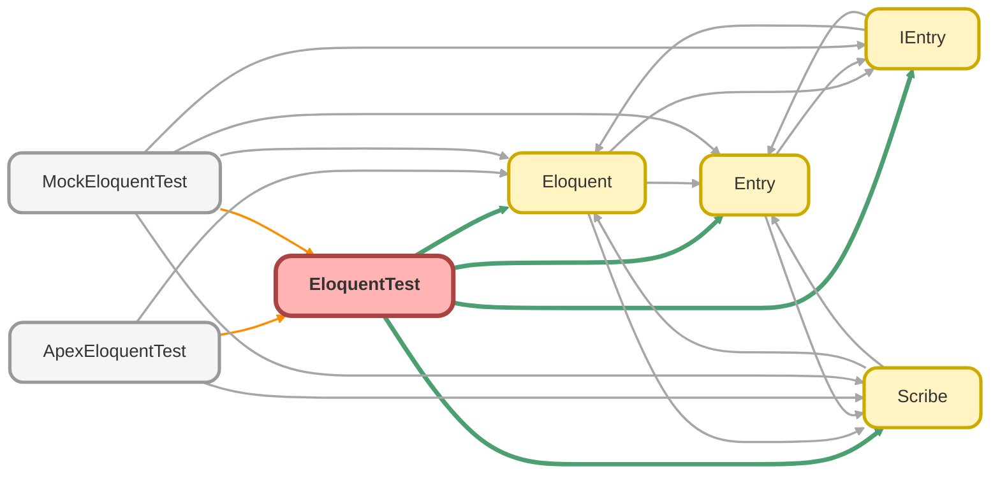

---
hide:
  - path
---

# EloquentTest Class

`ISTEST`

Copyright 2025 Hiroyuki Matsuoka 
 
Licensed under the Apache License, Version 2.0 (the &quot;License&quot;); 
you may not use this file except in compliance with the License. 
You may obtain a copy of the License at 
 
http://www.apache.org/licenses/LICENSE-2.0 
 
Unless required by applicable law or agreed to in writing, software 
distributed under the License is distributed on an &quot;AS IS&quot; BASIS, 
WITHOUT WARRANTIES OR CONDITIONS OF ANY KIND, either express or implied. 
See the License for the specific language governing permissions and 
limitations under the License.

## Class Diagram



<!-- Apex description -->

## Apex Code

```java
/**
 * Copyright 2025 Hiroyuki Matsuoka
 *
 * Licensed under the Apache License, Version 2.0 (the "License");
 * you may not use this file except in compliance with the License.
 * You may obtain a copy of the License at
 *
 * http://www.apache.org/licenses/LICENSE-2.0
 *
 * Unless required by applicable law or agreed to in writing, software
 * distributed under the License is distributed on an "AS IS" BASIS,
 * WITHOUT WARRANTIES OR CONDITIONS OF ANY KIND, either express or implied.
 * See the License for the specific language governing permissions and
 * limitations under the License.
 */
@isTest
public with sharing class EloquentTest {
  @isTest
  static void testGet() {
    // Arrange
    Scribe scribe = Scribe.source(Opportunity.getSObjectType()).field('Id').whereEqual('Id', '006000000000000');

    // Act
    List<IEntry> oppEntries = (new Eloquent()).get(scribe);

    // Assert
    Assert.isTrue(oppEntries.isEmpty(), 'Expected no records to be returned');
  }

  @isTest
  static void testGet_WhenScribeIsNotAggregate_ThenThrowException() {
    // Arrange
    Scribe scribe = Scribe.source(Opportunity.getSObjectType()).field('Id').whereEqual('Id', '006000000000000');

    // Act & Assert
    try {
      List<IEntry> oppEntries = (new Eloquent()).getAggregate(scribe);
      Assert.fail('Expected QueryException to be thrown');
    } catch (QueryException e) {
      System.debug(e.getMessage());
      Assert.isTrue(
        e.getMessage().startsWith('The provided Scribe instance does not represent an aggregate query: ')
      );
    }
  }

  @isTest
  static void testGetAggregate_WhenScriveIsAggregate() {
    // Arrange
    Scribe scribe = Scribe.source(Opportunity.getSObjectType())
      .field('StageName')
      .average('Amount', 'AvgAmount')
      .groupByField('StageName');

    // Act
    List<IEntry> oppEntries = (new Eloquent()).getAggregate(scribe);

    // Assert
    Assert.isTrue(oppEntries.isEmpty(), 'Expected no records to be returned');
  }

  @isTest
  static void testGetAsSObject() {
    // Arrange
    Scribe scribe = Scribe.source(Opportunity.getSObjectType()).field('Id').whereEqual('Id', '006000000000000');

    // Act
    List<SObject> oppSObjects = (new Eloquent()).getAsSObject(scribe);

    // Assert
    Assert.isTrue(oppSObjects.isEmpty(), 'Expected no records to be returned');
  }

  @isTest
  static void testFirst() {
    // Arrange
    Scribe scribe = Scribe.source(Opportunity.getSObjectType()).field('Id').whereEqual('Id', '006000000000000');

    // Act
    IEntry oppEntry = (new Eloquent()).first(scribe);

    // Assert
    Assert.isNull(oppEntry, 'Expected no record to be returned');
  }

  @isTest
  static void testFirstAsSObject() {
    // Arrange
    Scribe scribe = Scribe.source(Opportunity.getSObjectType()).field('Id').whereEqual('Id', '006000000000000');

    // Act
    SObject oppSObject = (new Eloquent()).firstAsSObject(scribe);

    // Assert
    Assert.isNull(oppSObject, 'Expected no record to be returned');
  }

  @isTest
  static void testFirstOrFail() {
    // Arrange
    Scribe scribe = Scribe.source(Opportunity.getSObjectType()).field('Id').whereEqual('Id', '006000000000000');

    // Act & Assert
    try {
      IEntry oppEntry = (new Eloquent()).firstOrFail(scribe);
      Assert.fail('Expected QueryException to be thrown');
    } catch (QueryException e) {
      System.debug(e.getMessage());
      Assert.isTrue(
        e.getMessage().contains('No records found for query'),
        'Expected QueryException with specific message'
      );
    }
  }

  @isTest
  static void testFirstOrFailAsSObject() {
    // Arrange
    Scribe scribe = Scribe.source(Opportunity.getSObjectType()).field('Id').whereEqual('Id', '006000000000000');
    // Act & Assert
    try {
      SObject oppSObject = (new Eloquent()).firstOrFailAsSObject(scribe);
      Assert.fail('Expected QueryException to be thrown');
    } catch (QueryException e) {
      System.debug(e.getMessage());
      Assert.isTrue(
        e.getMessage().contains('No records found for query'),
        'Expected QueryException with specific message'
      );
    }
  }

  @isTest
  static void testInsertSingleRecord() {
    // Arrange
    Opportunity opp = new Opportunity();
    opp.Name = 'Test';

    // Act & Assert
    try {
      opp = (Opportunity) (new Eloquent()).doInsert(opp);
    } catch (DmlException e) {
      System.debug(e.getMessage());
    }
  }

  @isTest
  static void testInsertMultipleRecords() {
    // Arrange
    Opportunity opp1 = new Opportunity(Name = 'Test1');
    Opportunity opp2 = new Opportunity(Name = 'Test2');
    List<Opportunity> opps = new List<Opportunity>{ opp1, opp2 };

    // Act & Assert
    try {
      opps = (List<Opportunity>) (new Eloquent()).doInsert(opps);
    } catch (DmlException e) {
      System.debug(e.getMessage());
    }
  }

  @isTest
  static void testUpdateSingleRecord() {
    // Arrange
    Opportunity opp = new Opportunity(Id = '006000000000000', Name = 'Updated Test');

    // Act & Assert
    try {
      opp = (Opportunity) (new Eloquent()).doUpdate(opp);
    } catch (DmlException e) {
      System.debug(e.getMessage());
    }
  }

  @isTest
  static void testUpdateSingleEntry() {
    // Arrange
    Opportunity opp = new Opportunity(Id = '006000000000000', Name = 'Updated Test');
    IEntry entry = new Entry(opp);

    // Act & Assert
    try {
      entry = (new Eloquent()).doUpdate(entry);
    } catch (DmlException e) {
      System.debug(e.getMessage());
    }
  }

  @isTest
  static void testUpdateMultipleRecords() {
    // Arrange
    Opportunity opp1 = new Opportunity(Id = '006000000000000', Name = 'Updated Test1');
    Opportunity opp2 = new Opportunity(Id = '006000000000001', Name = 'Updated Test2');
    List<Opportunity> opps = new List<Opportunity>{ opp1, opp2 };

    // Act & Assert
    try {
      opps = (List<Opportunity>) (new Eloquent()).doUpdate(opps);
    } catch (DmlException e) {
      System.debug(e.getMessage());
    }
  }

  @isTest
  static void testUpdateMultipleEntries() {
    // Arrange
    Opportunity opp1 = new Opportunity(Id = '006000000000000', Name = 'Updated Test1');
    Opportunity opp2 = new Opportunity(Id = '006000000000001', Name = 'Updated Test2');
    List<IEntry> entries = new List<IEntry>{ new Entry(opp1), new Entry(opp2) };
    // Act & Assert
    try {
      entries = (List<IEntry>) (new Eloquent()).doUpdate(entries);
    } catch (DmlException e) {
      System.debug(e.getMessage());
    }
  }

  @isTest
  static void testUpdateEmptyEntries() {
    // Arrange
    List<IEntry> entries = new List<IEntry>();

    // Act
    List<IEntry> updatedEntries = (new Eloquent()).doUpdate(entries);

    // Assert
    Assert.isTrue(updatedEntries.isEmpty(), 'Expected no entries to be updated');
  }

  @isTest
  static void testUpsertSingleRecord() {
    // Arrange
    Opportunity opp = new Opportunity(Id = '006000000000000', Name = 'Upserted Test');

    // Act & Assert
    try {
      opp = (Opportunity) (new Eloquent()).doUpsert(opp);
    } catch (DmlException e) {
      System.debug(e.getMessage());
    }
  }

  @isTest
  static void testUpsertSingleEntry() {
    // Arrange
    Opportunity opp = new Opportunity(Id = '006000000000000', Name = 'Upserted Test');
    IEntry entry = new Entry(opp);
    // Act & Assert
    try {
      entry = (new Eloquent()).doUpsert(entry);
    } catch (DmlException e) {
      System.debug(e.getMessage());
    }
  }

  @isTest
  static void testUpsertMultipleRecords() {
    // Arrange
    Opportunity opp1 = new Opportunity(Id = '006000000000000', Name = 'Upserted Test1');
    Opportunity opp2 = new Opportunity(Id = '006000000000001', Name = 'Upserted Test2');
    List<Opportunity> opps = new List<Opportunity>{ opp1, opp2 };
    // Act & Assert
    try {
      opps = (List<Opportunity>) (new Eloquent()).doUpsert(opps);
    } catch (DmlException e) {
      System.debug(e.getMessage());
    }
  }

  @isTest
  static void testUpsertMultipleEntries() {
    // Arrange
    Opportunity opp1 = new Opportunity(Id = '006000000000000', Name = 'Upserted Test1');
    Opportunity opp2 = new Opportunity(Id = '006000000000001', Name = 'Upserted Test2');
    List<IEntry> entries = new List<IEntry>{ new Entry(opp1), new Entry(opp2) };

    // Act & Assert
    try {
      entries = (List<IEntry>) (new Eloquent()).doUpsert(entries);
    } catch (DmlException e) {
      System.debug(e.getMessage());
    }
  }

  @isTest
  static void testUpsertEmptyEntries() {
    // Arrange
    List<IEntry> entries = new List<IEntry>();
    // Act
    List<IEntry> upsertedEntries = (new Eloquent()).doUpsert(entries);
    // Assert
    Assert.isTrue(upsertedEntries.isEmpty(), 'Expected no entries to be upserted');
  }

  @isTest
  static void testDeleteSingleRecord() {
    // Arrange
    Opportunity opp = new Opportunity(Id = '006000000000000');

    // Act & Assert
    try {
      (new Eloquent()).doDelete(opp);
    } catch (DmlException e) {
      System.debug(e.getMessage());
    }
  }

  @isTest
  static void testDeleteSingleEntry() {
    // Arrange
    Opportunity opp = new Opportunity(Id = '006000000000000');
    IEntry entry = new Entry(opp);

    // Act & Assert
    try {
      (new Eloquent()).doDelete(entry);
    } catch (DmlException e) {
      System.debug(e.getMessage());
    }
  }

  @isTest
  static void testDeleteMultipleRecords() {
    // Arrange
    Opportunity opp1 = new Opportunity(Id = '006000000000000');
    Opportunity opp2 = new Opportunity(Id = '006000000000001');
    List<Opportunity> opps = new List<Opportunity>{ opp1, opp2 };

    // Act & Assert
    try {
      (new Eloquent()).doDelete(opps);
    } catch (DmlException e) {
      System.debug(e.getMessage());
    }
  }

  @isTest
  static void testDeleteMultipleEntries() {
    // Arrange
    Opportunity opp1 = new Opportunity(Id = '006000000000000');
    Opportunity opp2 = new Opportunity(Id = '006000000000001');
    List<IEntry> entries = new List<IEntry>{ new Entry(opp1), new Entry(opp2) };

    // Act & Assert
    try {
      (new Eloquent()).doDelete(entries);
    } catch (DmlException e) {
      System.debug(e.getMessage());
    }
  }

  @isTest
  static void testDeleteEmptyEntries() {
    // Arrange
    List<IEntry> entries = new List<IEntry>();

    // Act
    (new Eloquent()).doDelete(entries);

    // Assert
    // No exception should be thrown
  }
}
```

## Methods
### `testGet()`

`ISTEST`

#### Signature
```apex
private static void testGet()
```

#### Return Type
**void**

---

### `testGet_WhenScribeIsNotAggregate_ThenThrowException()`

`ISTEST`

#### Signature
```apex
private static void testGet_WhenScribeIsNotAggregate_ThenThrowException()
```

#### Return Type
**void**

---

### `testGetAggregate_WhenScriveIsAggregate()`

`ISTEST`

#### Signature
```apex
private static void testGetAggregate_WhenScriveIsAggregate()
```

#### Return Type
**void**

---

### `testGetAsSObject()`

`ISTEST`

#### Signature
```apex
private static void testGetAsSObject()
```

#### Return Type
**void**

---

### `testFirst()`

`ISTEST`

#### Signature
```apex
private static void testFirst()
```

#### Return Type
**void**

---

### `testFirstAsSObject()`

`ISTEST`

#### Signature
```apex
private static void testFirstAsSObject()
```

#### Return Type
**void**

---

### `testFirstOrFail()`

`ISTEST`

#### Signature
```apex
private static void testFirstOrFail()
```

#### Return Type
**void**

---

### `testFirstOrFailAsSObject()`

`ISTEST`

#### Signature
```apex
private static void testFirstOrFailAsSObject()
```

#### Return Type
**void**

---

### `testInsertSingleRecord()`

`ISTEST`

#### Signature
```apex
private static void testInsertSingleRecord()
```

#### Return Type
**void**

---

### `testInsertMultipleRecords()`

`ISTEST`

#### Signature
```apex
private static void testInsertMultipleRecords()
```

#### Return Type
**void**

---

### `testUpdateSingleRecord()`

`ISTEST`

#### Signature
```apex
private static void testUpdateSingleRecord()
```

#### Return Type
**void**

---

### `testUpdateSingleEntry()`

`ISTEST`

#### Signature
```apex
private static void testUpdateSingleEntry()
```

#### Return Type
**void**

---

### `testUpdateMultipleRecords()`

`ISTEST`

#### Signature
```apex
private static void testUpdateMultipleRecords()
```

#### Return Type
**void**

---

### `testUpdateMultipleEntries()`

`ISTEST`

#### Signature
```apex
private static void testUpdateMultipleEntries()
```

#### Return Type
**void**

---

### `testUpdateEmptyEntries()`

`ISTEST`

#### Signature
```apex
private static void testUpdateEmptyEntries()
```

#### Return Type
**void**

---

### `testUpsertSingleRecord()`

`ISTEST`

#### Signature
```apex
private static void testUpsertSingleRecord()
```

#### Return Type
**void**

---

### `testUpsertSingleEntry()`

`ISTEST`

#### Signature
```apex
private static void testUpsertSingleEntry()
```

#### Return Type
**void**

---

### `testUpsertMultipleRecords()`

`ISTEST`

#### Signature
```apex
private static void testUpsertMultipleRecords()
```

#### Return Type
**void**

---

### `testUpsertMultipleEntries()`

`ISTEST`

#### Signature
```apex
private static void testUpsertMultipleEntries()
```

#### Return Type
**void**

---

### `testUpsertEmptyEntries()`

`ISTEST`

#### Signature
```apex
private static void testUpsertEmptyEntries()
```

#### Return Type
**void**

---

### `testDeleteSingleRecord()`

`ISTEST`

#### Signature
```apex
private static void testDeleteSingleRecord()
```

#### Return Type
**void**

---

### `testDeleteSingleEntry()`

`ISTEST`

#### Signature
```apex
private static void testDeleteSingleEntry()
```

#### Return Type
**void**

---

### `testDeleteMultipleRecords()`

`ISTEST`

#### Signature
```apex
private static void testDeleteMultipleRecords()
```

#### Return Type
**void**

---

### `testDeleteMultipleEntries()`

`ISTEST`

#### Signature
```apex
private static void testDeleteMultipleEntries()
```

#### Return Type
**void**

---

### `testDeleteEmptyEntries()`

`ISTEST`

#### Signature
```apex
private static void testDeleteEmptyEntries()
```

#### Return Type
**void**