---
hide:
  - path
---

# Entry Class

The concrete implementation of the `IEntry` interface for wrapping real records 
returned from a Salesforce database query. 
 
An `Entry` instance can represent either a standard `SObject` record (from a `Scribe` query) 
or an `AggregateResult` record (from an aggregate `Scribe` query). It provides access 
to field values and relationships by delegating calls to the underlying `SObject` or 
 `AggregateResult` &#x27;s standard methods (e.g., `.get()` , `.getSObject()` , `.getSObjects()` ). 
 
This class is the production counterpart to `MockEntry` .

**See** [IEntry](IEntry.md)

**See** [AbstractEntry](AbstractEntry.md)

**See** [MockEntry](MockEntry.md)

**Inheritance**

[AbstractEntry](AbstractEntry.md)

## Class Diagram

```mermaid
graph LR
  Entry["Entry"]:::mainApexClass
  click Entry "/objects/Entry/"
  AbstractEntry["AbstractEntry"]:::apexClass
  click AbstractEntry "/apex/AbstractEntry/"
  FieldStructure["FieldStructure"]:::apexClass
  click FieldStructure "/apex/FieldStructure/"
  IEntry["IEntry"]:::apexClass
  click IEntry "/apex/IEntry/"
  MockEntry["MockEntry"]:::apexClass
  click MockEntry "/apex/MockEntry/"
  Scribe["Scribe"]:::apexClass
  click Scribe "/apex/Scribe/"
  CallableLogger["CallableLogger"]:::apexClass
  CallableLogger_Tests["CallableLogger_Tests"]:::apexTestClass
  click CallableLogger_Tests "/apex/CallableLogger_Tests/"
  ComponentLogger["ComponentLogger"]:::apexClass
  ComponentLogger_Tests["ComponentLogger_Tests"]:::apexTestClass
  click ComponentLogger_Tests "/apex/ComponentLogger_Tests/"
  Eloquent["Eloquent"]:::apexClass
  click Eloquent "/apex/Eloquent/"
  EloquentTest["EloquentTest"]:::apexTestClass
  click EloquentTest "/apex/EloquentTest/"
  EntryTest["EntryTest"]:::apexTestClass
  click EntryTest "/apex/EntryTest/"
  FlowCollectionLogEntry["FlowCollectionLogEntry"]:::apexClass
  FlowCollectionLogEntry_Tests["FlowCollectionLogEntry_Tests"]:::apexTestClass
  click FlowCollectionLogEntry_Tests "/apex/FlowCollectionLogEntry_Tests/"
  FlowLogEntry["FlowLogEntry"]:::apexClass
  FlowLogEntry_Tests["FlowLogEntry_Tests"]:::apexTestClass
  click FlowLogEntry_Tests "/apex/FlowLogEntry_Tests/"
  FlowLogger["FlowLogger"]:::apexClass
  FlowLogger_Tests["FlowLogger_Tests"]:::apexTestClass
  click FlowLogger_Tests "/apex/FlowLogger_Tests/"
  FlowRecordLogEntry["FlowRecordLogEntry"]:::apexClass
  FlowRecordLogEntry_Tests["FlowRecordLogEntry_Tests"]:::apexTestClass
  click FlowRecordLogEntry_Tests "/apex/FlowRecordLogEntry_Tests/"
  IEloquent["IEloquent"]:::apexClass
  click IEloquent "/apex/IEloquent/"
  LogBatchPurgeController["LogBatchPurgeController"]:::apexClass
  LogBatchPurgeController_Tests["LogBatchPurgeController_Tests"]:::apexTestClass
  click LogBatchPurgeController_Tests "/apex/LogBatchPurgeController_Tests/"
  LogBatchPurger["LogBatchPurger"]:::apexClass
  LogBatchPurger_Tests["LogBatchPurger_Tests"]:::apexTestClass
  click LogBatchPurger_Tests "/apex/LogBatchPurger_Tests/"
  LogBatchPurgeScheduler_Tests["LogBatchPurgeScheduler_Tests"]:::apexTestClass
  click LogBatchPurgeScheduler_Tests "/apex/LogBatchPurgeScheduler_Tests/"
  LogEntry["LogEntry"]:::apexClass
  LogEntryEvent["LogEntryEvent"]:::apexClass
  LogEntryEventBuilder["LogEntryEventBuilder"]:::apexClass
  LogEntryEventBuilder_Tests["LogEntryEventBuilder_Tests"]:::apexTestClass
  click LogEntryEventBuilder_Tests "/apex/LogEntryEventBuilder_Tests/"
  LogEntryEventHandler["LogEntryEventHandler"]:::apexClass
  LogEntryEventHandler_Tests["LogEntryEventHandler_Tests"]:::apexTestClass
  click LogEntryEventHandler_Tests "/apex/LogEntryEventHandler_Tests/"
  LogEntryEventStreamController["LogEntryEventStreamController"]:::apexClass
  LogEntryEventStreamController_Tests["LogEntryEventStreamController_Tests"]:::apexTestClass
  click LogEntryEventStreamController_Tests "/apex/LogEntryEventStreamController_Tests/"
  LogEntryFieldSetPicklist["LogEntryFieldSetPicklist"]:::apexClass
  LogEntryFieldSetPicklist_Tests["LogEntryFieldSetPicklist_Tests"]:::apexTestClass
  click LogEntryFieldSetPicklist_Tests "/apex/LogEntryFieldSetPicklist_Tests/"
  LogEntryHandler["LogEntryHandler"]:::apexClass
  LogEntryHandler_Tests["LogEntryHandler_Tests"]:::apexTestClass
  click LogEntryHandler_Tests "/apex/LogEntryHandler_Tests/"
  LogEntryMetadataViewerController["LogEntryMetadataViewerController"]:::apexClass
  LogEntryMetadataViewerController_Tests["LogEntryMetadataViewerController_Tests"]:::apexTestClass
  click LogEntryMetadataViewerController_Tests "/apex/LogEntryMetadataViewerController_Tests/"
  LogEntryTag["LogEntryTag"]:::apexClass
  LogEntryTagHandler["LogEntryTagHandler"]:::apexClass
  LogEntryTagHandler_Tests["LogEntryTagHandler_Tests"]:::apexTestClass
  click LogEntryTagHandler_Tests "/apex/LogEntryTagHandler_Tests/"
  Logger["Logger"]:::apexClass
  Logger_Tests["Logger_Tests"]:::apexTestClass
  click Logger_Tests "/apex/Logger_Tests/"
  LoggerBatchableContext_Tests["LoggerBatchableContext_Tests"]:::apexTestClass
  click LoggerBatchableContext_Tests "/apex/LoggerBatchableContext_Tests/"
  LoggerConfigurationSelector["LoggerConfigurationSelector"]:::apexTestClass
  LoggerConfigurationSelector_Tests["LoggerConfigurationSelector_Tests"]:::apexTestClass
  click LoggerConfigurationSelector_Tests "/apex/LoggerConfigurationSelector_Tests/"
  LoggerDataStore_Tests["LoggerDataStore_Tests"]:::apexTestClass
  click LoggerDataStore_Tests "/apex/LoggerDataStore_Tests/"
  LoggerEmailSender_Tests["LoggerEmailSender_Tests"]:::apexTestClass
  click LoggerEmailSender_Tests "/apex/LoggerEmailSender_Tests/"
  LoggerFieldMapper["LoggerFieldMapper"]:::apexClass
  LoggerFieldMapper_Tests["LoggerFieldMapper_Tests"]:::apexTestClass
  click LoggerFieldMapper_Tests "/apex/LoggerFieldMapper_Tests/"
  LoggerMockDataStore["LoggerMockDataStore"]:::apexTestClass
  LoggerParameter["LoggerParameter"]:::apexClass
  LoggerParameter_Tests["LoggerParameter_Tests"]:::apexTestClass
  click LoggerParameter_Tests "/apex/LoggerParameter_Tests/"
  LoggerSettingsController["LoggerSettingsController"]:::apexClass
  LoggerSettingsController_Tests["LoggerSettingsController_Tests"]:::apexTestClass
  click LoggerSettingsController_Tests "/apex/LoggerSettingsController_Tests/"
  LoggerSObjectHandler["LoggerSObjectHandler"]:::apexClass
  LoggerSObjectHandler_Tests["LoggerSObjectHandler_Tests"]:::apexTestClass
  click LoggerSObjectHandler_Tests "/apex/LoggerSObjectHandler_Tests/"
  LoggerStackTrace["LoggerStackTrace"]:::apexClass
  LoggerStackTrace_Tests["LoggerStackTrace_Tests"]:::apexTestClass
  click LoggerStackTrace_Tests "/apex/LoggerStackTrace_Tests/"
  LoggerTestConfigurator["LoggerTestConfigurator"]:::apexTestClass
  LogHandler["LogHandler"]:::apexClass
  LogHandler_Tests["LogHandler_Tests"]:::apexTestClass
  click LogHandler_Tests "/apex/LogHandler_Tests/"
  LogManagementDataSelector["LogManagementDataSelector"]:::apexClass
  LogManagementDataSelector_Tests["LogManagementDataSelector_Tests"]:::apexTestClass
  click LogManagementDataSelector_Tests "/apex/LogManagementDataSelector_Tests/"
  LogMessage["LogMessage"]:::apexClass
  LogViewerController["LogViewerController"]:::apexClass
  LogViewerController_Tests["LogViewerController_Tests"]:::apexTestClass
  click LogViewerController_Tests "/apex/LogViewerController_Tests/"
  MockEloquent["MockEloquent"]:::apexClass
  click MockEloquent "/apex/MockEloquent/"
  MockEloquentTest["MockEloquentTest"]:::apexTestClass
  click MockEloquentTest "/apex/MockEloquentTest/"
  MockEntryTest["MockEntryTest"]:::apexTestClass
  click MockEntryTest "/apex/MockEntryTest/"
  RelatedLogEntriesController["RelatedLogEntriesController"]:::apexClass
  RelatedLogEntriesController_Tests["RelatedLogEntriesController_Tests"]:::apexTestClass
  click RelatedLogEntriesController_Tests "/apex/RelatedLogEntriesController_Tests/"
  SOrchestratorTest["SOrchestratorTest"]:::apexTestClass
  click SOrchestratorTest "/apex/SOrchestratorTest/"

  Entry --> AbstractEntry
  Entry --> FieldStructure
  Entry --> IEntry
  Entry --> MockEntry
  Entry --> Scribe

  AbstractEntry --> Entry
  CallableLogger --> Entry
  CallableLogger_Tests --> Entry
  ComponentLogger --> Entry
  ComponentLogger_Tests --> Entry
  Eloquent --> Entry
  EloquentTest --> Entry
  EntryTest --> Entry
  FieldStructure --> Entry
  FlowCollectionLogEntry --> Entry
  FlowCollectionLogEntry_Tests --> Entry
  FlowLogEntry --> Entry
  FlowLogEntry_Tests --> Entry
  FlowLogger --> Entry
  FlowLogger_Tests --> Entry
  FlowRecordLogEntry --> Entry
  FlowRecordLogEntry_Tests --> Entry
  IEloquent --> Entry
  IEntry --> Entry
  LogBatchPurgeController --> Entry
  LogBatchPurgeController_Tests --> Entry
  LogBatchPurger --> Entry
  LogBatchPurger_Tests --> Entry
  LogBatchPurgeScheduler_Tests --> Entry
  LogEntry --> Entry
  LogEntryEvent --> Entry
  LogEntryEventBuilder --> Entry
  LogEntryEventBuilder_Tests --> Entry
  LogEntryEventHandler --> Entry
  LogEntryEventHandler_Tests --> Entry
  LogEntryEventStreamController --> Entry
  LogEntryEventStreamController_Tests --> Entry
  LogEntryFieldSetPicklist --> Entry
  LogEntryFieldSetPicklist_Tests --> Entry
  LogEntryHandler --> Entry
  LogEntryHandler_Tests --> Entry
  LogEntryMetadataViewerController --> Entry
  LogEntryMetadataViewerController_Tests --> Entry
  LogEntryTag --> Entry
  LogEntryTagHandler --> Entry
  LogEntryTagHandler_Tests --> Entry
  Logger --> Entry
  Logger_Tests --> Entry
  LoggerBatchableContext_Tests --> Entry
  LoggerConfigurationSelector --> Entry
  LoggerConfigurationSelector_Tests --> Entry
  LoggerDataStore_Tests --> Entry
  LoggerEmailSender_Tests --> Entry
  LoggerFieldMapper --> Entry
  LoggerFieldMapper_Tests --> Entry
  LoggerMockDataStore --> Entry
  LoggerParameter --> Entry
  LoggerParameter_Tests --> Entry
  LoggerSettingsController --> Entry
  LoggerSettingsController_Tests --> Entry
  LoggerSObjectHandler --> Entry
  LoggerSObjectHandler_Tests --> Entry
  LoggerStackTrace --> Entry
  LoggerStackTrace_Tests --> Entry
  LoggerTestConfigurator --> Entry
  LogHandler --> Entry
  LogHandler_Tests --> Entry
  LogManagementDataSelector --> Entry
  LogManagementDataSelector_Tests --> Entry
  LogMessage --> Entry
  LogViewerController --> Entry
  LogViewerController_Tests --> Entry
  MockEloquent --> Entry
  MockEloquentTest --> Entry
  MockEntry --> Entry
  MockEntryTest --> Entry
  RelatedLogEntriesController --> Entry
  RelatedLogEntriesController_Tests --> Entry
  Scribe --> Entry
  SOrchestratorTest --> Entry

  %% Too many related classes, skipping transverse links


classDef apexClass fill:#FFF4C2,stroke:#CCAA00,stroke-width:3px,rx:12px,ry:12px,shadow:drop,color:#333;
classDef apexTestClass fill:#F5F5F5,stroke:#999999,stroke-width:3px,rx:12px,ry:12px,shadow:drop,color:#333;
classDef mainApexClass fill:#FFB3B3,stroke:#A94442,stroke-width:4px,rx:14px,ry:14px,shadow:drop,color:#333,font-weight:bold;

linkStyle 0,1,2,3,4 stroke:#4C9F70,stroke-width:4px;
linkStyle 5,6,7,8,9,10,11,12,13,14,15,16,17,18,19,20,21,22,23,24,25,26,27,28,29,30,31,32,33,34,35,36,37,38,39,40,41,42,43,44,45,46,47,48,49,50,51,52,53,54,55,56,57,58,59,60,61,62,63,64,65,66,67,68,69,70,71,72,73,74,75,76,77,78,79 stroke:#FF8C00,stroke-width:2px;
```



<!-- Apex description -->

## Apex Code

```java
/**
 * Copyright 2025 Hiroyuki Matsuoka
 *
 * Licensed under the Apache License, Version 2.0 (the "License");
 * you may not use this file except in compliance with the License.
 * You may obtain a copy of the License at
 *
 * http://www.apache.org/licenses/LICENSE-2.0
 *
 * Unless required by applicable law or agreed to in writing, software
 * distributed under the License is distributed on an "AS IS" BASIS,
 * WITHOUT WARRANTIES OR CONDITIONS OF ANY KIND, either express or implied.
 * See the License for the specific language governing permissions and
 * limitations under the License.
 */

/**
 * @description The concrete implementation of the `IEntry` interface for wrapping real records
 * returned from a Salesforce database query.
 *
 * An `Entry` instance can represent either a standard `SObject` record (from a `Scribe` query)
 * or an `AggregateResult` record (from an aggregate `Scribe` query). It provides access
 * to field values and relationships by delegating calls to the underlying `SObject` or
 * `AggregateResult`'s standard methods (e.g., `.get()`, `.getSObject()`, `.getSObjects()`).
 *
 * This class is the production counterpart to `MockEntry`.
 * @see IEntry
 * @see AbstractEntry
 * @see MockEntry
 */
public with sharing class Entry extends AbstractEntry {
  /**
   * constructor
   *
   * @param record SObject
   */
  public Entry(SObject record) {
    super(record);
  }

  /**
   * constructor for AggregateResult
   *
   * @param aggregateResult AggregateResult
   * @param fieldStructure FieldStructure
   */
  public Entry(AggregateResult aggregateResult, FieldStructure fieldStructure) {
    super(aggregateResult, fieldStructure);
  }

  /**
   * @inheritDoc
   */
  public override Object get(String fieldName) {
    if (this.hasAggregateResult) {
      if (!this.fieldStructure.hasField(fieldName.toLowerCase())) {
        String error = String.format(
          'The specified field or alias is not exist in Scribe. field or alias name: {0}',
          new List<String>{ fieldName }
        );
        throw new QueryException(error);
      }
      return this.aggregateResult.get(fieldName);
    }

    this.validateFieldName(fieldName);
    return this.record.get(fieldName);
  }

  /**
   * @inheritDoc
   */
  public override void put(String fieldName, Object value) {
    if (this.hasAggregateResult) {
      String error = 'Cannot call put() on an AggregateResult record.';
      throw new QueryException(error);
    }

    this.validateFieldName(fieldName);
    this.record.put(fieldName, value);
  }

  /**
   * @inheritDoc
   */
  public override IEntry getParent(String parentIdFieldName) {
    this.ensureDescribeResultIfNeeded();
    Map<String, Schema.SObjectField> fieldMap = this.describeResult.fields.getMap();

    Schema.SObjectField field = fieldMap.get(parentIdFieldName);
    if (field == null) {
      String error = String.format(
        'The specified parentIdFieldName does not exist in the object\'s fields. object name: {0}, parent Id field name: {1}',
        new List<String>{ this.describeResult.getName(), parentIdFieldName }
      );
      throw new QueryException(error);
    }

    Schema.DescribeFieldResult fieldDescribe = field.getDescribe();
    if (fieldDescribe.getType() != Schema.DisplayType.Reference) {
      String error = String.format(
        'The specified parentIdFieldName is not a reference type. object name: {0}, parent Id field name: {1}',
        new List<String>{ this.describeResult.getName(), parentIdFieldName }
      );
      throw new QueryException(error);
    }

    String parentRelationName = fieldDescribe.getRelationshipName();
    SObject parentSObject = this.record.getSObject(parentRelationName);
    if (parentSObject == null) {
      return null;
    }

    return new Entry(parentSObject);
  }

  /**
   * @inheritDoc
   */
  public override List<IEntry> getChildren(String childObjectName) {
    this.ensureDescribeResultIfNeeded();
    List<Schema.ChildRelationship> childRelationShips = this.describeResult.getChildRelationships();

    String childRelationName = this.getChildrenRelationNameFromChildObjectName(childObjectName);
    List<IEntry> childRecords = new List<IEntry>();
    for (SObject childSObject : this.record.getSObjects(childRelationName)) {
      childRecords.add(new Entry(ChildSObject));
    }

    return childRecords;
  }

  /**
   * @inheritDoc
   */
  public override List<IEntry> getChildrenByRelationName(String childRelationName) {
    this.ensureDescribeResultIfNeeded();
    this.validateChildRelationName(childRelationName);

    List<IEntry> childRecords = new List<IEntry>();
    for (SObject childSObject : this.record.getSObjects(childRelationName)) {
      childRecords.add(new Entry(ChildSObject));
    }

    return childRecords;
  }

  /**
   * @inheritDoc
   */
  public override Id getId() {
    return (Id) this.record.get('Id');
  }

  /**
   * @inheritDoc
   */
  public override String getName() {
    return (String) this.record.get('Name');
  }

  /**
   * @inheritDoc
   */
  public override SObject getRecord() {
    return this.record;
  }

  /**
   * @inheritDoc
   */
  public override IEntry setRecord(SObject record) {
    return new Entry(record);
  }

  /**
   * @inheritDoc
   */
  public override IEntry setFieldStructure(FieldStructure fieldStructure) {
    throw new QueryException(
      'Field structure is not supported in Entry class. Use MockEntry for testing purposes.'
    );
  }

  /**
  * validate field name
  *
  * @param fieldName field name to be validated
  * @throws QueryException if the field is not exist in the SObject
  */
  private void validateFieldName(String fieldName) {
    this.ensureDescribeResultIfNeeded();
    Map<String, Schema.SObjectField> fieldMap = this.describeResult.fields.getMap();
    if (!fieldMap.containsKey(fieldName)) {
      String error = String.format(
        'The specified field does not exist in the object\'s fields. object name: {0}, field name: {1}',
        new List<String>{ this.describeResult.getName(), fieldName }
      );
      throw new QueryException(error);
    }
  }
}
```

## Constructors
### `Entry(record)`

constructor

#### Signature
```apex
public Entry(SObject record)
```

#### Parameters
| Name | Type | Description |
|------|------|-------------|
| record | SObject | SObject |

---

### `Entry(aggregateResult, fieldStructure)`

constructor for AggregateResult

#### Signature
```apex
public Entry(AggregateResult aggregateResult, FieldStructure fieldStructure)
```

#### Parameters
| Name | Type | Description |
|------|------|-------------|
| aggregateResult | AggregateResult | AggregateResult |
| fieldStructure | [FieldStructure](FieldStructure.md) | FieldStructure |

## Methods
### `get(fieldName)`

**InheritDoc**

#### Signature
```apex
public override Object get(String fieldName)
```

#### Parameters
| Name | Type | Description |
|------|------|-------------|
| fieldName | String |  |

#### Return Type
**Object**

---

### `put(fieldName, value)`

**InheritDoc**

#### Signature
```apex
public override void put(String fieldName, Object value)
```

#### Parameters
| Name | Type | Description |
|------|------|-------------|
| fieldName | String |  |
| value | Object |  |

#### Return Type
**void**

---

### `getParent(parentIdFieldName)`

**InheritDoc**

#### Signature
```apex
public override IEntry getParent(String parentIdFieldName)
```

#### Parameters
| Name | Type | Description |
|------|------|-------------|
| parentIdFieldName | String |  |

#### Return Type
**[IEntry](IEntry.md)**

---

### `getChildren(childObjectName)`

**InheritDoc**

#### Signature
```apex
public override List<IEntry> getChildren(String childObjectName)
```

#### Parameters
| Name | Type | Description |
|------|------|-------------|
| childObjectName | String |  |

#### Return Type
**List<IEntry>**

---

### `getChildrenByRelationName(childRelationName)`

**InheritDoc**

#### Signature
```apex
public override List<IEntry> getChildrenByRelationName(String childRelationName)
```

#### Parameters
| Name | Type | Description |
|------|------|-------------|
| childRelationName | String |  |

#### Return Type
**List<IEntry>**

---

### `getId()`

**InheritDoc**

#### Signature
```apex
public override Id getId()
```

#### Return Type
**Id**

---

### `getName()`

**InheritDoc**

#### Signature
```apex
public override String getName()
```

#### Return Type
**String**

---

### `getRecord()`

**InheritDoc**

#### Signature
```apex
public override SObject getRecord()
```

#### Return Type
**SObject**

---

### `setRecord(record)`

**InheritDoc**

#### Signature
```apex
public override IEntry setRecord(SObject record)
```

#### Parameters
| Name | Type | Description |
|------|------|-------------|
| record | SObject |  |

#### Return Type
**[IEntry](IEntry.md)**

---

### `setFieldStructure(fieldStructure)`

**InheritDoc**

#### Signature
```apex
public override IEntry setFieldStructure(FieldStructure fieldStructure)
```

#### Parameters
| Name | Type | Description |
|------|------|-------------|
| fieldStructure | [FieldStructure](FieldStructure.md) |  |

#### Return Type
**[IEntry](IEntry.md)**

---

### `validateFieldName(fieldName)`

validate field name

#### Signature
```apex
private void validateFieldName(String fieldName)
```

#### Parameters
| Name | Type | Description |
|------|------|-------------|
| fieldName | String | field name to be validated |

#### Return Type
**void**

#### Throws
QueryException: if the field is not exist in the SObject

---

### `getThrough(junctionObjectName, relatedKey)`

*Inherited*

**InheritDoc**

#### Signature
```apex
public List<IEntry> getThrough(String junctionObjectName, String relatedKey)
```

#### Parameters
| Name | Type | Description |
|------|------|-------------|
| junctionObjectName | String |  |
| relatedKey | String |  |

#### Return Type
**List<IEntry>**

---

### `getThroughByRelationName(junctionRelationName, relatedKey)`

*Inherited*

#### Signature
```apex
public List<IEntry> getThroughByRelationName(String junctionRelationName, String relatedKey)
```

#### Parameters
| Name | Type | Description |
|------|------|-------------|
| junctionRelationName | String |  |
| relatedKey | String |  |

#### Return Type
**List<IEntry>**

---

### `setDescribeResult(describeResult)`

*Inherited*

**InheritDoc**

#### Signature
```apex
public void setDescribeResult(Schema.DescribeSObjectResult describeResult)
```

#### Parameters
| Name | Type | Description |
|------|------|-------------|
| describeResult | Schema.DescribeSObjectResult |  |

#### Return Type
**void**