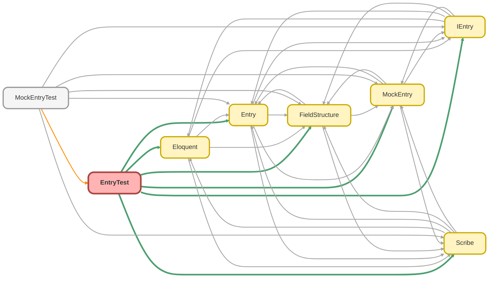

---
hide:
  - path
---

# EntryTest Class

`ISTEST`

Copyright 2025 Hiroyuki Matsuoka 
 
Licensed under the Apache License, Version 2.0 (the &quot;License&quot;); 
you may not use this file except in compliance with the License. 
You may obtain a copy of the License at 
 
http://www.apache.org/licenses/LICENSE-2.0 
 
Unless required by applicable law or agreed to in writing, software 
distributed under the License is distributed on an &quot;AS IS&quot; BASIS, 
WITHOUT WARRANTIES OR CONDITIONS OF ANY KIND, either express or implied. 
See the License for the specific language governing permissions and 
limitations under the License.

## Class Diagram



<!-- Apex description -->

## Apex Code

```java
/**
 * Copyright 2025 Hiroyuki Matsuoka
 *
 * Licensed under the Apache License, Version 2.0 (the "License");
 * you may not use this file except in compliance with the License.
 * You may obtain a copy of the License at
 *
 * http://www.apache.org/licenses/LICENSE-2.0
 *
 * Unless required by applicable law or agreed to in writing, software
 * distributed under the License is distributed on an "AS IS" BASIS,
 * WITHOUT WARRANTIES OR CONDITIONS OF ANY KIND, either express or implied.
 * See the License for the specific language governing permissions and
 * limitations under the License.
 */
@isTest
public with sharing class EntryTest {
  @isTest
  static void testGet_WhenFieldExists_ShouldReturnFieldValue() {
    // Arrange
    SObject record = new Account(Name = 'Test Account');
    Entry entry = new Entry(record);

    // Act
    Object fieldValue = entry.get('Name');

    // Assert
    Assert.areEqual('Test Account', fieldValue, 'The field value should match the expected value.');
  }

  @isTest
  static void testGet_WhenFieldDoesNotExist_ThenThrowException() {
    // Arrange
    SObject record = new Account(Name = 'Test Account');
    Entry entry = new Entry(record);

    // Act & Assert
    try {
      entry.get('NonExistentField');
      Assert.fail('Expected Exception to be thrown.');
    } catch (QueryException e) {
      Assert.areEqual(
        'The specified field does not exist in the object\'s fields. object name: Account, field name: NonExistentField',
        e.getMessage()
      );
    }
  }

  @isTest
  static void testGet_WhenGetUserCount_ThenReutnCountResult() {
    // Arrange
    Scribe scribe = Scribe.source(User.getSObjectType())
      .field('IsActive')
      .count('Id', 'UserCount')
      .groupByField('IsActive');
    List<IEntry> entries = (new Eloquent()).getAggregate(scribe);

    // Act
    Entry entry = (Entry) entries[0];
    Integer count = (Integer) entry.get('UserCount');

    // Assert
    Assert.isTrue(count >= 0, 'The count should be non-negative.');
  }

  @isTest
  static void testGet_WhenGetNonExistAlias_ThenThrowException() {
    // Arrange
    Scribe scribe = Scribe.source(User.getSObjectType())
      .field('IsActive')
      .count('Id', 'UserCount')
      .groupByField('IsActive');
    List<IEntry> entries = (new Eloquent()).getAggregate(scribe);
    Entry entry = (Entry) entries[0];

    // Act & Assert
    try {
      entry.get('NonExistAlias');
      Assert.fail('Expected Exception to be thrown.');
    } catch (QueryException e) {
      Assert.areEqual(
        'The specified field or alias is not exist in Scribe. field or alias name: NonExistAlias',
        e.getMessage()
      );
    }
  }

  @isTest
  static void testPut_WhenFieldExists_ShouldUpdateFieldValue() {
    // Arrange
    SObject record = new Account(Name = 'Test Account');
    Entry entry = new Entry(record);
    String newName = 'Updated Account';

    // Act
    entry.put('Name', newName);
    String updatedName = (String) entry.get('Name');

    // Assert
    Assert.areEqual(newName, updatedName, 'The field value should be updated to the new value.');
  }

  @isTest
  static void testPut_WhenFieldDoesNotExist_ThenThrowException() {
    // Arrange
    SObject record = new Account(Name = 'Test Account');
    Entry entry = new Entry(record);
    String newValue = 'Some Value';

    // Act & Assert
    try {
      entry.put('NonExistentField', newValue);
      Assert.fail('Expected Exception to be thrown.');
    } catch (QueryException e) {
      Assert.areEqual(
        'The specified field does not exist in the object\'s fields. object name: Account, field name: NonExistentField',
        e.getMessage()
      );
    }
  }

  @isTest
  static void testPut_WhenCalledOnAggregateResult_ThenThrowException() {
    // Arrange
    Scribe scribe = Scribe.source(User.getSObjectType())
      .field('IsActive')
      .count('Id', 'UserCount')
      .groupByField('IsActive');
    List<IEntry> entries = (new Eloquent()).getAggregate(scribe);
    Entry entry = (Entry) entries[0];
    String newValue = 'Some Value';

    // Act & Assert
    try {
      entry.put('IsActive', newValue);
      Assert.fail('Expected Exception to be thrown.');
    } catch (QueryException e) {
      Assert.areEqual('Cannot call put() on an AggregateResult record.', e.getMessage());
    }
  }


  @isTest
  static void testGetId_WhenCalled_ShouldReturnId() {
    // Arrange
    SObject record = new Account(Id = '001000000000000', Name = 'Test Account');
    Entry entry = new Entry(record);

    // Act
    Id id = entry.getId();

    // Assert
    Assert.areEqual('001000000000000', id, 'The Id should match the expected value.');
  }

  @isTest
  static void testGetName_WhenCalled_ShouldReturnName() {
    // Arrange
    SObject record = new Account(Id = '001000000000000', Name = 'Test Account');
    Entry entry = new Entry(record);

    // Act
    String name = entry.getName();

    // Assert
    Assert.areEqual('Test Account', name, 'The Name should match the expected value.');
  }

  @isTest
  static void testGetRecord_WhenCalled_ShouldReturnSObject() {
    // Arrange
    SObject record = new Account(Id = '001000000000000', Name = 'Test Account');
    Entry entry = new Entry(record);

    // Act
    SObject returnedRecord = entry.getRecord();

    // Assert
    Assert.areEqual(record, returnedRecord, 'The returned SObject should match the original record.');
  }

  @isTest
  static void testGetParent_WhenParentExists_ShouldReturnParentEntry() {
    // Arrange
    SObject record = new Opportunity(Name = 'Test Opportunity', Id = '006000000000001');
    Account parentAccount = new Account(Name = 'Parent Account', Id = '001000000000001');
    record.putSObject('Account', parentAccount);
    Entry entry = new Entry(record);

    // Act
    IEntry parentEntry = entry.getParent('AccountId');

    // Assert
    Assert.isNotNull(parentEntry, 'The parent entry should not be null when a parent exists.');
    Assert.areEqual(
      parentAccount.Id,
      parentEntry.getId(),
      'The parent entry Id should match the expected parent Id.'
    );
  }

  @isTest
  static void testGetParent_WhenParentIsNull_ThenReturnNull() {
    // Arrange
    SObject record = new Opportunity(Name = 'Test Opportunity');
    Entry entry = new Entry(record);

    // Act
    IEntry parentEntry = entry.getParent('AccountId');

    // Assert
    Assert.isNull(parentEntry, 'The parent entry should be null when no parent exists.');
  }

  @isTest
  static void testGetParent_WhenParentIdFieldDoesNotExist_ThenThrowException() {
    // Arrange
    SObject record = new Opportunity(Name = 'Test Opportunity');
    Entry entry = new Entry(record);

    // Act & Assert
    try {
      entry.getParent('NonExistentParentIdField');
      Assert.fail('Expected Exception to be thrown.');
    } catch (QueryException e) {
      Assert.areEqual(
        'The specified parentIdFieldName does not exist in the object\'s fields. object name: Opportunity, parent Id field name: NonExistentParentIdField',
        e.getMessage()
      );
    }
  }

  @isTest
  static void testGetParent_WhenParentIdFieldIsExistButNotReferenceType_ThenThrowException() {
    // Arrange
    SObject record = new Account(Name = 'Test Account');
    Entry entry = new Entry(record);

    // Act & Assert
    try {
      entry.getParent('Name'); // Name is not a reference field
      Assert.fail('Expected Exception to be thrown.');
    } catch (QueryException e) {
      Assert.areEqual(
        'The specified parentIdFieldName is not a reference type. object name: Account, parent Id field name: Name',
        e.getMessage()
      );
    }
  }

  @isTest
  static void testGetChildren_WhenChildrenAreNull_ShouldReturnEmptyList() {
    // Arrange
    SObject record = new Account(Name = 'Test Account');
    Entry entry = new Entry(record);

    // Act
    List<IEntry> children = entry.getChildren('Contact');

    // Assert
    Assert.isTrue(children.isEmpty(), 'The children list should be empty when no children exist.');
  }

  @isTest
  static void testGetChildren_WhenChildObjectNameDoesNotExist_ThenThrowException() {
    // Arrange
    SObject record = new Account(Name = 'Test Account');
    Entry entry = new Entry(record);

    // Act & Assert
    try {
      entry.getChildren('NonExistentChildObject');
      Assert.fail('Expected Exception to be thrown.');
    } catch (QueryException e) {
      Assert.areEqual(
        'The specified childObjectName does not exist in the parent object\'s children relationships. parent object name: Account, child object name: NonExistentChildObject',
        e.getMessage()
      );
    }
  }

  @isTest
  static void testGetChildrenByRelationName_WhenChildrenAreNull_ShouldReturnEmptyList() {
    // Arrange
    SObject record = new Account(Name = 'Test Account');
    Entry entry = new Entry(record);

    // Act
    List<IEntry> children = entry.getChildrenByRelationName('Contacts');

    // Assert
    Assert.isTrue(children.isEmpty(), 'The children list should be empty when no children exist.');
  }

  @isTest
  static void testGetRecord_WhenCalled_ThenReturnSObject() {
    // Arrange
    SObject record = new Account(Name = 'Test Account');
    Entry entry = new Entry(record);

    // Act
    SObject returnedRecord = entry.getRecord();

    // Assert
    Assert.areEqual(record, returnedRecord, 'The returned SObject should match the original record.');
  }

  @isTest
  static void testSetRecord_WhenCalled_ThenSetSObject() {
    // Arrange
    SObject record = new Account(Name = 'Test Account');
    Entry entry = new Entry(record);
    SObject newRecord = new Account(Name = 'Updated Account');

    // Act
    IEntry newEntry = entry.setRecord(newRecord);
    SObject returnedRecord = newEntry.getRecord();

    // Assert
    Assert.areEqual(newRecord, returnedRecord, 'The SObject should be updated to the new record.');
  }

  @isTest
  static void testSetFieldStructure_WhenCalled_ThenThrowException() {
    // Arrange
    SObject record = new Account(Name = 'Test Account');
    Entry entry = new Entry(record);
    FieldStructure fieldStructure = new FieldStructure();

    // Act & Assert
    try {
      entry.setFieldStructure(fieldStructure);
      Assert.fail('Expected Exception to be thrown.');
    } catch (QueryException e) {
      Assert.areEqual(
        'Field structure is not supported in Entry class. Use MockEntry for testing purposes.',
        e.getMessage()
      );
    }
  }
}
```

## Methods
### `testGet_WhenFieldExists_ShouldReturnFieldValue()`

`ISTEST`

#### Signature
```apex
private static void testGet_WhenFieldExists_ShouldReturnFieldValue()
```

#### Return Type
**void**

---

### `testGet_WhenFieldDoesNotExist_ThenThrowException()`

`ISTEST`

#### Signature
```apex
private static void testGet_WhenFieldDoesNotExist_ThenThrowException()
```

#### Return Type
**void**

---

### `testGet_WhenGetUserCount_ThenReutnCountResult()`

`ISTEST`

#### Signature
```apex
private static void testGet_WhenGetUserCount_ThenReutnCountResult()
```

#### Return Type
**void**

---

### `testGet_WhenGetNonExistAlias_ThenThrowException()`

`ISTEST`

#### Signature
```apex
private static void testGet_WhenGetNonExistAlias_ThenThrowException()
```

#### Return Type
**void**

---

### `testPut_WhenFieldExists_ShouldUpdateFieldValue()`

`ISTEST`

#### Signature
```apex
private static void testPut_WhenFieldExists_ShouldUpdateFieldValue()
```

#### Return Type
**void**

---

### `testPut_WhenFieldDoesNotExist_ThenThrowException()`

`ISTEST`

#### Signature
```apex
private static void testPut_WhenFieldDoesNotExist_ThenThrowException()
```

#### Return Type
**void**

---

### `testPut_WhenCalledOnAggregateResult_ThenThrowException()`

`ISTEST`

#### Signature
```apex
private static void testPut_WhenCalledOnAggregateResult_ThenThrowException()
```

#### Return Type
**void**

---

### `testGetId_WhenCalled_ShouldReturnId()`

`ISTEST`

#### Signature
```apex
private static void testGetId_WhenCalled_ShouldReturnId()
```

#### Return Type
**void**

---

### `testGetName_WhenCalled_ShouldReturnName()`

`ISTEST`

#### Signature
```apex
private static void testGetName_WhenCalled_ShouldReturnName()
```

#### Return Type
**void**

---

### `testGetRecord_WhenCalled_ShouldReturnSObject()`

`ISTEST`

#### Signature
```apex
private static void testGetRecord_WhenCalled_ShouldReturnSObject()
```

#### Return Type
**void**

---

### `testGetParent_WhenParentExists_ShouldReturnParentEntry()`

`ISTEST`

#### Signature
```apex
private static void testGetParent_WhenParentExists_ShouldReturnParentEntry()
```

#### Return Type
**void**

---

### `testGetParent_WhenParentIsNull_ThenReturnNull()`

`ISTEST`

#### Signature
```apex
private static void testGetParent_WhenParentIsNull_ThenReturnNull()
```

#### Return Type
**void**

---

### `testGetParent_WhenParentIdFieldDoesNotExist_ThenThrowException()`

`ISTEST`

#### Signature
```apex
private static void testGetParent_WhenParentIdFieldDoesNotExist_ThenThrowException()
```

#### Return Type
**void**

---

### `testGetParent_WhenParentIdFieldIsExistButNotReferenceType_ThenThrowException()`

`ISTEST`

#### Signature
```apex
private static void testGetParent_WhenParentIdFieldIsExistButNotReferenceType_ThenThrowException()
```

#### Return Type
**void**

---

### `testGetChildren_WhenChildrenAreNull_ShouldReturnEmptyList()`

`ISTEST`

#### Signature
```apex
private static void testGetChildren_WhenChildrenAreNull_ShouldReturnEmptyList()
```

#### Return Type
**void**

---

### `testGetChildren_WhenChildObjectNameDoesNotExist_ThenThrowException()`

`ISTEST`

#### Signature
```apex
private static void testGetChildren_WhenChildObjectNameDoesNotExist_ThenThrowException()
```

#### Return Type
**void**

---

### `testGetChildrenByRelationName_WhenChildrenAreNull_ShouldReturnEmptyList()`

`ISTEST`

#### Signature
```apex
private static void testGetChildrenByRelationName_WhenChildrenAreNull_ShouldReturnEmptyList()
```

#### Return Type
**void**

---

### `testGetRecord_WhenCalled_ThenReturnSObject()`

`ISTEST`

#### Signature
```apex
private static void testGetRecord_WhenCalled_ThenReturnSObject()
```

#### Return Type
**void**

---

### `testSetRecord_WhenCalled_ThenSetSObject()`

`ISTEST`

#### Signature
```apex
private static void testSetRecord_WhenCalled_ThenSetSObject()
```

#### Return Type
**void**

---

### `testSetFieldStructure_WhenCalled_ThenThrowException()`

`ISTEST`

#### Signature
```apex
private static void testSetFieldStructure_WhenCalled_ThenThrowException()
```

#### Return Type
**void**