---
hide:
  - path
---

# EqualConditionClause Class

A concrete implementation of `AbstractConditionClause` that builds a 
SOQL equality ( `=` ) condition. 
 
This class formats the provided value based on the field&#x27;s data type, correctly 
applying quotes for strings, dates, etc. It handles `null` values by generating 
an `IS NULL` condition (e.g., `FieldName = NULL` ).

**See** [IConditionClause](IConditionClause.md)

**See** [AbstractConditionClause](AbstractConditionClause.md)

**Inheritance**

[AbstractConditionClause](AbstractConditionClause.md)

## Class Diagram

```mermaid
graph LR
  EqualConditionClause["EqualConditionClause"]:::mainApexClass
  click EqualConditionClause "/objects/EqualConditionClause/"
  AbstractConditionClause["AbstractConditionClause"]:::apexClass
  click AbstractConditionClause "/apex/AbstractConditionClause/"
  IConditionClause["IConditionClause"]:::apexClass
  click IConditionClause "/apex/IConditionClause/"
  EqualConditionClauseTest["EqualConditionClauseTest"]:::apexTestClass
  click EqualConditionClauseTest "/apex/EqualConditionClauseTest/"
  GreaterThanOrEqualConditionClause["GreaterThanOrEqualConditionClause"]:::apexClass
  click GreaterThanOrEqualConditionClause "/apex/GreaterThanOrEqualConditionClause/"
  GreaterThanOrEqualConditionClauseTest["GreaterThanOrEqualConditionClauseTest"]:::apexTestClass
  click GreaterThanOrEqualConditionClauseTest "/apex/GreaterThanOrEqualConditionClauseTest/"
  LessThanOrEqualConditionClause["LessThanOrEqualConditionClause"]:::apexClass
  click LessThanOrEqualConditionClause "/apex/LessThanOrEqualConditionClause/"
  LessThanOrEqualConditionClauseTest["LessThanOrEqualConditionClauseTest"]:::apexTestClass
  click LessThanOrEqualConditionClauseTest "/apex/LessThanOrEqualConditionClauseTest/"
  NotEqualConditionClause["NotEqualConditionClause"]:::apexClass
  click NotEqualConditionClause "/apex/NotEqualConditionClause/"
  NotEqualConditionClauseTest["NotEqualConditionClauseTest"]:::apexTestClass
  click NotEqualConditionClauseTest "/apex/NotEqualConditionClauseTest/"
  Scribe["Scribe"]:::apexClass
  click Scribe "/apex/Scribe/"

  EqualConditionClause --> AbstractConditionClause
  EqualConditionClause --> IConditionClause

  EqualConditionClauseTest --> EqualConditionClause
  GreaterThanOrEqualConditionClause --> EqualConditionClause
  GreaterThanOrEqualConditionClauseTest --> EqualConditionClause
  LessThanOrEqualConditionClause --> EqualConditionClause
  LessThanOrEqualConditionClauseTest --> EqualConditionClause
  NotEqualConditionClause --> EqualConditionClause
  NotEqualConditionClauseTest --> EqualConditionClause
  Scribe --> EqualConditionClause

  AbstractConditionClause --> IConditionClause
  AbstractConditionClause --> Scribe
  IConditionClause --> AbstractConditionClause
  IConditionClause --> Scribe
  EqualConditionClauseTest --> IConditionClause
  GreaterThanOrEqualConditionClause --> AbstractConditionClause
  GreaterThanOrEqualConditionClause --> IConditionClause
  GreaterThanOrEqualConditionClauseTest --> EqualConditionClauseTest
  GreaterThanOrEqualConditionClauseTest --> GreaterThanOrEqualConditionClause
  GreaterThanOrEqualConditionClauseTest --> IConditionClause
  LessThanOrEqualConditionClause --> AbstractConditionClause
  LessThanOrEqualConditionClause --> IConditionClause
  LessThanOrEqualConditionClauseTest --> EqualConditionClauseTest
  LessThanOrEqualConditionClauseTest --> IConditionClause
  LessThanOrEqualConditionClauseTest --> LessThanOrEqualConditionClause
  NotEqualConditionClause --> AbstractConditionClause
  NotEqualConditionClause --> IConditionClause
  NotEqualConditionClauseTest --> EqualConditionClauseTest
  NotEqualConditionClauseTest --> IConditionClause
  NotEqualConditionClauseTest --> NotEqualConditionClause
  Scribe --> GreaterThanOrEqualConditionClause
  Scribe --> IConditionClause
  Scribe --> LessThanOrEqualConditionClause
  Scribe --> NotEqualConditionClause

classDef apexClass fill:#FFF4C2,stroke:#CCAA00,stroke-width:3px,rx:12px,ry:12px,shadow:drop,color:#333;
classDef apexTestClass fill:#F5F5F5,stroke:#999999,stroke-width:3px,rx:12px,ry:12px,shadow:drop,color:#333;
classDef mainApexClass fill:#FFB3B3,stroke:#A94442,stroke-width:4px,rx:14px,ry:14px,shadow:drop,color:#333,font-weight:bold;

linkStyle 0,1 stroke:#4C9F70,stroke-width:4px;
linkStyle 2,3,4,5,6,7,8,9 stroke:#FF8C00,stroke-width:2px;
linkStyle 10,11,12,13,14,15,16,17,18,19,20,21,22,23,24,25,26,27,28,29,30,31,32,33 stroke:#A6A6A6,stroke-width:2px;
```



<!-- Apex description -->

## Apex Code

```java
/**
 * Copyright 2025 Hiroyuki Matsuoka
 *
 * Licensed under the Apache License, Version 2.0 (the "License");
 * you may not use this file except in compliance with the License.
 * You may obtain a copy of the License at
 *
 * http://www.apache.org/licenses/LICENSE-2.0
 *
 * Unless required by applicable law or agreed to in writing, software
 * distributed under the License is distributed on an "AS IS" BASIS,
 * WITHOUT WARRANTIES OR CONDITIONS OF ANY KIND, either express or implied.
 * See the License for the specific language governing permissions and
 * limitations under the License.
 */

/**
 * @description A concrete implementation of `AbstractConditionClause` that builds a
 * SOQL equality (`=`) condition.
 *
 * This class formats the provided value based on the field's data type, correctly
 * applying quotes for strings, dates, etc. It handles `null` values by generating
 * an `IS NULL` condition (e.g., `FieldName = NULL`).
 * @see IConditionClause
 * @see AbstractConditionClause
 */
public with sharing class EqualConditionClause extends AbstractConditionClause {
  private final Object value;

  /**
   * Constructor for EqualConditionClause.
   *
   * @param sObjectType The SObject type for the condition.
   * @param fieldMap A map of field names to Schema.SObjectField.
   * @param field The field name to apply the equality condition on.
   * @param value The value to compare against.
   */
  public EqualConditionClause(
    Schema.SObjectType sObjectType,
    Map<String, Schema.SObjectField> fieldMap,
    String field,
    Object value
  ) {
    super(sObjectType, fieldMap, field);
    this.value = value;
  }

  /**
   * @inheritdoc
   */
  public override String build() {
    return String.format('{0} = {1}', new List<String>{ this.field, this.checkAndCast() });
  }

  /**
   * @inheritdoc
   */
  public override IConditionClause overrideMetaData(
    Schema.SObjectType sObjectType,
    Map<String, Schema.SObjectField> fieldMap
  ) {
    return new EqualConditionClause(sObjectType, fieldMap, this.field, this.value);
  }

  /**
   * @inheritdoc
   */
  public override IConditionClause overrideField(String field) {
    return new EqualConditionClause(this.sObjectType, this.fieldMap, field, this.value);
  }

  /**
   * check the value type and cast it to string for SOQL
   *
   * @return The value formatted as a SOQL-compatible string.
   */
  private String checkAndCast() {
    Schema.DisplayType fieldType = this.getFieldType(field);

    if (value == null) {
      return 'NULL';
    }

    String valueString = this.formatAndCastToString(value);
    if (this.TYPES_REQUIRING_SINGLE_QUOTES.contains(fieldType)) {
      return '\'' + valueString + '\'';
    }

    return valueString;
  }
}
```

## Fields
### `value`

#### Signature
```apex
private final value
```

#### Type
Object

## Constructors
### `EqualConditionClause(sObjectType, fieldMap, field, value)`

Constructor for EqualConditionClause.

#### Signature
```apex
public EqualConditionClause(Schema.SObjectType sObjectType, Map<String,Schema.SObjectField> fieldMap, String field, Object value)
```

#### Parameters
| Name | Type | Description |
|------|------|-------------|
| sObjectType | Schema.SObjectType | The SObject type for the condition. |
| fieldMap | Map<String,Schema.SObjectField> | A map of field names to Schema.SObjectField. |
| field | String | The field name to apply the equality condition on. |
| value | Object | The value to compare against. |

## Methods
### `build()`

**Inheritdoc**

#### Signature
```apex
public override String build()
```

#### Return Type
**String**

---

### `overrideMetaData(sObjectType, fieldMap)`

**Inheritdoc**

#### Signature
```apex
public override IConditionClause overrideMetaData(Schema.SObjectType sObjectType, Map<String,Schema.SObjectField> fieldMap)
```

#### Parameters
| Name | Type | Description |
|------|------|-------------|
| sObjectType | Schema.SObjectType |  |
| fieldMap | Map<String,Schema.SObjectField> |  |

#### Return Type
**[IConditionClause](IConditionClause.md)**

---

### `overrideField(field)`

**Inheritdoc**

#### Signature
```apex
public override IConditionClause overrideField(String field)
```

#### Parameters
| Name | Type | Description |
|------|------|-------------|
| field | String |  |

#### Return Type
**[IConditionClause](IConditionClause.md)**

---

### `checkAndCast()`

check the value type and cast it to string for SOQL

#### Signature
```apex
private String checkAndCast()
```

#### Return Type
**String**

The value formatted as a SOQL-compatible string.

---

### `getFieldName()`

*Inherited*

**InheritDoc**

#### Signature
```apex
public String getFieldName()
```

#### Return Type
**String**