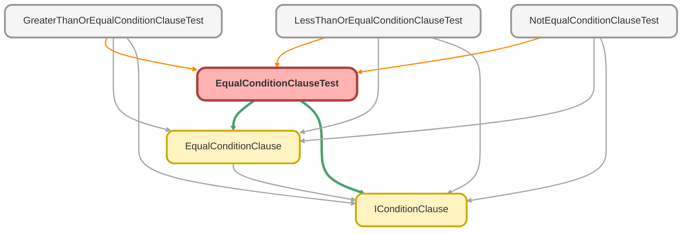

---
hide:
  - path
---

# EqualConditionClauseTest Class

`ISTEST`

Copyright 2025 Hiroyuki Matsuoka 
 
Licensed under the Apache License, Version 2.0 (the &quot;License&quot;); 
you may not use this file except in compliance with the License. 
You may obtain a copy of the License at 
 
http://www.apache.org/licenses/LICENSE-2.0 
 
Unless required by applicable law or agreed to in writing, software 
distributed under the License is distributed on an &quot;AS IS&quot; BASIS, 
WITHOUT WARRANTIES OR CONDITIONS OF ANY KIND, either express or implied. 
See the License for the specific language governing permissions and 
limitations under the License.

## Class Diagram



<!-- Apex description -->

## Apex Code

```java
/**
 * Copyright 2025 Hiroyuki Matsuoka
 *
 * Licensed under the Apache License, Version 2.0 (the "License");
 * you may not use this file except in compliance with the License.
 * You may obtain a copy of the License at
 *
 * http://www.apache.org/licenses/LICENSE-2.0
 *
 * Unless required by applicable law or agreed to in writing, software
 * distributed under the License is distributed on an "AS IS" BASIS,
 * WITHOUT WARRANTIES OR CONDITIONS OF ANY KIND, either express or implied.
 * See the License for the specific language governing permissions and
 * limitations under the License.
 */
@isTest
public class EqualConditionClauseTest {
  @isTest
  static void testBuild_WhenValueIsString_ThenReturnsConditionWithQuotes() {
    // Arrange
    Schema.SObjectType sObjectType = Account.getsobjectType();
    Map<String, Schema.SObjectField> fieldMap = sObjectType.getDescribe().fields.getMap();
    IConditionClause clause = new EqualConditionClause(sObjectType, fieldMap, 'Name', 'Test Corp');

    // Act
    String result = clause.build();

    // Assert
    Assert.areEqual('Name = \'Test Corp\'', result, 'String value should be enclosed in single quotes.');
  }

  @isTest
  static void testBuild_WhenValueIsInteger_ThenReturnsConditionWithoutQuotes() {
    // Arrange
    Schema.SObjectType sObjectType = Account.getsobjectType();
    Map<String, Schema.SObjectField> fieldMap = sObjectType.getDescribe().fields.getMap();
    IConditionClause clause = new EqualConditionClause(sObjectType, fieldMap, 'NumberOfEmployees', 100);

    // Act
    String result = clause.build();

    // Assert
    Assert.areEqual('NumberOfEmployees = 100', result, 'Integer value should not be quoted.');
  }

  @isTest
  static void testBuild_WhenValueIsDate_ThenReturnsFormattedDateLiteral() {
    // Arrange
    Schema.SObjectType sObjectType = Opportunity.getsobjectType();
    Map<String, Schema.SObjectField> fieldMap = sObjectType.getDescribe().fields.getMap();
    Date testDate = Date.newInstance(2025, 9, 10);
    IConditionClause clause = new EqualConditionClause(sObjectType, fieldMap, 'CloseDate', testDate);

    // Act
    String result = clause.build();

    // Assert
    Assert.areEqual(
      'CloseDate = 2025-09-10',
      result,
      'Date value should be formatted as YYYY-MM-DD and quoted.'
    );
  }

  @isTest
  static void testBuild_WhenValueIsDatetime_ThenReturnsFormattedDatetimeLiteral() {
    // Arrange
    // This datetime is in the local timezone of the running user.
    Datetime testDatetime = Datetime.newInstance(2025, 9, 10, 15, 30, 0);
    // formatGmt will convert it to the correct UTC string for SOQL.
    String expectedGmtString = testDatetime.formatGmt('yyyy-MM-dd\'T\'HH:mm:ss\'Z\'');

    Schema.SObjectType sObjectType = Opportunity.getsobjectType();
    Map<String, Schema.SObjectField> fieldMap = sObjectType.getDescribe().fields.getMap();
    IConditionClause clause = new EqualConditionClause(sObjectType, fieldMap, 'CreatedDate', testDatetime);

    // Act
    String result = clause.build();

    // Assert
    String expectedResult = 'CreatedDate = ' + expectedGmtString;
    Assert.areEqual(expectedResult, result, 'Datetime value should be formatted as a GMT literal and quoted.');
  }

  @isTest
  static void testImmutability_WhenOverrideMetaData_ThenReturnsNewInstance() {
    // Arrange
    Schema.SObjectType accountSObjectType = Account.getsobjectType();
    Map<String, Schema.SObjectField> accountFieldMap = accountSObjectType.getDescribe().fields.getMap();
    IConditionClause originalClause = new EqualConditionClause(
      accountSObjectType,
      accountFieldMap,
      'Name',
      'Test'
    );

    // Act
    Schema.SObjectType oppSObjectType = Opportunity.getsobjectType();
    Map<String, Schema.SObjectField> oppFieldMap = oppSObjectType.getDescribe().fields.getMap();
    IConditionClause newClause = originalClause.overrideMetaData(oppSObjectType, oppFieldMap);

    // Assert
    Assert.areNotEqual(originalClause, newClause, 'A new instance should be returned.');
    // The original clause should remain unchanged
    Assert.areEqual('Name = \'Test\'', originalClause.build(), 'Original instance should not be modified.');
  }

  @isTest
  static void testImmutability_WhenOverrideField_ThenReturnsNewInstanceWithNewField() {
    // Arrange
    Schema.SObjectType sObjectType = Account.getsobjectType();
    Map<String, Schema.SObjectField> fieldMap = sObjectType.getDescribe().fields.getMap();
    IConditionClause originalClause = new EqualConditionClause(sObjectType, fieldMap, 'Name', 'Test Corp');

    // Act
    IConditionClause newClause = originalClause.overrideField('Industry');

    // Assert
    Assert.areNotEqual(originalClause, newClause, 'A new instance should be returned.');
    Assert.areEqual('Name = \'Test Corp\'', originalClause.build(), 'Original instance should not be modified.');
    Assert.areEqual(
      'Industry = \'Test Corp\'',
      newClause.build(),
      'New instance should reflect the overridden field name.'
    );
  }
}
```

## Methods
### `testBuild_WhenValueIsString_ThenReturnsConditionWithQuotes()`

`ISTEST`

#### Signature
```apex
private static void testBuild_WhenValueIsString_ThenReturnsConditionWithQuotes()
```

#### Return Type
**void**

---

### `testBuild_WhenValueIsInteger_ThenReturnsConditionWithoutQuotes()`

`ISTEST`

#### Signature
```apex
private static void testBuild_WhenValueIsInteger_ThenReturnsConditionWithoutQuotes()
```

#### Return Type
**void**

---

### `testBuild_WhenValueIsDate_ThenReturnsFormattedDateLiteral()`

`ISTEST`

#### Signature
```apex
private static void testBuild_WhenValueIsDate_ThenReturnsFormattedDateLiteral()
```

#### Return Type
**void**

---

### `testBuild_WhenValueIsDatetime_ThenReturnsFormattedDatetimeLiteral()`

`ISTEST`

#### Signature
```apex
private static void testBuild_WhenValueIsDatetime_ThenReturnsFormattedDatetimeLiteral()
```

#### Return Type
**void**

---

### `testImmutability_WhenOverrideMetaData_ThenReturnsNewInstance()`

`ISTEST`

#### Signature
```apex
private static void testImmutability_WhenOverrideMetaData_ThenReturnsNewInstance()
```

#### Return Type
**void**

---

### `testImmutability_WhenOverrideField_ThenReturnsNewInstanceWithNewField()`

`ISTEST`

#### Signature
```apex
private static void testImmutability_WhenOverrideField_ThenReturnsNewInstanceWithNewField()
```

#### Return Type
**void**