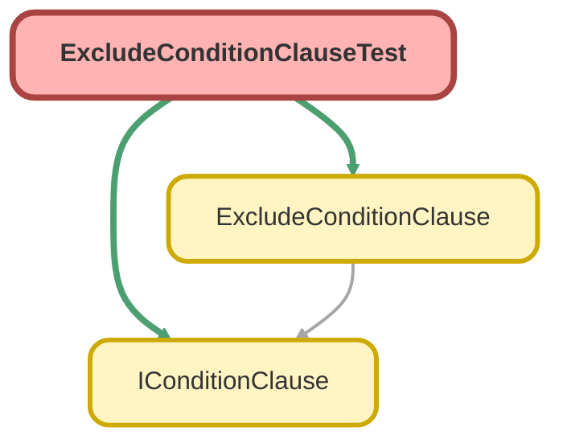

---
hide:
  - path
---

# ExcludeConditionClauseTest Class

`ISTEST`

Copyright 2025 Hiroyuki Matsuoka 
 
Licensed under the Apache License, Version 2.0 (the &quot;License&quot;); 
you may not use this file except in compliance with the License. 
You may obtain a copy of the License at 
 
http://www.apache.org/licenses/LICENSE-2.0 
 
Unless required by applicable law or agreed to in writing, software 
distributed under the License is distributed on an &quot;AS IS&quot; BASIS, 
WITHOUT WARRANTIES OR CONDITIONS OF ANY KIND, either express or implied. 
See the License for the specific language governing permissions and 
limitations under the License.

## Class Diagram



<!-- Apex description -->

## Apex Code

```java
/**
 * Copyright 2025 Hiroyuki Matsuoka
 *
 * Licensed under the Apache License, Version 2.0 (the "License");
 * you may not use this file except in compliance with the License.
 * You may obtain a copy of the License at
 *
 * http://www.apache.org/licenses/LICENSE-2.0
 *
 * Unless required by applicable law or agreed to in writing, software
 * distributed under the License is distributed on an "AS IS" BASIS,
 * WITHOUT WARRANTIES OR CONDITIONS OF ANY KIND, either express or implied.
 * See the License for the specific language governing permissions and
 * limitations under the License.
 */
@isTest
public class ExcludeConditionClauseTest {
  @isTest
  static void testBuild_WhenValueIsStringList_ThenReturnsExcludesClause() {
    // Arrange
    Schema.SObjectType sObjectType = Account.getSObjectType();
    Map<String, Schema.SObjectField> fieldMap = sObjectType.getDescribe().fields.getMap();
    List<String> valuesToExclude = new List<String>{ 'Value1', 'Value2' };
    IConditionClause clause = new ExcludeConditionClause(
      sObjectType,
      fieldMap,
      'MultiSelectField__c',
      valuesToExclude
    );

    // Act
    String result = clause.build();

    // Assert
    String expected = 'MultiSelectField__c EXCLUDES (\'Value1\', \'Value2\')';
    Assert.areEqual(expected, result, 'The clause should correctly format the EXCLUDES condition.');
  }

  @isTest
  static void testBuild_WhenValueIsEmptyList_ThenReturnsEmptyExcludesClause() {
    // Arrange
    Schema.SObjectType sObjectType = Account.getSObjectType();
    Map<String, Schema.SObjectField> fieldMap = sObjectType.getDescribe().fields.getMap();
    List<String> valuesToExclude = new List<String>();
    IConditionClause clause = new ExcludeConditionClause(
      sObjectType,
      fieldMap,
      'MultiSelectField__c',
      valuesToExclude
    );

    // Act
    String result = clause.build();

    // Assert
    String expected = 'MultiSelectField__c EXCLUDES ()';
    Assert.areEqual(expected, result, 'The clause should handle an empty list correctly.');
  }

  @isTest
  static void testImmutability_WhenOverrideMetaData_ThenReturnsNewInstance() {
    // Arrange
    Schema.SObjectType accountSObjectType = Account.getSObjectType();
    Map<String, Schema.SObjectField> accountFieldMap = accountSObjectType.getDescribe().fields.getMap();
    List<String> values = new List<String>{ 'Value1' };
    IConditionClause originalClause = new ExcludeConditionClause(
      accountSObjectType,
      accountFieldMap,
      'MultiSelectField__c',
      values
    );

    // Act
    Schema.SObjectType oppSObjectType = Opportunity.getSObjectType();
    Map<String, Schema.SObjectField> oppFieldMap = oppSObjectType.getDescribe().fields.getMap();
    IConditionClause newClause = originalClause.overrideMetaData(oppSObjectType, oppFieldMap);

    // Assert
    Assert.areNotEqual(originalClause, newClause, 'A new instance should be returned.');
    Assert.areEqual(
      'MultiSelectField__c EXCLUDES (\'Value1\')',
      originalClause.build(),
      'Original instance should not be modified.'
    );
  }

  @isTest
  static void testImmutability_WhenOverrideField_ThenReturnsNewInstanceWithNewField() {
    // Arrange
    Schema.SObjectType sObjectType = Account.getSObjectType();
    Map<String, Schema.SObjectField> fieldMap = sObjectType.getDescribe().fields.getMap();
    List<String> values = new List<String>{ 'ValueA', 'ValueB' };
    IConditionClause originalClause = new ExcludeConditionClause(sObjectType, fieldMap, 'OldField__c', values);

    // Act
    IConditionClause newClause = originalClause.overrideField('NewField__c');

    // Assert
    Assert.areNotEqual(originalClause, newClause, 'A new instance should be returned.');
    Assert.areEqual(
      'OldField__c EXCLUDES (\'ValueA\', \'ValueB\')',
      originalClause.build(),
      'Original instance should not be modified.'
    );
    Assert.areEqual(
      'NewField__c EXCLUDES (\'ValueA\', \'ValueB\')',
      newClause.build(),
      'New instance should reflect the overridden field name.'
    );
  }
}
```

## Methods
### `testBuild_WhenValueIsStringList_ThenReturnsExcludesClause()`

`ISTEST`

#### Signature
```apex
private static void testBuild_WhenValueIsStringList_ThenReturnsExcludesClause()
```

#### Return Type
**void**

---

### `testBuild_WhenValueIsEmptyList_ThenReturnsEmptyExcludesClause()`

`ISTEST`

#### Signature
```apex
private static void testBuild_WhenValueIsEmptyList_ThenReturnsEmptyExcludesClause()
```

#### Return Type
**void**

---

### `testImmutability_WhenOverrideMetaData_ThenReturnsNewInstance()`

`ISTEST`

#### Signature
```apex
private static void testImmutability_WhenOverrideMetaData_ThenReturnsNewInstance()
```

#### Return Type
**void**

---

### `testImmutability_WhenOverrideField_ThenReturnsNewInstanceWithNewField()`

`ISTEST`

#### Signature
```apex
private static void testImmutability_WhenOverrideField_ThenReturnsNewInstanceWithNewField()
```

#### Return Type
**void**