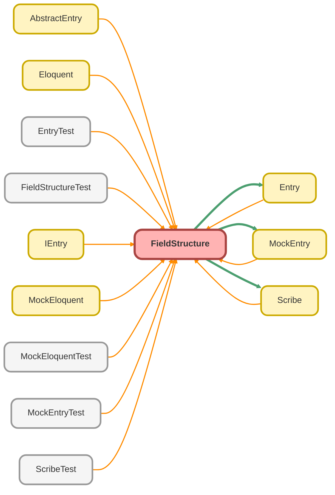

---
hide:
  - path
---

# FieldStructure Class

A data structure that represents the hierarchical &quot;shape&quot; of a `Scribe` query, 
including all selected fields and relationships. 
 
This class forms a recursive, tree-like structure. Each `FieldStructure` instance 
holds the fields for a specific SObject in the query and a map of its related objects, 
where each related object is also represented by a `FieldStructure` . 
 
Its primary purpose is to support the high-fidelity mocking system ( `MockEntry` ). 
It acts as a blueprint of the original query, allowing `MockEntry` to accurately 
simulate the &quot;select-forgotten&quot; validation and ensure that tests are only accessing 
data that would have been retrieved by the real query.

## Class Diagram



<!-- Apex description -->

## Apex Code

```java
/**
 * Copyright 2025 Hiroyuki Matsuoka
 *
 * Licensed under the Apache License, Version 2.0 (the "License");
 * you may not use this file except in compliance with the License.
 * You may obtain a copy of the License at
 *
 * http://www.apache.org/licenses/LICENSE-2.0
 *
 * Unless required by applicable law or agreed to in writing, software
 * distributed under the License is distributed on an "AS IS" BASIS,
 * WITHOUT WARRANTIES OR CONDITIONS OF ANY KIND, either express or implied.
 * See the License for the specific language governing permissions and
 * limitations under the License.
 */

/**
 * @description A data structure that represents the hierarchical "shape" of a `Scribe` query,
 * including all selected fields and relationships.
 *
 * This class forms a recursive, tree-like structure. Each `FieldStructure` instance
 * holds the fields for a specific SObject in the query and a map of its related objects,
 * where each related object is also represented by a `FieldStructure`.
 *
 * Its primary purpose is to support the high-fidelity mocking system (`MockEntry`).
 * It acts as a blueprint of the original query, allowing `MockEntry` to accurately
 * simulate the "select-forgotten" validation and ensure that tests are only accessing
 * data that would have been retrieved by the real query.
 */
public with sharing class FieldStructure {
  private List<String> fields;
  private Map<String, FieldStructure> relations;

  /**
   * Default constructor initializing empty fields and relations.
   */
  public FieldStructure() {
    this.fields = new List<String>();
    this.relations = new Map<String, FieldStructure>();
  }

  /**
   * Constructor initializing with a list of fields and empty relations.
   *
   * @param fields List of field names.
   */
  public FieldStructure(List<String> fields) {
    this.fields = fields;
    this.relations = new Map<String, FieldStructure>();
  }

  /**
   * Constructor initializing with a list of fields and a map of relations.
   *
   * @param fields List of field names.
   * @param relations Map of relation names to their corresponding FieldStructure.
   */
  public FieldStructure(List<String> fields, Map<String, FieldStructure> relations) {
    this.fields = fields;
    this.relations = relations;
  }

  /**
   * Checks if the current FieldStructure has any relations.
   * @return Boolean - True if relations exist, false otherwise.
   */
  public Boolean hasRelation() {
    return !this.relations.isEmpty();
  }

  /**
   * Checks if the current FieldStructure contains a specific relation by name.
   * @param relationName The name of the relation to check.
   * @return Boolean - True if the relation exists, false otherwise.
   */
  public Boolean hasRelation(String relationName) {
    return this.relations.containsKey(relationName);
  }

  /**
   * Checks if the current FieldStructure contains a specific field by name.
   * @param fieldName The name of the field to check.
   * @return Boolean - True if the field exists, false otherwise.
   */
  public Boolean hasField(String fieldName) {
    return this.fields.contains(fieldName);
  }

  /**
   * Adds a field to the current FieldStructure.
   *
   * @param relationName The name of the relation to add.
   * @param fieldStructure The FieldStructure of the relation.
   */
  public void addField(String fieldName) {
    if (!this.fields.contains(fieldName)) {
      this.fields.add(fieldName);
    }
  }

  /**
   * Removes a field from the current FieldStructure.
   *
   * @param relationName The name of the relation to add.
   * @param fieldStructure The FieldStructure of the relation.
   */
  public void removeField(String fieldName) {
    List<String> filteredFields = new List<String>();
    for (String field : this.fields) {
      if (field != fieldName) {
        filteredFields.add(field);
      }
    }
    this.fields = filteredFields;
  }

  /**
   * Checks if the current FieldStructure is empty (no fields and relations have no fields).
   *
   * @return Boolean - True if empty, false otherwise.
   */
  public Boolean isEmpty() {
    Boolean isFieldsEmpty = this.fields.isEmpty();
    Boolean isRelationEmpty;
    if (this.relations.isEmpty()) {
      isRelationEmpty = true;
    } else {
      isRelationEmpty = true;
      for (FieldStructure relationFieldStructure : this.relations.values()) {
        if (!relationFieldStructure.isEmpty()) {
          isRelationEmpty = false;
          break;
        }
      }
    }
    return isFieldsEmpty && isRelationEmpty;
  }

  /**
   * Gets the list of fields in the current FieldStructure as flatten.
   *
   * @return List<String> - List of field names.
   */
  public List<String> getAllFieldsAsFlatten() {
    List<String> allFields = new List<String>();
    allFields.addAll(this.fields);
    for (FieldStructure fieldStructure : this.relations.values()) {
      allFields.addAll(fieldStructure.getAllFieldsAsFlatten());
    }

    return allFields;
  }

  /**
   * Gets the list of fields in the current FieldStructure as flatten with relation names prefixed.
   *
   * @param relationName The prefix for relation names.
   * @return List<String> - List of field names with relation prefixes.
   */
  public List<String> getFieldsAsFlattenWithRelationName(String relationName) {
    List<String> allFields = new List<String>();
    if (relationName != null) {
      for (String field : this.fields) {
        allFields.add(relationName + '.' + field);
      }
    } else {
      allFields.addAll(this.fields);
    }
    for (String relation : this.relations.keySet()) {
      String chainedRelationName = relationName != null ? relationName + '.' + relation : relation;
      FieldStructure relationFieldStructure = this.relations.get(relation);
      List<String> relationFields = relationFieldStructure.getFieldsAsFlattenWithRelationName(chainedRelationName);
      allFields.addAll(relationFields);
    }

    return allFields;
  }

  /**
   * Retrieves the number of fields in the current FieldStructure.
   * @return Integer - The count of fields.
   */
  public Integer getFieldCount() {
    return this.fields.size();
  }

  /**
   * Retrieves the FieldStructure associated with a specific relation name.
   * @param relationName The name of the relation to retrieve.
   * @return FieldStructure - The FieldStructure of the relation, or null if not found.
   */
  public FieldStructure getRelationFieldStructure(String relationName) {
    if (this.relations.containsKey(relationName)) {
      return this.relations.get(relationName);
    }
    return new FieldStructure();
  }
}
```

## Fields
### `fields`

#### Signature
```apex
private fields
```

#### Type
List<String>

---

### `relations`

#### Signature
```apex
private relations
```

#### Type
Map<String,FieldStructure>

## Constructors
### `FieldStructure()`

Default constructor initializing empty fields and relations.

#### Signature
```apex
public FieldStructure()
```

---

### `FieldStructure(fields)`

Constructor initializing with a list of fields and empty relations.

#### Signature
```apex
public FieldStructure(List<String> fields)
```

#### Parameters
| Name | Type | Description |
|------|------|-------------|
| fields | List<String> | List of field names. |

---

### `FieldStructure(fields, relations)`

Constructor initializing with a list of fields and a map of relations.

#### Signature
```apex
public FieldStructure(List<String> fields, Map<String,FieldStructure> relations)
```

#### Parameters
| Name | Type | Description |
|------|------|-------------|
| fields | List<String> | List of field names. |
| relations | Map<String,FieldStructure> | Map of relation names to their corresponding FieldStructure. |

## Methods
### `hasRelation()`

Checks if the current FieldStructure has any relations.

#### Signature
```apex
public Boolean hasRelation()
```

#### Return Type
**Boolean**

Boolean - True if relations exist, false otherwise.

---

### `hasRelation(relationName)`

Checks if the current FieldStructure contains a specific relation by name.

#### Signature
```apex
public Boolean hasRelation(String relationName)
```

#### Parameters
| Name | Type | Description |
|------|------|-------------|
| relationName | String | The name of the relation to check. |

#### Return Type
**Boolean**

Boolean - True if the relation exists, false otherwise.

---

### `hasField(fieldName)`

Checks if the current FieldStructure contains a specific field by name.

#### Signature
```apex
public Boolean hasField(String fieldName)
```

#### Parameters
| Name | Type | Description |
|------|------|-------------|
| fieldName | String | The name of the field to check. |

#### Return Type
**Boolean**

Boolean - True if the field exists, false otherwise.

---

### `addField(fieldName)`

Adds a field to the current FieldStructure.

#### Signature
```apex
public void addField(String fieldName)
```

#### Parameters
| Name | Type | Description |
|------|------|-------------|
| fieldName | String |  |

#### Return Type
**void**

---

### `removeField(fieldName)`

Removes a field from the current FieldStructure.

#### Signature
```apex
public void removeField(String fieldName)
```

#### Parameters
| Name | Type | Description |
|------|------|-------------|
| fieldName | String |  |

#### Return Type
**void**

---

### `isEmpty()`

Checks if the current FieldStructure is empty (no fields and relations have no fields).

#### Signature
```apex
public Boolean isEmpty()
```

#### Return Type
**Boolean**

Boolean - True if empty, false otherwise.

---

### `getAllFieldsAsFlatten()`

Gets the list of fields in the current FieldStructure as flatten.

#### Signature
```apex
public List<String> getAllFieldsAsFlatten()
```

#### Return Type
**List<String>**

List&lt;String&gt; - List of field names.

---

### `getFieldsAsFlattenWithRelationName(relationName)`

Gets the list of fields in the current FieldStructure as flatten with relation names prefixed.

#### Signature
```apex
public List<String> getFieldsAsFlattenWithRelationName(String relationName)
```

#### Parameters
| Name | Type | Description |
|------|------|-------------|
| relationName | String | The prefix for relation names. |

#### Return Type
**List<String>**

List&lt;String&gt; - List of field names with relation prefixes.

---

### `getFieldCount()`

Retrieves the number of fields in the current FieldStructure.

#### Signature
```apex
public Integer getFieldCount()
```

#### Return Type
**Integer**

Integer - The count of fields.

---

### `getRelationFieldStructure(relationName)`

Retrieves the FieldStructure associated with a specific relation name.

#### Signature
```apex
public FieldStructure getRelationFieldStructure(String relationName)
```

#### Parameters
| Name | Type | Description |
|------|------|-------------|
| relationName | String | The name of the relation to retrieve. |

#### Return Type
**[FieldStructure](FieldStructure.md)**

FieldStructure - The FieldStructure of the relation, or null if not found.