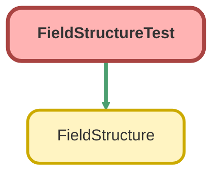

---
hide:
  - path
---

# FieldStructureTest Class

`ISTEST`

Copyright 2025 Hiroyuki Matsuoka 
 
Licensed under the Apache License, Version 2.0 (the &quot;License&quot;); 
you may not use this file except in compliance with the License. 
You may obtain a copy of the License at 
 
http://www.apache.org/licenses/LICENSE-2.0 
 
Unless required by applicable law or agreed to in writing, software 
distributed under the License is distributed on an &quot;AS IS&quot; BASIS, 
WITHOUT WARRANTIES OR CONDITIONS OF ANY KIND, either express or implied. 
See the License for the specific language governing permissions and 
limitations under the License.

## Class Diagram



<!-- Apex description -->

## Apex Code

```java
/**
 * Copyright 2025 Hiroyuki Matsuoka
 *
 * Licensed under the Apache License, Version 2.0 (the "License");
 * you may not use this file except in compliance with the License.
 * You may obtain a copy of the License at
 *
 * http://www.apache.org/licenses/LICENSE-2.0
 *
 * Unless required by applicable law or agreed to in writing, software
 * distributed under the License is distributed on an "AS IS" BASIS,
 * WITHOUT WARRANTIES OR CONDITIONS OF ANY KIND, either express or implied.
 * See the License for the specific language governing permissions and
 * limitations under the License.
 */
@isTest
public with sharing class FieldStructureTest {
  @isTest
  static void testConstructor_WhenNoArguments_ThenInstanceCreated() {
    // Arrange
    FieldStructure fieldStructure = new FieldStructure();

    // Act & Assert
    Assert.isNotNull(fieldStructure, 'FieldStructure instance should be created');
  }

  @isTest
  static void testConstructor_WhenWithFieldsArgument_ThenInstanceCreatedWithFields() {
    // Arrange
    List<String> fields = new List<String>{ 'Id', 'Name' };
    FieldStructure fieldStructure = new FieldStructure(fields);

    // Act & Assert
    Assert.isNotNull(fieldStructure, 'FieldStructure instance should be created');
  }

  @isTest
  static void testConstructor_WhenWithFieldsAndRelations_ThenInstanceCreatedWithFieldsAndRelations() {
    // Arrange
    List<String> fields = new List<String>{ 'Id', 'Name' };
    Map<String, FieldStructure> relations = new Map<String, FieldStructure>{
      'AccountId' => new FieldStructure(new List<String>{ 'Id', 'Name' })
    };
    FieldStructure fieldStructure = new FieldStructure(fields, relations);

    // Act & Assert
    Assert.isNotNull(fieldStructure, 'FieldStructure instance should be created with fields and relations');
  }

  @isTest
  static void testHasField_WhenFieldExists_ThenReturnsTrue() {
    // Arrange
    FieldStructure fieldStructure = new FieldStructure(new List<String>{ 'Id', 'Name' });

    // Act
    Boolean hasField = fieldStructure.hasField('Id');

    // Assert
    Assert.isTrue(hasField, 'FieldStructure should have field Id');
  }

  @isTest
  static void testHasRelation_WhenHasRelation_ThenReturnsTrue() {
    // Arrange
    FieldStructure fieldStructure = new FieldStructure(new List<String>{ 'Id', 'Name' }, 
      new Map<String, FieldStructure>{
        'AccountId' => new FieldStructure(new List<String>{ 'Id', 'Name' })
      });

    // Act / Assert
    Assert.isTrue(fieldStructure.hasRelation(), 'FieldStructure should have relation');
    Assert.isTrue(fieldStructure.hasRelation('AccountId'), 'FieldStructure should have relation Account');
  }

  @isTest
  static void testGetFieldCount_WhenFieldsExist_ThenReturnsCorrectCount() {
    // Arrange
    FieldStructure fieldStructure = new FieldStructure(new List<String>{ 'Id', 'Name', 'CreatedDate' });

    // Act
    Integer fieldCount = fieldStructure.getFieldCount();

    // Assert
    Assert.areEqual(3, fieldCount, 'Field count should be 3');
  }

  @isTest
  static void testGetRelationFieldStructure_WhenRelationExists_ThenReturnsFieldStructure() {
    // Arrange
    FieldStructure fieldStructure = new FieldStructure(new List<String>{ 'Id', 'Name' }, 
      new Map<String, FieldStructure>{
        'AccountId' => new FieldStructure(new List<String>{ 'Id', 'Name' })
      });

    // Act
    FieldStructure relationFieldStructure = fieldStructure.getRelationFieldStructure('AccountId');

    // Assert
    Assert.isNotNull(relationFieldStructure, 'Should return FieldStructure for AccountId relation');
    Assert.isTrue(relationFieldStructure.hasField('Id'), 'Relation should have field Id');
  }
}
```

## Methods
### `testConstructor_WhenNoArguments_ThenInstanceCreated()`

`ISTEST`

#### Signature
```apex
private static void testConstructor_WhenNoArguments_ThenInstanceCreated()
```

#### Return Type
**void**

---

### `testConstructor_WhenWithFieldsArgument_ThenInstanceCreatedWithFields()`

`ISTEST`

#### Signature
```apex
private static void testConstructor_WhenWithFieldsArgument_ThenInstanceCreatedWithFields()
```

#### Return Type
**void**

---

### `testConstructor_WhenWithFieldsAndRelations_ThenInstanceCreatedWithFieldsAndRelations()`

`ISTEST`

#### Signature
```apex
private static void testConstructor_WhenWithFieldsAndRelations_ThenInstanceCreatedWithFieldsAndRelations()
```

#### Return Type
**void**

---

### `testHasField_WhenFieldExists_ThenReturnsTrue()`

`ISTEST`

#### Signature
```apex
private static void testHasField_WhenFieldExists_ThenReturnsTrue()
```

#### Return Type
**void**

---

### `testHasRelation_WhenHasRelation_ThenReturnsTrue()`

`ISTEST`

#### Signature
```apex
private static void testHasRelation_WhenHasRelation_ThenReturnsTrue()
```

#### Return Type
**void**

---

### `testGetFieldCount_WhenFieldsExist_ThenReturnsCorrectCount()`

`ISTEST`

#### Signature
```apex
private static void testGetFieldCount_WhenFieldsExist_ThenReturnsCorrectCount()
```

#### Return Type
**void**

---

### `testGetRelationFieldStructure_WhenRelationExists_ThenReturnsFieldStructure()`

`ISTEST`

#### Signature
```apex
private static void testGetRelationFieldStructure_WhenRelationExists_ThenReturnsFieldStructure()
```

#### Return Type
**void**