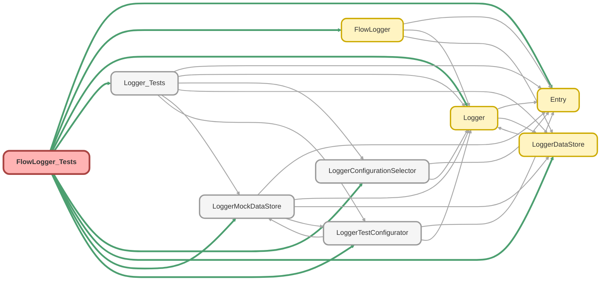

---
hide:
  - path
---

# FlowLogger_Tests Class

`SUPPRESSWARNINGS`
`ISTEST`

## Class Diagram



<!-- Apex description -->

## Apex Code

```java
//------------------------------------------------------------------------------------------------//
// This file is part of the Nebula Logger project, released under the MIT License.                //
// See LICENSE file or go to https://github.com/jongpie/NebulaLogger for full license details.    //
//------------------------------------------------------------------------------------------------//

@SuppressWarnings('PMD.ApexDoc, PMD.CyclomaticComplexity, PMD.ExcessiveParameterList, PMD.MethodNamingConventions, PMD.NcssMethodCount')
@IsTest(IsParallel=true)
private class FlowLogger_Tests {
  static {
    // Don't use the org's actual custom metadata records when running tests
    LoggerConfigurationSelector.useMocks();
  }

  @IsTest
  static void it_should_add_entry_to_logger_buffer() {
    LoggerDataStore.setMock(LoggerMockDataStore.getEventBus());
    System.LoggingLevel entryLoggingLevel = System.LoggingLevel.DEBUG;
    Logger.getUserSettings().LoggingLevel__c = entryLoggingLevel.name();
    LoggerTestConfigurator.setupMockSObjectHandlerConfigurations();
    System.Assert.areEqual(0, Logger.getBufferSize());
    System.Assert.areEqual(0, [SELECT COUNT() FROM LogEntry__c]);
    FlowLogger.LogEntry flowEntry = new FlowLogger.LogEntry();
    flowEntry.flowName = 'MyFlow';
    flowEntry.message = 'hello from Flow';
    flowEntry.loggingLevelName = entryLoggingLevel.name();
    flowEntry.saveLog = false;
    flowEntry.timestamp = System.now();
    System.Assert.areEqual(0, Logger.saveLogCallCount);
    System.Assert.areEqual(0, LoggerMockDataStore.getEventBus().getPublishCallCount());
    System.Assert.areEqual(0, LoggerMockDataStore.getEventBus().getPublishedPlatformEvents().size());

    FlowLogger.addEntries(new List<FlowLogger.LogEntry>{ flowEntry });
    System.Assert.areEqual(1, Logger.getBufferSize());
    Logger.saveLog();

    System.Assert.areEqual(0, Logger.getBufferSize());
    System.Assert.areEqual(1, Logger.saveLogCallCount);
    System.Assert.areEqual(1, LoggerMockDataStore.getEventBus().getPublishCallCount());
    System.Assert.areEqual(1, LoggerMockDataStore.getEventBus().getPublishedPlatformEvents().size());
    LogEntryEvent__e publishedLogEntryEvent = (LogEntryEvent__e) LoggerMockDataStore.getEventBus().getPublishedPlatformEvents().get(0);
    System.Assert.isNull(publishedLogEntryEvent.ExceptionMessage__c);
    System.Assert.isNull(publishedLogEntryEvent.ExceptionSourceActionName__c);
    System.Assert.isNull(publishedLogEntryEvent.ExceptionSourceApiName__c);
    System.Assert.isNull(publishedLogEntryEvent.ExceptionSourceMetadataType__c);
    System.Assert.isNull(publishedLogEntryEvent.ExceptionStackTrace__c, 'Flow does not have a stack trace, so expect null');
    System.Assert.isNull(publishedLogEntryEvent.ExceptionType__c);
    System.Assert.areEqual(flowEntry.loggingLevelName, publishedLogEntryEvent.LoggingLevel__c);
    System.Assert.areEqual(flowEntry.message, publishedLogEntryEvent.Message__c);
    System.Assert.areEqual(flowEntry.flowName, publishedLogEntryEvent.OriginLocation__c);
    System.Assert.areEqual(flowEntry.flowName, publishedLogEntryEvent.OriginSourceApiName__c);
    System.Assert.areEqual(FlowLogger.FLOW_SOURCE_METADATA_TYPE, publishedLogEntryEvent.OriginSourceMetadataType__c);
    System.Assert.areEqual(FlowLogger.FLOW_SOURCE_METADATA_TYPE, publishedLogEntryEvent.OriginType__c);
    System.Assert.isNull(publishedLogEntryEvent.StackTrace__c, 'Flow does not have a stack trace, so expect null');
    System.Assert.areEqual(flowEntry.timestamp, publishedLogEntryEvent.Timestamp__c);
  }

  @IsTest
  static void it_should_auto_save_entry_when_saveLog_is_true() {
    LoggerDataStore.setMock(LoggerMockDataStore.getEventBus());
    System.LoggingLevel entryLoggingLevel = System.LoggingLevel.DEBUG;
    System.Test.startTest();
    Logger.getUserSettings().LoggingLevel__c = entryLoggingLevel.name();
    LoggerTestConfigurator.setupMockSObjectHandlerConfigurations();
    System.Assert.areEqual(0, Logger.getBufferSize());
    System.Assert.areEqual(0, [SELECT COUNT() FROM LogEntry__c]);
    FlowLogger.LogEntry flowEntry = new FlowLogger.LogEntry();
    flowEntry.flowName = 'MyFlow';
    flowEntry.message = 'hello from Flow';
    flowEntry.loggingLevelName = entryLoggingLevel.name();
    flowEntry.saveLog = true;
    flowEntry.timestamp = System.now();
    System.Assert.areEqual(0, Logger.saveLogCallCount);
    System.Assert.areEqual(0, LoggerMockDataStore.getEventBus().getPublishCallCount());
    System.Assert.areEqual(0, LoggerMockDataStore.getEventBus().getPublishedPlatformEvents().size());

    FlowLogger.addEntries(new List<FlowLogger.LogEntry>{ flowEntry });

    System.Assert.areEqual(0, Logger.getBufferSize());
    System.Assert.areEqual(1, Logger.saveLogCallCount);
    System.Assert.areEqual(1, LoggerMockDataStore.getEventBus().getPublishCallCount());
    System.Assert.areEqual(1, LoggerMockDataStore.getEventBus().getPublishedPlatformEvents().size());
    LogEntryEvent__e publishedLogEntryEvent = (LogEntryEvent__e) LoggerMockDataStore.getEventBus().getPublishedPlatformEvents().get(0);
    System.Assert.isNull(publishedLogEntryEvent.ExceptionMessage__c);
    System.Assert.isNull(publishedLogEntryEvent.ExceptionSourceActionName__c, 'Flow logging does not have an action name, so expect null');
    System.Assert.isNull(publishedLogEntryEvent.ExceptionSourceApiName__c);
    System.Assert.isNull(publishedLogEntryEvent.ExceptionSourceMetadataType__c);
    System.Assert.isNull(publishedLogEntryEvent.ExceptionStackTrace__c, 'Flow does not have a stack trace, so expect null');
    System.Assert.isNull(publishedLogEntryEvent.ExceptionType__c);
    System.Assert.areEqual(flowEntry.loggingLevelName, publishedLogEntryEvent.LoggingLevel__c);
    System.Assert.areEqual(flowEntry.message, publishedLogEntryEvent.Message__c);
    System.Assert.areEqual(flowEntry.flowName, publishedLogEntryEvent.OriginLocation__c);
    System.Assert.areEqual(flowEntry.flowName, publishedLogEntryEvent.OriginSourceApiName__c);
    System.Assert.areEqual(FlowLogger.FLOW_SOURCE_METADATA_TYPE, publishedLogEntryEvent.OriginSourceMetadataType__c);
    System.Assert.areEqual(FlowLogger.FLOW_SOURCE_METADATA_TYPE, publishedLogEntryEvent.OriginType__c);
    System.Assert.isNull(publishedLogEntryEvent.StackTrace__c, 'Flow does not have a stack trace, so expect null');
    System.Assert.areEqual(flowEntry.timestamp, publishedLogEntryEvent.Timestamp__c);
  }

  @IsTest
  static void it_should_auto_save_entry_with_save_method_when_saveMethodName_specified() {
    LoggerDataStore.setMock(LoggerMockDataStore.getEventBus());
    LoggerDataStore.setMock(LoggerMockDataStore.getJobQueue());
    System.LoggingLevel entryLoggingLevel = System.LoggingLevel.DEBUG;
    System.Assert.areEqual(0, System.Limits.getQueueableJobs(), 'Test should start with 0 queueable jobs used');
    Logger.getUserSettings().LoggingLevel__c = entryLoggingLevel.name();
    LoggerTestConfigurator.setupMockSObjectHandlerConfigurations();
    System.Assert.areEqual(0, Logger.getBufferSize());
    System.Assert.areEqual(0, [SELECT COUNT() FROM LogEntry__c]);
    FlowLogger.LogEntry flowEntry = new FlowLogger.LogEntry();
    flowEntry.flowName = 'MyFlow';
    flowEntry.message = 'hello from Flow';
    flowEntry.loggingLevelName = entryLoggingLevel.name();
    flowEntry.saveLog = true;
    flowEntry.saveMethodName = Logger.SaveMethod.QUEUEABLE.name();
    flowEntry.timestamp = System.now();
    System.Assert.areEqual(0, Logger.saveLogCallCount);
    System.Assert.areEqual(0, LoggerMockDataStore.getEventBus().getPublishCallCount());
    System.Assert.areEqual(0, LoggerMockDataStore.getEventBus().getPublishedPlatformEvents().size());

    FlowLogger.addEntries(new List<FlowLogger.LogEntry>{ flowEntry });
    System.Assert.areEqual(1, LoggerMockDataStore.getJobQueue().getEnqueuedJobs().size());
    LoggerMockDataStore.getJobQueue().executeJobs();

    System.Assert.areEqual(Logger.SaveMethod.QUEUEABLE.name(), Logger.lastSaveMethodNameUsed);
    System.Assert.areEqual(0, Logger.getBufferSize());
    System.Assert.areEqual(1, Logger.saveLogCallCount);
    System.Assert.areEqual(1, LoggerMockDataStore.getEventBus().getPublishCallCount());
    System.Assert.areEqual(1, LoggerMockDataStore.getEventBus().getPublishedPlatformEvents().size());
    LogEntryEvent__e publishedLogEntryEvent = (LogEntryEvent__e) LoggerMockDataStore.getEventBus().getPublishedPlatformEvents().get(0);
    System.Assert.isNull(publishedLogEntryEvent.ExceptionMessage__c);
    System.Assert.isNull(publishedLogEntryEvent.ExceptionSourceActionName__c, 'Flow logging does not have an action name, so expect null');
    System.Assert.isNull(publishedLogEntryEvent.ExceptionSourceApiName__c);
    System.Assert.isNull(publishedLogEntryEvent.ExceptionSourceMetadataType__c);
    System.Assert.isNull(publishedLogEntryEvent.ExceptionStackTrace__c, 'Flow does not have a stack trace, so expect null');
    System.Assert.isNull(publishedLogEntryEvent.ExceptionType__c);
    System.Assert.areEqual(flowEntry.loggingLevelName, publishedLogEntryEvent.LoggingLevel__c);
    System.Assert.areEqual(flowEntry.message, publishedLogEntryEvent.Message__c);
    System.Assert.areEqual(flowEntry.flowName, publishedLogEntryEvent.OriginLocation__c);
    System.Assert.areEqual(flowEntry.flowName, publishedLogEntryEvent.OriginSourceApiName__c);
    System.Assert.areEqual(FlowLogger.FLOW_SOURCE_METADATA_TYPE, publishedLogEntryEvent.OriginSourceMetadataType__c);
    System.Assert.areEqual(FlowLogger.FLOW_SOURCE_METADATA_TYPE, publishedLogEntryEvent.OriginType__c);
    System.Assert.isNull(publishedLogEntryEvent.StackTrace__c, 'Flow does not have a stack trace, so expect null');
    System.Assert.areEqual(flowEntry.timestamp, publishedLogEntryEvent.Timestamp__c);
  }

  @IsTest
  static void it_should_throw_exception_with_fault_error_message_when_shouldThrowFaultMessageException_is_set_to_true() {
    LoggerDataStore.setMock(LoggerMockDataStore.getEventBus());
    System.LoggingLevel entryLoggingLevel = System.LoggingLevel.ERROR;
    Logger.getUserSettings().LoggingLevel__c = entryLoggingLevel.name();
    LoggerTestConfigurator.setupMockSObjectHandlerConfigurations();
    System.Assert.areEqual(0, Logger.getBufferSize());
    System.Assert.areEqual(0, [SELECT COUNT() FROM LogEntry__c]);
    FlowLogger.LogEntry flowEntry = new FlowLogger.LogEntry();
    flowEntry.flowName = 'MyFlow';
    flowEntry.message = 'hello from Flow';
    flowEntry.loggingLevelName = entryLoggingLevel.name();
    flowEntry.saveLog = false;
    flowEntry.faultMessage = 'Exception message';
    flowEntry.shouldThrowFaultMessageException = true;
    flowEntry.timestamp = System.now();
    System.Assert.areEqual(0, Logger.saveLogCallCount);
    System.Assert.areEqual(0, LoggerMockDataStore.getEventBus().getPublishCallCount());
    System.Assert.areEqual(0, LoggerMockDataStore.getEventBus().getPublishedPlatformEvents().size());

    Exception thrownException;
    try {
      FlowLogger.addEntries(new List<FlowLogger.LogEntry>{ flowEntry });
    } catch (Exception ex) {
      thrownException = ex;
    }

    System.Assert.isNotNull(thrownException);
    System.Assert.areEqual(flowEntry.faultMessage, thrownException.getMessage());
    System.Assert.isInstanceOfType(thrownException, System.FlowException.class);
    System.Assert.areEqual(0, Logger.getBufferSize());
    System.Assert.areEqual(1, Logger.saveLogCallCount);
    System.Assert.areEqual(1, LoggerMockDataStore.getEventBus().getPublishCallCount());
    System.Assert.areEqual(1, LoggerMockDataStore.getEventBus().getPublishedPlatformEvents().size());
    LogEntryEvent__e publishedLogEntryEvent = (LogEntryEvent__e) LoggerMockDataStore.getEventBus().getPublishedPlatformEvents().get(0);
    System.Assert.areEqual(flowEntry.faultMessage, publishedLogEntryEvent.ExceptionMessage__c);
    System.Assert.isNull(publishedLogEntryEvent.ExceptionSourceActionName__c, 'Flow logging does not have an action name, so expect null');
    System.Assert.areEqual(flowEntry.flowName, publishedLogEntryEvent.ExceptionSourceApiName__c);
    System.Assert.areEqual(FlowLogger.FLOW_SOURCE_METADATA_TYPE, publishedLogEntryEvent.ExceptionSourceMetadataType__c);
    System.Assert.isNull(publishedLogEntryEvent.ExceptionStackTrace__c, 'Flow does not have a stack trace, so expect null');
    System.Assert.areEqual(FlowLogger.FLOW_EXCEPTION_TYPE_NAME, publishedLogEntryEvent.ExceptionType__c);
    System.Assert.areEqual(flowEntry.loggingLevelName, publishedLogEntryEvent.LoggingLevel__c);
    System.Assert.areEqual(flowEntry.message, publishedLogEntryEvent.Message__c);
    System.Assert.areEqual(flowEntry.flowName, publishedLogEntryEvent.OriginLocation__c);
    System.Assert.areEqual(flowEntry.flowName, publishedLogEntryEvent.OriginSourceApiName__c);
    System.Assert.areEqual(FlowLogger.FLOW_SOURCE_METADATA_TYPE, publishedLogEntryEvent.OriginSourceMetadataType__c);
    System.Assert.areEqual(FlowLogger.FLOW_SOURCE_METADATA_TYPE, publishedLogEntryEvent.OriginType__c);
    System.Assert.isNull(publishedLogEntryEvent.StackTrace__c, 'Flow does not have a stack trace, so expect null');
    System.Assert.areEqual(flowEntry.timestamp, publishedLogEntryEvent.Timestamp__c);
  }

  @IsTest
  static void it_should_throw_exception_with_generic_message_when_shouldThrowFaultMessageException_is_set_to_true_and_faultMessage_is_null() {
    LoggerDataStore.setMock(LoggerMockDataStore.getEventBus());
    System.LoggingLevel entryLoggingLevel = System.LoggingLevel.ERROR;
    Logger.getUserSettings().LoggingLevel__c = entryLoggingLevel.name();
    LoggerTestConfigurator.setupMockSObjectHandlerConfigurations();
    System.Assert.areEqual(0, Logger.getBufferSize());
    System.Assert.areEqual(0, [SELECT COUNT() FROM LogEntry__c]);
    FlowLogger.LogEntry flowEntry = new FlowLogger.LogEntry();
    flowEntry.flowName = 'MyFlow';
    flowEntry.message = 'hello from Flow';
    flowEntry.loggingLevelName = entryLoggingLevel.name();
    flowEntry.saveLog = false;
    flowEntry.faultMessage = null;
    flowEntry.shouldThrowFaultMessageException = true;
    flowEntry.timestamp = System.now();
    System.Assert.areEqual(0, Logger.saveLogCallCount);
    System.Assert.areEqual(0, LoggerMockDataStore.getEventBus().getPublishCallCount());
    System.Assert.areEqual(0, LoggerMockDataStore.getEventBus().getPublishedPlatformEvents().size());

    Exception thrownException;
    try {
      FlowLogger.addEntries(new List<FlowLogger.LogEntry>{ flowEntry });
    } catch (Exception ex) {
      thrownException = ex;
    }

    System.Assert.isNotNull(thrownException);
    System.Assert.isTrue(String.isNotBlank(thrownException.getMessage()));
    System.Assert.areEqual(FlowLogger.FLOW_FAULT_ERROR_DEFAULT_EXCEPTION_MESSAGE, thrownException.getMessage());
    System.Assert.isInstanceOfType(thrownException, System.FlowException.class);
    System.Assert.areEqual(0, Logger.getBufferSize());
    System.Assert.areEqual(1, Logger.saveLogCallCount);
    System.Assert.areEqual(1, LoggerMockDataStore.getEventBus().getPublishCallCount());
    System.Assert.areEqual(1, LoggerMockDataStore.getEventBus().getPublishedPlatformEvents().size());
    LogEntryEvent__e publishedLogEntryEvent = (LogEntryEvent__e) LoggerMockDataStore.getEventBus().getPublishedPlatformEvents().get(0);
    System.Assert.areEqual(FlowLogger.FLOW_FAULT_ERROR_DEFAULT_EXCEPTION_MESSAGE, publishedLogEntryEvent.ExceptionMessage__c);
    System.Assert.isNull(publishedLogEntryEvent.ExceptionSourceActionName__c, 'Flow logging does not have an action name, so expect null');
    System.Assert.areEqual(flowEntry.flowName, publishedLogEntryEvent.ExceptionSourceApiName__c);
    System.Assert.areEqual(FlowLogger.FLOW_SOURCE_METADATA_TYPE, publishedLogEntryEvent.ExceptionSourceMetadataType__c);
    System.Assert.isNull(publishedLogEntryEvent.ExceptionStackTrace__c, 'Flow does not have a stack trace, so expect null');
    System.Assert.areEqual(FlowLogger.FLOW_EXCEPTION_TYPE_NAME, publishedLogEntryEvent.ExceptionType__c);
    System.Assert.areEqual(flowEntry.loggingLevelName, publishedLogEntryEvent.LoggingLevel__c);
    System.Assert.areEqual(flowEntry.message, publishedLogEntryEvent.Message__c);
    System.Assert.areEqual(flowEntry.flowName, publishedLogEntryEvent.OriginLocation__c);
    System.Assert.areEqual(flowEntry.flowName, publishedLogEntryEvent.OriginSourceApiName__c);
    System.Assert.areEqual(FlowLogger.FLOW_SOURCE_METADATA_TYPE, publishedLogEntryEvent.OriginSourceMetadataType__c);
    System.Assert.areEqual(FlowLogger.FLOW_SOURCE_METADATA_TYPE, publishedLogEntryEvent.OriginType__c);
    System.Assert.isNull(publishedLogEntryEvent.StackTrace__c, 'Flow does not have a stack trace, so expect null');
    System.Assert.areEqual(flowEntry.timestamp, publishedLogEntryEvent.Timestamp__c);
  }

  @IsTest
  static void it_truncates_too_long_exception_messages() {
    LoggerDataStore.setMock(LoggerMockDataStore.getEventBus());
    System.LoggingLevel entryLoggingLevel = System.LoggingLevel.ERROR;
    Logger.getUserSettings().LoggingLevel__c = entryLoggingLevel.name();
    LoggerTestConfigurator.setupMockSObjectHandlerConfigurations();
    Integer maxLengthForExceptionMessage = Schema.LogEntryEvent__e.ExceptionMessage__c.getDescribe().getLength();
    FlowLogger.LogEntry flowEntry = new FlowLogger.LogEntry();
    flowEntry.flowName = 'MyFlow';
    flowEntry.message = 'hello from Flow';
    flowEntry.loggingLevelName = entryLoggingLevel.name();
    flowEntry.saveLog = true;
    flowEntry.faultMessage = '0'.repeat(maxLengthForExceptionMessage + 1);
    flowEntry.timestamp = System.now();
    System.Assert.areEqual(0, Logger.saveLogCallCount);
    System.Assert.areEqual(0, LoggerMockDataStore.getEventBus().getPublishCallCount());
    System.Assert.areEqual(0, LoggerMockDataStore.getEventBus().getPublishedPlatformEvents().size());

    FlowLogger.addEntries(new List<FlowLogger.LogEntry>{ flowEntry });

    System.Assert.areEqual(0, Logger.getBufferSize());
    System.Assert.areEqual(1, Logger.saveLogCallCount);
    System.Assert.areEqual(1, LoggerMockDataStore.getEventBus().getPublishCallCount());
    System.Assert.areEqual(1, LoggerMockDataStore.getEventBus().getPublishedPlatformEvents().size());
    LogEntryEvent__e publishedLogEntryEvent = (LogEntryEvent__e) LoggerMockDataStore.getEventBus().getPublishedPlatformEvents().get(0);
    System.Assert.areEqual(maxLengthForExceptionMessage, publishedLogEntryEvent.ExceptionMessage__c.length());
  }
}
```

## Methods
### `it_should_add_entry_to_logger_buffer()`

`ISTEST`

#### Signature
```apex
private static void it_should_add_entry_to_logger_buffer()
```

#### Return Type
**void**

---

### `it_should_auto_save_entry_when_saveLog_is_true()`

`ISTEST`

#### Signature
```apex
private static void it_should_auto_save_entry_when_saveLog_is_true()
```

#### Return Type
**void**

---

### `it_should_auto_save_entry_with_save_method_when_saveMethodName_specified()`

`ISTEST`

#### Signature
```apex
private static void it_should_auto_save_entry_with_save_method_when_saveMethodName_specified()
```

#### Return Type
**void**

---

### `it_should_throw_exception_with_fault_error_message_when_shouldThrowFaultMessageException_is_set_to_true()`

`ISTEST`

#### Signature
```apex
private static void it_should_throw_exception_with_fault_error_message_when_shouldThrowFaultMessageException_is_set_to_true()
```

#### Return Type
**void**

---

### `it_should_throw_exception_with_generic_message_when_shouldThrowFaultMessageException_is_set_to_true_and_faultMessage_is_null()`

`ISTEST`

#### Signature
```apex
private static void it_should_throw_exception_with_generic_message_when_shouldThrowFaultMessageException_is_set_to_true_and_faultMessage_is_null()
```

#### Return Type
**void**

---

### `it_truncates_too_long_exception_messages()`

`ISTEST`

#### Signature
```apex
private static void it_truncates_too_long_exception_messages()
```

#### Return Type
**void**