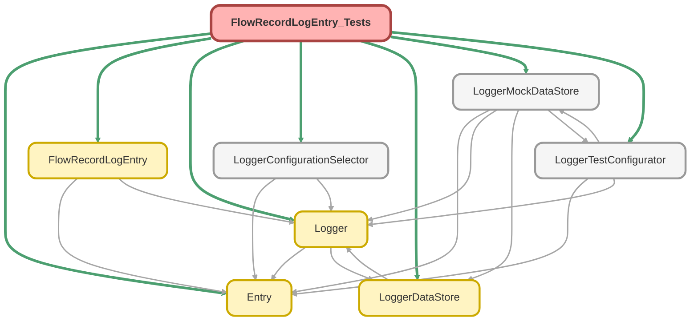

---
hide:
  - path
---

# FlowRecordLogEntry_Tests Class

`SUPPRESSWARNINGS`
`ISTEST`

## Class Diagram



<!-- Apex description -->

## Apex Code

```java
//------------------------------------------------------------------------------------------------//
// This file is part of the Nebula Logger project, released under the MIT License.                //
// See LICENSE file or go to https://github.com/jongpie/NebulaLogger for full license details.    //
//------------------------------------------------------------------------------------------------//

@SuppressWarnings('PMD.ApexDoc, PMD.CyclomaticComplexity, PMD.ExcessiveParameterList, PMD.MethodNamingConventions, PMD.NcssMethodCount')
@IsTest(IsParallel=true)
private class FlowRecordLogEntry_Tests {
  static {
    // Don't use the org's actual custom metadata records when running tests
    LoggerConfigurationSelector.useMocks();
  }

  static FlowRecordLogEntry createFlowRecordLogEntry() {
    FlowRecordLogEntry flowRecordEntry = new FlowRecordLogEntry();
    flowRecordEntry.flowName = 'MyFlowOrProcessBuilder';
    flowRecordEntry.message = 'my test message';
    flowRecordEntry.saveLog = false;

    return flowRecordEntry;
  }

  @IsTest
  static void it_should_save_entry_when_logging_level_met() {
    LoggerDataStore.setMock(LoggerMockDataStore.getEventBus());
    Schema.User currentUser = new Schema.User(
      Id = System.UserInfo.getUserId(),
      FirstName = System.UserInfo.getFirstName(),
      LastName = System.UserInfo.getLastName(),
      Username = System.UserInfo.getUsername()
    );
    System.LoggingLevel userLoggingLevel = System.LoggingLevel.FINEST;
    System.LoggingLevel flowRecordEntryLoggingLevel = System.LoggingLevel.DEBUG;
    System.Assert.isTrue(userLoggingLevel.ordinal() < flowRecordEntryLoggingLevel.ordinal());
    System.Test.startTest();
    Logger.getUserSettings().LoggingLevel__c = userLoggingLevel.name();
    LoggerTestConfigurator.setupMockSObjectHandlerConfigurations();
    FlowRecordLogEntry flowRecordEntry = createFlowRecordLogEntry();
    flowRecordEntry.loggingLevelName = flowRecordEntryLoggingLevel.name();
    flowRecordEntry.record = currentUser;
    flowRecordEntry.timestamp = System.now().addSeconds(-20);
    System.Assert.areEqual(0, Logger.saveLogCallCount);
    System.Assert.areEqual(0, LoggerMockDataStore.getEventBus().getPublishCallCount());
    System.Assert.areEqual(0, LoggerMockDataStore.getEventBus().getPublishedPlatformEvents().size());

    FlowRecordLogEntry.addFlowRecordEntries(new List<FlowRecordLogEntry>{ flowRecordEntry });
    System.Assert.areEqual(1, Logger.getBufferSize());
    Logger.saveLog();

    System.Assert.areEqual(0, Logger.getBufferSize());
    System.Assert.areEqual(1, Logger.saveLogCallCount);
    System.Assert.areEqual(1, LoggerMockDataStore.getEventBus().getPublishCallCount());
    System.Assert.areEqual(1, LoggerMockDataStore.getEventBus().getPublishedPlatformEvents().size());
    LogEntryEvent__e publishedLogEntryEvent = (LogEntryEvent__e) LoggerMockDataStore.getEventBus().getPublishedPlatformEvents().get(0);
    String expectedUserJson = System.JSON.serializePretty(currentUser);
    System.Assert.areEqual(flowRecordEntry.loggingLevelName, publishedLogEntryEvent.LoggingLevel__c);
    System.Assert.areEqual(flowRecordEntry.message, publishedLogEntryEvent.Message__c);
    System.Assert.areEqual('Flow', publishedLogEntryEvent.OriginType__c);
    System.Assert.areEqual(currentUser.Id, publishedLogEntryEvent.RecordId__c);
    System.Assert.areEqual(expectedUserJson, publishedLogEntryEvent.RecordJson__c);
    System.Assert.areEqual(flowRecordEntry.timestamp, publishedLogEntryEvent.Timestamp__c);
  }

  @IsTest
  static void it_should_auto_save_entry_with_save_method_when_saveMethodName_specified() {
    LoggerDataStore.setMock(LoggerMockDataStore.getEventBus());
    LoggerDataStore.setMock(LoggerMockDataStore.getJobQueue());
    Schema.User currentUser = new Schema.User(
      Id = System.UserInfo.getUserId(),
      FirstName = System.UserInfo.getFirstName(),
      LastName = System.UserInfo.getLastName(),
      Username = System.UserInfo.getUsername()
    );
    System.LoggingLevel userLoggingLevel = System.LoggingLevel.FINEST;
    System.LoggingLevel flowRecordEntryLoggingLevel = System.LoggingLevel.DEBUG;
    System.Assert.isTrue(userLoggingLevel.ordinal() < flowRecordEntryLoggingLevel.ordinal());
    System.Assert.areEqual(0, System.Limits.getQueueableJobs(), 'Test should start with 0 queueable jobs used');
    Logger.getUserSettings().LoggingLevel__c = userLoggingLevel.name();
    LoggerTestConfigurator.setupMockSObjectHandlerConfigurations();
    FlowRecordLogEntry flowRecordEntry = createFlowRecordLogEntry();
    flowRecordEntry.loggingLevelName = flowRecordEntryLoggingLevel.name();
    flowRecordEntry.record = currentUser;
    flowRecordEntry.saveLog = true;
    flowRecordEntry.saveMethodName = Logger.SaveMethod.QUEUEABLE.name();
    System.Assert.areEqual(0, Logger.saveLogCallCount);
    System.Assert.areEqual(0, LoggerMockDataStore.getEventBus().getPublishCallCount());
    System.Assert.areEqual(0, LoggerMockDataStore.getEventBus().getPublishedPlatformEvents().size());
    System.Assert.areEqual(0, LoggerMockDataStore.getJobQueue().getEnqueuedJobs().size());

    FlowRecordLogEntry.addFlowRecordEntries(new List<FlowRecordLogEntry>{ flowRecordEntry });
    System.Assert.areEqual(1, LoggerMockDataStore.getJobQueue().getEnqueuedJobs().size());
    LoggerMockDataStore.getJobQueue().executeJobs();

    System.Assert.areEqual(Logger.SaveMethod.QUEUEABLE.name(), Logger.lastSaveMethodNameUsed);
    System.Assert.areEqual(1, LoggerMockDataStore.getJobQueue().getEnqueuedJobs().size());
    System.Assert.areEqual(0, Logger.getBufferSize());
    System.Assert.areEqual(1, Logger.saveLogCallCount);
    System.Assert.areEqual(1, LoggerMockDataStore.getEventBus().getPublishCallCount());
    System.Assert.areEqual(1, LoggerMockDataStore.getEventBus().getPublishedPlatformEvents().size());
    LogEntryEvent__e publishedLogEntryEvent = (LogEntryEvent__e) LoggerMockDataStore.getEventBus().getPublishedPlatformEvents().get(0);
    String expectedUserJson = System.JSON.serializePretty(currentUser);
    System.Assert.areEqual(flowRecordEntry.loggingLevelName, publishedLogEntryEvent.LoggingLevel__c);
    System.Assert.areEqual(flowRecordEntry.message, publishedLogEntryEvent.Message__c);
    System.Assert.areEqual('Flow', publishedLogEntryEvent.OriginType__c);
    System.Assert.areEqual(currentUser.Id, publishedLogEntryEvent.RecordId__c);
    System.Assert.areEqual(expectedUserJson, publishedLogEntryEvent.RecordJson__c);
  }

  @IsTest
  static void it_should_auto_save_entry_when_saveLog_is_true() {
    LoggerDataStore.setMock(LoggerMockDataStore.getEventBus());
    Schema.User currentUser = new Schema.User(
      Id = System.UserInfo.getUserId(),
      FirstName = System.UserInfo.getFirstName(),
      LastName = System.UserInfo.getLastName(),
      Username = System.UserInfo.getUsername()
    );
    System.LoggingLevel userLoggingLevel = System.LoggingLevel.FINEST;
    System.LoggingLevel flowRecordEntryLoggingLevel = System.LoggingLevel.DEBUG;
    System.Assert.isTrue(userLoggingLevel.ordinal() < flowRecordEntryLoggingLevel.ordinal());
    Logger.getUserSettings().LoggingLevel__c = userLoggingLevel.name();
    LoggerTestConfigurator.setupMockSObjectHandlerConfigurations();
    FlowRecordLogEntry flowRecordEntry = createFlowRecordLogEntry();
    flowRecordEntry.loggingLevelName = flowRecordEntryLoggingLevel.name();
    flowRecordEntry.record = currentUser;
    flowRecordEntry.saveLog = true;
    System.Assert.areEqual(0, Logger.saveLogCallCount);
    System.Assert.areEqual(0, LoggerMockDataStore.getEventBus().getPublishCallCount());
    System.Assert.areEqual(0, LoggerMockDataStore.getEventBus().getPublishedPlatformEvents().size());

    FlowRecordLogEntry.addFlowRecordEntries(new List<FlowRecordLogEntry>{ flowRecordEntry });

    System.Assert.areEqual(0, Logger.getBufferSize());
    System.Assert.areEqual(1, Logger.saveLogCallCount);
    System.Assert.areEqual(1, LoggerMockDataStore.getEventBus().getPublishCallCount());
    System.Assert.areEqual(1, LoggerMockDataStore.getEventBus().getPublishedPlatformEvents().size());
    LogEntryEvent__e publishedLogEntryEvent = (LogEntryEvent__e) LoggerMockDataStore.getEventBus().getPublishedPlatformEvents().get(0);
    String expectedUserJson = System.JSON.serializePretty(currentUser);
    System.Assert.areEqual(flowRecordEntry.loggingLevelName, publishedLogEntryEvent.LoggingLevel__c);
    System.Assert.areEqual(flowRecordEntry.message, publishedLogEntryEvent.Message__c);
    System.Assert.areEqual('Flow', publishedLogEntryEvent.OriginType__c);
    System.Assert.areEqual(currentUser.Id, publishedLogEntryEvent.RecordId__c);
    System.Assert.areEqual(expectedUserJson, publishedLogEntryEvent.RecordJson__c);
  }

  @IsTest
  static void it_should_not_save_entry_when_logging_level_not_met() {
    LoggerDataStore.setMock(LoggerMockDataStore.getEventBus());
    Schema.User currentUser = new Schema.User(
      Id = System.UserInfo.getUserId(),
      FirstName = System.UserInfo.getFirstName(),
      LastName = System.UserInfo.getLastName(),
      Username = System.UserInfo.getUsername()
    );
    System.LoggingLevel userLoggingLevel = System.LoggingLevel.ERROR;
    System.LoggingLevel flowRecordEntryLoggingLevel = System.LoggingLevel.DEBUG;
    System.Assert.isTrue(userLoggingLevel.ordinal() > flowRecordEntryLoggingLevel.ordinal());
    Logger.getUserSettings().LoggingLevel__c = userLoggingLevel.name();
    LoggerTestConfigurator.setupMockSObjectHandlerConfigurations();
    FlowRecordLogEntry flowRecordEntry = createFlowRecordLogEntry();
    flowRecordEntry.loggingLevelName = flowRecordEntryLoggingLevel.name();
    flowRecordEntry.record = currentUser;
    System.Assert.areEqual(0, Logger.saveLogCallCount);
    System.Assert.areEqual(0, LoggerMockDataStore.getEventBus().getPublishCallCount());
    System.Assert.areEqual(0, LoggerMockDataStore.getEventBus().getPublishedPlatformEvents().size());

    FlowRecordLogEntry.addFlowRecordEntries(new List<FlowRecordLogEntry>{ flowRecordEntry });
    System.Assert.areEqual(0, Logger.getBufferSize());
    Logger.saveLog();

    System.Assert.areEqual(0, Logger.getBufferSize());
    System.Assert.areEqual(1, Logger.saveLogCallCount);
    System.Assert.areEqual(0, LoggerMockDataStore.getEventBus().getPublishCallCount());
    System.Assert.areEqual(0, LoggerMockDataStore.getEventBus().getPublishedPlatformEvents().size());
  }

  @IsTest
  static void it_should_use_debug_as_default_level_when_faultMessage_is_null() {
    LoggerDataStore.setMock(LoggerMockDataStore.getEventBus());
    System.LoggingLevel expectedEntryLoggingLevel = System.LoggingLevel.DEBUG;
    Logger.getUserSettings().LoggingLevel__c = expectedEntryLoggingLevel.name();
    LoggerTestConfigurator.setupMockSObjectHandlerConfigurations();
    FlowRecordLogEntry flowRecordEntry = createFlowRecordLogEntry();
    System.Assert.isNull(flowRecordEntry.faultMessage);
    System.Assert.isNull(flowRecordEntry.loggingLevelName);
    System.Assert.areEqual(0, Logger.saveLogCallCount);
    System.Assert.areEqual(0, LoggerMockDataStore.getEventBus().getPublishCallCount());
    System.Assert.areEqual(0, LoggerMockDataStore.getEventBus().getPublishedPlatformEvents().size());

    FlowRecordLogEntry.addFlowRecordEntries(new List<FlowRecordLogEntry>{ flowRecordEntry });
    System.Assert.areEqual(1, Logger.getBufferSize());
    Logger.saveLog();

    System.Assert.areEqual(0, Logger.getBufferSize());
    System.Assert.areEqual(1, Logger.saveLogCallCount);
    System.Assert.areEqual(1, LoggerMockDataStore.getEventBus().getPublishCallCount());
    System.Assert.areEqual(1, LoggerMockDataStore.getEventBus().getPublishedPlatformEvents().size());
    LogEntryEvent__e publishedLogEntryEvent = (LogEntryEvent__e) LoggerMockDataStore.getEventBus().getPublishedPlatformEvents().get(0);
    System.Assert.isNull(publishedLogEntryEvent.ExceptionMessage__c);
    System.Assert.isNull(publishedLogEntryEvent.ExceptionType__c);
    System.Assert.areEqual(expectedEntryLoggingLevel.name(), publishedLogEntryEvent.LoggingLevel__c);
    System.Assert.areEqual(flowRecordEntry.message, publishedLogEntryEvent.Message__c);
    System.Assert.areEqual('Flow', publishedLogEntryEvent.OriginType__c);
  }

  @IsTest
  static void it_should_use_error_as_default_level_when_faultMessage_is_not_null() {
    LoggerDataStore.setMock(LoggerMockDataStore.getEventBus());
    System.LoggingLevel expectedEntryLoggingLevel = System.LoggingLevel.ERROR;
    Logger.getUserSettings().LoggingLevel__c = System.LoggingLevel.FINEST.name();
    LoggerTestConfigurator.setupMockSObjectHandlerConfigurations();
    FlowRecordLogEntry flowRecordEntry = createFlowRecordLogEntry();
    flowRecordEntry.faultMessage = 'Whoops, a Flow error has occurred.';
    System.Assert.isNull(flowRecordEntry.loggingLevelName);
    System.Assert.areEqual(0, Logger.saveLogCallCount);
    System.Assert.areEqual(0, LoggerMockDataStore.getEventBus().getPublishCallCount());
    System.Assert.areEqual(0, LoggerMockDataStore.getEventBus().getPublishedPlatformEvents().size());

    FlowRecordLogEntry.addFlowRecordEntries(new List<FlowRecordLogEntry>{ flowRecordEntry });
    System.Assert.areEqual(1, Logger.getBufferSize());
    Logger.saveLog();

    System.Assert.areEqual(0, Logger.getBufferSize());
    System.Assert.areEqual(1, Logger.saveLogCallCount);
    System.Assert.areEqual(1, LoggerMockDataStore.getEventBus().getPublishCallCount());
    System.Assert.areEqual(1, LoggerMockDataStore.getEventBus().getPublishedPlatformEvents().size());
    LogEntryEvent__e publishedLogEntryEvent = (LogEntryEvent__e) LoggerMockDataStore.getEventBus().getPublishedPlatformEvents().get(0);
    System.Assert.areEqual(flowRecordEntry.faultMessage, publishedLogEntryEvent.ExceptionMessage__c);
    System.Assert.areEqual('Flow.FaultError', publishedLogEntryEvent.ExceptionType__c);
    System.Assert.areEqual(expectedEntryLoggingLevel.name(), publishedLogEntryEvent.LoggingLevel__c);
    System.Assert.areEqual(flowRecordEntry.message, publishedLogEntryEvent.Message__c);
    System.Assert.areEqual('Flow', publishedLogEntryEvent.OriginType__c);
  }

  @IsTest
  static void it_should_throw_exception_when_shouldThrowFaultMessageException_is_set_to_true() {
    LoggerDataStore.setMock(LoggerMockDataStore.getEventBus());
    String faultMessage = '';
    System.LoggingLevel entryLoggingLevel = System.LoggingLevel.ERROR;
    Logger.getUserSettings().LoggingLevel__c = entryLoggingLevel.name();
    LoggerTestConfigurator.setupMockSObjectHandlerConfigurations();
    System.Assert.areEqual(0, Logger.getBufferSize());
    System.Assert.areEqual(0, [SELECT COUNT() FROM LogEntry__c]);
    FlowRecordLogEntry flowRecordEntry = createFlowRecordLogEntry();
    flowRecordEntry.flowName = 'MyFlow';
    flowRecordEntry.message = 'hello from Flow';
    flowRecordEntry.loggingLevelName = entryLoggingLevel.name();
    flowRecordEntry.saveLog = true;
    flowRecordEntry.faultMessage = 'Exception message';
    flowRecordEntry.shouldThrowFaultMessageException = true;
    flowRecordEntry.timestamp = System.now();
    System.Assert.areEqual(0, Logger.saveLogCallCount);
    System.Assert.areEqual(0, LoggerMockDataStore.getEventBus().getPublishCallCount());
    System.Assert.areEqual(0, LoggerMockDataStore.getEventBus().getPublishedPlatformEvents().size());

    try {
      FlowRecordLogEntry.addFlowRecordEntries(new List<FlowRecordLogEntry>{ flowRecordEntry });

      System.Assert.areEqual(0, Logger.getBufferSize());
      System.Assert.areEqual(1, Logger.saveLogCallCount);
      System.Assert.areEqual(1, LoggerMockDataStore.getEventBus().getPublishCallCount());
      System.Assert.areEqual(1, LoggerMockDataStore.getEventBus().getPublishedPlatformEvents().size());
      LogEntryEvent__e publishedLogEntryEvent = (LogEntryEvent__e) LoggerMockDataStore.getEventBus().getPublishedPlatformEvents().get(0);
      System.Assert.areEqual(flowRecordEntry.loggingLevelName, publishedLogEntryEvent.LoggingLevel__c);
      System.Assert.areEqual(flowRecordEntry.message, publishedLogEntryEvent.Message__c);
      System.Assert.areEqual('Flow', publishedLogEntryEvent.OriginType__c);
      System.Assert.areEqual(flowRecordEntry.timestamp, publishedLogEntryEvent.Timestamp__c);
    } catch (Exception e) {
      faultMessage = e.getMessage();

      System.Assert.areEqual(flowRecordEntry.faultMessage, faultMessage, 'fault message its not expected to be empty');
      System.Assert.areEqual('System.FlowException', e.getTypeName(), 'Exception type must match the one we are throwing');
    }
  }

  @IsTest
  static void it_should_set_logger_scenario() {
    LoggerDataStore.setMock(LoggerMockDataStore.getEventBus());
    System.LoggingLevel userLoggingLevel = System.LoggingLevel.FINEST;
    Logger.getUserSettings().LoggingLevel__c = userLoggingLevel.name();
    LoggerTestConfigurator.setupMockSObjectHandlerConfigurations();
    FlowRecordLogEntry flowRecordEntry = createFlowRecordLogEntry();
    flowRecordEntry.loggingLevelName = userLoggingLevel.name();
    flowRecordEntry.scenario = 'Some scenario';
    System.Assert.areEqual(0, Logger.saveLogCallCount);
    System.Assert.areEqual(0, LoggerMockDataStore.getEventBus().getPublishCallCount());
    System.Assert.areEqual(0, LoggerMockDataStore.getEventBus().getPublishedPlatformEvents().size());

    FlowRecordLogEntry.addFlowRecordEntries(new List<FlowRecordLogEntry>{ flowRecordEntry });
    System.Assert.areEqual(1, Logger.getBufferSize());
    Logger.saveLog();

    System.Assert.areEqual(0, Logger.getBufferSize());
    System.Assert.areEqual(1, Logger.saveLogCallCount);
    System.Assert.areEqual(1, LoggerMockDataStore.getEventBus().getPublishCallCount());
    System.Assert.areEqual(1, LoggerMockDataStore.getEventBus().getPublishedPlatformEvents().size());
    LogEntryEvent__e publishedLogEntryEvent = (LogEntryEvent__e) LoggerMockDataStore.getEventBus().getPublishedPlatformEvents().get(0);
    System.Assert.areEqual(flowRecordEntry.scenario, publishedLogEntryEvent.TransactionScenario__c);
    System.Assert.areEqual(flowRecordEntry.scenario, publishedLogEntryEvent.EntryScenario__c);
  }

  @IsTest
  static void it_should_add_tags_to_log_entry() {
    LoggerDataStore.setMock(LoggerMockDataStore.getEventBus());
    System.LoggingLevel userLoggingLevel = System.LoggingLevel.FINEST;
    System.LoggingLevel flowRecordEntryLoggingLevel = System.LoggingLevel.DEBUG;
    System.Assert.isTrue(userLoggingLevel.ordinal() < flowRecordEntryLoggingLevel.ordinal());
    Logger.getUserSettings().LoggingLevel__c = userLoggingLevel.name();
    LoggerTestConfigurator.setupMockSObjectHandlerConfigurations();
    List<String> tags = new List<String>{ 'first tag', 'SECOND TAG' };
    FlowRecordLogEntry flowRecordEntry = createFlowRecordLogEntry();
    flowRecordEntry.loggingLevelName = flowRecordEntryLoggingLevel.name();
    flowRecordEntry.tagsString = String.join(tags, ', ');
    System.Assert.areEqual(0, Logger.saveLogCallCount);
    System.Assert.areEqual(0, LoggerMockDataStore.getEventBus().getPublishCallCount());
    System.Assert.areEqual(0, LoggerMockDataStore.getEventBus().getPublishedPlatformEvents().size());

    FlowRecordLogEntry.addFlowRecordEntries(new List<FlowRecordLogEntry>{ flowRecordEntry });
    System.Assert.areEqual(1, Logger.getBufferSize());
    Logger.saveLog();

    System.Assert.areEqual(0, Logger.getBufferSize());
    System.Assert.areEqual(1, Logger.saveLogCallCount);
    System.Assert.areEqual(1, LoggerMockDataStore.getEventBus().getPublishCallCount());
    System.Assert.areEqual(1, LoggerMockDataStore.getEventBus().getPublishedPlatformEvents().size());
    LogEntryEvent__e publishedLogEntryEvent = (LogEntryEvent__e) LoggerMockDataStore.getEventBus().getPublishedPlatformEvents().get(0);
    List<String> publishedLogEntryEventTags = publishedLogEntryEvent.Tags__c.split('\n');
    System.Assert.areEqual(tags.size(), publishedLogEntryEventTags.size(), System.JSON.serializePretty(publishedLogEntryEventTags));
    Set<String> tagsSet = new Set<String>(tags);
    for (String publishedTag : publishedLogEntryEventTags) {
      publishedTag = publishedTag.trim();
      System.Assert.isTrue(tagsSet.contains(publishedTag), publishedTag + ' not found in expected tags set: ' + tagsSet);
    }
  }
}
```

## Methods
### `createFlowRecordLogEntry()`

#### Signature
```apex
private static FlowRecordLogEntry createFlowRecordLogEntry()
```

#### Return Type
**[FlowRecordLogEntry](../logger-engine/FlowRecordLogEntry.md)**

---

### `it_should_save_entry_when_logging_level_met()`

`ISTEST`

#### Signature
```apex
private static void it_should_save_entry_when_logging_level_met()
```

#### Return Type
**void**

---

### `it_should_auto_save_entry_with_save_method_when_saveMethodName_specified()`

`ISTEST`

#### Signature
```apex
private static void it_should_auto_save_entry_with_save_method_when_saveMethodName_specified()
```

#### Return Type
**void**

---

### `it_should_auto_save_entry_when_saveLog_is_true()`

`ISTEST`

#### Signature
```apex
private static void it_should_auto_save_entry_when_saveLog_is_true()
```

#### Return Type
**void**

---

### `it_should_not_save_entry_when_logging_level_not_met()`

`ISTEST`

#### Signature
```apex
private static void it_should_not_save_entry_when_logging_level_not_met()
```

#### Return Type
**void**

---

### `it_should_use_debug_as_default_level_when_faultMessage_is_null()`

`ISTEST`

#### Signature
```apex
private static void it_should_use_debug_as_default_level_when_faultMessage_is_null()
```

#### Return Type
**void**

---

### `it_should_use_error_as_default_level_when_faultMessage_is_not_null()`

`ISTEST`

#### Signature
```apex
private static void it_should_use_error_as_default_level_when_faultMessage_is_not_null()
```

#### Return Type
**void**

---

### `it_should_throw_exception_when_shouldThrowFaultMessageException_is_set_to_true()`

`ISTEST`

#### Signature
```apex
private static void it_should_throw_exception_when_shouldThrowFaultMessageException_is_set_to_true()
```

#### Return Type
**void**

---

### `it_should_set_logger_scenario()`

`ISTEST`

#### Signature
```apex
private static void it_should_set_logger_scenario()
```

#### Return Type
**void**

---

### `it_should_add_tags_to_log_entry()`

`ISTEST`

#### Signature
```apex
private static void it_should_add_tags_to_log_entry()
```

#### Return Type
**void**