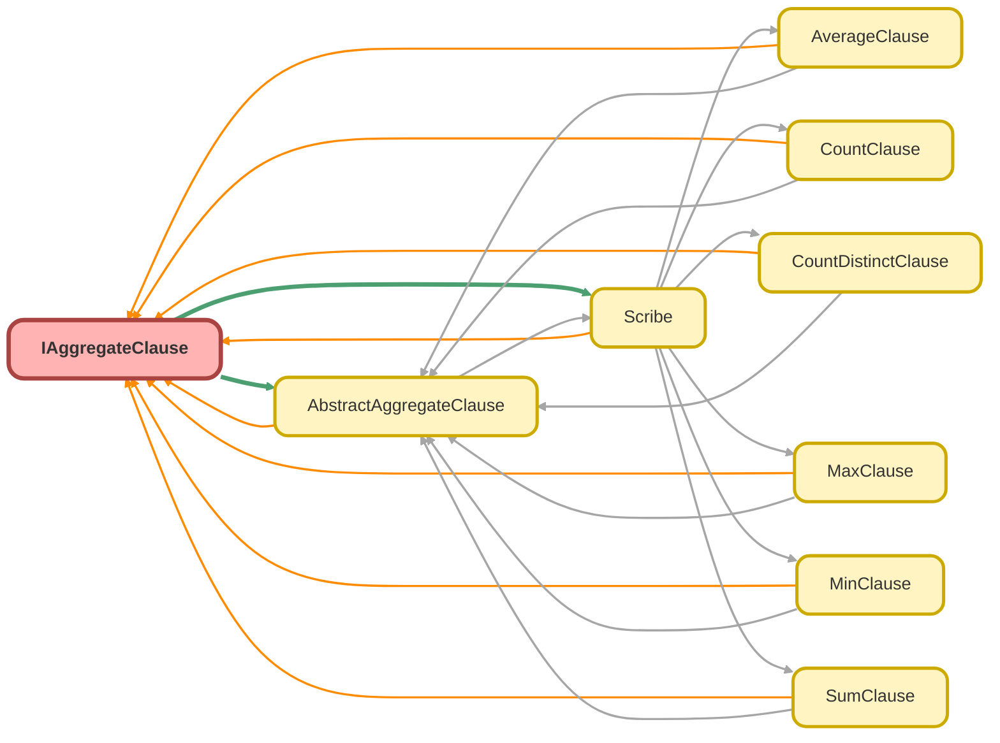

---
hide:
  - path
---

# IAggregateClause Interface

An interface for classes that build a single aggregate function clause in a SOQL query. 
 
Implementations of this interface are responsible for generating a specific aggregate 
expression, such as &quot;SUM(Amount) totalAmount&quot;. This allows the Scribe builder to 
handle various aggregate functions in a polymorphic and extensible way.

**See** [AbstractAggregateClause](AbstractAggregateClause.md)

**See** [Scribe](Scribe.md)

## Class Diagram



<!-- Apex description -->

## Apex Code

```java
/**
 * Copyright 2025 Hiroyuki Matsuoka
 *
 * Licensed under the Apache License, Version 2.0 (the "License");
 * you may not use this file except in compliance with the License.
 * You may obtain a copy of the License at
 *
 * http://www.apache.org/licenses/LICENSE-2.0
 *
 * Unless required by applicable law or agreed to in writing, software
 * distributed under the License is distributed on an "AS IS" BASIS,
 * WITHOUT WARRANTIES OR CONDITIONS OF ANY KIND, either express or implied.
 * See the License for the specific language governing permissions and
 * limitations under the License.
 */

/**
 * @description An interface for classes that build a single aggregate function clause in a SOQL query.
 *
 * Implementations of this interface are responsible for generating a specific aggregate
 * expression, such as "SUM(Amount) totalAmount". This allows the Scribe builder to
 * handle various aggregate functions in a polymorphic and extensible way.
 * @see AbstractAggregateClause
 * @see Scribe
 */
public interface IAggregateClause {
  /**
   * Builds the aggregate clause string.
   *
   * @return The constructed aggregate clause.
   */
  String build();

  /**
   * Builds the aggregate clause with a relationship name prefix for parent relationship queries.
   *
   * @param parentRelationName The relationship name of the parent object.
   * @return The constructed aggregate clause with the relationship prefix.
   */
  String buildWithChild(String parentRelationName);

  /**
   * Gets the alias defined for this aggregate clause.
   *
   * @return The alias.
   */
  String getAlias();

  /**
   * Gets the API name of the field being aggregated.
   *
   * @return The field's API name.
   */
  String getFieldName();

  /**
   * Overrides the internal metadata for the clause.
   *
   * @param sObjectType The SObjectType to use for context.
   * @param fieldMap The field map of the relevant SObject.
   * @return A new IAggregateClause instance with the updated metadata.
   */
  IAggregateClause overrideMetaData(Schema.SObjectType sObjectType, Map<String, Schema.SObjectField> fieldMap);
}
```

## Methods
### `build()`

Builds the aggregate clause string.

#### Signature
```apex
public String build()
```

#### Return Type
**String**

The constructed aggregate clause.

---

### `buildWithChild(parentRelationName)`

Builds the aggregate clause with a relationship name prefix for parent relationship queries.

#### Signature
```apex
public String buildWithChild(String parentRelationName)
```

#### Parameters
| Name | Type | Description |
|------|------|-------------|
| parentRelationName | String | The relationship name of the parent object. |

#### Return Type
**String**

The constructed aggregate clause with the relationship prefix.

---

### `getAlias()`

Gets the alias defined for this aggregate clause.

#### Signature
```apex
public String getAlias()
```

#### Return Type
**String**

The alias.

---

### `getFieldName()`

Gets the API name of the field being aggregated.

#### Signature
```apex
public String getFieldName()
```

#### Return Type
**String**

The field&#x27;s API name.

---

### `overrideMetaData(sObjectType, fieldMap)`

Overrides the internal metadata for the clause.

#### Signature
```apex
public IAggregateClause overrideMetaData(Schema.SObjectType sObjectType, Map<String,Schema.SObjectField> fieldMap)
```

#### Parameters
| Name | Type | Description |
|------|------|-------------|
| sObjectType | Schema.SObjectType | The SObjectType to use for context. |
| fieldMap | Map<String,Schema.SObjectField> | The field map of the relevant SObject. |

#### Return Type
**[IAggregateClause](IAggregateClause.md)**

A new IAggregateClause instance with the updated metadata.