---
hide:
  - path
---

# IConditionClause Interface

An interface for classes that build a single condition part of a SOQL WHERE or HAVING clause. 
 
Implementations of this interface are responsible for generating a specific logical 
condition string (e.g., &quot;Name &#x3D; &#x27;Test Corp&#x27;&quot; or &quot;Amount &gt; 1000&quot;). This allows the 
Scribe builder to handle various condition types in a polymorphic way.

**See** [AbstractConditionClause](AbstractConditionClause.md)

**See** [Scribe](Scribe.md)

## Class Diagram

```mermaid
graph LR
  IConditionClause["IConditionClause"]:::mainApexClass
  click IConditionClause "/objects/IConditionClause/"
  AbstractConditionClause["AbstractConditionClause"]:::apexClass
  click AbstractConditionClause "/apex/AbstractConditionClause/"
  Scribe["Scribe"]:::apexClass
  click Scribe "/apex/Scribe/"
  EqualConditionClause["EqualConditionClause"]:::apexClass
  click EqualConditionClause "/apex/EqualConditionClause/"
  EqualConditionClauseTest["EqualConditionClauseTest"]:::apexTestClass
  click EqualConditionClauseTest "/apex/EqualConditionClauseTest/"
  ExcludeConditionClause["ExcludeConditionClause"]:::apexClass
  click ExcludeConditionClause "/apex/ExcludeConditionClause/"
  ExcludeConditionClauseTest["ExcludeConditionClauseTest"]:::apexTestClass
  click ExcludeConditionClauseTest "/apex/ExcludeConditionClauseTest/"
  GreaterThanConditionClause["GreaterThanConditionClause"]:::apexClass
  click GreaterThanConditionClause "/apex/GreaterThanConditionClause/"
  GreaterThanConditionClauseTest["GreaterThanConditionClauseTest"]:::apexTestClass
  click GreaterThanConditionClauseTest "/apex/GreaterThanConditionClauseTest/"
  GreaterThanOrEqualConditionClause["GreaterThanOrEqualConditionClause"]:::apexClass
  click GreaterThanOrEqualConditionClause "/apex/GreaterThanOrEqualConditionClause/"
  GreaterThanOrEqualConditionClauseTest["GreaterThanOrEqualConditionClauseTest"]:::apexTestClass
  click GreaterThanOrEqualConditionClauseTest "/apex/GreaterThanOrEqualConditionClauseTest/"
  IncludesConditionClause["IncludesConditionClause"]:::apexClass
  click IncludesConditionClause "/apex/IncludesConditionClause/"
  IncludesConditionClauseTest["IncludesConditionClauseTest"]:::apexTestClass
  click IncludesConditionClauseTest "/apex/IncludesConditionClauseTest/"
  InConditionClause["InConditionClause"]:::apexClass
  click InConditionClause "/apex/InConditionClause/"
  InConditionClauseTest["InConditionClauseTest"]:::apexTestClass
  click InConditionClauseTest "/apex/InConditionClauseTest/"
  InSubQueryConditionClause["InSubQueryConditionClause"]:::apexClass
  click InSubQueryConditionClause "/apex/InSubQueryConditionClause/"
  InSubQueryConditionClauseTest["InSubQueryConditionClauseTest"]:::apexTestClass
  click InSubQueryConditionClauseTest "/apex/InSubQueryConditionClauseTest/"
  IsNotNullConditionClause["IsNotNullConditionClause"]:::apexClass
  click IsNotNullConditionClause "/apex/IsNotNullConditionClause/"
  IsNotNullConditionClauseTest["IsNotNullConditionClauseTest"]:::apexTestClass
  click IsNotNullConditionClauseTest "/apex/IsNotNullConditionClauseTest/"
  IsNullConditionClause["IsNullConditionClause"]:::apexClass
  click IsNullConditionClause "/apex/IsNullConditionClause/"
  IsNullConditionClauseTest["IsNullConditionClauseTest"]:::apexTestClass
  click IsNullConditionClauseTest "/apex/IsNullConditionClauseTest/"
  LessThanConditionClause["LessThanConditionClause"]:::apexClass
  click LessThanConditionClause "/apex/LessThanConditionClause/"
  LessThanConditionClauseTest["LessThanConditionClauseTest"]:::apexTestClass
  click LessThanConditionClauseTest "/apex/LessThanConditionClauseTest/"
  LessThanOrEqualConditionClause["LessThanOrEqualConditionClause"]:::apexClass
  click LessThanOrEqualConditionClause "/apex/LessThanOrEqualConditionClause/"
  LessThanOrEqualConditionClauseTest["LessThanOrEqualConditionClauseTest"]:::apexTestClass
  click LessThanOrEqualConditionClauseTest "/apex/LessThanOrEqualConditionClauseTest/"
  LikeConditionClause["LikeConditionClause"]:::apexClass
  click LikeConditionClause "/apex/LikeConditionClause/"
  LikeConditionClauseTest["LikeConditionClauseTest"]:::apexTestClass
  click LikeConditionClauseTest "/apex/LikeConditionClauseTest/"
  NotEqualConditionClause["NotEqualConditionClause"]:::apexClass
  click NotEqualConditionClause "/apex/NotEqualConditionClause/"
  NotEqualConditionClauseTest["NotEqualConditionClauseTest"]:::apexTestClass
  click NotEqualConditionClauseTest "/apex/NotEqualConditionClauseTest/"
  NotInConditionClause["NotInConditionClause"]:::apexClass
  click NotInConditionClause "/apex/NotInConditionClause/"
  NotInConditionClauseTest["NotInConditionClauseTest"]:::apexTestClass
  click NotInConditionClauseTest "/apex/NotInConditionClauseTest/"
  NotInSubQueryConditionClause["NotInSubQueryConditionClause"]:::apexClass
  click NotInSubQueryConditionClause "/apex/NotInSubQueryConditionClause/"
  NotInSubQueryConditionClauseTest["NotInSubQueryConditionClauseTest"]:::apexTestClass
  click NotInSubQueryConditionClauseTest "/apex/NotInSubQueryConditionClauseTest/"
  NotLikeConditionClause["NotLikeConditionClause"]:::apexClass
  click NotLikeConditionClause "/apex/NotLikeConditionClause/"
  NotLikeConditionClauseTest["NotLikeConditionClauseTest"]:::apexTestClass
  click NotLikeConditionClauseTest "/apex/NotLikeConditionClauseTest/"

  IConditionClause --> AbstractConditionClause
  IConditionClause --> Scribe

  AbstractConditionClause --> IConditionClause
  EqualConditionClause --> IConditionClause
  EqualConditionClauseTest --> IConditionClause
  ExcludeConditionClause --> IConditionClause
  ExcludeConditionClauseTest --> IConditionClause
  GreaterThanConditionClause --> IConditionClause
  GreaterThanConditionClauseTest --> IConditionClause
  GreaterThanOrEqualConditionClause --> IConditionClause
  GreaterThanOrEqualConditionClauseTest --> IConditionClause
  IncludesConditionClause --> IConditionClause
  IncludesConditionClauseTest --> IConditionClause
  InConditionClause --> IConditionClause
  InConditionClauseTest --> IConditionClause
  InSubQueryConditionClause --> IConditionClause
  InSubQueryConditionClauseTest --> IConditionClause
  IsNotNullConditionClause --> IConditionClause
  IsNotNullConditionClauseTest --> IConditionClause
  IsNullConditionClause --> IConditionClause
  IsNullConditionClauseTest --> IConditionClause
  LessThanConditionClause --> IConditionClause
  LessThanConditionClauseTest --> IConditionClause
  LessThanOrEqualConditionClause --> IConditionClause
  LessThanOrEqualConditionClauseTest --> IConditionClause
  LikeConditionClause --> IConditionClause
  LikeConditionClauseTest --> IConditionClause
  NotEqualConditionClause --> IConditionClause
  NotEqualConditionClauseTest --> IConditionClause
  NotInConditionClause --> IConditionClause
  NotInConditionClauseTest --> IConditionClause
  NotInSubQueryConditionClause --> IConditionClause
  NotInSubQueryConditionClauseTest --> IConditionClause
  NotLikeConditionClause --> IConditionClause
  NotLikeConditionClauseTest --> IConditionClause
  Scribe --> IConditionClause

  %% Too many related classes, skipping transverse links


classDef apexClass fill:#FFF4C2,stroke:#CCAA00,stroke-width:3px,rx:12px,ry:12px,shadow:drop,color:#333;
classDef apexTestClass fill:#F5F5F5,stroke:#999999,stroke-width:3px,rx:12px,ry:12px,shadow:drop,color:#333;
classDef mainApexClass fill:#FFB3B3,stroke:#A94442,stroke-width:4px,rx:14px,ry:14px,shadow:drop,color:#333,font-weight:bold;

linkStyle 0,1 stroke:#4C9F70,stroke-width:4px;
linkStyle 2,3,4,5,6,7,8,9,10,11,12,13,14,15,16,17,18,19,20,21,22,23,24,25,26,27,28,29,30,31,32,33,34,35 stroke:#FF8C00,stroke-width:2px;
```



<!-- Apex description -->

## Apex Code

```java
/**
 * Copyright 2025 Hiroyuki Matsuoka
 *
 * Licensed under the Apache License, Version 2.0 (the "License");
 * you may not use this file except in compliance with the License.
 * You may obtain a copy of the License at
 *
 * http://www.apache.org/licenses/LICENSE-2.0
 *
 * Unless required by applicable law or agreed to in writing, software
 * distributed under the License is distributed on an "AS IS" BASIS,
 * WITHOUT WARRANTIES OR CONDITIONS OF ANY KIND, either express or implied.
 * See the License for the specific language governing permissions and
 * limitations under the License.
 */

/**
 * @description An interface for classes that build a single condition part of a SOQL WHERE or HAVING clause.
 *
 * Implementations of this interface are responsible for generating a specific logical
 * condition string (e.g., "Name = 'Test Corp'" or "Amount > 1000"). This allows the
 * Scribe builder to handle various condition types in a polymorphic way.
 * @see AbstractConditionClause
 * @see Scribe
 */
 public interface IConditionClause {
  /**
   * Builds the condition clause string.
   *
   * @return The constructed condition clause part.
   */
  String build();

  /**
   * Overrides the internal metadata for the clause.
   *
   * @param sObjectType The SObjectType to use for context.
   * @param fieldMap The field map of the relevant SObject for schema validation.
   * @return A new IConditionClause instance with the updated metadata.
   */
  IConditionClause overrideMetaData(Schema.SObjectType sObjectType, Map<String, Schema.SObjectField> fieldMap);

  /**
   * Overrides the field name for this condition.
   *
   * @param field The new field name to use.
   * @return A new IConditionClause instance with the updated field name.
   */
  IConditionClause overrideField(String field);

  /**
   * Gets the field name or alias used in this condition.
   *
   * @return The field name or alias.
   */
  String getFieldName();
}
```

## Methods
### `build()`

Builds the condition clause string.

#### Signature
```apex
public String build()
```

#### Return Type
**String**

The constructed condition clause part.

---

### `overrideMetaData(sObjectType, fieldMap)`

Overrides the internal metadata for the clause.

#### Signature
```apex
public IConditionClause overrideMetaData(Schema.SObjectType sObjectType, Map<String,Schema.SObjectField> fieldMap)
```

#### Parameters
| Name | Type | Description |
|------|------|-------------|
| sObjectType | Schema.SObjectType | The SObjectType to use for context. |
| fieldMap | Map<String,Schema.SObjectField> | The field map of the relevant SObject for schema validation. |

#### Return Type
**[IConditionClause](IConditionClause.md)**

A new IConditionClause instance with the updated metadata.

---

### `overrideField(field)`

Overrides the field name for this condition.

#### Signature
```apex
public IConditionClause overrideField(String field)
```

#### Parameters
| Name | Type | Description |
|------|------|-------------|
| field | String | The new field name to use. |

#### Return Type
**[IConditionClause](IConditionClause.md)**

A new IConditionClause instance with the updated field name.

---

### `getFieldName()`

Gets the field name or alias used in this condition.

#### Signature
```apex
public String getFieldName()
```

#### Return Type
**String**

The field name or alias.