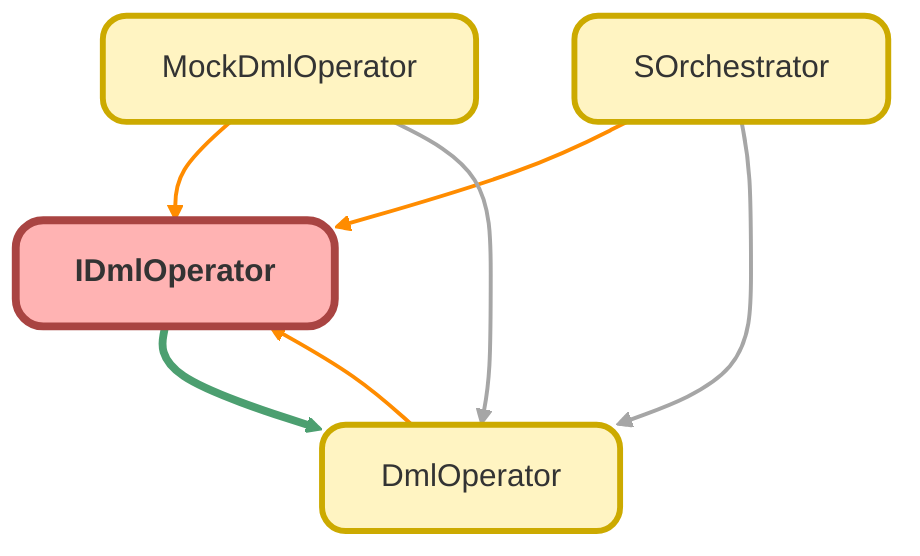

---
hide:
  - path
---

# IDmlOperator Interface

## Class Diagram



<!-- Apex description -->

## Apex Code

```java
public interface IDmlOperator {
  void doInsert(List<SObject> records);
  void doUpdate(List<SObject> records);
  void doDelete(List<SObject> records);
}
```

## Methods
### `doInsert(records)`

#### Signature
```apex
public void doInsert(List<SObject> records)
```

#### Parameters
| Name | Type | Description |
|------|------|-------------|
| records | List<SObject> |  |

#### Return Type
**void**

---

### `doUpdate(records)`

#### Signature
```apex
public void doUpdate(List<SObject> records)
```

#### Parameters
| Name | Type | Description |
|------|------|-------------|
| records | List<SObject> |  |

#### Return Type
**void**

---

### `doDelete(records)`

#### Signature
```apex
public void doDelete(List<SObject> records)
```

#### Parameters
| Name | Type | Description |
|------|------|-------------|
| records | List<SObject> |  |

#### Return Type
**void**