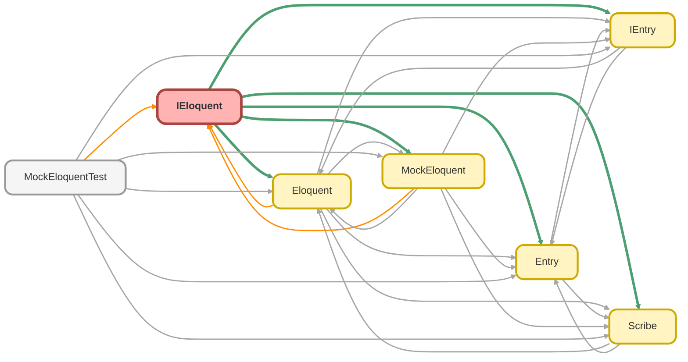

---
hide:
  - path
---

# IEloquent Interface

Defines the contract for the data access layer of the ApexEloquent framework. 
 
This interface is responsible for executing queries constructed by the `Scribe` builder 
and for performing DML operations. Following the Repository Pattern, this interface 
abstracts the data source. It has two primary implementations: `Eloquent` for live 
database interactions, and `MockEloquent` for database-independent unit testing.

**See** [Scribe](Scribe.md)

**See** [Eloquent](Eloquent.md)

**See** [MockEloquent](MockEloquent.md)

## Class Diagram



<!-- Apex description -->

## Apex Code

```java
/**
 * Copyright 2025 Hiroyuki Matsuoka
 *
 * Licensed under the Apache License, Version 2.0 (the "License");
 * you may not use this file except in compliance with the License.
 * You may obtain a copy of the License at
 *
 * http://www.apache.org/licenses/LICENSE-2.0
 *
 * Unless required by applicable law or agreed to in writing, software
 * distributed under the License is distributed on an "AS IS" BASIS,
 * WITHOUT WARRANTIES OR CONDITIONS OF ANY KIND, either express or implied.
 * See the License for the specific language governing permissions and
 * limitations under the License.
 */

 /**
 * @description Defines the contract for the data access layer of the ApexEloquent framework.
 *
 * This interface is responsible for executing queries constructed by the `Scribe` builder
 * and for performing DML operations. Following the Repository Pattern, this interface
 * abstracts the data source. It has two primary implementations: `Eloquent` for live
 * database interactions, and `MockEloquent` for database-independent unit testing.
 * @see Scribe
 * @see Eloquent
 * @see MockEloquent
 */
public interface IEloquent {
  /**
  * Executes SOQL and retrieves the results.
  * If the number of retrieved records is 0, an empty list is returned.
  *
  * @param Scribe scribe: Scribe instance containing the SOQL query
  * @return Retrieved results as a list of Entry objects
  */
  List<IEntry> get(Scribe scribe);

  /**
  * Executes SOQL and retrieves the aggregate results.
  * If the number of retrieved records is 0, an empty list is returned.
  *
  * @param Scribe scribe: Scribe instance containing the SOQL query
  * @return Retrieved aggregate results as a list of Entry objects
  */
  List<IEntry> getAggregate(Scribe scribe);

  /**
  * Executes SOQL and retrieves the results as SObject.
  * If the number of retrieved records is 0, an empty list is returned.
  *
  * @param Scribe scribe: Scribe instance containing the SOQL query
  * @return Retrieved results as a list of SObjects
  */
  List<SObject> getAsSObject(Scribe scribe);

  /**
  * Executes SOQL and returns the first record.
  * If the number of retrieved records is 0, null is returned.
  *
  * @param Scribe scribe: Scribe instance containing the SOQL query
  * @return Retrieved result as an Entry object
  */
  IEntry first(Scribe scribe);

  /**
  * Executes SOQL and returns the first record as SObject.
  * If the number of retrieved records is 0, null is returned.
  *
  * @param Scribe scribe: Scribe instance containing the SOQL query
  * @return Retrieved result as an SObject
  */
  SObject firstAsSObject(Scribe scribe);

  /**
  * Executes SOQL and returns the first record.
  * If the number of retrieved records is 0, an exception is thrown.
  *
  * @param Scribe scribe: Scribe instance containing the SOQL query
  * @return Retrieved result as an Entry object
  * @throws QueryException If the number of retrieved records is 0
  */
  IEntry firstOrFail(Scribe scribe);

  /**
  * Executes SOQL and returns the first record as SObject.
  * If the number of retrieved records is 0, an exception is thrown.
  *
  * @param Scribe scribe: Scribe instance containing the SOQL query
  * @return Retrieved result as an SObject
  * @throws QueryException If the number of retrieved records is 0
  */
  SObject firstOrFailAsSObject(Scribe scribe) ;

  /**
  * Inserts a record and returns the inserted record.
  *
  * @param record SObject to be inserted
  * @return Inserted SObject
  */
  SObject doInsert(SObject record);

  /**
  * Inserts a list of records and returns the inserted records.
  *
  * @param records List of SObjects to be inserted
  * @return List of inserted SObjects
  */
  List<SObject> doInsert(List<SObject> records);

  /**
  * Updates a record and returns the updated record.
  *
  * @param record SObject to be updated
  * @return Updated SObject
  */
  SObject doUpdate(SObject record);

  /**
  * Updates a record wrapped in an Entry and returns the updated Entry.
  *
  * @param entry Entry containing the SObject to be updated
  * @return Updated Entry
  */
  IEntry doUpdate(IEntry entry);

  /**
  * Updates a list of records and returns the updated records.
  *
  * @param records List of SObjects to be updated
  * @return List of updated SObjects
  */
  List<SObject> doUpdate(List<SObject> records);

  /**
  * Updates a list of Entries and returns the updated Entries.
  *
  * @param entries List of Entries containing the SObjects to be updated
  * @return List of updated Entries
  */
  List<IEntry> doUpdate(List<IEntry> entries);

  /**
  * Inserts or updates a record and returns the upserted record.
  *
  * @param record SObject to be upserted
  * @return Upserted SObject
  */
  SObject doUpsert(SObject record);

  /**
  * Inserts or updates a record and returns the upserted record.
  *
  * @param record SObject to be upserted
  * @return Upserted SObject
  */
  IEntry doUpsert(IEntry entry);

  /**
  * Inserts or updates a list of records and returns the upserted records.
  *
  * @param records List of SObjects to be upserted
  * @return List of upserted SObjects
  */
  List<SObject> doUpsert(List<SObject> records);

  /**
  * Inserts or updates a list of Entries and returns the upserted Entries.
  *
  * @param entries List of Entries containing the SObjects to be upserted
  * @return List of upserted Entries
  */
  List<IEntry> doUpsert(List<IEntry> entries);

  /**
  * Deletes a record.
  *
  * @param record SObject to be deleted
  */
  void doDelete(SObject record);

  /**
  * Deletes a record wrapped in an Entry.
  *
  * @param entry Entry containing the SObject to be deleted
  */
  void doDelete(IEntry entry);

  /**
  * Deletes a list of records.
  *
  * @param records List of SObjects to be deleted
  */
  void doDelete(List<SObject> records);

  /**
  * Deletes a list of Entries.
  *
  * @param entries List of Entries containing the SObjects to be deleted
  */
  void doDelete(List<IEntry> entries);
}
```

## Methods
### `get(scribe)`

Executes SOQL and retrieves the results. 
If the number of retrieved records is 0, an empty list is returned.

#### Signature
```apex
public List<IEntry> get(Scribe scribe)
```

#### Parameters
| Name | Type | Description |
|------|------|-------------|
| scribe | [Scribe](Scribe.md) | scribe: Scribe instance containing the SOQL query |

#### Return Type
**List<IEntry>**

Retrieved results as a list of Entry objects

---

### `getAggregate(scribe)`

Executes SOQL and retrieves the aggregate results. 
If the number of retrieved records is 0, an empty list is returned.

#### Signature
```apex
public List<IEntry> getAggregate(Scribe scribe)
```

#### Parameters
| Name | Type | Description |
|------|------|-------------|
| scribe | [Scribe](Scribe.md) | scribe: Scribe instance containing the SOQL query |

#### Return Type
**List<IEntry>**

Retrieved aggregate results as a list of Entry objects

---

### `getAsSObject(scribe)`

Executes SOQL and retrieves the results as SObject. 
If the number of retrieved records is 0, an empty list is returned.

#### Signature
```apex
public List<SObject> getAsSObject(Scribe scribe)
```

#### Parameters
| Name | Type | Description |
|------|------|-------------|
| scribe | [Scribe](Scribe.md) | scribe: Scribe instance containing the SOQL query |

#### Return Type
**List<SObject>**

Retrieved results as a list of SObjects

---

### `first(scribe)`

Executes SOQL and returns the first record. 
If the number of retrieved records is 0, null is returned.

#### Signature
```apex
public IEntry first(Scribe scribe)
```

#### Parameters
| Name | Type | Description |
|------|------|-------------|
| scribe | [Scribe](Scribe.md) | scribe: Scribe instance containing the SOQL query |

#### Return Type
**[IEntry](IEntry.md)**

Retrieved result as an Entry object

---

### `firstAsSObject(scribe)`

Executes SOQL and returns the first record as SObject. 
If the number of retrieved records is 0, null is returned.

#### Signature
```apex
public SObject firstAsSObject(Scribe scribe)
```

#### Parameters
| Name | Type | Description |
|------|------|-------------|
| scribe | [Scribe](Scribe.md) | scribe: Scribe instance containing the SOQL query |

#### Return Type
**SObject**

Retrieved result as an SObject

---

### `firstOrFail(scribe)`

Executes SOQL and returns the first record. 
If the number of retrieved records is 0, an exception is thrown.

#### Signature
```apex
public IEntry firstOrFail(Scribe scribe)
```

#### Parameters
| Name | Type | Description |
|------|------|-------------|
| scribe | [Scribe](Scribe.md) | scribe: Scribe instance containing the SOQL query |

#### Return Type
**[IEntry](IEntry.md)**

Retrieved result as an Entry object

#### Throws
QueryException: If the number of retrieved records is 0

---

### `firstOrFailAsSObject(scribe)`

Executes SOQL and returns the first record as SObject. 
If the number of retrieved records is 0, an exception is thrown.

#### Signature
```apex
public SObject firstOrFailAsSObject(Scribe scribe)
```

#### Parameters
| Name | Type | Description |
|------|------|-------------|
| scribe | [Scribe](Scribe.md) | scribe: Scribe instance containing the SOQL query |

#### Return Type
**SObject**

Retrieved result as an SObject

#### Throws
QueryException: If the number of retrieved records is 0

---

### `doInsert(record)`

Inserts a record and returns the inserted record.

#### Signature
```apex
public SObject doInsert(SObject record)
```

#### Parameters
| Name | Type | Description |
|------|------|-------------|
| record | SObject | SObject to be inserted |

#### Return Type
**SObject**

Inserted SObject

---

### `doInsert(records)`

Inserts a list of records and returns the inserted records.

#### Signature
```apex
public List<SObject> doInsert(List<SObject> records)
```

#### Parameters
| Name | Type | Description |
|------|------|-------------|
| records | List<SObject> | List of SObjects to be inserted |

#### Return Type
**List<SObject>**

List of inserted SObjects

---

### `doUpdate(record)`

Updates a record and returns the updated record.

#### Signature
```apex
public SObject doUpdate(SObject record)
```

#### Parameters
| Name | Type | Description |
|------|------|-------------|
| record | SObject | SObject to be updated |

#### Return Type
**SObject**

Updated SObject

---

### `doUpdate(entry)`

Updates a record wrapped in an Entry and returns the updated Entry.

#### Signature
```apex
public IEntry doUpdate(IEntry entry)
```

#### Parameters
| Name | Type | Description |
|------|------|-------------|
| entry | [IEntry](IEntry.md) | Entry containing the SObject to be updated |

#### Return Type
**[IEntry](IEntry.md)**

Updated Entry

---

### `doUpdate(records)`

Updates a list of records and returns the updated records.

#### Signature
```apex
public List<SObject> doUpdate(List<SObject> records)
```

#### Parameters
| Name | Type | Description |
|------|------|-------------|
| records | List<SObject> | List of SObjects to be updated |

#### Return Type
**List<SObject>**

List of updated SObjects

---

### `doUpdate(entries)`

Updates a list of Entries and returns the updated Entries.

#### Signature
```apex
public List<IEntry> doUpdate(List<IEntry> entries)
```

#### Parameters
| Name | Type | Description |
|------|------|-------------|
| entries | List<IEntry> | List of Entries containing the SObjects to be updated |

#### Return Type
**List<IEntry>**

List of updated Entries

---

### `doUpsert(record)`

Inserts or updates a record and returns the upserted record.

#### Signature
```apex
public SObject doUpsert(SObject record)
```

#### Parameters
| Name | Type | Description |
|------|------|-------------|
| record | SObject | SObject to be upserted |

#### Return Type
**SObject**

Upserted SObject

---

### `doUpsert(entry)`

Inserts or updates a record and returns the upserted record.

#### Signature
```apex
public IEntry doUpsert(IEntry entry)
```

#### Parameters
| Name | Type | Description |
|------|------|-------------|
| entry | [IEntry](IEntry.md) |  |

#### Return Type
**[IEntry](IEntry.md)**

Upserted SObject

---

### `doUpsert(records)`

Inserts or updates a list of records and returns the upserted records.

#### Signature
```apex
public List<SObject> doUpsert(List<SObject> records)
```

#### Parameters
| Name | Type | Description |
|------|------|-------------|
| records | List<SObject> | List of SObjects to be upserted |

#### Return Type
**List<SObject>**

List of upserted SObjects

---

### `doUpsert(entries)`

Inserts or updates a list of Entries and returns the upserted Entries.

#### Signature
```apex
public List<IEntry> doUpsert(List<IEntry> entries)
```

#### Parameters
| Name | Type | Description |
|------|------|-------------|
| entries | List<IEntry> | List of Entries containing the SObjects to be upserted |

#### Return Type
**List<IEntry>**

List of upserted Entries

---

### `doDelete(record)`

Deletes a record.

#### Signature
```apex
public void doDelete(SObject record)
```

#### Parameters
| Name | Type | Description |
|------|------|-------------|
| record | SObject | SObject to be deleted |

#### Return Type
**void**

---

### `doDelete(entry)`

Deletes a record wrapped in an Entry.

#### Signature
```apex
public void doDelete(IEntry entry)
```

#### Parameters
| Name | Type | Description |
|------|------|-------------|
| entry | [IEntry](IEntry.md) | Entry containing the SObject to be deleted |

#### Return Type
**void**

---

### `doDelete(records)`

Deletes a list of records.

#### Signature
```apex
public void doDelete(List<SObject> records)
```

#### Parameters
| Name | Type | Description |
|------|------|-------------|
| records | List<SObject> | List of SObjects to be deleted |

#### Return Type
**void**

---

### `doDelete(entries)`

Deletes a list of Entries.

#### Signature
```apex
public void doDelete(List<IEntry> entries)
```

#### Parameters
| Name | Type | Description |
|------|------|-------------|
| entries | List<IEntry> | List of Entries containing the SObjects to be deleted |

#### Return Type
**void**