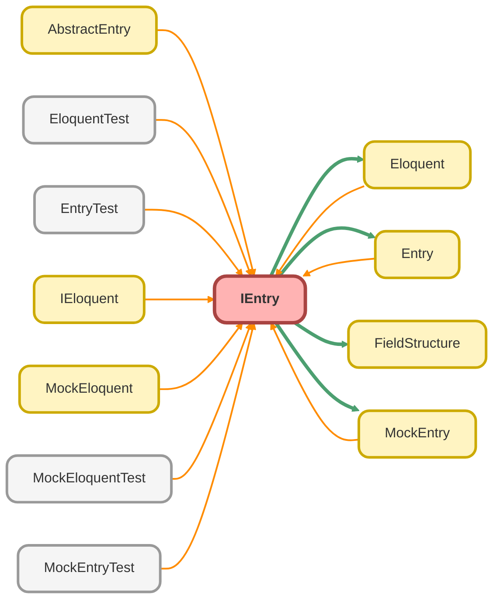

---
hide:
  - path
---

# IEntry Interface

Defines the contract for a unified record wrapper, which represents a single result from an `ApexEloquent` query. 
 
This interface is the cornerstone of the framework&#x27;s testability. It abstracts the 
underlying data source, allowing developers to interact seamlessly with either a real `SObject` 
record returned from the database (via the `Entry` class) or a mocked in-memory record 
(via the `MockEntry` class). 
 
It provides methods to access field values and to navigate eager-loaded parent, child, 
and many-to-many ( `through` ) relationships.

## Class Diagram



<!-- Apex description -->

## Apex Code

```java
/**
 * Copyright 2025 Hiroyuki Matsuoka
 *
 * Licensed under the Apache License, Version 2.0 (the "License");
 * you may not use this file except in compliance with the License.
 * You may obtain a copy of the License at
 *
 * http://www.apache.org/licenses/LICENSE-2.0
 *
 * Unless required by applicable law or agreed to in writing, software
 * distributed under the License is distributed on an "AS IS" BASIS,
 * WITHOUT WARRANTIES OR CONDITIONS OF ANY KIND, either express or implied.
 * See the License for the specific language governing permissions and
 * limitations under the License.
 */

 /**
 * @description Defines the contract for a unified record wrapper, which represents a single result from an `ApexEloquent` query.
 *
 * This interface is the cornerstone of the framework's testability. It abstracts the
 * underlying data source, allowing developers to interact seamlessly with either a real `SObject`
 * record returned from the database (via the `Entry` class) or a mocked in-memory record
 * (via the `MockEntry` class).
 *
 * It provides methods to access field values and to navigate eager-loaded parent, child,
 * and many-to-many (`through`) relationships.
 */
public Interface IEntry {
  /**
   * get SObject field value.
   *
   * @param fieldName field name
   * @return field value
   */
  Object get(String fieldName);

  /**
   * set SObject field value.
   *
   * @param fieldName field name
   * @param value field value
   */
  void put(String fieldName, Object value); 

  /**
   * get parent SObject as Evaluator.
   *
   * @param parentFieldName parent relationId field name
   * @return parent SObject as Entry 
   */
  IEntry getParent(String parentIdFieldName);

  /**
   * get child SObject list.
   *
   * @param childObjectName child SObject name
   * @return child SObject list
   */
  List<IEntry> getChildren(String childObjectName);

  /**
   * get child SObject list through relation name.
   *
   * @param childRelationName child relation name
   * @return child SObject list
   */
  List<IEntry> getChildrenByRelationName(String childRelationName);

  /**
  * get related SObject list through a junction object.
  *
  * @param junctionObjectName junction object Name
  * @param relatedKey related SObject key field name in the junction object
  * @return related SObject list
  */
  List<IEntry> getThrough(String junctionObjectName, String relatedKey);
  
  /**
   * get related SObject list through a junction object relation name.
   *
   * @param junctionRelationName junction object relation Name
   * @param relatedKey related SObject key field name in the junction object
   * @return related SObject list
   */
  List<IEntry> getThroughByRelationName(String junctionRelationName, String relatedKey);

  /**
   * get Id
   *
   * @return Id
   */
  Id getId();

  /**
   * get Name
   *
   * @return Name
   */
  String getName();

  /**
   * get SObject
   *
   * @return SObject
   */
  SObject getRecord();

  /**
   * set Evaluatot SObject property
   *
   * @param record SObject
   * @return EvaluatorInterface
   */
  IEntry setRecord(SObject record);

  /**
   * set picked fields and relation fields.
   *
   * @param FieldStructure fieldStructure
   * @return EvaluatorInterface
   */
  IEntry setFieldStructure(FieldStructure fieldStructure);

  /**
   * set DescribeSObjectResult for relation query
   *
   * @param describeResult Schema.DescribeSObjectResult
   */
  void setDescribeResult(Schema.DescribeSObjectResult describeResult);
}
```

## Methods
### `get(fieldName)`

get SObject field value.

#### Signature
```apex
public Object get(String fieldName)
```

#### Parameters
| Name | Type | Description |
|------|------|-------------|
| fieldName | String | field name |

#### Return Type
**Object**

field value

---

### `put(fieldName, value)`

set SObject field value.

#### Signature
```apex
public void put(String fieldName, Object value)
```

#### Parameters
| Name | Type | Description |
|------|------|-------------|
| fieldName | String | field name |
| value | Object | field value |

#### Return Type
**void**

---

### `getParent(parentIdFieldName)`

get parent SObject as Evaluator.

#### Signature
```apex
public IEntry getParent(String parentIdFieldName)
```

#### Parameters
| Name | Type | Description |
|------|------|-------------|
| parentIdFieldName | String |  |

#### Return Type
**[IEntry](IEntry.md)**

parent SObject as Entry

---

### `getChildren(childObjectName)`

get child SObject list.

#### Signature
```apex
public List<IEntry> getChildren(String childObjectName)
```

#### Parameters
| Name | Type | Description |
|------|------|-------------|
| childObjectName | String | child SObject name |

#### Return Type
**List<IEntry>**

child SObject list

---

### `getChildrenByRelationName(childRelationName)`

get child SObject list through relation name.

#### Signature
```apex
public List<IEntry> getChildrenByRelationName(String childRelationName)
```

#### Parameters
| Name | Type | Description |
|------|------|-------------|
| childRelationName | String | child relation name |

#### Return Type
**List<IEntry>**

child SObject list

---

### `getThrough(junctionObjectName, relatedKey)`

get related SObject list through a junction object.

#### Signature
```apex
public List<IEntry> getThrough(String junctionObjectName, String relatedKey)
```

#### Parameters
| Name | Type | Description |
|------|------|-------------|
| junctionObjectName | String | junction object Name |
| relatedKey | String | related SObject key field name in the junction object |

#### Return Type
**List<IEntry>**

related SObject list

---

### `getThroughByRelationName(junctionRelationName, relatedKey)`

get related SObject list through a junction object relation name.

#### Signature
```apex
public List<IEntry> getThroughByRelationName(String junctionRelationName, String relatedKey)
```

#### Parameters
| Name | Type | Description |
|------|------|-------------|
| junctionRelationName | String | junction object relation Name |
| relatedKey | String | related SObject key field name in the junction object |

#### Return Type
**List<IEntry>**

related SObject list

---

### `getId()`

get Id

#### Signature
```apex
public Id getId()
```

#### Return Type
**Id**

Id

---

### `getName()`

get Name

#### Signature
```apex
public String getName()
```

#### Return Type
**String**

Name

---

### `getRecord()`

get SObject

#### Signature
```apex
public SObject getRecord()
```

#### Return Type
**SObject**

SObject

---

### `setRecord(record)`

set Evaluatot SObject property

#### Signature
```apex
public IEntry setRecord(SObject record)
```

#### Parameters
| Name | Type | Description |
|------|------|-------------|
| record | SObject | SObject |

#### Return Type
**[IEntry](IEntry.md)**

EvaluatorInterface

---

### `setFieldStructure(fieldStructure)`

set picked fields and relation fields.

#### Signature
```apex
public IEntry setFieldStructure(FieldStructure fieldStructure)
```

#### Parameters
| Name | Type | Description |
|------|------|-------------|
| fieldStructure | [FieldStructure](FieldStructure.md) | fieldStructure |

#### Return Type
**[IEntry](IEntry.md)**

EvaluatorInterface

---

### `setDescribeResult(describeResult)`

set DescribeSObjectResult for relation query

#### Signature
```apex
public void setDescribeResult(Schema.DescribeSObjectResult describeResult)
```

#### Parameters
| Name | Type | Description |
|------|------|-------------|
| describeResult | Schema.DescribeSObjectResult | Schema.DescribeSObjectResult |

#### Return Type
**void**