---
hide:
  - path
---

# InSubQueryConditionClause Class

A concrete implementation of `AbstractConditionClause` that builds a 
SOQL `IN` condition with a subquery. 
 
This class demonstrates the composability of the framework, as it takes another 
 `Scribe` instance as its &quot;value&quot;. The `build()` method recursively calls `toSoql()` 
on the provided subquery Scribe to generate the final clause.

**See** [IConditionClause](IConditionClause.md)

**See** [AbstractConditionClause](AbstractConditionClause.md)

**See** [Scribe](Scribe.md)

**Inheritance**

[AbstractConditionClause](AbstractConditionClause.md)

## Class Diagram

```mermaid
graph LR
  InSubQueryConditionClause["InSubQueryConditionClause"]:::mainApexClass
  click InSubQueryConditionClause "/objects/InSubQueryConditionClause/"
  AbstractConditionClause["AbstractConditionClause"]:::apexClass
  click AbstractConditionClause "/apex/AbstractConditionClause/"
  IConditionClause["IConditionClause"]:::apexClass
  click IConditionClause "/apex/IConditionClause/"
  Scribe["Scribe"]:::apexClass
  click Scribe "/apex/Scribe/"
  InSubQueryConditionClauseTest["InSubQueryConditionClauseTest"]:::apexTestClass
  click InSubQueryConditionClauseTest "/apex/InSubQueryConditionClauseTest/"
  NotInSubQueryConditionClause["NotInSubQueryConditionClause"]:::apexClass
  click NotInSubQueryConditionClause "/apex/NotInSubQueryConditionClause/"
  NotInSubQueryConditionClauseTest["NotInSubQueryConditionClauseTest"]:::apexTestClass
  click NotInSubQueryConditionClauseTest "/apex/NotInSubQueryConditionClauseTest/"

  InSubQueryConditionClause --> AbstractConditionClause
  InSubQueryConditionClause --> IConditionClause
  InSubQueryConditionClause --> Scribe

  InSubQueryConditionClauseTest --> InSubQueryConditionClause
  NotInSubQueryConditionClause --> InSubQueryConditionClause
  NotInSubQueryConditionClauseTest --> InSubQueryConditionClause
  Scribe --> InSubQueryConditionClause

  AbstractConditionClause --> IConditionClause
  AbstractConditionClause --> Scribe
  IConditionClause --> AbstractConditionClause
  IConditionClause --> Scribe
  Scribe --> IConditionClause
  Scribe --> NotInSubQueryConditionClause
  InSubQueryConditionClauseTest --> IConditionClause
  InSubQueryConditionClauseTest --> Scribe
  NotInSubQueryConditionClause --> AbstractConditionClause
  NotInSubQueryConditionClause --> IConditionClause
  NotInSubQueryConditionClause --> Scribe
  NotInSubQueryConditionClauseTest --> IConditionClause
  NotInSubQueryConditionClauseTest --> InSubQueryConditionClauseTest
  NotInSubQueryConditionClauseTest --> NotInSubQueryConditionClause
  NotInSubQueryConditionClauseTest --> Scribe

classDef apexClass fill:#FFF4C2,stroke:#CCAA00,stroke-width:3px,rx:12px,ry:12px,shadow:drop,color:#333;
classDef apexTestClass fill:#F5F5F5,stroke:#999999,stroke-width:3px,rx:12px,ry:12px,shadow:drop,color:#333;
classDef mainApexClass fill:#FFB3B3,stroke:#A94442,stroke-width:4px,rx:14px,ry:14px,shadow:drop,color:#333,font-weight:bold;

linkStyle 0,1,2 stroke:#4C9F70,stroke-width:4px;
linkStyle 3,4,5,6 stroke:#FF8C00,stroke-width:2px;
linkStyle 7,8,9,10,11,12,13,14,15,16,17,18,19,20,21 stroke:#A6A6A6,stroke-width:2px;
```



<!-- Apex description -->

## Apex Code

```java
/**
 * Copyright 2025 Hiroyuki Matsuoka
 *
 * Licensed under the Apache License, Version 2.0 (the "License");
 * you may not use this file except in compliance with the License.
 * You may obtain a copy of the License at
 *
 * http://www.apache.org/licenses/LICENSE-2.0
 *
 * Unless required by applicable law or agreed to in writing, software
 * distributed under the License is distributed on an "AS IS" BASIS,
 * WITHOUT WARRANTIES OR CONDITIONS OF ANY KIND, either express or implied.
 * See the License for the specific language governing permissions and
 * limitations under the License.
 */

/**
 * @description A concrete implementation of `AbstractConditionClause` that builds a
 * SOQL `IN` condition with a subquery.
 *
 * This class demonstrates the composability of the framework, as it takes another
 * `Scribe` instance as its "value". The `build()` method recursively calls `toSoql()`
 * on the provided subquery Scribe to generate the final clause.
 * @see IConditionClause
 * @see AbstractConditionClause
 * @see Scribe
 */
public with sharing class InSubQueryConditionClause extends AbstractConditionClause {
  private final Scribe subQueryScribe;

  /**
   * Constructor for InSubQueryConditionClause.
   *
   * @param sObjectType The SObject type for the main query.
   * @param fieldMap A map of field names to Schema.SObjectField for the main query.
   * @param field The field name in the main query to apply the in subQuery condition on.
   * @param subQueryScribe The Scribe instance representing the subquery.
   */
  public InSubQueryConditionClause(
    Schema.SObjectType sObjectType,
    Map<String, Schema.SObjectField> fieldMap,
    String field,
    Scribe subQueryScribe
  ) {
    super(sObjectType, fieldMap, field);
    this.subQueryScribe = subQueryScribe;
  }

  /**
   * @inheritDoc
   */
  public override String build() {
    return String.format('{0} IN ({1})', new List<String>{ this.field, this.subQueryScribe.toSoql() });
  }

  /**
   * @inheritDoc
   */
  public override IConditionClause overrideMetaData(
    Schema.SObjectType sObjectType,
    Map<String, Schema.SObjectField> fieldMap
  ) {
    return new InSubQueryConditionClause(sObjectType, fieldMap, this.field, this.subQueryScribe);
  }

  /**
   * @inheritDoc
   */
  public override IConditionClause overrideField(String field) {
    return new InSubQueryConditionClause(this.sObjectType, this.fieldMap, field, this.subQueryScribe);
  }

  /**
   * check the value type and cast it to string for SOQL
   *
   * @return The value formatted as a SOQL-compatible string.
   */
  private String checkAndCast() {
    return '';
  }
}
```

## Fields
### `subQueryScribe`

#### Signature
```apex
private final subQueryScribe
```

#### Type
[Scribe](Scribe.md)

## Constructors
### `InSubQueryConditionClause(sObjectType, fieldMap, field, subQueryScribe)`

Constructor for InSubQueryConditionClause.

#### Signature
```apex
public InSubQueryConditionClause(Schema.SObjectType sObjectType, Map<String,Schema.SObjectField> fieldMap, String field, Scribe subQueryScribe)
```

#### Parameters
| Name | Type | Description |
|------|------|-------------|
| sObjectType | Schema.SObjectType | The SObject type for the main query. |
| fieldMap | Map<String,Schema.SObjectField> | A map of field names to Schema.SObjectField for the main query. |
| field | String | The field name in the main query to apply the in subQuery condition on. |
| subQueryScribe | [Scribe](Scribe.md) | The Scribe instance representing the subquery. |

## Methods
### `build()`

**InheritDoc**

#### Signature
```apex
public override String build()
```

#### Return Type
**String**

---

### `overrideMetaData(sObjectType, fieldMap)`

**InheritDoc**

#### Signature
```apex
public override IConditionClause overrideMetaData(Schema.SObjectType sObjectType, Map<String,Schema.SObjectField> fieldMap)
```

#### Parameters
| Name | Type | Description |
|------|------|-------------|
| sObjectType | Schema.SObjectType |  |
| fieldMap | Map<String,Schema.SObjectField> |  |

#### Return Type
**[IConditionClause](IConditionClause.md)**

---

### `overrideField(field)`

**InheritDoc**

#### Signature
```apex
public override IConditionClause overrideField(String field)
```

#### Parameters
| Name | Type | Description |
|------|------|-------------|
| field | String |  |

#### Return Type
**[IConditionClause](IConditionClause.md)**

---

### `checkAndCast()`

check the value type and cast it to string for SOQL

#### Signature
```apex
private String checkAndCast()
```

#### Return Type
**String**

The value formatted as a SOQL-compatible string.

---

### `getFieldName()`

*Inherited*

**InheritDoc**

#### Signature
```apex
public String getFieldName()
```

#### Return Type
**String**