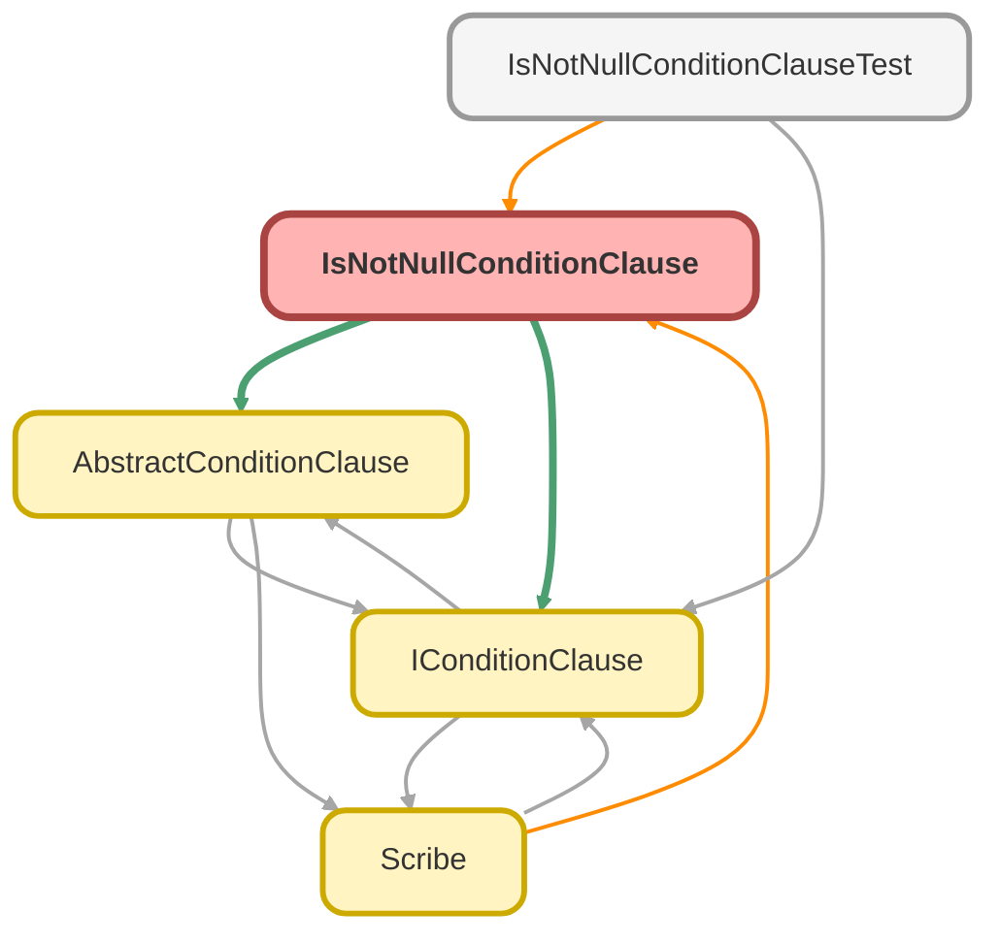

---
hide:
  - path
---

# IsNotNullConditionClause Class

A concrete implementation of `AbstractConditionClause` that builds a 
SOQL &quot;IS NOT NULL&quot; condition (represented as `!= NULL` ). 
 
This class does not require a value and simply generates the condition based on the 
provided field name.

**See** [IConditionClause](IConditionClause.md)

**See** [AbstractConditionClause](AbstractConditionClause.md)

**Inheritance**

[AbstractConditionClause](AbstractConditionClause.md)

## Class Diagram



<!-- Apex description -->

## Apex Code

```java
/**
 * Copyright 2025 Hiroyuki Matsuoka
 *
 * Licensed under the Apache License, Version 2.0 (the "License");
 * you may not use this file except in compliance with the License.
 * You may obtain a copy of the License at
 *
 * http://www.apache.org/licenses/LICENSE-2.0
 *
 * Unless required by applicable law or agreed to in writing, software
 * distributed under the License is distributed on an "AS IS" BASIS,
 * WITHOUT WARRANTIES OR CONDITIONS OF ANY KIND, either express or implied.
 * See the License for the specific language governing permissions and
 * limitations under the License.
 */

/**
 * @description A concrete implementation of `AbstractConditionClause` that builds a
 * SOQL "IS NOT NULL" condition (represented as `!= NULL`).
 *
 * This class does not require a value and simply generates the condition based on the
 * provided field name.
 * @see IConditionClause
 * @see AbstractConditionClause
 */
public with sharing class IsNotNullConditionClause extends AbstractConditionClause {
  /**
   * Constructor for IsNotNullConditionClause.
   *
   * @param sObjectType The SObject type for the condition.
   * @param fieldMap A map of field names to Schema.SObjectField.
   * @param field The field name to apply the not equality to null condition on.
   */
  public IsNotNullConditionClause(
    Schema.SObjectType sObjectType,
    Map<String, Schema.SObjectField> fieldMap,
    String field
  ) {
    super(sObjectType, fieldMap, field);
  }

  /**
   * @inheritDoc
   */
  public override String build() {
    return String.format('{0} != {1}', new List<String>{ this.field, 'NULL' });
  }

  /**
   * @inheritDoc
   */
  public override IConditionClause overrideMetaData(
    Schema.SObjectType sObjectType,
    Map<String, Schema.SObjectField> fieldMap
  ) {
    return new IsNotNullConditionClause(sObjectType, fieldMap, this.field);
  }

  /**
   * @inheritDoc
   */
  public override IConditionClause overrideField(String field) {
    return new IsNotNullConditionClause(this.sObjectType, this.fieldMap, field);
  }

  /**
   * check the value type and cast it to string for SOQL
   *
   * @return The value formatted as a SOQL-compatible string.
   */
  private String checkAndCast() {
    return '';
  }
}
```

## Constructors
### `IsNotNullConditionClause(sObjectType, fieldMap, field)`

Constructor for IsNotNullConditionClause.

#### Signature
```apex
public IsNotNullConditionClause(Schema.SObjectType sObjectType, Map<String,Schema.SObjectField> fieldMap, String field)
```

#### Parameters
| Name | Type | Description |
|------|------|-------------|
| sObjectType | Schema.SObjectType | The SObject type for the condition. |
| fieldMap | Map<String,Schema.SObjectField> | A map of field names to Schema.SObjectField. |
| field | String | The field name to apply the not equality to null condition on. |

## Methods
### `build()`

**InheritDoc**

#### Signature
```apex
public override String build()
```

#### Return Type
**String**

---

### `overrideMetaData(sObjectType, fieldMap)`

**InheritDoc**

#### Signature
```apex
public override IConditionClause overrideMetaData(Schema.SObjectType sObjectType, Map<String,Schema.SObjectField> fieldMap)
```

#### Parameters
| Name | Type | Description |
|------|------|-------------|
| sObjectType | Schema.SObjectType |  |
| fieldMap | Map<String,Schema.SObjectField> |  |

#### Return Type
**[IConditionClause](IConditionClause.md)**

---

### `overrideField(field)`

**InheritDoc**

#### Signature
```apex
public override IConditionClause overrideField(String field)
```

#### Parameters
| Name | Type | Description |
|------|------|-------------|
| field | String |  |

#### Return Type
**[IConditionClause](IConditionClause.md)**

---

### `checkAndCast()`

check the value type and cast it to string for SOQL

#### Signature
```apex
private String checkAndCast()
```

#### Return Type
**String**

The value formatted as a SOQL-compatible string.

---

### `getFieldName()`

*Inherited*

**InheritDoc**

#### Signature
```apex
public String getFieldName()
```

#### Return Type
**String**