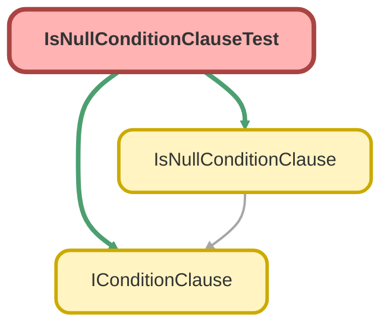

---
hide:
  - path
---

# IsNullConditionClauseTest Class

`ISTEST`

Copyright 2025 Hiroyuki Matsuoka 
 
Licensed under the Apache License, Version 2.0 (the &quot;License&quot;); 
you may not use this file except in compliance with the License. 
You may obtain a copy of the License at 
 
http://www.apache.org/licenses/LICENSE-2.0 
 
Unless required by applicable law or agreed to in writing, software 
distributed under the License is distributed on an &quot;AS IS&quot; BASIS, 
WITHOUT WARRANTIES OR CONDITIONS OF ANY KIND, either express or implied. 
See the License for the specific language governing permissions and 
limitations under the License.

## Class Diagram



<!-- Apex description -->

## Apex Code

```java
/**
 * Copyright 2025 Hiroyuki Matsuoka
 *
 * Licensed under the Apache License, Version 2.0 (the "License");
 * you may not use this file except in compliance with the License.
 * You may obtain a copy of the License at
 *
 * http://www.apache.org/licenses/LICENSE-2.0
 *
 * Unless required by applicable law or agreed to in writing, software
 * distributed under the License is distributed on an "AS IS" BASIS,
 * WITHOUT WARRANTIES OR CONDITIONS OF ANY KIND, either express or implied.
 * See the License for the specific language governing permissions and
 * limitations under the License.
 */
@isTest
public class IsNullConditionClauseTest {
  @isTest
  static void testBuild_WhenCalled_ThenReturnsIsNullCondition() {
    // Arrange
    Schema.SObjectType sObjectType = Account.getSObjectType();
    Map<String, Schema.SObjectField> fieldMap = sObjectType.getDescribe().fields.getMap();
    IConditionClause clause = new IsNullConditionClause(sObjectType, fieldMap, 'Name');

    // Act
    String result = clause.build();

    // Assert
    Assert.areEqual('Name = NULL', result, 'The clause should build a correct IS NULL condition.');
  }

  @isTest
  static void testImmutability_WhenOverrideMetaData_ThenReturnsNewInstance() {
    // Arrange
    Schema.SObjectType accountSObjectType = Account.getSObjectType();
    Map<String, Schema.SObjectField> accountFieldMap = accountSObjectType.getDescribe().fields.getMap();
    IConditionClause originalClause = new IsNullConditionClause(accountSObjectType, accountFieldMap, 'Name');

    // Act
    Schema.SObjectType oppSObjectType = Opportunity.getSObjectType();
    Map<String, Schema.SObjectField> oppFieldMap = oppSObjectType.getDescribe().fields.getMap();
    IConditionClause newClause = originalClause.overrideMetaData(oppSObjectType, oppFieldMap);

    // Assert
    Assert.areNotEqual(originalClause, newClause, 'A new instance should be returned.');
    Assert.areEqual('Name = NULL', originalClause.build(), 'Original instance should not be modified.');
  }

  @isTest
  static void testImmutability_WhenOverrideField_ThenReturnsNewInstanceWithNewField() {
    // Arrange
    Schema.SObjectType sObjectType = Account.getSObjectType();
    Map<String, Schema.SObjectField> fieldMap = sObjectType.getDescribe().fields.getMap();
    IConditionClause originalClause = new IsNullConditionClause(sObjectType, fieldMap, 'Name');

    // Act
    IConditionClause newClause = originalClause.overrideField('Industry');

    // Assert
    Assert.areNotEqual(originalClause, newClause, 'A new instance should be returned.');
    Assert.areEqual('Name = NULL', originalClause.build(), 'Original instance should not be modified.');
    Assert.areEqual(
      'Industry = NULL',
      newClause.build(),
      'New instance should reflect the overridden field name.'
    );
  }
}
```

## Methods
### `testBuild_WhenCalled_ThenReturnsIsNullCondition()`

`ISTEST`

#### Signature
```apex
private static void testBuild_WhenCalled_ThenReturnsIsNullCondition()
```

#### Return Type
**void**

---

### `testImmutability_WhenOverrideMetaData_ThenReturnsNewInstance()`

`ISTEST`

#### Signature
```apex
private static void testImmutability_WhenOverrideMetaData_ThenReturnsNewInstance()
```

#### Return Type
**void**

---

### `testImmutability_WhenOverrideField_ThenReturnsNewInstanceWithNewField()`

`ISTEST`

#### Signature
```apex
private static void testImmutability_WhenOverrideField_ThenReturnsNewInstanceWithNewField()
```

#### Return Type
**void**