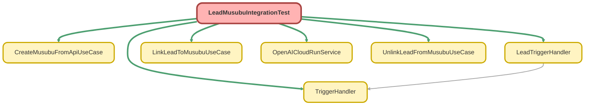

---
hide:
  - path
---

# LeadMusubuIntegrationTest Class

`ISTEST`

リード・結ぶ法人情報連携の結合テストクラス

## Class Diagram



<!-- Apex description -->

## Apex Code

```java
/**
 * リード・結ぶ法人情報連携の結合テストクラス
 *
 * @description トリガー、ハンドラー、UseCase を通したエンドツーエンドのテストを行う。
 */
@IsTest
private class LeadMusubuIntegrationTest {

    @TestSetup
    static void setup() {
        // テスト用の結ぶ法人情報を作成
        List<MusubuCompany__c> companies = new List<MusubuCompany__c>();
        for (Integer i = 0; i < 5; i++) {
            companies.add(new MusubuCompany__c(
                Name = 'インテグレーションテスト会社' + i,
                CorporateNumber__c = String.valueOf(5000000000000L + i),
                Industry__c = 'IT',
                Address__c = '東京都渋谷区' + i + '-1-1'
            ));
        }
        insert companies;
    }

    @IsTest
    static void testLeadInsert_TriggerFires() {
        // 準備
        TriggerHandler.bypass('LeadTriggerHandler'); // Queueable を起動しないようバイパス

        // 実行
        Test.startTest();
        Lead lead = new Lead(
            LastName = 'トリガーテスト',
            Company = 'トリガーテスト株式会社'
        );
        insert lead;
        Test.stopTest();

        // 検証: リードが作成されていること
        Lead insertedLead = [SELECT Id, Company FROM Lead WHERE Id = :lead.Id];
        System.assertEquals('トリガーテスト株式会社', insertedLead.Company);

        TriggerHandler.clearBypass('LeadTriggerHandler');
    }

    @IsTest
    static void testLeadUpdate_WithCorporateNumberChange() {
        // 準備
        TriggerHandler.bypass('LeadTriggerHandler');

        Lead lead = new Lead(
            LastName = '更新テスト',
            Company = '更新テスト株式会社',
            CorporateNumber__c = '1111111111111'
        );
        insert lead;

        TriggerHandler.clearBypass('LeadTriggerHandler');

        // 実行
        Test.startTest();
        TriggerHandler.bypass('LeadTriggerHandler'); // 再度バイパス
        lead.CorporateNumber__c = '2222222222222';
        update lead;
        Test.stopTest();

        // 検証
        Lead updatedLead = [SELECT Id, CorporateNumber__c FROM Lead WHERE Id = :lead.Id];
        System.assertEquals('2222222222222', updatedLead.CorporateNumber__c);

        TriggerHandler.clearBypass('LeadTriggerHandler');
    }

    @IsTest
    static void testLinkAndUnlink_FullFlow() {
        // 準備
        MusubuCompany__c company = [SELECT Id, CorporateNumber__c FROM MusubuCompany__c LIMIT 1];

        TriggerHandler.bypass('LeadTriggerHandler');
        Lead lead = new Lead(
            LastName = 'フローテスト',
            Company = 'フローテスト株式会社'
        );
        insert lead;
        TriggerHandler.clearBypass('LeadTriggerHandler');

        // 実行: 紐付け
        Test.startTest();
        LinkLeadToMusubuUseCase linkUseCase = new LinkLeadToMusubuUseCase();
        LinkLeadToMusubuUseCase.LinkRequest linkRequest = new LinkLeadToMusubuUseCase.LinkRequest();
        linkRequest.leadId = lead.Id;
        linkRequest.musubuCompanyId = company.Id;
        LinkLeadToMusubuUseCase.LinkResult linkResult = linkUseCase.invoke(linkRequest);

        // 検証: 紐付け成功
        System.assertEquals(true, linkResult.success, '紐付けが成功すること');

        Lead linkedLead = [SELECT Id, MusubuCompanyId__c FROM Lead WHERE Id = :lead.Id];
        System.assertEquals(company.Id, linkedLead.MusubuCompanyId__c, '紐付けされていること');

        // 実行: 紐付け解除
        UnlinkLeadFromMusubuUseCase unlinkUseCase = new UnlinkLeadFromMusubuUseCase();
        UnlinkLeadFromMusubuUseCase.UnlinkRequest unlinkRequest = new UnlinkLeadFromMusubuUseCase.UnlinkRequest();
        unlinkRequest.leadId = lead.Id;
        UnlinkLeadFromMusubuUseCase.UnlinkResult unlinkResult = unlinkUseCase.invoke(unlinkRequest);
        Test.stopTest();

        // 検証: 紐付け解除成功
        System.assertEquals(true, unlinkResult.success, '紐付け解除が成功すること');

        Lead unlinkedLead = [SELECT Id, MusubuCompanyId__c FROM Lead WHERE Id = :lead.Id];
        System.assertEquals(null, unlinkedLead.MusubuCompanyId__c, '紐付けが解除されていること');
    }

    @IsTest
    static void testCreateAndLink_FromApiResponse() {
        // 準備
        TriggerHandler.bypass('LeadTriggerHandler');
        Lead lead = new Lead(
            LastName = 'API連携テスト',
            Company = 'API連携テスト株式会社'
        );
        insert lead;
        TriggerHandler.clearBypass('LeadTriggerHandler');

        // 実行
        Test.startTest();

        // API レスポンスから結ぶ法人情報を作成
        CreateMusubuFromApiUseCase createUseCase = new CreateMusubuFromApiUseCase();
        CreateMusubuFromApiUseCase.CompanyApiResponse apiResponse = new CreateMusubuFromApiUseCase.CompanyApiResponse();
        apiResponse.corporateNumber = '9999999999999';
        apiResponse.companyName = 'API作成会社';
        apiResponse.address = '大阪府大阪市北区1-1-1';
        apiResponse.prefecture = '大阪府';
        apiResponse.city = '大阪市北区';
        apiResponse.industry = '製造業';
        apiResponse.dataSource = 'Integration Test';

        CreateMusubuFromApiUseCase.CreateResult createResult = createUseCase.invoke(apiResponse);

        // 作成した結ぶ法人情報をリードに紐付け
        LinkLeadToMusubuUseCase linkUseCase = new LinkLeadToMusubuUseCase();
        LinkLeadToMusubuUseCase.LinkRequest linkRequest = new LinkLeadToMusubuUseCase.LinkRequest();
        linkRequest.leadId = lead.Id;
        linkRequest.musubuCompanyId = createResult.company.Id;
        LinkLeadToMusubuUseCase.LinkResult linkResult = linkUseCase.invoke(linkRequest);

        Test.stopTest();

        // 検証
        System.assertEquals(true, createResult.isNewlyCreated, '新規作成されたこと');
        System.assertEquals(true, linkResult.success, '紐付けが成功すること');

        Lead linkedLead = [SELECT Id, MusubuCompanyId__c, CorporateNumber__c FROM Lead WHERE Id = :lead.Id];
        System.assertEquals(createResult.company.Id, linkedLead.MusubuCompanyId__c, '紐付けされていること');
        System.assertEquals('9999999999999', linkedLead.CorporateNumber__c, '法人番号がコピーされていること');
    }

    @IsTest
    static void testBulkLeadProcessing() {
        // 準備
        TriggerHandler.bypass('LeadTriggerHandler');

        List<Lead> leads = new List<Lead>();
        for (Integer i = 0; i < 50; i++) {
            leads.add(new Lead(
                LastName = 'バルクテスト' + i,
                Company = 'バルクテスト株式会社' + i
            ));
        }
        insert leads;

        // 全リードに結ぶ法人情報を紐付け
        MusubuCompany__c company = [SELECT Id FROM MusubuCompany__c LIMIT 1];
        for (Lead lead : leads) {
            lead.MusubuCompanyId__c = company.Id;
        }
        update leads;

        TriggerHandler.clearBypass('LeadTriggerHandler');

        // 実行: 一括紐付け解除
        Set<Id> leadIds = new Set<Id>();
        for (Lead lead : leads) {
            leadIds.add(lead.Id);
        }

        Test.startTest();
        UnlinkLeadFromMusubuUseCase useCase = new UnlinkLeadFromMusubuUseCase();
        List<UnlinkLeadFromMusubuUseCase.UnlinkResult> results = useCase.invokeForMultipleLeads(leadIds, false);
        Test.stopTest();

        // 検証
        System.assertEquals(50, results.size(), '50件の結果が返ること');

        Integer successCount = 0;
        for (UnlinkLeadFromMusubuUseCase.UnlinkResult result : results) {
            if (result.success) {
                successCount++;
            }
        }
        System.assertEquals(50, successCount, '全て成功すること');

        List<Lead> unlinkedLeads = [SELECT Id, MusubuCompanyId__c FROM Lead WHERE Id IN :leadIds];
        for (Lead lead : unlinkedLeads) {
            System.assertEquals(null, lead.MusubuCompanyId__c, '紐付けが解除されていること');
        }
    }

    @IsTest
    static void testTriggerHandlerBypass() {
        // 準備
        System.assertEquals(false, TriggerHandler.isBypassed('LeadTriggerHandler'), '最初はバイパスされていないこと');

        // 実行
        TriggerHandler.bypass('LeadTriggerHandler');
        System.assertEquals(true, TriggerHandler.isBypassed('LeadTriggerHandler'), 'バイパスされていること');

        TriggerHandler.clearBypass('LeadTriggerHandler');
        System.assertEquals(false, TriggerHandler.isBypassed('LeadTriggerHandler'), 'バイパスが解除されていること');

        TriggerHandler.bypass('LeadTriggerHandler');
        TriggerHandler.clearAllBypasses();
        System.assertEquals(false, TriggerHandler.isBypassed('LeadTriggerHandler'), '全バイパスがクリアされていること');
    }

    @IsTest
    static void testOpenAICloudRunService_MockCallout() {
        // 準備: HTTP Mock
        Test.setMock(HttpCalloutMock.class, new OpenAICloudRunMockSuccess());

        OpenAICloudRunService service = new OpenAICloudRunService();
        OpenAICloudRunService.CompanySearchRequest request = new OpenAICloudRunService.CompanySearchRequest();
        request.companyName = 'テスト会社';

        // 実行
        Test.startTest();
        OpenAICloudRunService.CompanySearchResponse response = service.searchCompany(request);
        Test.stopTest();

        // 検証
        System.assertEquals(true, response.found, '結果が見つかること');
        System.assertEquals('モック株式会社', response.companyName, '会社名が正しいこと');
        System.assertEquals('1234567890123', response.corporateNumber, '法人番号が正しいこと');
    }

    @IsTest
    static void testOpenAICloudRunService_NotFound() {
        // 準備: HTTP Mock (404)
        Test.setMock(HttpCalloutMock.class, new OpenAICloudRunMockNotFound());

        OpenAICloudRunService service = new OpenAICloudRunService();
        OpenAICloudRunService.CompanySearchRequest request = new OpenAICloudRunService.CompanySearchRequest();
        request.companyName = '存在しない会社';

        // 実行
        Test.startTest();
        OpenAICloudRunService.CompanySearchResponse response = service.searchCompany(request);
        Test.stopTest();

        // 検証
        System.assertEquals(false, response.found, '結果が見つからないこと');
    }

    /**
     * 成功レスポンス用の HTTP Mock
     */
    private class OpenAICloudRunMockSuccess implements HttpCalloutMock {
        public HttpResponse respond(HttpRequest request) {
            HttpResponse response = new HttpResponse();
            response.setStatusCode(200);
            response.setHeader('Content-Type', 'application/json');
            response.setBody(JSON.serialize(new Map<String, Object>{
                'corporate_number' => '1234567890123',
                'company_name' => 'モック株式会社',
                'address' => '東京都千代田区1-1-1',
                'postal_code' => '100-0001',
                'prefecture' => '東京都',
                'city' => '千代田区',
                'industry' => 'IT',
                'employee_count' => 100,
                'capital' => 10000000,
                'established_date' => '2000-01-01',
                'website' => 'https://mock.example.com',
                'phone' => '03-0000-0000'
            }));
            return response;
        }
    }

    /**
     * Not Found レスポンス用の HTTP Mock
     */
    private class OpenAICloudRunMockNotFound implements HttpCalloutMock {
        public HttpResponse respond(HttpRequest request) {
            HttpResponse response = new HttpResponse();
            response.setStatusCode(404);
            response.setHeader('Content-Type', 'application/json');
            response.setBody('{"error": "Not Found"}');
            return response;
        }
    }
}
```

## Methods
### `setup()`

`TESTSETUP`

#### Signature
```apex
private static void setup()
```

#### Return Type
**void**

---

### `testLeadInsert_TriggerFires()`

`ISTEST`

#### Signature
```apex
private static void testLeadInsert_TriggerFires()
```

#### Return Type
**void**

---

### `testLeadUpdate_WithCorporateNumberChange()`

`ISTEST`

#### Signature
```apex
private static void testLeadUpdate_WithCorporateNumberChange()
```

#### Return Type
**void**

---

### `testLinkAndUnlink_FullFlow()`

`ISTEST`

#### Signature
```apex
private static void testLinkAndUnlink_FullFlow()
```

#### Return Type
**void**

---

### `testCreateAndLink_FromApiResponse()`

`ISTEST`

#### Signature
```apex
private static void testCreateAndLink_FromApiResponse()
```

#### Return Type
**void**

---

### `testBulkLeadProcessing()`

`ISTEST`

#### Signature
```apex
private static void testBulkLeadProcessing()
```

#### Return Type
**void**

---

### `testTriggerHandlerBypass()`

`ISTEST`

#### Signature
```apex
private static void testTriggerHandlerBypass()
```

#### Return Type
**void**

---

### `testOpenAICloudRunService_MockCallout()`

`ISTEST`

#### Signature
```apex
private static void testOpenAICloudRunService_MockCallout()
```

#### Return Type
**void**

---

### `testOpenAICloudRunService_NotFound()`

`ISTEST`

#### Signature
```apex
private static void testOpenAICloudRunService_NotFound()
```

#### Return Type
**void**

## Classes
### OpenAICloudRunMockSuccess Class

成功レスポンス用の HTTP Mock

**Implements**

HttpCalloutMock

#### Methods
##### `respond(request)`

###### Signature
```apex
public HttpResponse respond(HttpRequest request)
```

###### Parameters
| Name | Type | Description |
|------|------|-------------|
| request | HttpRequest |  |

###### Return Type
**HttpResponse**

### OpenAICloudRunMockNotFound Class

Not Found レスポンス用の HTTP Mock

**Implements**

HttpCalloutMock

#### Methods
##### `respond(request)`

###### Signature
```apex
public HttpResponse respond(HttpRequest request)
```

###### Parameters
| Name | Type | Description |
|------|------|-------------|
| request | HttpRequest |  |

###### Return Type
**HttpResponse**