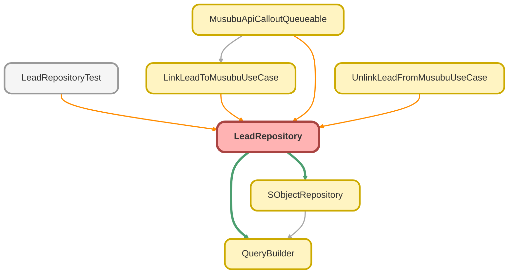

---
hide:
  - path
---

# LeadRepository Class

Lead リポジトリクラス

**Inheritance**

[SObjectRepository](SObjectRepository.md)

## Class Diagram



<!-- Apex description -->

## Apex Code

```java
/**
 * Lead リポジトリクラス
 *
 * @description Lead オブジェクト用のリポジトリ。
 *              QueryBuilder を使用した型安全なクエリを提供します。
 */
public with sharing class LeadRepository extends SObjectRepository {

    /**
     * コンストラクタ
     */
    public LeadRepository() {
        super(Lead.SObjectType);
    }

    /**
     * デフォルトで取得するフィールドを返す
     *
     * @return フィールド名のリスト
     */
    protected override List<String> getDefaultFields() {
        return new List<String>{
            'Id',
            'Company',
            'CorporateNumber__c',
            'MusubuCompanyId__c'
        };
    }

    /**
     * ID でリードを検索
     *
     * @param recordId レコード ID
     * @return Lead レコード（なければ null）
     */
    public override SObject findById(Id recordId) {
        return super.findById(recordId);
    }

    /**
     * 複数の ID でリードを検索
     *
     * @param recordIds レコード ID のセット
     * @return Lead のリスト
     */
    public override List<SObject> findByIds(Set<Id> recordIds) {
        return super.findByIds(recordIds);
    }

    /**
     * ID でリードを検索（型付き）
     *
     * @param recordId レコード ID
     * @return Lead レコード（なければ null）
     */
    public Lead findLeadById(Id recordId) {
        return (Lead) super.findById(recordId);
    }

    /**
     * 複数の ID でリードを検索（型付き）
     *
     * @param recordIds レコード ID のセット
     * @return Lead のリスト
     */
    public List<Lead> findLeadsByIds(Set<Id> recordIds) {
        List<SObject> results = super.findByIds(recordIds);
        List<Lead> leads = new List<Lead>();
        for (SObject record : results) {
            leads.add((Lead) record);
        }
        return leads;
    }

    /**
     * 結ぶ法人情報に紐付いているリードを検索
     *
     * @param leadIds リード ID のセット
     * @return 紐付いているリードのリスト
     */
    public List<Lead> findLinkedToMusubuCompany(Set<Id> leadIds) {
        return (List<Lead>) query()
            .selectFields(getDefaultFields())
            .whereInIds('Id', leadIds)
            .whereNotNull('MusubuCompanyId__c')
            .get();
    }

    /**
     * 結ぶ法人情報に紐付いていないリードを検索
     *
     * @param leadIds リード ID のセット
     * @return 紐付いていないリードのリスト
     */
    public List<Lead> findNotLinkedToMusubuCompany(Set<Id> leadIds) {
        return (List<Lead>) query()
            .selectFields(getDefaultFields())
            .whereInIds('Id', leadIds)
            .whereNull('MusubuCompanyId__c')
            .get();
    }

    /**
     * 法人番号でリードを検索
     *
     * @param corporateNumber 法人番号
     * @return 該当するリードのリスト
     */
    public List<Lead> findByCorporateNumber(String corporateNumber) {
        return (List<Lead>) query()
            .selectFields(getDefaultFields())
            .whereEqual('CorporateNumber__c', corporateNumber)
            .get();
    }

    /**
     * 結ぶ法人情報 ID でリードを検索
     *
     * @param musubuCompanyId 結ぶ法人情報 ID
     * @return 該当するリードのリスト
     */
    public List<Lead> findByMusubuCompanyId(Id musubuCompanyId) {
        return (List<Lead>) query()
            .selectFields(getDefaultFields())
            .whereEqual('MusubuCompanyId__c', musubuCompanyId)
            .get();
    }

    /**
     * API コールアウト用に紐付いていないリードを検索（住所フィールド含む）
     *
     * @param leadIds リード ID のセット
     * @return 該当するリードのリスト
     */
    public List<Lead> findForApiCallout(Set<Id> leadIds) {
        return (List<Lead>) query()
            .selectFields(getFieldsForApiCallout())
            .whereInIds('Id', leadIds)
            .whereNull('MusubuCompanyId__c')
            .get();
    }

    /**
     * API コールアウト用フィールドを取得
     *
     * @return フィールド名のリスト
     */
    private List<String> getFieldsForApiCallout() {
        return new List<String>{
            'Id',
            'Company',
            'CorporateNumber__c',
            'MusubuCompanyId__c',
            'Phone',
            'Website',
            'Street',
            'City',
            'State',
            'PostalCode'
        };
    }
}
```

## Constructors
### `LeadRepository()`

コンストラクタ

#### Signature
```apex
public LeadRepository()
```

## Methods
### `findById(recordId)`

ID でリードを検索

#### Signature
```apex
public override SObject findById(Id recordId)
```

#### Parameters
| Name | Type | Description |
|------|------|-------------|
| recordId | Id | レコード ID |

#### Return Type
**SObject**

Lead レコード（なければ null）

---

### `findByIds(recordIds)`

複数の ID でリードを検索

#### Signature
```apex
public override List<SObject> findByIds(Set<Id> recordIds)
```

#### Parameters
| Name | Type | Description |
|------|------|-------------|
| recordIds | Set<Id> | レコード ID のセット |

#### Return Type
**List<SObject>**

Lead のリスト

---

### `findLeadById(recordId)`

ID でリードを検索（型付き）

#### Signature
```apex
public Lead findLeadById(Id recordId)
```

#### Parameters
| Name | Type | Description |
|------|------|-------------|
| recordId | Id | レコード ID |

#### Return Type
**[Lead](../objects/Lead.md)**

Lead レコード（なければ null）

---

### `findLeadsByIds(recordIds)`

複数の ID でリードを検索（型付き）

#### Signature
```apex
public List<Lead> findLeadsByIds(Set<Id> recordIds)
```

#### Parameters
| Name | Type | Description |
|------|------|-------------|
| recordIds | Set<Id> | レコード ID のセット |

#### Return Type
**List<Lead>**

Lead のリスト

---

### `findLinkedToMusubuCompany(leadIds)`

結ぶ法人情報に紐付いているリードを検索

#### Signature
```apex
public List<Lead> findLinkedToMusubuCompany(Set<Id> leadIds)
```

#### Parameters
| Name | Type | Description |
|------|------|-------------|
| leadIds | Set<Id> | リード ID のセット |

#### Return Type
**List<Lead>**

紐付いているリードのリスト

---

### `findNotLinkedToMusubuCompany(leadIds)`

結ぶ法人情報に紐付いていないリードを検索

#### Signature
```apex
public List<Lead> findNotLinkedToMusubuCompany(Set<Id> leadIds)
```

#### Parameters
| Name | Type | Description |
|------|------|-------------|
| leadIds | Set<Id> | リード ID のセット |

#### Return Type
**List<Lead>**

紐付いていないリードのリスト

---

### `findByCorporateNumber(corporateNumber)`

法人番号でリードを検索

#### Signature
```apex
public List<Lead> findByCorporateNumber(String corporateNumber)
```

#### Parameters
| Name | Type | Description |
|------|------|-------------|
| corporateNumber | String | 法人番号 |

#### Return Type
**List<Lead>**

該当するリードのリスト

---

### `findByMusubuCompanyId(musubuCompanyId)`

結ぶ法人情報 ID でリードを検索

#### Signature
```apex
public List<Lead> findByMusubuCompanyId(Id musubuCompanyId)
```

#### Parameters
| Name | Type | Description |
|------|------|-------------|
| musubuCompanyId | Id | 結ぶ法人情報 ID |

#### Return Type
**List<Lead>**

該当するリードのリスト

---

### `findForApiCallout(leadIds)`

API コールアウト用に紐付いていないリードを検索（住所フィールド含む）

#### Signature
```apex
public List<Lead> findForApiCallout(Set<Id> leadIds)
```

#### Parameters
| Name | Type | Description |
|------|------|-------------|
| leadIds | Set<Id> | リード ID のセット |

#### Return Type
**List<Lead>**

該当するリードのリスト

---

### `getFieldsForApiCallout()`

API コールアウト用フィールドを取得

#### Signature
```apex
private List<String> getFieldsForApiCallout()
```

#### Return Type
**List<String>**

フィールド名のリスト