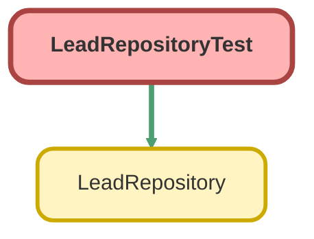

---
hide:
  - path
---

# LeadRepositoryTest Class

`ISTEST`

LeadRepository のテストクラス

## Class Diagram



<!-- Apex description -->

## Apex Code

```java
/**
 * LeadRepository のテストクラス
 */
@IsTest
private class LeadRepositoryTest {

    @TestSetup
    static void setup() {
        // 結ぶ法人情報を作成
        MusubuCompany__c company = new MusubuCompany__c(
            Name = 'Test Company',
            CorporateNumber__c = '1234567890123'
        );
        insert company;

        // リードを作成
        List<Lead> leads = new List<Lead>();
        leads.add(new Lead(
            LastName = 'Lead 1',
            Company = 'Company 1',
            CorporateNumber__c = '1111111111111',
            MusubuCompanyId__c = company.Id
        ));
        leads.add(new Lead(
            LastName = 'Lead 2',
            Company = 'Company 2',
            CorporateNumber__c = '2222222222222',
            MusubuCompanyId__c = null
        ));
        leads.add(new Lead(
            LastName = 'Lead 3',
            Company = 'Company 3',
            CorporateNumber__c = '1111111111111',
            MusubuCompanyId__c = null
        ));
        insert leads;
    }

    @IsTest
    static void testFindById() {
        // Given
        Lead testLead = [SELECT Id FROM Lead WHERE LastName = 'Lead 1' LIMIT 1];
        LeadRepository repo = new LeadRepository();

        // When
        Lead result = repo.findLeadById(testLead.Id);

        // Then
        System.assertNotEquals(null, result, 'リードが取得できません');
        System.assertEquals(testLead.Id, result.Id, 'IDが一致しません');
    }

    @IsTest
    static void testFindByIdReturnsNull() {
        // Given
        LeadRepository repo = new LeadRepository();
        Id fakeId = Lead.SObjectType.getDescribe().getKeyPrefix() + '000000000000';

        // When
        Lead result = repo.findLeadById(fakeId);

        // Then
        System.assertEquals(null, result, '存在しないIDでnullが返されていません');
    }

    @IsTest
    static void testFindByIds() {
        // Given
        List<Lead> testLeads = [SELECT Id FROM Lead];
        Set<Id> leadIds = new Set<Id>();
        for (Lead l : testLeads) {
            leadIds.add(l.Id);
        }
        LeadRepository repo = new LeadRepository();

        // When
        List<Lead> results = repo.findLeadsByIds(leadIds);

        // Then
        System.assertEquals(3, results.size(), '該当件数が一致しません');
    }

    @IsTest
    static void testFindLinkedToMusubuCompany() {
        // Given
        List<Lead> allLeads = [SELECT Id FROM Lead];
        Set<Id> leadIds = new Set<Id>();
        for (Lead l : allLeads) {
            leadIds.add(l.Id);
        }
        LeadRepository repo = new LeadRepository();

        // When
        List<Lead> results = repo.findLinkedToMusubuCompany(leadIds);

        // Then
        System.assertEquals(1, results.size(), '紐付いているリードの件数が一致しません');
    }

    @IsTest
    static void testFindNotLinkedToMusubuCompany() {
        // Given
        List<Lead> allLeads = [SELECT Id FROM Lead];
        Set<Id> leadIds = new Set<Id>();
        for (Lead l : allLeads) {
            leadIds.add(l.Id);
        }
        LeadRepository repo = new LeadRepository();

        // When
        List<Lead> results = repo.findNotLinkedToMusubuCompany(leadIds);

        // Then
        System.assertEquals(2, results.size(), '紐付いていないリードの件数が一致しません');
    }

    @IsTest
    static void testFindByCorporateNumber() {
        // Given
        LeadRepository repo = new LeadRepository();

        // When
        List<Lead> results = repo.findByCorporateNumber('1111111111111');

        // Then
        System.assertEquals(2, results.size(), '法人番号での検索結果が一致しません');
    }

    @IsTest
    static void testFindByMusubuCompanyId() {
        // Given
        MusubuCompany__c company = [SELECT Id FROM MusubuCompany__c LIMIT 1];
        LeadRepository repo = new LeadRepository();

        // When
        List<Lead> results = repo.findByMusubuCompanyId(company.Id);

        // Then
        System.assertEquals(1, results.size(), '結ぶ法人情報IDでの検索結果が一致しません');
    }

    @IsTest
    static void testFindForApiCallout() {
        // Given
        List<Lead> allLeads = [SELECT Id FROM Lead];
        Set<Id> leadIds = new Set<Id>();
        for (Lead l : allLeads) {
            leadIds.add(l.Id);
        }
        LeadRepository repo = new LeadRepository();

        // When
        List<Lead> results = repo.findForApiCallout(leadIds);

        // Then
        System.assertEquals(2, results.size(), 'API用検索の件数が一致しません（紐付いていないリードのみ）');
    }
}
```

## Methods
### `setup()`

`TESTSETUP`

#### Signature
```apex
private static void setup()
```

#### Return Type
**void**

---

### `testFindById()`

`ISTEST`

#### Signature
```apex
private static void testFindById()
```

#### Return Type
**void**

---

### `testFindByIdReturnsNull()`

`ISTEST`

#### Signature
```apex
private static void testFindByIdReturnsNull()
```

#### Return Type
**void**

---

### `testFindByIds()`

`ISTEST`

#### Signature
```apex
private static void testFindByIds()
```

#### Return Type
**void**

---

### `testFindLinkedToMusubuCompany()`

`ISTEST`

#### Signature
```apex
private static void testFindLinkedToMusubuCompany()
```

#### Return Type
**void**

---

### `testFindNotLinkedToMusubuCompany()`

`ISTEST`

#### Signature
```apex
private static void testFindNotLinkedToMusubuCompany()
```

#### Return Type
**void**

---

### `testFindByCorporateNumber()`

`ISTEST`

#### Signature
```apex
private static void testFindByCorporateNumber()
```

#### Return Type
**void**

---

### `testFindByMusubuCompanyId()`

`ISTEST`

#### Signature
```apex
private static void testFindByMusubuCompanyId()
```

#### Return Type
**void**

---

### `testFindForApiCallout()`

`ISTEST`

#### Signature
```apex
private static void testFindForApiCallout()
```

#### Return Type
**void**