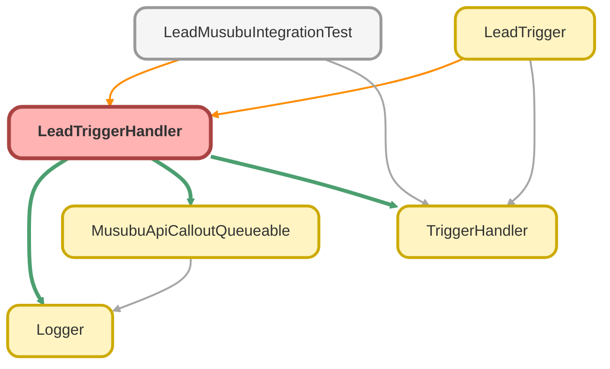

---
hide:
  - path
---

# LeadTriggerHandler Class

リードトリガーハンドラー

**Inheritance**

[TriggerHandler](TriggerHandler.md)

## Class Diagram



<!-- Apex description -->

## Apex Code

```java
/**
 * リードトリガーハンドラー
 *
 * @description リードに対するトリガーロジックを管理する。
 *              結ぶ法人情報との連携処理を制御。
 */
public with sharing class LeadTriggerHandler extends TriggerHandler {

    private List<Lead> newLeads;
    private List<Lead> oldLeads;
    private Map<Id, Lead> newLeadMap;
    private Map<Id, Lead> oldLeadMap;

    public LeadTriggerHandler() {
        this.newLeads = (List<Lead>) Trigger.new;
        this.oldLeads = (List<Lead>) Trigger.old;
        this.newLeadMap = (Map<Id, Lead>) Trigger.newMap;
        this.oldLeadMap = (Map<Id, Lead>) Trigger.oldMap;
    }

    /**
     * 挿入後処理
     */
    protected override void afterInsert() {
        Logger.info('LeadTriggerHandler.afterInsert を開始します - leadCount: ' + this.newLeads.size());

        try {
            enqueueMusubuApiCallout(this.newLeads);

        } catch (Exception e) {
            Logger.error('afterInsert でエラーが発生しました', e);

        } finally {
            Logger.saveLog();
        }
    }

    /**
     * 更新後処理
     */
    protected override void afterUpdate() {
        Logger.info('LeadTriggerHandler.afterUpdate を開始します - leadCount: ' + this.newLeads.size());

        try {
            // 法人番号が変更されたリードを抽出
            List<Lead> changedLeads = new List<Lead>();
            for (Lead newLead : this.newLeads) {
                Lead oldLead = this.oldLeadMap.get(newLead.Id);
                if (isCorporateNumberChanged(newLead, oldLead) || isCompanyChanged(newLead, oldLead)) {
                    changedLeads.add(newLead);
                }
            }

            if (!changedLeads.isEmpty()) {
                Logger.info('法人情報が変更されたリードがあります - changedCount: ' + changedLeads.size());
                enqueueMusubuApiCallout(changedLeads);
            }

        } catch (Exception e) {
            Logger.error('afterUpdate でエラーが発生しました', e);

        } finally {
            Logger.saveLog();
        }
    }

    /**
     * 結ぶ法人情報 API コールアウトをキューに追加する
     *
     * @param leads 処理対象のリード
     */
    private void enqueueMusubuApiCallout(List<Lead> leads) {
        // 既に紐付いているリードを除外
        Set<Id> leadIdsToProcess = new Set<Id>();
        for (Lead lead : leads) {
            if (lead.MusubuCompanyId__c == null && String.isNotBlank(lead.Company)) {
                leadIdsToProcess.add(lead.Id);
            }
        }

        if (leadIdsToProcess.isEmpty()) {
            Logger.debug('処理対象のリードがありません');
            return;
        }

        // Queueable ジョブが既にキューイングされているかチェック
        if (Limits.getQueueableJobs() >= Limits.getLimitQueueableJobs()) {
            Logger.warn('Queueable ジョブの上限に達しています - currentJobs: ' + Limits.getQueueableJobs() + ', limitJobs: ' + Limits.getLimitQueueableJobs());
            return;
        }

        Logger.info('結ぶ法人情報 API コールアウトをキューに追加します - leadCount: ' + leadIdsToProcess.size());

        if (!Test.isRunningTest()) {
            System.enqueueJob(new MusubuApiCalloutQueueable(leadIdsToProcess));
        }
    }

    /**
     * 法人番号が変更されたかチェック
     *
     * @param newLead 新しいリード
     * @param oldLead 古いリード
     * @return 変更されていれば true
     */
    private Boolean isCorporateNumberChanged(Lead newLead, Lead oldLead) {
        return newLead.CorporateNumber__c != oldLead.CorporateNumber__c;
    }

    /**
     * 会社名が変更されたかチェック
     *
     * @param newLead 新しいリード
     * @param oldLead 古いリード
     * @return 変更されていれば true
     */
    private Boolean isCompanyChanged(Lead newLead, Lead oldLead) {
        return newLead.Company != oldLead.Company;
    }
}
```

## Fields
### `newLeads`

#### Signature
```apex
private newLeads
```

#### Type
List<Lead>

---

### `oldLeads`

#### Signature
```apex
private oldLeads
```

#### Type
List<Lead>

---

### `newLeadMap`

#### Signature
```apex
private newLeadMap
```

#### Type
Map<Id,Lead>

---

### `oldLeadMap`

#### Signature
```apex
private oldLeadMap
```

#### Type
Map<Id,Lead>

## Constructors
### `LeadTriggerHandler()`

#### Signature
```apex
public LeadTriggerHandler()
```

## Methods
### `enqueueMusubuApiCallout(leads)`

結ぶ法人情報 API コールアウトをキューに追加する

#### Signature
```apex
private void enqueueMusubuApiCallout(List<Lead> leads)
```

#### Parameters
| Name | Type | Description |
|------|------|-------------|
| leads | List<Lead> | 処理対象のリード |

#### Return Type
**void**

---

### `isCorporateNumberChanged(newLead, oldLead)`

法人番号が変更されたかチェック

#### Signature
```apex
private Boolean isCorporateNumberChanged(Lead newLead, Lead oldLead)
```

#### Parameters
| Name | Type | Description |
|------|------|-------------|
| newLead | [Lead](../objects/Lead.md) | 新しいリード |
| oldLead | [Lead](../objects/Lead.md) | 古いリード |

#### Return Type
**Boolean**

変更されていれば true

---

### `isCompanyChanged(newLead, oldLead)`

会社名が変更されたかチェック

#### Signature
```apex
private Boolean isCompanyChanged(Lead newLead, Lead oldLead)
```

#### Parameters
| Name | Type | Description |
|------|------|-------------|
| newLead | [Lead](../objects/Lead.md) | 新しいリード |
| oldLead | [Lead](../objects/Lead.md) | 古いリード |

#### Return Type
**Boolean**

変更されていれば true

---

### `run()`

*Inherited*

メインエントリポイント - トリガーから呼び出す

#### Signature
```apex
public void run()
```

#### Return Type
**void**

---

### `setMaxLoopCount(max)`

*Inherited*

#### Signature
```apex
public void setMaxLoopCount(Integer max)
```

#### Parameters
| Name | Type | Description |
|------|------|-------------|
| max | Integer |  |

#### Return Type
**void**

---

### `clearMaxLoopCount()`

*Inherited*

#### Signature
```apex
public void clearMaxLoopCount()
```

#### Return Type
**void**

---

### `bypass(handlerName)`

*Inherited*

指定したハンドラーをバイパス（無効化）する

#### Signature
```apex
public static void bypass(String handlerName)
```

#### Parameters
| Name | Type | Description |
|------|------|-------------|
| handlerName | String | バイパスするハンドラー名 |

#### Return Type
**void**

---

### `clearBypass(handlerName)`

*Inherited*

指定したハンドラーのバイパスを解除する

#### Signature
```apex
public static void clearBypass(String handlerName)
```

#### Parameters
| Name | Type | Description |
|------|------|-------------|
| handlerName | String | バイパス解除するハンドラー名 |

#### Return Type
**void**

---

### `isBypassed(handlerName)`

*Inherited*

指定したハンドラーがバイパスされているか確認

#### Signature
```apex
public static Boolean isBypassed(String handlerName)
```

#### Parameters
| Name | Type | Description |
|------|------|-------------|
| handlerName | String | 確認するハンドラー名 |

#### Return Type
**Boolean**

バイパスされている場合 true

---

### `clearAllBypasses()`

*Inherited*

すべてのバイパスをクリアする

#### Signature
```apex
public static void clearAllBypasses()
```

#### Return Type
**void**