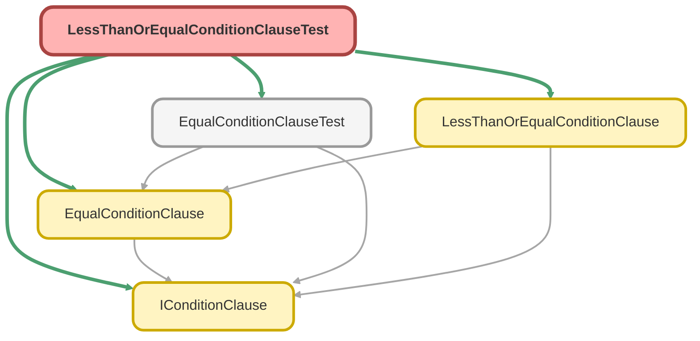

---
hide:
  - path
---

# LessThanOrEqualConditionClauseTest Class

`ISTEST`

Copyright 2025 Hiroyuki Matsuoka 
 
Licensed under the Apache License, Version 2.0 (the &quot;License&quot;); 
you may not use this file except in compliance with the License. 
You may obtain a copy of the License at 
 
http://www.apache.org/licenses/LICENSE-2.0 
 
Unless required by applicable law or agreed to in writing, software 
distributed under the License is distributed on an &quot;AS IS&quot; BASIS, 
WITHOUT WARRANTIES OR CONDITIONS OF ANY KIND, either express or implied. 
See the License for the specific language governing permissions and 
limitations under the License.

## Class Diagram



<!-- Apex description -->

## Apex Code

```java
/**
 * Copyright 2025 Hiroyuki Matsuoka
 *
 * Licensed under the Apache License, Version 2.0 (the "License");
 * you may not use this file except in compliance with the License.
 * You may obtain a copy of the License at
 *
 * http://www.apache.org/licenses/LICENSE-2.0
 *
 * Unless required by applicable law or agreed to in writing, software
 * distributed under the License is distributed on an "AS IS" BASIS,
 * WITHOUT WARRANTIES OR CONDITIONS OF ANY KIND, either express or implied.
 * See the License for the specific language governing permissions and
 * limitations under the License.
 */
@isTest
public class LessThanOrEqualConditionClauseTest {
  @isTest
  static void testBuild_WhenValueIsString_ThenReturnsConditionWithQuotes() {
    // Arrange
    Schema.SObjectType sObjectType = Account.getSObjectType();
    Map<String, Schema.SObjectField> fieldMap = sObjectType.getDescribe().fields.getMap();
    IConditionClause clause = new LessThanOrEqualConditionClause(sObjectType, fieldMap, 'Name', 'Test Corp');

    // Act
    String result = clause.build();

    // Assert
    Assert.areEqual('Name <= \'Test Corp\'', result, 'String value should be enclosed in single quotes.');
  }

  @isTest
  static void testBuild_WhenValueIsInteger_ThenReturnsConditionWithoutQuotes() {
    // Arrange
    Schema.SObjectType sObjectType = Opportunity.getSObjectType();
    Map<String, Schema.SObjectField> fieldMap = sObjectType.getDescribe().fields.getMap();
    IConditionClause clause = new LessThanOrEqualConditionClause(sObjectType, fieldMap, 'Amount', 5000);

    // Act
    String result = clause.build();

    // Assert
    Assert.areEqual('Amount <= 5000', result, 'Numeric value should not be quoted.');
  }

  @isTest
  static void testBuild_WhenValueIsDate_ThenReturnsFormattedDateLiteral() {
    // Arrange
    Schema.SObjectType sObjectType = Opportunity.getSObjectType();
    Map<String, Schema.SObjectField> fieldMap = sObjectType.getDescribe().fields.getMap();
    Date testDate = Date.newInstance(2025, 1, 1);
    IConditionClause clause = new LessThanOrEqualConditionClause(sObjectType, fieldMap, 'CloseDate', testDate);

    // Act
    String result = clause.build();

    // Assert
    Assert.areEqual('CloseDate <= 2025-01-01', result, 'Date value should be formatted as YYYY-MM-DD.');
  }

  @isTest
  static void testBuild_WhenValueIsDatetime_ThenReturnsFormattedDatetimeLiteral() {
    // Arrange
    Datetime testDatetime = Datetime.newInstance(2025, 1, 1, 10, 0, 0);
    String expectedGmtString = testDatetime.formatGmt('yyyy-MM-dd\'T\'HH:mm:ss\'Z\'');

    Schema.SObjectType sObjectType = Account.getSObjectType();
    Map<String, Schema.SObjectField> fieldMap = sObjectType.getDescribe().fields.getMap();
    IConditionClause clause = new LessThanOrEqualConditionClause(
      sObjectType,
      fieldMap,
      'CreatedDate',
      testDatetime
    );

    // Act
    String result = clause.build();

    // Assert
    String expectedResult = 'CreatedDate <= ' + expectedGmtString;
    Assert.areEqual(expectedResult, result, 'Datetime value should be formatted as a GMT literal.');
  }

  @isTest
  static void testBuild_WhenValueIsNull_ThenThrowException() {
    // Arrange
    Schema.SObjectType sObjectType = Opportunity.getSObjectType();
    Map<String, Schema.SObjectField> fieldMap = sObjectType.getDescribe().fields.getMap();
    IConditionClause clause = new LessThanOrEqualConditionClause(sObjectType, fieldMap, 'Amount', null);

    // Act & Assert
    try {
      clause.build();
      Assert.fail('Expected a QueryException to be thrown for null value.');
    } catch (QueryException e) {
      String expectedMessage = 'Value cannot be null for LessThanOrEqual condition. field: Amount';
      Assert.areEqual(expectedMessage, e.getMessage(), 'The exception message should match.');
    }
  }

  @isTest
  static void testImmutability_WhenOverrideMetaData_ThenReturnsNewInstance() {
    // Arrange
    Schema.SObjectType accountSObjectType = Account.getSObjectType();
    Map<String, Schema.SObjectField> accountFieldMap = accountSObjectType.getDescribe().fields.getMap();
    IConditionClause originalClause = new LessThanOrEqualConditionClause(
      accountSObjectType,
      accountFieldMap,
      'NumberOfEmployees',
      100
    );

    // Act
    Schema.SObjectType oppSObjectType = Opportunity.getSObjectType();
    Map<String, Schema.SObjectField> oppFieldMap = oppSObjectType.getDescribe().fields.getMap();
    IConditionClause newClause = originalClause.overrideMetaData(oppSObjectType, oppFieldMap);

    // Assert
    Assert.areNotEqual(originalClause, newClause, 'A new instance should be returned.');
    Assert.areEqual(
      'NumberOfEmployees <= 100',
      originalClause.build(),
      'Original instance should not be modified.'
    );
  }

  @isTest
  static void testImmutability_WhenOverrideField_ThenReturnsNewInstanceWithNewField() {
    // Arrange
    Schema.SObjectType sObjectType = Opportunity.getSObjectType();
    Map<String, Schema.SObjectField> fieldMap = sObjectType.getDescribe().fields.getMap();
    IConditionClause originalClause = new LessThanOrEqualConditionClause(sObjectType, fieldMap, 'Amount', 2000);

    // Act
    IConditionClause newClause = originalClause.overrideField('TotalOpportunityQuantity');

    // Assert
    Assert.areNotEqual(originalClause, newClause, 'A new instance should be returned.');
    Assert.areEqual('Amount <= 2000', originalClause.build(), 'Original instance should not be modified.');
    Assert.areEqual(
      'TotalOpportunityQuantity <= 2000',
      newClause.build(),
      'New instance should reflect the overridden field name.'
    );
  }
}
```

## Methods
### `testBuild_WhenValueIsString_ThenReturnsConditionWithQuotes()`

`ISTEST`

#### Signature
```apex
private static void testBuild_WhenValueIsString_ThenReturnsConditionWithQuotes()
```

#### Return Type
**void**

---

### `testBuild_WhenValueIsInteger_ThenReturnsConditionWithoutQuotes()`

`ISTEST`

#### Signature
```apex
private static void testBuild_WhenValueIsInteger_ThenReturnsConditionWithoutQuotes()
```

#### Return Type
**void**

---

### `testBuild_WhenValueIsDate_ThenReturnsFormattedDateLiteral()`

`ISTEST`

#### Signature
```apex
private static void testBuild_WhenValueIsDate_ThenReturnsFormattedDateLiteral()
```

#### Return Type
**void**

---

### `testBuild_WhenValueIsDatetime_ThenReturnsFormattedDatetimeLiteral()`

`ISTEST`

#### Signature
```apex
private static void testBuild_WhenValueIsDatetime_ThenReturnsFormattedDatetimeLiteral()
```

#### Return Type
**void**

---

### `testBuild_WhenValueIsNull_ThenThrowException()`

`ISTEST`

#### Signature
```apex
private static void testBuild_WhenValueIsNull_ThenThrowException()
```

#### Return Type
**void**

---

### `testImmutability_WhenOverrideMetaData_ThenReturnsNewInstance()`

`ISTEST`

#### Signature
```apex
private static void testImmutability_WhenOverrideMetaData_ThenReturnsNewInstance()
```

#### Return Type
**void**

---

### `testImmutability_WhenOverrideField_ThenReturnsNewInstanceWithNewField()`

`ISTEST`

#### Signature
```apex
private static void testImmutability_WhenOverrideField_ThenReturnsNewInstanceWithNewField()
```

#### Return Type
**void**