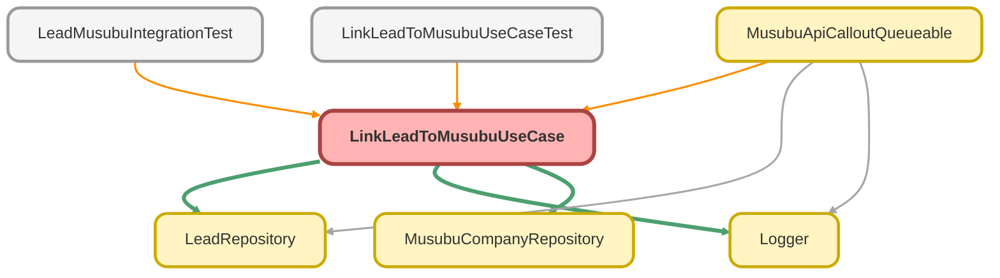

---
hide:
  - path
---

# LinkLeadToMusubuUseCase Class

リードと結ぶ法人情報を紐付けるユースケース

## Class Diagram



<!-- Apex description -->

## Apex Code

```java
/**
 * リードと結ぶ法人情報を紐付けるユースケース
 *
 * @description リードレコードに MusubuCompany__c レコードを関連付ける。
 *              法人番号またはリード ID をもとに紐付けを行う。
 */
public with sharing class LinkLeadToMusubuUseCase {

    private final LeadRepository leadRepo;
    private final MusubuCompanyRepository musubuCompanyRepo;

    /**
     * コンストラクタ
     */
    public LinkLeadToMusubuUseCase() {
        this(new LeadRepository(), new MusubuCompanyRepository());
    }

    /**
     * テスト用コンストラクタ（DI）
     *
     * @param leadRepo Lead リポジトリ
     * @param musubuCompanyRepo MusubuCompany リポジトリ
     */
    @TestVisible
    private LinkLeadToMusubuUseCase(LeadRepository leadRepo, MusubuCompanyRepository musubuCompanyRepo) {
        this.leadRepo = leadRepo;
        this.musubuCompanyRepo = musubuCompanyRepo;
    }

    /**
     * リードと結ぶ法人情報を紐付ける
     *
     * @param request 紐付けリクエスト
     * @return 紐付け結果
     */
    public LinkResult invoke(LinkRequest request) {
        Logger.info('LinkLeadToMusubuUseCase を開始します - leadId: ' + request.leadId + ', musubuCompanyId: ' + request.musubuCompanyId);

        try {
            // 1. リードを取得
            Lead lead = this.leadRepo.findLeadById(request.leadId);

            if (lead == null) {
                throw new LinkLeadException('リードが見つかりません');
            }

            // 2. 既に紐付いている場合はスキップ
            if (lead.MusubuCompanyId__c != null) {
                Logger.warn('リードは既に結ぶ法人情報に紐付いています - existingMusubuCompanyId: ' + lead.MusubuCompanyId__c);
                return new LinkResult(false, '既に紐付いています: ' + lead.MusubuCompanyId__c);
            }

            // 3. 結ぶ法人情報を取得
            MusubuCompany__c musubuCompany = this.musubuCompanyRepo.findCompanyById(request.musubuCompanyId);

            if (musubuCompany == null) {
                throw new LinkLeadException('結ぶ法人情報が見つかりません');
            }

            // 4. 紐付けを実行
            lead.MusubuCompanyId__c = musubuCompany.Id;
            if (String.isBlank(lead.CorporateNumber__c) && String.isNotBlank(musubuCompany.CorporateNumber__c)) {
                lead.CorporateNumber__c = musubuCompany.CorporateNumber__c;
            }

            update Security.stripInaccessible(AccessType.UPDATABLE, new List<Lead>{ lead }).getRecords();

            Logger.info('リードと結ぶ法人情報を紐付けました - leadId: ' + lead.Id);

            return new LinkResult(true, 'Success');

        } catch (QueryException e) {
            Logger.error('データ取得に失敗しました', e);
            throw new LinkLeadException('レコードが見つかりません', e);

        } catch (DmlException e) {
            Logger.error('更新に失敗しました', e);
            throw new LinkLeadException('リードの更新に失敗しました', e);

        } finally {
            Logger.saveLog();
        }
    }

    /**
     * 法人番号をもとにリードを紐付ける
     *
     * @param leadId リード ID
     * @param corporateNumber 法人番号
     * @return 紐付け結果
     */
    public LinkResult linkByCorporateNumber(Id leadId, String corporateNumber) {
        Logger.info('法人番号での紐付けを開始します - leadId: ' + leadId + ', corporateNumber: ' + corporateNumber);

        try {
            // 法人番号で結ぶ法人情報を検索
            MusubuCompany__c company = this.musubuCompanyRepo.findByCorporateNumber(corporateNumber);

            if (company == null) {
                Logger.warn('法人番号に一致する結ぶ法人情報が見つかりません');
                return new LinkResult(false, '該当する法人が見つかりません');
            }

            LinkRequest request = new LinkRequest();
            request.leadId = leadId;
            request.musubuCompanyId = company.Id;

            return invoke(request);

        } finally {
            Logger.saveLog();
        }
    }

    /**
     * 紐付けリクエスト
     */
    public class LinkRequest {
        public Id leadId;
        public Id musubuCompanyId;
    }

    /**
     * 紐付け結果
     */
    public class LinkResult {
        public Boolean success;
        public String message;

        public LinkResult(Boolean success, String message) {
            this.success = success;
            this.message = message;
        }
    }

    /**
     * 紐付けエラー例外
     */
    public class LinkLeadException extends Exception {}
}
```

## Fields
### `leadRepo`

#### Signature
```apex
private final leadRepo
```

#### Type
[LeadRepository](LeadRepository.md)

---

### `musubuCompanyRepo`

#### Signature
```apex
private final musubuCompanyRepo
```

#### Type
[MusubuCompanyRepository](MusubuCompanyRepository.md)

## Constructors
### `LinkLeadToMusubuUseCase()`

コンストラクタ

#### Signature
```apex
public LinkLeadToMusubuUseCase()
```

---

### `LinkLeadToMusubuUseCase(leadRepo, musubuCompanyRepo)`

`TESTVISIBLE`

テスト用コンストラクタ（DI）

#### Signature
```apex
private LinkLeadToMusubuUseCase(LeadRepository leadRepo, MusubuCompanyRepository musubuCompanyRepo)
```

#### Parameters
| Name | Type | Description |
|------|------|-------------|
| leadRepo | [LeadRepository](LeadRepository.md) | Lead リポジトリ |
| musubuCompanyRepo | [MusubuCompanyRepository](MusubuCompanyRepository.md) | MusubuCompany リポジトリ |

## Methods
### `invoke(request)`

リードと結ぶ法人情報を紐付ける

#### Signature
```apex
public LinkResult invoke(LinkRequest request)
```

#### Parameters
| Name | Type | Description |
|------|------|-------------|
| request | LinkRequest | 紐付けリクエスト |

#### Return Type
**LinkResult**

紐付け結果

---

### `linkByCorporateNumber(leadId, corporateNumber)`

法人番号をもとにリードを紐付ける

#### Signature
```apex
public LinkResult linkByCorporateNumber(Id leadId, String corporateNumber)
```

#### Parameters
| Name | Type | Description |
|------|------|-------------|
| leadId | Id | リード ID |
| corporateNumber | String | 法人番号 |

#### Return Type
**LinkResult**

紐付け結果

## Classes
### LinkRequest Class

紐付けリクエスト

#### Fields
##### `leadId`

###### Signature
```apex
public leadId
```

###### Type
Id

---

##### `musubuCompanyId`

###### Signature
```apex
public musubuCompanyId
```

###### Type
Id

### LinkResult Class

紐付け結果

#### Fields
##### `success`

###### Signature
```apex
public success
```

###### Type
Boolean

---

##### `message`

###### Signature
```apex
public message
```

###### Type
String

#### Constructors
##### `LinkResult(success, message)`

###### Signature
```apex
public LinkResult(Boolean success, String message)
```

###### Parameters
| Name | Type | Description |
|------|------|-------------|
| success | Boolean |  |
| message | String |  |

### LinkLeadException Class

紐付けエラー例外