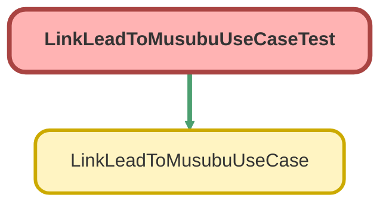

---
hide:
  - path
---

# LinkLeadToMusubuUseCaseTest Class

`ISTEST`

LinkLeadToMusubuUseCase のテストクラス

## Class Diagram



<!-- Apex description -->

## Apex Code

```java
/**
 * LinkLeadToMusubuUseCase のテストクラス
 *
 * @description リードと結ぶ法人情報の紐付け機能をテストする。
 */
@IsTest
private class LinkLeadToMusubuUseCaseTest {

    @TestSetup
    static void setup() {
        // テストデータを作成
        Lead testLead = new Lead(
            LastName = 'テストリード',
            Company = 'テスト株式会社',
            CorporateNumber__c = '1234567890123'
        );
        insert testLead;

        MusubuCompany__c testCompany = new MusubuCompany__c(
            Name = 'テスト株式会社',
            CorporateNumber__c = '1234567890123'
        );
        insert testCompany;
    }

    @IsTest
    static void testInvoke_Success() {
        // 準備
        Lead lead = [SELECT Id, MusubuCompanyId__c FROM Lead LIMIT 1];
        MusubuCompany__c company = [SELECT Id FROM MusubuCompany__c LIMIT 1];

        LinkLeadToMusubuUseCase.LinkRequest request = new LinkLeadToMusubuUseCase.LinkRequest();
        request.leadId = lead.Id;
        request.musubuCompanyId = company.Id;

        LinkLeadToMusubuUseCase useCase = new LinkLeadToMusubuUseCase();

        // 実行
        Test.startTest();
        LinkLeadToMusubuUseCase.LinkResult result = useCase.invoke(request);
        Test.stopTest();

        // 検証
        System.assertEquals(true, result.success, '紐付けが成功すること');
        System.assertEquals('Success', result.message, 'メッセージが正しいこと');

        Lead updatedLead = [SELECT Id, MusubuCompanyId__c FROM Lead WHERE Id = :lead.Id];
        System.assertEquals(company.Id, updatedLead.MusubuCompanyId__c, 'リードに結ぶ法人情報が紐付いていること');
    }

    @IsTest
    static void testInvoke_AlreadyLinked() {
        // 準備
        Lead lead = [SELECT Id FROM Lead LIMIT 1];
        MusubuCompany__c company = [SELECT Id FROM MusubuCompany__c LIMIT 1];

        // 先に紐付けておく
        lead.MusubuCompanyId__c = company.Id;
        update lead;

        LinkLeadToMusubuUseCase.LinkRequest request = new LinkLeadToMusubuUseCase.LinkRequest();
        request.leadId = lead.Id;
        request.musubuCompanyId = company.Id;

        LinkLeadToMusubuUseCase useCase = new LinkLeadToMusubuUseCase();

        // 実行
        Test.startTest();
        LinkLeadToMusubuUseCase.LinkResult result = useCase.invoke(request);
        Test.stopTest();

        // 検証
        System.assertEquals(false, result.success, '既に紐付いている場合は失敗すること');
        System.assert(result.message.contains('既に紐付いています'), 'メッセージに「既に紐付いています」が含まれること');
    }

    @IsTest
    static void testInvoke_LeadNotFound() {
        // 準備
        MusubuCompany__c company = [SELECT Id FROM MusubuCompany__c LIMIT 1];

        LinkLeadToMusubuUseCase.LinkRequest request = new LinkLeadToMusubuUseCase.LinkRequest();
        request.leadId = '00Q000000000000AAA'; // 存在しない ID
        request.musubuCompanyId = company.Id;

        LinkLeadToMusubuUseCase useCase = new LinkLeadToMusubuUseCase();

        // 実行
        Test.startTest();
        try {
            useCase.invoke(request);
            System.assert(false, '例外が発生すること');
        } catch (LinkLeadToMusubuUseCase.LinkLeadException e) {
            // 期待通り
            System.assert(e.getMessage().contains('リードが見つかりません') || e.getMessage().contains('レコードが見つかりません'), 'メッセージが正しいこと');
        }
        Test.stopTest();
    }

    @IsTest
    static void testLinkByCorporateNumber_Success() {
        // 準備
        Lead lead = [SELECT Id, MusubuCompanyId__c FROM Lead LIMIT 1];
        MusubuCompany__c company = [SELECT Id, CorporateNumber__c FROM MusubuCompany__c LIMIT 1];

        LinkLeadToMusubuUseCase useCase = new LinkLeadToMusubuUseCase();

        // 実行
        Test.startTest();
        LinkLeadToMusubuUseCase.LinkResult result = useCase.linkByCorporateNumber(lead.Id, company.CorporateNumber__c);
        Test.stopTest();

        // 検証
        System.assertEquals(true, result.success, '紐付けが成功すること');

        Lead updatedLead = [SELECT Id, MusubuCompanyId__c FROM Lead WHERE Id = :lead.Id];
        System.assertEquals(company.Id, updatedLead.MusubuCompanyId__c, 'リードに結ぶ法人情報が紐付いていること');
    }

    @IsTest
    static void testLinkByCorporateNumber_NotFound() {
        // 準備
        Lead lead = [SELECT Id FROM Lead LIMIT 1];

        LinkLeadToMusubuUseCase useCase = new LinkLeadToMusubuUseCase();

        // 実行
        Test.startTest();
        LinkLeadToMusubuUseCase.LinkResult result = useCase.linkByCorporateNumber(lead.Id, '9999999999999');
        Test.stopTest();

        // 検証
        System.assertEquals(false, result.success, '該当する法人が見つからない場合は失敗すること');
        System.assert(result.message.contains('該当する法人が見つかりません'), 'メッセージが正しいこと');
    }

    @IsTest
    static void testLinkRequest() {
        // LinkRequest クラスのテスト
        LinkLeadToMusubuUseCase.LinkRequest request = new LinkLeadToMusubuUseCase.LinkRequest();
        request.leadId = '00Q000000000000AAA';
        request.musubuCompanyId = 'a00000000000000AAA';

        System.assertNotEquals(null, request.leadId);
        System.assertNotEquals(null, request.musubuCompanyId);
    }

    @IsTest
    static void testLinkResult() {
        // LinkResult クラスのテスト
        LinkLeadToMusubuUseCase.LinkResult result = new LinkLeadToMusubuUseCase.LinkResult(true, 'Test Message');

        System.assertEquals(true, result.success);
        System.assertEquals('Test Message', result.message);
    }
}
```

## Methods
### `setup()`

`TESTSETUP`

#### Signature
```apex
private static void setup()
```

#### Return Type
**void**

---

### `testInvoke_Success()`

`ISTEST`

#### Signature
```apex
private static void testInvoke_Success()
```

#### Return Type
**void**

---

### `testInvoke_AlreadyLinked()`

`ISTEST`

#### Signature
```apex
private static void testInvoke_AlreadyLinked()
```

#### Return Type
**void**

---

### `testInvoke_LeadNotFound()`

`ISTEST`

#### Signature
```apex
private static void testInvoke_LeadNotFound()
```

#### Return Type
**void**

---

### `testLinkByCorporateNumber_Success()`

`ISTEST`

#### Signature
```apex
private static void testLinkByCorporateNumber_Success()
```

#### Return Type
**void**

---

### `testLinkByCorporateNumber_NotFound()`

`ISTEST`

#### Signature
```apex
private static void testLinkByCorporateNumber_NotFound()
```

#### Return Type
**void**

---

### `testLinkRequest()`

`ISTEST`

#### Signature
```apex
private static void testLinkRequest()
```

#### Return Type
**void**

---

### `testLinkResult()`

`ISTEST`

#### Signature
```apex
private static void testLinkResult()
```

#### Return Type
**void**