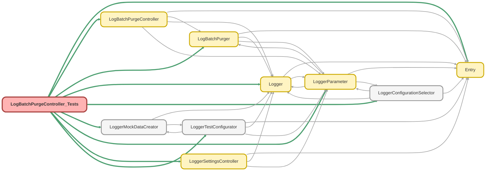

---
hide:
  - path
---

# LogBatchPurgeController_Tests Class

`SUPPRESSWARNINGS`
`ISTEST`

## Class Diagram



<!-- Apex description -->

## Apex Code

```java
//------------------------------------------------------------------------------------------------//
// This file is part of the Nebula Logger project, released under the MIT License.                //
// See LICENSE file or go to https://github.com/jongpie/NebulaLogger for full license details.    //
//------------------------------------------------------------------------------------------------//
@SuppressWarnings('PMD.ApexDoc, PMD.CognitiveComplexity, PMD.CyclomaticComplexity, PMD.ExcessiveParameterList, PMD.MethodNamingConventions')
@IsTest(IsParallel=false)
private class LogBatchPurgeController_Tests {
  private static final String CUSTOM_PURGE_ACTION = 'Custom';
  private static final String DEFAULT_PURGE_ACTION = 'Delete';
  private static final String CAN_EXECUTE_LOG_BATCH_PURGER_PERMISSION = 'CanExecuteLogBatchPurger';
  private static final Schema.Profile STANDARD_USER_PROFILE = [SELECT Id FROM Profile WHERE Name IN ('Standard User', 'Usuario estándar', '標準ユーザー')];

  static {
    // Don't use the org's actual custom metadata records when running tests
    LoggerConfigurationSelector.useMocks();
  }

  @IsTest
  static void it_should_return_logPurgeAction_options() {
    List<String> fakeLogPurgeActions = new List<String>{ 'A_FAKE_PURGE_ACTION', 'ANOTHER_ONE', 'SOME_OTHER_PURGE_ACTION' };
    for (String fakeLogPurgeAction : fakeLogPurgeActions) {
      LoggerTestConfigurator.setMock(
        new LoggerParameter__mdt(DeveloperName = LoggerSettingsController.CUSTOM_LOG_PURGE_ACTION_PREFIX + fakeLogPurgeAction, Value__c = fakeLogPurgeAction)
      );
    }

    List<LogBatchPurgeController.PicklistOption> picklistOptions = LogBatchPurgeController.getPurgeActionOptions();

    Set<String> expectedLogPurgeActions = new Set<String>{ LogBatchPurgeController.DELETE_LOG_PURGE_ACTION };
    expectedLogPurgeActions.addAll(fakeLogPurgeActions);
    Integer expectedLogPurgeActionsSize = expectedLogPurgeActions.size();
    System.Assert.areEqual(expectedLogPurgeActionsSize, picklistOptions.size(), 'Purge Action size mismatch');
    for (LogBatchPurgeController.PicklistOption picklistOption : picklistOptions) {
      System.Assert.areEqual(picklistOption.value, picklistOption.label, 'Purge action label mismatch');
      System.Assert.isTrue(expectedLogPurgeActions.contains(picklistOption.value), 'Purge Action not found');
    }
  }

  @IsTest
  private static void it_should_return_summary_for_logs_created_today() {
    Integer expectedRecordCountWithPurgeActionDelete = 5;
    Integer expectedRecordCountWithPurgeActionCustom = 4;
    createLogRecords('Delete', expectedRecordCountWithPurgeActionDelete, System.now());
    createLogRecords('Custom', expectedRecordCountWithPurgeActionCustom, System.now());

    List<AggregateResult> logObjectResult = LogBatchPurgeController.getLogObjectSummary('TODAY');

    Integer expectedAggregateResultSize = 2;
    System.Assert.areEqual(expectedAggregateResultSize, logObjectResult.size(), 'Log object summary size should match');
    for (AggregateResult summary : logObjectResult) {
      if (summary.get('LogPurgeAction__c') === DEFAULT_PURGE_ACTION) {
        System.Assert.areEqual(expectedRecordCountWithPurgeActionDelete, summary.get('expr0'), 'Log object summary should match for purge action : delete');
      }
      if (summary.get('LogPurgeAction__c') === CUSTOM_PURGE_ACTION) {
        System.Assert.areEqual(expectedRecordCountWithPurgeActionCustom, summary.get('expr0'), 'Log object summary should match for purge action : custom');
      }
    }
  }

  @IsTest
  private static void it_should_return_summary_for_logs_created_this_week() {
    Integer expectedRecordCountWithPurgeActionDelete = 5;
    Integer expectedRecordCountWithPurgeActionCustom = 4;
    Datetime createDate = DateTime.newInstance(Date.today().toStartOfWeek(), Datetime.now().time());
    createLogRecords('Delete', expectedRecordCountWithPurgeActionDelete, createDate);
    createLogRecords('Custom', expectedRecordCountWithPurgeActionCustom, createDate);

    List<AggregateResult> logObjectResult = LogBatchPurgeController.getLogObjectSummary('THIS_WEEK');

    Integer expectedAggregateResultSize = 2;
    System.Assert.areEqual(expectedAggregateResultSize, logObjectResult.size(), 'log summary size mismatch');
    for (AggregateResult summary : logObjectResult) {
      if (summary.get('LogPurgeAction__c') === DEFAULT_PURGE_ACTION) {
        System.Assert.areEqual(expectedRecordCountWithPurgeActionDelete, summary.get('expr0'), 'log object summary mismatch for purge action : delete');
      }
      if (summary.get('LogPurgeAction__c') === CUSTOM_PURGE_ACTION) {
        System.Assert.areEqual(expectedRecordCountWithPurgeActionCustom, summary.get('expr0'), 'log object summary mismatch for purge action : custom');
      }
    }
  }

  @IsTest
  private static void it_should_return_summary_for_logs_created_this_month() {
    Integer expectedRecordCountWithPurgeActionDelete = 5;
    Integer expectedRecordCountWithPurgeActionCustom = 4;
    Datetime createDate = DateTime.newInstance(Date.today().toStartOfMonth(), Datetime.now().time());
    createLogRecords('Delete', expectedRecordCountWithPurgeActionDelete, createDate);
    createLogRecords('Custom', expectedRecordCountWithPurgeActionCustom, createDate);

    List<AggregateResult> logObjectResult = LogBatchPurgeController.getLogObjectSummary('THIS_MONTH');

    Integer expectedAggregateResultSize = 2;
    System.Assert.areEqual(expectedAggregateResultSize, logObjectResult.size(), 'log summary size should match');
    for (AggregateResult summary : logObjectResult) {
      if (summary.get('LogPurgeAction__c') === DEFAULT_PURGE_ACTION) {
        System.Assert.areEqual(expectedRecordCountWithPurgeActionDelete, summary.get('expr0'), 'log object summary should match for purge action : delete');
      }
      if (summary.get('LogPurgeAction__c') === CUSTOM_PURGE_ACTION) {
        System.Assert.areEqual(expectedRecordCountWithPurgeActionCustom, summary.get('expr0'), 'log object summary should match for purge action : custom');
      }
    }
  }

  @IsTest
  private static void it_should_return_summary_for_logEntry_created_today() {
    Integer expectedRecordCountWithPurgeActionDelete = 5;
    Integer expectedRecordCountWithPurgeActionCustom = 4;
    createLogEntryRecords('Delete', expectedRecordCountWithPurgeActionDelete, System.now());
    createLogEntryRecords('Custom', expectedRecordCountWithPurgeActionCustom, System.now());
    List<AggregateResult> logObjectResult = LogBatchPurgeController.getLogEntryObjectSummary('TODAY');

    Integer expectedAggregateResultSize = 2;
    System.Assert.areEqual(expectedAggregateResultSize, logObjectResult.size(), 'log summary size should match');
    for (AggregateResult summary : logObjectResult) {
      if (summary.get('LogPurgeAction__c') === DEFAULT_PURGE_ACTION) {
        System.Assert.areEqual(expectedRecordCountWithPurgeActionDelete, summary.get('expr0'), 'log object summary should match for purge action : delete');
      }
      if (summary.get('LogPurgeAction__c') === CUSTOM_PURGE_ACTION) {
        System.Assert.areEqual(expectedRecordCountWithPurgeActionCustom, summary.get('expr0'), 'log object summary should match for purge action : custom');
      }
    }
  }

  @IsTest
  private static void it_should_return_summary_for_logEntry_created_this_week() {
    Integer expectedRecordCountWithPurgeActionDelete = 5;
    Integer expectedRecordCountWithPurgeActionCustom = 4;
    Datetime createDate = DateTime.newInstance(Date.today().toStartOfMonth(), Datetime.now().time());
    createLogEntryRecords('Delete', expectedRecordCountWithPurgeActionDelete, createDate);
    createLogEntryRecords('Custom', expectedRecordCountWithPurgeActionCustom, createDate);

    List<AggregateResult> logObjectResult = LogBatchPurgeController.getLogEntryObjectSummary('THIS_WEEK');

    Integer expectedAggregateResultSize = 2;
    System.Assert.areEqual(expectedAggregateResultSize, logObjectResult.size(), 'log summary size should match');
    for (AggregateResult summary : logObjectResult) {
      if (summary.get('LogPurgeAction__c') === DEFAULT_PURGE_ACTION) {
        System.Assert.areEqual(expectedRecordCountWithPurgeActionDelete, summary.get('expr0'), 'log object summary should match for purge action : delete');
      }
      if (summary.get('LogPurgeAction__c') === CUSTOM_PURGE_ACTION) {
        System.Assert.areEqual(expectedRecordCountWithPurgeActionCustom, summary.get('expr0'), 'log object summary should match for purge action : custom');
      }
    }
  }

  @IsTest
  private static void it_should_return_summary_for_logEntry_created_this_month() {
    Integer expectedRecordCountWithPurgeActionDelete = 5;
    Integer expectedRecordCountWithPurgeActionCustom = 4;
    Datetime createDate = DateTime.newInstance(Date.today().toStartOfMonth(), Datetime.now().time());
    createLogEntryRecords('Delete', expectedRecordCountWithPurgeActionDelete, createDate);
    createLogEntryRecords('Custom', expectedRecordCountWithPurgeActionCustom, createDate);

    List<AggregateResult> logObjectResult = LogBatchPurgeController.getLogEntryObjectSummary('THIS_MONTH');

    Integer expectedAggregateResultSize = 2;
    System.Assert.areEqual(expectedAggregateResultSize, logObjectResult.size(), 'log summary size should match');
    for (AggregateResult summary : logObjectResult) {
      if (summary.get('LogPurgeAction__c') === DEFAULT_PURGE_ACTION) {
        System.Assert.areEqual(expectedRecordCountWithPurgeActionDelete, summary.get('expr0'), 'log object summary should match for purge action : delete');
      }
      if (summary.get('LogPurgeAction__c') === CUSTOM_PURGE_ACTION) {
        System.Assert.areEqual(expectedRecordCountWithPurgeActionCustom, summary.get('expr0'), 'log object summary should match for purge action : custom');
      }
    }
  }

  @IsTest
  private static void it_should_return_summary_for_logEntryTag_created_today() {
    Integer expectedRecordCountWithPurgeActionDelete = 5;
    Integer expectedRecordCountWithPurgeActionCustom = 4;
    createLogEntryTagRecords('Delete', expectedRecordCountWithPurgeActionDelete, System.now());
    createLogEntryTagRecords('Custom', expectedRecordCountWithPurgeActionCustom, System.now());

    List<AggregateResult> logObjectResult = LogBatchPurgeController.getLogEntryTagObjectSummary('TODAY');

    Integer expectedAggregateResultSize = 2;
    System.Assert.areEqual(expectedAggregateResultSize, logObjectResult.size(), 'log summary size should match');
    for (AggregateResult summary : logObjectResult) {
      if (summary.get('LogPurgeAction__c') === DEFAULT_PURGE_ACTION) {
        System.Assert.areEqual(expectedRecordCountWithPurgeActionDelete, summary.get('expr0'), 'log object summary should match for purge action : delete');
      }
      if (summary.get('LogPurgeAction__c') === CUSTOM_PURGE_ACTION) {
        System.Assert.areEqual(expectedRecordCountWithPurgeActionCustom, summary.get('expr0'), 'log object summary should match for purge action : custom');
      }
    }
  }

  @IsTest
  private static void it_should_return_summary_for_logEntryTag_created_This_Week() {
    Integer expectedRecordCountWithPurgeActionDelete = 5;
    Integer expectedRecordCountWithPurgeActionCustom = 4;
    Datetime createDate = DateTime.newInstance(Date.today().toStartOfWeek(), Datetime.now().time());
    createLogEntryTagRecords('Delete', expectedRecordCountWithPurgeActionDelete, createDate);
    createLogEntryTagRecords('Custom', expectedRecordCountWithPurgeActionCustom, createDate);

    List<AggregateResult> logObjectResult = LogBatchPurgeController.getLogEntryTagObjectSummary('THIS_WEEK');

    Integer expectedAggregateResultSize = 2;
    System.Assert.areEqual(expectedAggregateResultSize, logObjectResult.size(), 'log summary size should match');
    for (AggregateResult summary : logObjectResult) {
      if (summary.get('LogPurgeAction__c') === DEFAULT_PURGE_ACTION) {
        System.Assert.areEqual(expectedRecordCountWithPurgeActionDelete, summary.get('expr0'), 'log object summary should match for purge action : delete');
      }
      if (summary.get('LogPurgeAction__c') === CUSTOM_PURGE_ACTION) {
        System.Assert.areEqual(expectedRecordCountWithPurgeActionCustom, summary.get('expr0'), 'log object summary should match for purge action : custom');
      }
    }
  }

  @IsTest
  private static void it_should_return_summary_for_logEntryTag_created_This_Month() {
    Integer expectedRecordCountWithPurgeActionDelete = 5;
    Integer expectedRecordCountWithPurgeActionCustom = 4;
    Datetime createDate = DateTime.newInstance(Date.today().toStartOfMonth(), Datetime.now().time());
    createLogEntryTagRecords('Delete', expectedRecordCountWithPurgeActionDelete, createDate);
    createLogEntryTagRecords('Custom', expectedRecordCountWithPurgeActionCustom, createDate);

    List<AggregateResult> logObjectResult = LogBatchPurgeController.getLogEntryTagObjectSummary('THIS_MONTH');

    Integer expectedAggregateResultSize = 2;
    System.Assert.areEqual(expectedAggregateResultSize, logObjectResult.size(), 'log summary size should match');
    for (AggregateResult summary : logObjectResult) {
      if (summary.get('LogPurgeAction__c') === DEFAULT_PURGE_ACTION) {
        System.Assert.areEqual(expectedRecordCountWithPurgeActionDelete, summary.get('expr0'), 'log object summary should match for purge action : delete');
      }
      if (summary.get('LogPurgeAction__c') === CUSTOM_PURGE_ACTION) {
        System.Assert.areEqual(expectedRecordCountWithPurgeActionCustom, summary.get('expr0'), 'log object summary should match for purge action : custom');
      }
    }
  }

  @IsTest
  private static void it_should_return_metrics_for_all_logObjects() {
    Integer expectedRecordCountWithPurgeActionDelete = 5;
    Integer expectedRecordCountWithPurgeActionCustom = 4;
    Datetime createDate = Datetime.now();
    createLogEntryTagRecords('Delete', expectedRecordCountWithPurgeActionDelete, createDate);
    createLogEntryTagRecords('Custom', expectedRecordCountWithPurgeActionCustom, createDate);

    Map<String, Object> metricsResult = LogBatchPurgeController.getMetrics('TODAY');

    List<AggregateResult> logObjectSummary = (List<AggregateResult>) metricsResult.get('Log__c');
    List<AggregateResult> logEntryObjectSummary = (List<AggregateResult>) metricsResult.get('LogEntry__c');
    List<AggregateResult> logEntryTagObjectSummary = (List<AggregateResult>) metricsResult.get('LogEntryTag__c');
    System.Assert.isNotNull(metricsResult.get('Log__c'), 'it should return metrics for Log__c object');
    System.Assert.isNotNull(metricsResult.get('LogEntry__c'), 'it should return metrics for LogEntry__c object');
    System.Assert.isNotNull(metricsResult.get('LogEntryTag__c'), 'it should return metrics for LogEntryTag__c object');
    System.Assert.areEqual(2, logObjectSummary.size(), 'it should return Log__c object summary records');
    System.Assert.areEqual(2, logEntryObjectSummary.size(), 'it should return LogEntry__c object summary records');
    System.Assert.areEqual(2, logEntryTagObjectSummary.size(), 'it should return LogEntry__c object summary records');
  }

  @IsTest
  static void it_should_permit_user_to_execute_purge_batch_when_custom_permission_is_assigned() {
    Schema.User standardUser = LoggerMockDataCreator.createUser(STANDARD_USER_PROFILE.Id);
    insert standardUser;
    Schema.PermissionSet permissionSet = new Schema.PermissionSet(Name = 'CanExecuteLogBatchPurger', Label = 'Custom Permisison Enabled');
    insert permissionSet;
    SetupEntityAccess setupEntityAccess = new SetupEntityAccess(ParentId = permissionSet.Id, SetupEntityId = getCanExecuteLogBatchPurgerCustomPermissionId());
    Schema.PermissionSetAssignment permissionSetAssignment = new Schema.PermissionSetAssignment(
      AssigneeId = standardUser.Id,
      PermissionSetId = permissionSet.Id
    );
    insert new List<SObject>{ setupEntityAccess, permissionSetAssignment };

    System.runAs(standardUser) {
      System.Assert.isTrue(
        System.FeatureManagement.checkPermission(CAN_EXECUTE_LOG_BATCH_PURGER_PERMISSION),
        System.JSON.serializePretty(permissionSetAssignment)
      );
      System.Assert.areEqual(
        true,
        LogBatchPurgeController.canUserRunLogBatchPurger(),
        'it did not allow user to execute purge batch when custom permission assigned'
      );
    }
  }

  @IsTest
  private static void it_should_return_purge_batch_job_records() {
    System.Test.startTest();
    LogBatchPurgeController.runBatchPurge();
    System.Test.stopTest();
    List<Schema.AsyncApexJob> purgeJobs = LogBatchPurgeController.getBatchPurgeJobRecords();
    System.Assert.areEqual(1, purgeJobs.size(), 'should return purge batch job records');
    for (Schema.AsyncApexJob job : purgeJobs) {
      System.Assert.isNotNull(job.JobType, 'it should return job type');
      System.Assert.isNotNull(job.JobItemsProcessed, 'it should return JobItemsProcessed');
      System.Assert.isNotNull(job.NumberOfErrors, 'it should return noOfErrors');
      System.Assert.isNotNull(job.Status, 'it should return JobStatus');
      System.Assert.isNotNull(job.CreatedDate, 'it should return job CreatedDate');
      System.Assert.isNotNull(job.CreatedBy.Name, 'it should return job CreatedBy.Name');
    }
  }

  @IsTest
  static void it_should_not_permit_user_to_execute_purge_batch_when_custom_permission_is_not_assigned() {
    Schema.User standardUser = LoggerMockDataCreator.createUser(STANDARD_USER_PROFILE.Id);
    insert standardUser;
    Schema.PermissionSet permissionSet = new Schema.PermissionSet(Name = 'CanExecuteLogBatchPurger', Label = 'Custom Permisison Enabled');
    insert permissionSet;
    SetupEntityAccess setupEntityAccess = new SetupEntityAccess(ParentId = permissionSet.Id, SetupEntityId = getCanExecuteLogBatchPurgerCustomPermissionId());
    insert new List<SObject>{ setupEntityAccess };

    System.runAs(standardUser) {
      System.Assert.isFalse(System.FeatureManagement.checkPermission(CAN_EXECUTE_LOG_BATCH_PURGER_PERMISSION), 'permission set assigned');
      System.Assert.areEqual(
        false,
        LogBatchPurgeController.canUserRunLogBatchPurger(),
        'it did allow user to execute purge batch when custom permission is not assigned'
      );
    }
  }

  @IsTest
  private static void it_should_execute_the_purge_batch() {
    System.Test.startTest();
    String jobId = LogBatchPurgeController.runBatchPurge();
    System.Test.stopTest();

    String apexClassNamespacePrefix = LogBatchPurger.class.getName().contains('.') ? LogBatchPurger.class.getName().substringBefore('.') : null;
    String apexClassName = LogBatchPurger.class.getName().contains('.') ? LogBatchPurger.class.getName().substringAfter('.') : LogBatchPurger.class.getName();
    List<Schema.AsyncApexJob> purgeBatchJobs = [
      SELECT Id
      FROM AsyncApexJob
      WHERE
        JobType IN ('ScheduledApex', 'BatchApex', 'BatchApexWorker')
        AND ApexClass.NamespacePrefix = :apexClassNamespacePrefix
        AND ApexClass.Name = :apexClassName
        AND Id = :jobId
    ];
    System.Assert.areEqual(1, purgeBatchJobs.size(), 'should execute the purge batch job');
  }

  private static void createLogRecords(String purgeAction, Integer noOfRecords, Datetime createDate) {
    List<Log__c> logs = new List<Log__c>();
    for (Integer i = 1; i <= noOfRecords; i++) {
      Log__c log = new Log__c(TransactionId__c = System.UUID.randomUUID().toString());
      log.LogPurgeAction__c = purgeAction;
      log.LogRetentionDate__c = System.today();
      logs.add(log);
    }
    insert logs;
    for (Log__c log : logs) {
      System.Test.setCreatedDate(log.Id, createDate);
    }
  }

  private static void createLogEntryRecords(String purgeAction, Integer noOfRecords, Datetime createDate) {
    Log__c log = new log__c(TransactionId__c = System.UUID.randomUUID().toString());
    log.LogPurgeAction__c = purgeAction;
    log.LogRetentionDate__c = System.today();
    insert log;
    List<LogEntry__c> logEntries = new List<LogEntry__c>();
    for (Integer i = 1; i <= noOfRecords; i++) {
      LogEntry__c logEntry = new LogEntry__c(Log__c = log.Id, TransactionEntryNumber__c = i + 1);

      LoggerMockDataCreator.createDataBuilder(logEntry).populateRequiredFields();
      logEntries.add(logEntry);
    }
    insert logEntries;
    for (LogEntry__c logEntry : logEntries) {
      System.Test.setCreatedDate(log.Id, createDate);
    }
  }

  private static void createLogEntryTagRecords(String purgeAction, Integer noOfRecords, Datetime createDate) {
    Log__c log = new log__c(TransactionId__c = System.UUID.randomUUID().toString());
    log.LogPurgeAction__c = purgeAction;
    log.LogRetentionDate__c = System.today();
    insert log;

    List<LogEntry__c> logEntries = new List<LogEntry__c>();
    for (Integer i = 0; i < noOfRecords; i++) {
      LogEntry__c logEntry = new LogEntry__c(Log__c = log.Id, LoggingLevel__c = System.LoggingLevel.INFO.name());
      LoggerMockDataCreator.createDataBuilder(logEntry).populateRequiredFields();
      logEntries.add(logEntry);
    }
    insert logEntries;

    String uniqueTagId = System.UUID.randomUUID().toString();
    LoggerTag__c tag = new LoggerTag__c(Name = uniqueTagId, UniqueId__c = uniqueTagId);
    LoggerMockDataCreator.createDataBuilder(tag).populateRequiredFields();
    insert tag;

    List<LogEntryTag__c> logEntryTags = new List<LogEntryTag__c>();
    for (LogEntry__c logEntry : logEntries) {
      LogEntryTag__c logEntryTag = new LogEntryTag__c(LogEntry__c = logEntry.Id, Tag__c = tag.Id);
      LoggerMockDataCreator.createDataBuilder(logEntryTag).populateRequiredFields();
      logEntryTags.add(logEntryTag);
    }
    insert logEntryTags;
    for (LogEntryTag__c logEntryTag : logEntryTags) {
      System.Test.setCreatedDate(logEntryTag.Id, createDate);
    }
  }

  private static Id getCanExecuteLogBatchPurgerCustomPermissionId() {
    String className = LogBatchPurgeController_Tests.class.getName();
    String namespacePrefix = className.contains('.') ? className.substringBefore('.') : null;
    return [SELECT Id FROM CustomPermission WHERE DeveloperName = :CAN_EXECUTE_LOG_BATCH_PURGER_PERMISSION AND NamespacePrefix = :namespacePrefix].Id;
  }
}
```

## Fields
### `CUSTOM_PURGE_ACTION`

#### Signature
```apex
private static final CUSTOM_PURGE_ACTION
```

#### Type
String

---

### `DEFAULT_PURGE_ACTION`

#### Signature
```apex
private static final DEFAULT_PURGE_ACTION
```

#### Type
String

---

### `CAN_EXECUTE_LOG_BATCH_PURGER_PERMISSION`

#### Signature
```apex
private static final CAN_EXECUTE_LOG_BATCH_PURGER_PERMISSION
```

#### Type
String

---

### `STANDARD_USER_PROFILE`

#### Signature
```apex
private static final STANDARD_USER_PROFILE
```

#### Type
Schema.Profile

## Methods
### `it_should_return_logPurgeAction_options()`

`ISTEST`

#### Signature
```apex
private static void it_should_return_logPurgeAction_options()
```

#### Return Type
**void**

---

### `it_should_return_summary_for_logs_created_today()`

`ISTEST`

#### Signature
```apex
private static void it_should_return_summary_for_logs_created_today()
```

#### Return Type
**void**

---

### `it_should_return_summary_for_logs_created_this_week()`

`ISTEST`

#### Signature
```apex
private static void it_should_return_summary_for_logs_created_this_week()
```

#### Return Type
**void**

---

### `it_should_return_summary_for_logs_created_this_month()`

`ISTEST`

#### Signature
```apex
private static void it_should_return_summary_for_logs_created_this_month()
```

#### Return Type
**void**

---

### `it_should_return_summary_for_logEntry_created_today()`

`ISTEST`

#### Signature
```apex
private static void it_should_return_summary_for_logEntry_created_today()
```

#### Return Type
**void**

---

### `it_should_return_summary_for_logEntry_created_this_week()`

`ISTEST`

#### Signature
```apex
private static void it_should_return_summary_for_logEntry_created_this_week()
```

#### Return Type
**void**

---

### `it_should_return_summary_for_logEntry_created_this_month()`

`ISTEST`

#### Signature
```apex
private static void it_should_return_summary_for_logEntry_created_this_month()
```

#### Return Type
**void**

---

### `it_should_return_summary_for_logEntryTag_created_today()`

`ISTEST`

#### Signature
```apex
private static void it_should_return_summary_for_logEntryTag_created_today()
```

#### Return Type
**void**

---

### `it_should_return_summary_for_logEntryTag_created_This_Week()`

`ISTEST`

#### Signature
```apex
private static void it_should_return_summary_for_logEntryTag_created_This_Week()
```

#### Return Type
**void**

---

### `it_should_return_summary_for_logEntryTag_created_This_Month()`

`ISTEST`

#### Signature
```apex
private static void it_should_return_summary_for_logEntryTag_created_This_Month()
```

#### Return Type
**void**

---

### `it_should_return_metrics_for_all_logObjects()`

`ISTEST`

#### Signature
```apex
private static void it_should_return_metrics_for_all_logObjects()
```

#### Return Type
**void**

---

### `it_should_permit_user_to_execute_purge_batch_when_custom_permission_is_assigned()`

`ISTEST`

#### Signature
```apex
private static void it_should_permit_user_to_execute_purge_batch_when_custom_permission_is_assigned()
```

#### Return Type
**void**

---

### `it_should_return_purge_batch_job_records()`

`ISTEST`

#### Signature
```apex
private static void it_should_return_purge_batch_job_records()
```

#### Return Type
**void**

---

### `it_should_not_permit_user_to_execute_purge_batch_when_custom_permission_is_not_assigned()`

`ISTEST`

#### Signature
```apex
private static void it_should_not_permit_user_to_execute_purge_batch_when_custom_permission_is_not_assigned()
```

#### Return Type
**void**

---

### `it_should_execute_the_purge_batch()`

`ISTEST`

#### Signature
```apex
private static void it_should_execute_the_purge_batch()
```

#### Return Type
**void**

---

### `createLogRecords(purgeAction, noOfRecords, createDate)`

#### Signature
```apex
private static void createLogRecords(String purgeAction, Integer noOfRecords, Datetime createDate)
```

#### Parameters
| Name | Type | Description |
|------|------|-------------|
| purgeAction | String |  |
| noOfRecords | Integer |  |
| createDate | Datetime |  |

#### Return Type
**void**

---

### `createLogEntryRecords(purgeAction, noOfRecords, createDate)`

#### Signature
```apex
private static void createLogEntryRecords(String purgeAction, Integer noOfRecords, Datetime createDate)
```

#### Parameters
| Name | Type | Description |
|------|------|-------------|
| purgeAction | String |  |
| noOfRecords | Integer |  |
| createDate | Datetime |  |

#### Return Type
**void**

---

### `createLogEntryTagRecords(purgeAction, noOfRecords, createDate)`

#### Signature
```apex
private static void createLogEntryTagRecords(String purgeAction, Integer noOfRecords, Datetime createDate)
```

#### Parameters
| Name | Type | Description |
|------|------|-------------|
| purgeAction | String |  |
| noOfRecords | Integer |  |
| createDate | Datetime |  |

#### Return Type
**void**

---

### `getCanExecuteLogBatchPurgerCustomPermissionId()`

#### Signature
```apex
private static Id getCanExecuteLogBatchPurgerCustomPermissionId()
```

#### Return Type
**Id**