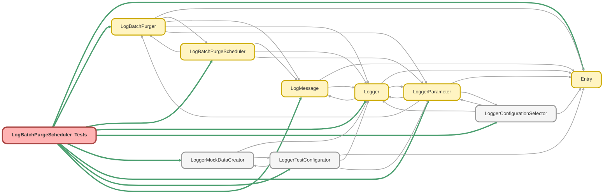

---
hide:
  - path
---

# LogBatchPurgeScheduler_Tests Class

`SUPPRESSWARNINGS`
`ISTEST`

## Class Diagram



<!-- Apex description -->

## Apex Code

```java
//------------------------------------------------------------------------------------------------//
// This file is part of the Nebula Logger project, released under the MIT License.                //
// See LICENSE file or go to https://github.com/jongpie/NebulaLogger for full license details.    //
//------------------------------------------------------------------------------------------------//

@SuppressWarnings('PMD.ApexDoc, PMD.CyclomaticComplexity, PMD.ExcessiveParameterList, PMD.MethodNamingConventions, PMD.NcssMethodCount')
@IsTest(IsParallel=true)
private class LogBatchPurgeScheduler_Tests {
  static {
    // Don't use the org's actual custom metadata records when running tests
    LoggerConfigurationSelector.useMocks();
  }

  @IsTest
  static void it_implements_system_schedulable_interface() {
    Object scheduler = new LogBatchPurgeScheduler();

    System.Assert.isInstanceOfType(scheduler, System.Schedulable.class);
  }

  @IsTest
  static void it_should_use_specified_batch_size_when_specified_batch_size_is_not_null() {
    Integer specifiedBatchSize = 123;

    LogBatchPurgeScheduler scheduler = new LogBatchPurgeScheduler(specifiedBatchSize);
    scheduler.execute(null);

    System.Assert.areEqual(specifiedBatchSize, scheduler.batchSize);
  }

  @IsTest
  static void it_should_use_default_batch_size_when_specified_batch_size_is_null() {
    Integer nullBatchSize = null;

    LogBatchPurgeScheduler scheduler = new LogBatchPurgeScheduler(nullBatchSize);
    scheduler.execute(null);

    System.Assert.areEqual(LogBatchPurger.getDefaultBatchSize(), scheduler.batchSize);
  }

  @IsTest
  static void it_should_execute_batch_job() {
    LoggerTestConfigurator.setMock(new LoggerParameter__mdt(DeveloperName = 'EnableLoggerSystemMessages', Value__c = String.valueOf(false)));
    Log__c log = (Log__c) LoggerMockDataCreator.createDataBuilder(Schema.Log__c.SObjectType).populateRequiredFields().getRecord();
    log.LogRetentionDate__c = System.today().addDays(-1);
    insert log;

    System.Test.startTest();
    new LogBatchPurgeScheduler().execute(null);
    System.Test.stopTest();

    List<Log__c> logs = [SELECT Id FROM Log__c];
    System.Assert.areEqual(0, logs.size());
  }

  @IsTest
  static void it_should_create_system_log_entry_when_enabled() {
    LoggerTestConfigurator.setMock(new LoggerParameter__mdt(DeveloperName = 'EnableLoggerSystemMessages', Value__c = String.valueOf(true)));
    Log__c log = (Log__c) LoggerMockDataCreator.createDataBuilder(Schema.Log__c.SObjectType).populateRequiredFields().getRecord();
    log.LogRetentionDate__c = System.today().addDays(-1);
    insert log;

    System.Test.startTest();
    new LogBatchPurgeScheduler().execute(null);
    System.Test.stopTest();

    List<Log__c> logs = [SELECT Id FROM Log__c];
    System.Assert.areEqual(1, logs.size());
    List<LogEntry__c> logEntries = [SELECT Id, Message__c FROM LogEntry__c];
    System.Assert.areNotEqual(0, logEntries.size());
    Boolean foundExpectedMessage = false;
    String expectedMessage = new LogMessage(LogBatchPurgeScheduler.SCHEDULER_SYSTEM_MESSAGE_TEMPLATE, (System.SchedulableContext) null).getMessage();
    for (LogEntry__c logEntry : logEntries) {
      if (logEntry.Message__c.contains(expectedMessage)) {
        foundExpectedMessage = true;
      }
    }
    System.Assert.isTrue(foundExpectedMessage, 'Expected system message not found');
  }
}
```

## Methods
### `it_implements_system_schedulable_interface()`

`ISTEST`

#### Signature
```apex
private static void it_implements_system_schedulable_interface()
```

#### Return Type
**void**

---

### `it_should_use_specified_batch_size_when_specified_batch_size_is_not_null()`

`ISTEST`

#### Signature
```apex
private static void it_should_use_specified_batch_size_when_specified_batch_size_is_not_null()
```

#### Return Type
**void**

---

### `it_should_use_default_batch_size_when_specified_batch_size_is_null()`

`ISTEST`

#### Signature
```apex
private static void it_should_use_default_batch_size_when_specified_batch_size_is_null()
```

#### Return Type
**void**

---

### `it_should_execute_batch_job()`

`ISTEST`

#### Signature
```apex
private static void it_should_execute_batch_job()
```

#### Return Type
**void**

---

### `it_should_create_system_log_entry_when_enabled()`

`ISTEST`

#### Signature
```apex
private static void it_should_create_system_log_entry_when_enabled()
```

#### Return Type
**void**