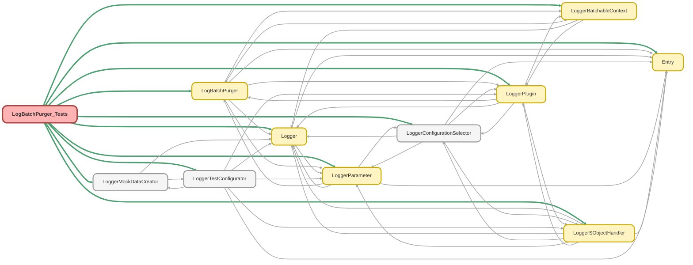

---
hide:
  - path
---

# LogBatchPurger_Tests Class

`SUPPRESSWARNINGS`
`ISTEST`

## Class Diagram



<!-- Apex description -->

## Apex Code

```java
//------------------------------------------------------------------------------------------------//
// This file is part of the Nebula Logger project, released under the MIT License.                //
// See LICENSE file or go to https://github.com/jongpie/NebulaLogger for full license details.    //
//------------------------------------------------------------------------------------------------//

@SuppressWarnings('PMD.ApexDoc, PMD.CyclomaticComplexity, PMD.ExcessiveParameterList, PMD.MethodNamingConventions, PMD.NcssMethodCount')
@IsTest(IsParallel=true)
private class LogBatchPurger_Tests {
  private static final Integer NUMBER_OF_LOG_ENTRIES_TO_CREATE = 3;

  private static Boolean ranPluginStart = false;
  private static Boolean ranPluginExecute = false;
  private static Boolean ranPluginFinish = false;
  private static LoggerPlugin__mdt pluginConfiguration;
  private static LoggerBatchableContext batchInput;
  private static List<SObject> pluginRecords;

  static {
    // Don't use the org's actual custom metadata records when running tests
    LoggerConfigurationSelector.useMocks();
  }

  @TestSetup
  static void setupData() {
    LoggerSObjectHandler.shouldExecute(false);
    LoggerSettings__c settings = Logger.getUserSettings();
    settings.IsEnabled__c = false;
    settings.LoggingLevel__c = System.LoggingLevel.FINEST.name();
    insert settings;

    Date scheduledDeletionDate = System.today().addDays(-7);
    Log__c log = new Log__c(LogRetentionDate__c = scheduledDeletionDate);
    LoggerMockDataCreator.createDataBuilder(log).populateRequiredFields().getRecord();
    insert log;

    List<LogEntry__c> logEntries = new List<LogEntry__c>();
    for (Integer i = 0; i < NUMBER_OF_LOG_ENTRIES_TO_CREATE; i++) {
      LogEntry__c logEntry = new LogEntry__c(Log__c = log.Id, LoggingLevel__c = System.LoggingLevel.INFO.name());
      LoggerMockDataCreator.createDataBuilder(logEntry).populateRequiredFields().getRecord();
      logEntries.add(logEntry);
    }
    insert logEntries;

    LoggerTag__c tag = (LoggerTag__c) LoggerMockDataCreator.createDataBuilder(Schema.LoggerTag__c.SObjectType).populateRequiredFields().getRecord();
    insert tag;

    List<LogEntryTag__c> logEntryTags = new List<LogEntryTag__c>();
    for (LogEntry__c logEntry : logEntries) {
      LogEntryTag__c logEntryTag = new LogEntryTag__c(LogEntry__c = logEntry.Id, Tag__c = tag.Id);
      LoggerMockDataCreator.createDataBuilder(logEntryTag).populateRequiredFields().getRecord();
      logEntryTags.add(logEntryTag);
    }
    insert logEntryTags;
  }

  @IsTest
  static void it_returns_configured_logger_parameter_value_for_the_default_batch_size() {
    Integer mockValue = 1234;
    LoggerParameter__mdt mockParameter = new LoggerParameter__mdt(
      DeveloperName = 'LogBatchPurgerDefaultBatchSize',
      Value__c = System.JSON.serialize(mockValue)
    );
    LoggerParameter.setMock(mockParameter);

    Integer returnedValue = LogBatchPurger.getDefaultBatchSize();

    System.Assert.areEqual(mockValue, returnedValue);
  }

  @IsTest
  static void it_should_throw_an_exception_when_data_cannot_be_purged() {
    LoggerTestConfigurator.setMock(new LoggerParameter__mdt(DeveloperName = 'EnableLoggerSystemMessages', Value__c = 'true'));
    LogBatchPurger batchJobInstance = new LogBatchPurger();
    batchJobInstance.currentSObjectType = Schema.Log__c.SObjectType;
    List<Log__c> nullLogsList = null;
    Database.BatchableContext mockBatchableContext = new LoggerMockDataCreator.MockBatchableContext();
    System.Exception thrownNullPointerException;

    try {
      batchJobInstance.execute(mockBatchableContext, nullLogsList);
    } catch (NullPointerException ex) {
      thrownNullPointerException = ex;
    }

    System.Assert.isNotNull(thrownNullPointerException);
  }

  @IsTest
  static void it_should_default_batch_size_for_chained_job_batch_size() {
    LogBatchPurger batchJobInstance = new LogBatchPurger();

    System.Assert.areEqual(LogBatchPurger.getDefaultBatchSize(), batchJobInstance.chainedBatchSize);
  }

  @IsTest
  static void it_should_set_chained_job_batch_size() {
    LogBatchPurger batchJobInstance = new LogBatchPurger();
    Integer specifiedBatchSize = 123;

    batchJobInstance.setChainedBatchSize(specifiedBatchSize);

    System.Assert.areEqual(specifiedBatchSize, batchJobInstance.chainedBatchSize);
  }

  @IsTest
  static void it_should_delete_a_log_after_scheduled_deletion_date_when_system_messages_enabled() {
    LoggerSettings__c settings = Logger.getUserSettings();
    settings.IsEnabled__c = true;
    settings.LoggingLevel__c = System.LoggingLevel.FINEST.name();
    upsert settings;
    LoggerTestConfigurator.setMock(new LoggerParameter__mdt(DeveloperName = 'EnableLoggerSystemMessages', Value__c = 'true'));
    System.Assert.isTrue(Logger.getUserSettings().IsEnabled__c);
    System.Assert.isTrue(LoggerParameter.getBoolean('EnableLoggerSystemMessages', null));
    System.Assert.areEqual(System.LoggingLevel.FINEST.name(), Logger.getUserSettings().LoggingLevel__c);
    List<Log__c> logs = [SELECT Id, LogRetentionDate__c FROM Log__c];
    List<LogEntry__c> logEntries = [SELECT Id FROM LogEntry__c];
    System.Assert.areEqual(1, logs.size());
    System.Assert.areEqual(NUMBER_OF_LOG_ENTRIES_TO_CREATE, logEntries.size());
    // Verify assumption that the log in the database has a deletion date in the past
    Log__c log = logs.get(0);
    System.Assert.isNotNull(log.LogRetentionDate__c);
    System.Assert.isTrue(log.LogRetentionDate__c < System.today());
    System.Test.startTest();
    LoggerSObjectHandler.shouldExecute(true);
    LoggerTestConfigurator.setupMockSObjectHandlerConfigurations();

    System.Database.executeBatch(new LogBatchPurger());

    System.Test.stopTest();
    logs = [SELECT Id FROM Log__c WHERE Id IN :logs];
    logEntries = [SELECT Id FROM LogEntry__c WHERE Id IN :logEntries];
    System.Assert.areEqual(0, logs.size(), System.JSON.serializePretty(logs));
    System.Assert.areEqual(0, logEntries.size(), System.JSON.serializePretty(logEntries));
  }

  @IsTest
  static void it_should_delete_a_log_after_scheduled_deletion_date_when_system_messages_disabled() {
    LoggerSettings__c settings = Logger.getUserSettings();
    settings.IsEnabled__c = true;
    upsert settings;
    LoggerTestConfigurator.setMock(new LoggerParameter__mdt(DeveloperName = 'EnableLoggerSystemMessages', Value__c = String.valueOf(false)));
    System.Assert.isTrue(Logger.getUserSettings().IsEnabled__c);
    System.Assert.isFalse(LoggerParameter.getBoolean('EnableLoggerSystemMessages', null));
    System.Assert.areEqual(System.LoggingLevel.FINEST.name(), Logger.getUserSettings().LoggingLevel__c);
    List<Log__c> logs = [SELECT Id, LogRetentionDate__c FROM Log__c];
    List<LogEntry__c> logEntries = [SELECT Id FROM LogEntry__c];
    System.Assert.areEqual(1, logs.size());
    System.Assert.areEqual(NUMBER_OF_LOG_ENTRIES_TO_CREATE, logEntries.size());
    // Verify assumption that the log in the database has a deletion date in the past
    Log__c log = logs.get(0);
    System.Assert.isNotNull(log.LogRetentionDate__c);
    System.Assert.isTrue(log.LogRetentionDate__c < System.today());
    System.Test.startTest();
    LoggerSObjectHandler.shouldExecute(false);
    LoggerTestConfigurator.setupMockSObjectHandlerConfigurations();

    System.Database.executeBatch(new LogBatchPurger());

    System.Test.stopTest();
    logs = [SELECT Id FROM Log__c WHERE Id IN :logs];
    logEntries = [SELECT Id FROM LogEntry__c WHERE Id IN :logEntries];
    System.Assert.areEqual(0, logs.size(), System.JSON.serializePretty(logs));
    System.Assert.areEqual(0, logEntries.size(), System.JSON.serializePretty(logEntries));
  }

  @IsTest
  static void it_should_not_delete_a_log_before_scheduled_deletion_date() {
    LoggerSObjectHandler.shouldExecute(false);
    List<Log__c> logs = [SELECT Id, LogRetentionDate__c FROM Log__c];
    List<LogEntry__c> logEntries = [SELECT Id FROM LogEntry__c];
    System.Assert.areEqual(1, logs.size());
    System.Assert.areEqual(NUMBER_OF_LOG_ENTRIES_TO_CREATE, logEntries.size());
    // Set the log's deletion date to be in the future
    Log__c log = logs.get(0);
    log.LogRetentionDate__c = System.today().addDays(7);
    update log;
    log = [SELECT Id, LogRetentionDate__c FROM Log__c];
    System.Assert.isTrue(log.LogRetentionDate__c > System.today());
    System.Test.startTest();
    LoggerSObjectHandler.shouldExecute(false);
    LoggerTestConfigurator.setupMockSObjectHandlerConfigurations();

    System.Database.executeBatch(new LogBatchPurger());

    System.Test.stopTest();
    logs = [SELECT Id FROM Log__c WHERE Id IN :logs];
    logEntries = [SELECT Id FROM LogEntry__c WHERE Id IN :logEntries];
    System.Assert.areEqual(1, logs.size());
    System.Assert.areEqual(NUMBER_OF_LOG_ENTRIES_TO_CREATE, logEntries.size());
  }

  @IsTest
  static void it_should_not_delete_a_log_without_a_scheduled_deletion_date_and_with_log_entries() {
    LoggerSObjectHandler.shouldExecute(false);
    List<Log__c> logs = [SELECT Id, TotalLogEntries__c, LogRetentionDate__c FROM Log__c];
    List<LogEntry__c> logEntries = [SELECT Id FROM LogEntry__c];
    System.Assert.areEqual(1, logs.size());
    System.Assert.areEqual(NUMBER_OF_LOG_ENTRIES_TO_CREATE, logs.get(0).TotalLogEntries__c);
    System.Assert.areEqual(NUMBER_OF_LOG_ENTRIES_TO_CREATE, logEntries.size());
    // Set the log's deletion date to be null
    Log__c log = logs.get(0);
    log.LogRetentionDate__c = null;
    update log;
    log = [SELECT Id, LogRetentionDate__c FROM Log__c];
    System.Assert.isNull(log.LogRetentionDate__c);
    System.Test.startTest();
    LoggerSObjectHandler.shouldExecute(false);
    LoggerTestConfigurator.setupMockSObjectHandlerConfigurations();

    System.Database.executeBatch(new LogBatchPurger());

    System.Test.stopTest();
    logs = [SELECT Id FROM Log__c WHERE Id IN :logs];
    logEntries = [SELECT Id FROM LogEntry__c WHERE Id IN :logEntries];
    System.Assert.areEqual(1, logs.size(), System.JSON.serializePretty(logs));
    System.Assert.areEqual(NUMBER_OF_LOG_ENTRIES_TO_CREATE, logEntries.size(), System.JSON.serializePretty(logEntries));
  }

  @IsTest
  static void it_should_delete_a_log_with_a_scheduled_deletion_date_and_without_log_entries() {
    LoggerSObjectHandler.shouldExecute(false);
    Date retentionDate = System.today().addDays(-1);
    Log__c log = new Log__c(TransactionId__c = '5678');
    insert log;
    log.LogRetentionDate__c = retentionDate;
    update log;
    log = [SELECT Id, LogRetentionDate__c, TotalLogEntries__c FROM Log__c WHERE Id = :log.Id];
    System.Assert.areEqual(retentionDate, log.LogRetentionDate__c, 'Log should not have a retention date');
    System.Assert.areEqual(0, log.TotalLogEntries__c, 'Log should not have any related log entries');
    System.Test.startTest();
    LoggerSObjectHandler.shouldExecute(false);
    LoggerTestConfigurator.setupMockSObjectHandlerConfigurations();

    System.Database.executeBatch(new LogBatchPurger());

    System.Test.stopTest();
    List<Log__c> matchingLogs = [SELECT Id FROM Log__c WHERE Id = :log.Id];
    System.Assert.areEqual(0, matchingLogs.size(), 'Test log should have been deleted');
  }

  @IsTest
  static void it_should_delete_a_log_without_a_scheduled_deletion_date_and_without_log_entries() {
    LoggerSObjectHandler.shouldExecute(false);
    Log__c log = new Log__c(TransactionId__c = '5678');
    insert log;
    log.LogRetentionDate__c = null;
    update log;
    log = [SELECT Id, LogRetentionDate__c, TotalLogEntries__c FROM Log__c WHERE Id = :log.Id];
    System.Assert.isNull(log.LogRetentionDate__c, 'Log should not have a retention date');
    System.Assert.areEqual(0, log.TotalLogEntries__c, 'Log should not have any related log entries');
    System.Test.startTest();
    LoggerSObjectHandler.shouldExecute(false);
    LoggerTestConfigurator.setupMockSObjectHandlerConfigurations();

    System.Database.executeBatch(new LogBatchPurger());

    System.Test.stopTest();
    List<Log__c> matchingLogs = [SELECT Id FROM Log__c WHERE Id = :log.Id];
    System.Assert.areEqual(0, matchingLogs.size(), 'Test log should have been deleted');
  }

  @IsTest
  static void it_should_run_apex_plugin_in_start_method() {
    LoggerSObjectHandler.shouldExecute(false);
    LoggerTestConfigurator.setupMockSObjectHandlerConfigurations();
    LoggerPlugin__mdt mockPluginConfiguration = new LoggerPlugin__mdt(
      DeveloperName = 'Mock_Plugin',
      IsEnabled__c = true,
      BatchPurgerApexClass__c = MockBatchPurgerPlugin.class.getName()
    );
    LoggerTestConfigurator.setMock(mockPluginConfiguration);
    LogBatchPurger batchJobInstance = new LogBatchPurger();
    batchJobInstance.currentSObjectType = Schema.LogEntry__c.SObjectType;
    System.Assert.isFalse(ranPluginStart);
    System.Assert.isFalse(ranPluginExecute);
    System.Assert.isFalse(ranPluginFinish);
    System.Assert.isNull(pluginConfiguration);
    System.Assert.isNull(batchInput);
    Database.BatchableContext mockBatchableContext = new LoggerMockDataCreator.MockBatchableContext();

    batchJobInstance.start(mockBatchableContext);

    LoggerBatchableContext expectedInput = new LoggerBatchableContext(mockBatchableContext, batchJobInstance.currentSObjectType);
    System.Assert.areEqual(
      3,
      batchJobInstance.getExecutedApexPlugins().size(),
      'The map of executed Apex plugins should have 3 keys - one for each enum value in LogBatchPurger.BatchableMethod (START, EXECUTE, and FINISH)'
    );
    System.Assert.areEqual(
      1,
      batchJobInstance.getExecutedApexPlugins().get(LogBatchPurger.BatchableMethod.START).size(),
      'One Apex plugin should have run in the batch job\'s start method'
    );
    System.Assert.areEqual(
      0,
      batchJobInstance.getExecutedApexPlugins().get(LogBatchPurger.BatchableMethod.EXECUTE).size(),
      'No Apex plugins should have run in the batch job\'s execute method'
    );
    System.Assert.areEqual(
      0,
      batchJobInstance.getExecutedApexPlugins().get(LogBatchPurger.BatchableMethod.FINISH).size(),
      'No Apex plugins should have run in the batch job\'s finish method'
    );
    LoggerPlugin.Batchable apexStartPlugin = batchJobInstance.getExecutedApexPlugins().get(LogBatchPurger.BatchableMethod.START).get(0);
    System.Assert.isInstanceOfType(apexStartPlugin, MockBatchPurgerPlugin.class, System.JSON.serializePretty(apexStartPlugin));
    System.Assert.isTrue(ranPluginStart);
    System.Assert.isFalse(ranPluginExecute);
    System.Assert.isFalse(ranPluginFinish);
    System.Assert.areEqual(mockPluginConfiguration, pluginConfiguration);
    System.Assert.areEqual(expectedInput.batchableContext, batchInput.batchableContext);
    System.Assert.areEqual(expectedInput.sobjectType, batchInput.sobjectType);
  }

  @IsTest
  static void it_should_run_apex_plugin_in_execute_method() {
    LoggerSObjectHandler.shouldExecute(false);
    LoggerPlugin__mdt mockPluginConfiguration = new LoggerPlugin__mdt(
      DeveloperName = 'Mock_Plugin',
      IsEnabled__c = true,
      BatchPurgerApexClass__c = MockBatchPurgerPlugin.class.getName()
    );
    LoggerTestConfigurator.setMock(mockPluginConfiguration);
    LogBatchPurger batchJobInstance = new LogBatchPurger();
    batchJobInstance.currentSObjectType = Schema.LogEntry__c.SObjectType;
    System.Assert.isFalse(ranPluginStart);
    System.Assert.isFalse(ranPluginExecute);
    System.Assert.isFalse(ranPluginFinish);
    System.Assert.isNull(pluginConfiguration);
    System.Assert.isNull(batchInput);
    List<Log__c> logsToDelete = [SELECT Id FROM Log__c];
    System.Assert.areNotEqual(0, logsToDelete.size());
    Database.BatchableContext mockBatchableContext = new LoggerMockDataCreator.MockBatchableContext();

    batchJobInstance.execute(mockBatchableContext, logsToDelete);

    LoggerBatchableContext expectedInput = new LoggerBatchableContext(mockBatchableContext, batchJobInstance.currentSObjectType);
    System.Assert.areEqual(
      3,
      batchJobInstance.getExecutedApexPlugins().size(),
      'The map of executed Apex plugins should have 3 keys - one for each enum value in LogBatchPurger.BatchableMethod (START, EXECUTE, and FINISH)'
    );
    System.Assert.areEqual(
      0,
      batchJobInstance.getExecutedApexPlugins().get(LogBatchPurger.BatchableMethod.START).size(),
      'No Apex plugins should have run in the batch job\'s start method'
    );
    System.Assert.areEqual(
      1,
      batchJobInstance.getExecutedApexPlugins().get(LogBatchPurger.BatchableMethod.EXECUTE).size(),
      'One Apex plugin should have run in the batch job\'s execute method'
    );
    System.Assert.areEqual(
      0,
      batchJobInstance.getExecutedApexPlugins().get(LogBatchPurger.BatchableMethod.FINISH).size(),
      'No Apex plugins should have run in the batch job\'s finish method'
    );
    LoggerPlugin.Batchable apexExecutePlugin = batchJobInstance.getExecutedApexPlugins().get(LogBatchPurger.BatchableMethod.EXECUTE).get(0);
    System.Assert.isInstanceOfType(apexExecutePlugin, MockBatchPurgerPlugin.class, System.JSON.serializePretty(apexExecutePlugin));
    System.Assert.isFalse(ranPluginStart);
    System.Assert.isTrue(ranPluginExecute);
    System.Assert.isFalse(ranPluginFinish);
    System.Assert.areEqual(mockPluginConfiguration, pluginConfiguration);
    System.Assert.areEqual(expectedInput.batchableContext, batchInput.batchableContext);
    logsToDelete = [SELECT Id FROM Log__c WHERE Id IN :logsToDelete];
    System.Assert.areEqual(0, logsToDelete.size(), 'All logs should have still been deleted by LogBatchPurger after running plugins: ' + logsToDelete);
  }

  @IsTest
  static void it_should_run_apex_plugin_in_finish_method() {
    LoggerSObjectHandler.shouldExecute(false);
    LoggerPlugin__mdt mockPluginConfiguration = new LoggerPlugin__mdt(
      DeveloperName = 'Mock_Plugin',
      IsEnabled__c = true,
      BatchPurgerApexClass__c = MockBatchPurgerPlugin.class.getName()
    );
    LoggerTestConfigurator.setMock(mockPluginConfiguration);
    LogBatchPurger batchJobInstance = new LogBatchPurger();
    batchJobInstance.currentSObjectType = Schema.LogEntry__c.SObjectType;
    System.Assert.isFalse(ranPluginStart);
    System.Assert.isFalse(ranPluginExecute);
    System.Assert.isFalse(ranPluginFinish);
    System.Assert.isNull(pluginConfiguration);
    System.Assert.isNull(batchInput);
    Database.BatchableContext mockBatchableContext = new LoggerMockDataCreator.MockBatchableContext();

    batchJobInstance.finish(mockBatchableContext);

    LoggerBatchableContext expectedInput = new LoggerBatchableContext(mockBatchableContext, batchJobInstance.currentSObjectType);
    System.Assert.areEqual(
      3,
      batchJobInstance.getExecutedApexPlugins().size(),
      'The map of executed Apex plugins should have 3 keys - one for each enum value in LogBatchPurger.BatchableMethod (START, EXECUTE, and FINISH)'
    );
    System.Assert.areEqual(
      0,
      batchJobInstance.getExecutedApexPlugins().get(LogBatchPurger.BatchableMethod.START).size(),
      'No Apex plugins should have run in the batch job\'s start method'
    );
    System.Assert.areEqual(
      0,
      batchJobInstance.getExecutedApexPlugins().get(LogBatchPurger.BatchableMethod.EXECUTE).size(),
      'No Apex plugins should have run in the batch job\'s execute method'
    );
    System.Assert.areEqual(
      1,
      batchJobInstance.getExecutedApexPlugins().get(LogBatchPurger.BatchableMethod.FINISH).size(),
      'One Apex plugin should have run in the batch job\'s finish method'
    );
    LoggerPlugin.Batchable apexFinishPlugin = batchJobInstance.getExecutedApexPlugins().get(LogBatchPurger.BatchableMethod.FINISH).get(0);
    System.Assert.isInstanceOfType(apexFinishPlugin, MockBatchPurgerPlugin.class, System.JSON.serializePretty(apexFinishPlugin));
    System.Assert.isFalse(ranPluginStart);
    System.Assert.isFalse(ranPluginExecute);
    System.Assert.isTrue(ranPluginFinish);
    System.Assert.areEqual(mockPluginConfiguration, pluginConfiguration);
    System.Assert.areEqual(expectedInput.sobjectType, batchInput.sobjectType);
  }

  public class MockBatchPurgerPlugin implements LoggerPlugin.Batchable {
    public void start(LoggerPlugin__mdt configuration, LoggerBatchableContext input) {
      ranPluginStart = true;
      pluginConfiguration = configuration;
      batchInput = input;
    }

    public void execute(LoggerPlugin__mdt configuration, LoggerBatchableContext input, List<SObject> scope) {
      ranPluginExecute = true;
      pluginConfiguration = configuration;
      batchInput = input;
      pluginRecords = scope;
    }

    public void finish(LoggerPlugin__mdt configuration, LoggerBatchableContext input) {
      ranPluginFinish = true;
      pluginConfiguration = configuration;
      batchInput = input;
    }
  }
}
```

## Fields
### `NUMBER_OF_LOG_ENTRIES_TO_CREATE`

#### Signature
```apex
private static final NUMBER_OF_LOG_ENTRIES_TO_CREATE
```

#### Type
Integer

---

### `ranPluginStart`

#### Signature
```apex
private static ranPluginStart
```

#### Type
Boolean

---

### `ranPluginExecute`

#### Signature
```apex
private static ranPluginExecute
```

#### Type
Boolean

---

### `ranPluginFinish`

#### Signature
```apex
private static ranPluginFinish
```

#### Type
Boolean

---

### `pluginConfiguration`

#### Signature
```apex
private static pluginConfiguration
```

#### Type
LoggerPlugin__mdt

---

### `batchInput`

#### Signature
```apex
private static batchInput
```

#### Type
[LoggerBatchableContext](../configuration/LoggerBatchableContext.md)

---

### `pluginRecords`

#### Signature
```apex
private static pluginRecords
```

#### Type
List<SObject>

## Methods
### `setupData()`

`TESTSETUP`

#### Signature
```apex
private static void setupData()
```

#### Return Type
**void**

---

### `it_returns_configured_logger_parameter_value_for_the_default_batch_size()`

`ISTEST`

#### Signature
```apex
private static void it_returns_configured_logger_parameter_value_for_the_default_batch_size()
```

#### Return Type
**void**

---

### `it_should_throw_an_exception_when_data_cannot_be_purged()`

`ISTEST`

#### Signature
```apex
private static void it_should_throw_an_exception_when_data_cannot_be_purged()
```

#### Return Type
**void**

---

### `it_should_default_batch_size_for_chained_job_batch_size()`

`ISTEST`

#### Signature
```apex
private static void it_should_default_batch_size_for_chained_job_batch_size()
```

#### Return Type
**void**

---

### `it_should_set_chained_job_batch_size()`

`ISTEST`

#### Signature
```apex
private static void it_should_set_chained_job_batch_size()
```

#### Return Type
**void**

---

### `it_should_delete_a_log_after_scheduled_deletion_date_when_system_messages_enabled()`

`ISTEST`

#### Signature
```apex
private static void it_should_delete_a_log_after_scheduled_deletion_date_when_system_messages_enabled()
```

#### Return Type
**void**

---

### `it_should_delete_a_log_after_scheduled_deletion_date_when_system_messages_disabled()`

`ISTEST`

#### Signature
```apex
private static void it_should_delete_a_log_after_scheduled_deletion_date_when_system_messages_disabled()
```

#### Return Type
**void**

---

### `it_should_not_delete_a_log_before_scheduled_deletion_date()`

`ISTEST`

#### Signature
```apex
private static void it_should_not_delete_a_log_before_scheduled_deletion_date()
```

#### Return Type
**void**

---

### `it_should_not_delete_a_log_without_a_scheduled_deletion_date_and_with_log_entries()`

`ISTEST`

#### Signature
```apex
private static void it_should_not_delete_a_log_without_a_scheduled_deletion_date_and_with_log_entries()
```

#### Return Type
**void**

---

### `it_should_delete_a_log_with_a_scheduled_deletion_date_and_without_log_entries()`

`ISTEST`

#### Signature
```apex
private static void it_should_delete_a_log_with_a_scheduled_deletion_date_and_without_log_entries()
```

#### Return Type
**void**

---

### `it_should_delete_a_log_without_a_scheduled_deletion_date_and_without_log_entries()`

`ISTEST`

#### Signature
```apex
private static void it_should_delete_a_log_without_a_scheduled_deletion_date_and_without_log_entries()
```

#### Return Type
**void**

---

### `it_should_run_apex_plugin_in_start_method()`

`ISTEST`

#### Signature
```apex
private static void it_should_run_apex_plugin_in_start_method()
```

#### Return Type
**void**

---

### `it_should_run_apex_plugin_in_execute_method()`

`ISTEST`

#### Signature
```apex
private static void it_should_run_apex_plugin_in_execute_method()
```

#### Return Type
**void**

---

### `it_should_run_apex_plugin_in_finish_method()`

`ISTEST`

#### Signature
```apex
private static void it_should_run_apex_plugin_in_finish_method()
```

#### Return Type
**void**

## Classes
### MockBatchPurgerPlugin Class

**Implements**

LoggerPlugin.Batchable

#### Methods
##### `start(configuration, input)`

###### Signature
```apex
public void start(LoggerPlugin__mdt configuration, LoggerBatchableContext input)
```

###### Parameters
| Name | Type | Description |
|------|------|-------------|
| configuration | LoggerPlugin__mdt |  |
| input | [LoggerBatchableContext](../configuration/LoggerBatchableContext.md) |  |

###### Return Type
**void**

---

##### `execute(configuration, input, scope)`

###### Signature
```apex
public void execute(LoggerPlugin__mdt configuration, LoggerBatchableContext input, List<SObject> scope)
```

###### Parameters
| Name | Type | Description |
|------|------|-------------|
| configuration | LoggerPlugin__mdt |  |
| input | [LoggerBatchableContext](../configuration/LoggerBatchableContext.md) |  |
| scope | List<SObject> |  |

###### Return Type
**void**

---

##### `finish(configuration, input)`

###### Signature
```apex
public void finish(LoggerPlugin__mdt configuration, LoggerBatchableContext input)
```

###### Parameters
| Name | Type | Description |
|------|------|-------------|
| configuration | LoggerPlugin__mdt |  |
| input | [LoggerBatchableContext](../configuration/LoggerBatchableContext.md) |  |

###### Return Type
**void**