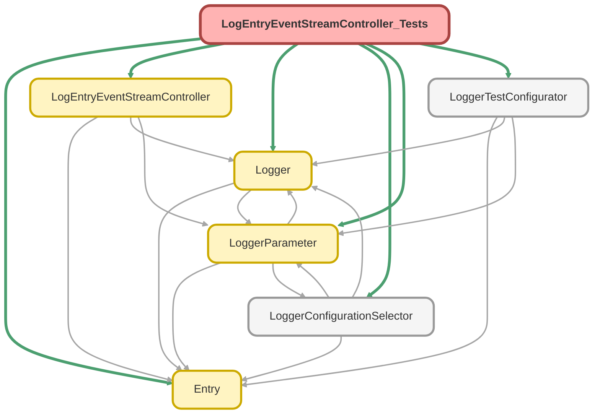

---
hide:
  - path
---

# LogEntryEventStreamController_Tests Class

`SUPPRESSWARNINGS`
`ISTEST`

## Class Diagram



<!-- Apex description -->

## Apex Code

```java
//------------------------------------------------------------------------------------------------//
// This file is part of the Nebula Logger project, released under the MIT License.                //
// See LICENSE file or go to https://github.com/jongpie/NebulaLogger for full license details.    //
//------------------------------------------------------------------------------------------------//

@SuppressWarnings('PMD.ApexDoc, PMD.CyclomaticComplexity, PMD.ExcessiveParameterList, PMD.MethodNamingConventions, PMD.NcssMethodCount')
@IsTest
private class LogEntryEventStreamController_Tests {
  static {
    // Don't use the org's actual custom metadata records when running tests
    LoggerConfigurationSelector.useMocks();
  }

  @IsTest
  static void it_should_return_is_enabled_parameter() {
    Boolean mockValue = false;
    LoggerParameter__mdt mockParameter = new LoggerParameter__mdt(DeveloperName = 'EnableLogEntryEventStream', Value__c = System.JSON.serialize(mockValue));
    LoggerParameter.setMock(mockParameter);

    Boolean returnedValue = LogEntryEventStreamController.isEnabled();

    System.Assert.areEqual(mockValue, returnedValue);
  }

  @IsTest
  static void it_should_return_list_of_fields_configured_in_logger_parameters() {
    String fields = '["Timestamp__c", "LoggedByUsername__c", "OriginLocation__c"]';
    LoggerTestConfigurator.setMock(new LoggerParameter__mdt(DeveloperName = LogEntryEventStreamController.DISPLAY_FIELDS_PARAMETER_NAME, Value__c = fields));
    List<String> mockDisplayFields = (List<String>) System.JSON.deserialize(fields, List<String>.class);
    List<String> displayFields = LogEntryEventStreamController.getDatatableDisplayFields();

    System.Assert.areEqual(mockDisplayFields.size(), displayFields.size(), 'fields count mismatch');
    for (String fieldName : mockDisplayFields) {
      System.Assert.areEqual(true, displayFields.contains(fieldName), 'field not found: ' + fieldName);
    }
  }

  @IsTest
  static void it_should_return_default_fields_when_list_of_fields_not_configured_in_logger_parameters() {
    List<String> displayFields = LogEntryEventStreamController.getDatatableDisplayFields();

    System.Assert.areEqual(LogEntryEventStreamController.DEFAULT_DISPLAY_FIELDS.size(), displayFields.size(), 'fields count mismatch');
    for (String fieldName : LogEntryEventStreamController.DEFAULT_DISPLAY_FIELDS) {
      System.Assert.isTrue(displayFields.contains(fieldName), 'field not found: ' + fieldName);
    }
  }
}
```

## Methods
### `it_should_return_is_enabled_parameter()`

`ISTEST`

#### Signature
```apex
private static void it_should_return_is_enabled_parameter()
```

#### Return Type
**void**

---

### `it_should_return_list_of_fields_configured_in_logger_parameters()`

`ISTEST`

#### Signature
```apex
private static void it_should_return_list_of_fields_configured_in_logger_parameters()
```

#### Return Type
**void**

---

### `it_should_return_default_fields_when_list_of_fields_not_configured_in_logger_parameters()`

`ISTEST`

#### Signature
```apex
private static void it_should_return_default_fields_when_list_of_fields_not_configured_in_logger_parameters()
```

#### Return Type
**void**