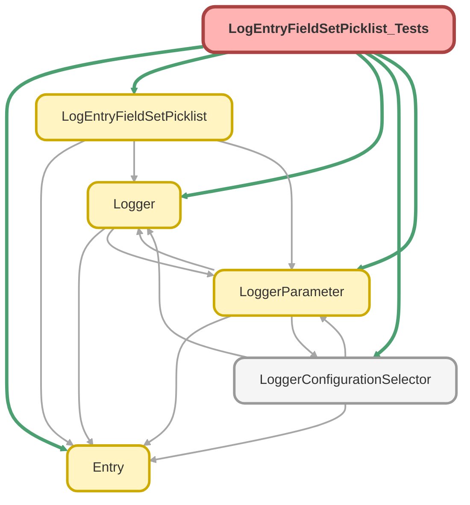

---
hide:
  - path
---

# LogEntryFieldSetPicklist_Tests Class

`SUPPRESSWARNINGS`
`ISTEST`

## Class Diagram



<!-- Apex description -->

## Apex Code

```java
//------------------------------------------------------------------------------------------------//
// This file is part of the Nebula Logger project, released under the MIT License.                //
// See LICENSE file or go to https://github.com/jongpie/NebulaLogger for full license details.    //
//------------------------------------------------------------------------------------------------//

@SuppressWarnings('PMD.ApexDoc, PMD.MethodNamingConventions')
@IsTest(IsParallel=true)
private class LogEntryFieldSetPicklist_Tests {
  static {
    // Don't use the org's actual custom metadata records when running tests
    LoggerConfigurationSelector.useMocks();
  }

  @IsTest
  static void it_should_return_null_for_default_value_when_empty_value_is_configured() {
    String emptyFieldSetName = '';
    Schema.FieldSet expectedFieldSet = Schema.SObjectType.LogEntry__c.fieldSets.getMap().get(emptyFieldSetName);
    System.Assert.isNull(expectedFieldSet);
    LoggerParameter__mdt mockParameter = new LoggerParameter__mdt(DeveloperName = 'DefaultLogEntryRelatedListFieldSet', Value__c = emptyFieldSetName);
    LoggerParameter.setMock(mockParameter);

    LogEntryFieldSetPicklist instance = new LogEntryFieldSetPicklist();

    System.Assert.isNull(instance.getDefaultValue());
  }

  @IsTest
  static void it_should_return_null_for_default_value_when_invalid_value_is_configured() {
    String invalidFieldSetName = 'Some value that definitely cannot exist';
    Schema.FieldSet expectedFieldSet = Schema.SObjectType.LogEntry__c.fieldSets.getMap().get(invalidFieldSetName);
    System.Assert.isNull(expectedFieldSet);
    LoggerParameter__mdt mockParameter = new LoggerParameter__mdt(DeveloperName = 'DefaultLogEntryRelatedListFieldSet', Value__c = invalidFieldSetName);
    LoggerParameter.setMock(mockParameter);

    LogEntryFieldSetPicklist instance = new LogEntryFieldSetPicklist();

    System.Assert.isNull(instance.getDefaultValue());
  }

  @IsTest
  static void it_should_return_non_null_for_default_value_when_valid_value_is_configured() {
    String namespacePrefix = String.isBlank(Logger.getNamespacePrefix()) ? '' : Logger.getNamespacePrefix() + '__';
    String validFieldSetName = namespacePrefix + 'Related_List_Defaults';
    Schema.FieldSet expectedFieldSet = Schema.SObjectType.LogEntry__c.fieldSets.getMap().get(validFieldSetName);
    System.Assert.isNotNull(expectedFieldSet);
    LoggerParameter__mdt mockParameter = new LoggerParameter__mdt(DeveloperName = 'DefaultLogEntryRelatedListFieldSet', Value__c = validFieldSetName);
    LoggerParameter.setMock(mockParameter);

    LogEntryFieldSetPicklist instance = new LogEntryFieldSetPicklist();

    System.Assert.isNotNull(instance.getDefaultValue());
    System.Assert.areEqual(expectedFieldSet.getLabel(), instance.getDefaultValue().getLabel());
    System.Assert.areEqual(namespacePrefix + expectedFieldSet.getName(), instance.getDefaultValue().getValue());
  }

  @IsTest
  static void it_should_return_all_field_sets_as_values() {
    Map<String, Schema.FieldSet> expectedFieldSets = Schema.SObjectType.LogEntry__c.fieldSets.getMap();

    LogEntryFieldSetPicklist instance = new LogEntryFieldSetPicklist();

    List<VisualEditor.DataRow> dataRows = instance.getValues().getDataRows();
    System.Assert.areEqual(expectedFieldSets.size(), dataRows.size());
    for (VisualEditor.DataRow dataRow : dataRows) {
      String dataRowLabel = (String) dataRow.getLabel();
      String dataRowValue = (String) dataRow.getValue();
      System.Assert.isTrue(expectedFieldSets.containsKey(dataRowValue));
      Schema.FieldSet matchingFieldSet = expectedFieldSets.get(dataRowValue);
      String matchingFieldSetNamespacePrefix = String.isBlank(matchingFieldSet.getNameSpace()) ? '' : matchingFieldSet.getNameSpace() + '__';
      System.Assert.areEqual(matchingFieldSet.getLabel(), dataRowLabel);
      System.Assert.areEqual(matchingFieldSetNamespacePrefix + matchingFieldSet.getName(), dataRowValue);
    }
  }
}
```

## Methods
### `it_should_return_null_for_default_value_when_empty_value_is_configured()`

`ISTEST`

#### Signature
```apex
private static void it_should_return_null_for_default_value_when_empty_value_is_configured()
```

#### Return Type
**void**

---

### `it_should_return_null_for_default_value_when_invalid_value_is_configured()`

`ISTEST`

#### Signature
```apex
private static void it_should_return_null_for_default_value_when_invalid_value_is_configured()
```

#### Return Type
**void**

---

### `it_should_return_non_null_for_default_value_when_valid_value_is_configured()`

`ISTEST`

#### Signature
```apex
private static void it_should_return_non_null_for_default_value_when_valid_value_is_configured()
```

#### Return Type
**void**

---

### `it_should_return_all_field_sets_as_values()`

`ISTEST`

#### Signature
```apex
private static void it_should_return_all_field_sets_as_values()
```

#### Return Type
**void**