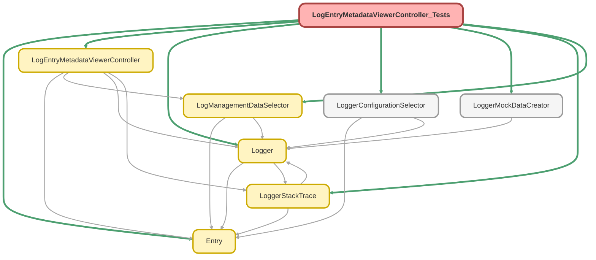

---
hide:
  - path
---

# LogEntryMetadataViewerController_Tests Class

`SUPPRESSWARNINGS`
`ISTEST`

## Class Diagram



<!-- Apex description -->

## Apex Code

```java
@SuppressWarnings('PMD.ApexDoc, PMD.MethodNamingConventions')
@IsTest
private class LogEntryMetadataViewerController_Tests {
  private static final MockLogManagementDataSelector MOCK_SELECTOR = new MockLogManagementDataSelector();
  private static final String SOURCE_METADATA_EXCEPTION = 'Exception';
  private static final String SOURCE_METADATA_ORIGIN = 'Origin';

  static {
    // Don't use the org's actual custom metadata records when running tests
    LoggerConfigurationSelector.useMocks();
    LogManagementDataSelector.setMock(MOCK_SELECTOR);
  }

  @IsTest
  static void it_returns_apex_class_metadata_for_log_entry_when_source_metadata_is_exception() {
    Schema.ApexClass mockExceptionApexClass = createMockApexClass('Some_Fake_Apex_Class');
    System.Assert.isNotNull(mockExceptionApexClass.Name);
    MOCK_SELECTOR.setMockApexClass(mockExceptionApexClass);
    LogEntry__c mockLogEntry = createMockLogEntry(null, mockExceptionApexClass);
    System.Assert.areEqual(mockExceptionApexClass.Name, mockLogEntry.ExceptionSourceApiName__c);
    System.Assert.isNull(mockLogEntry.OriginSourceApiName__c);
    MOCK_SELECTOR.setMockLogEntry(mockLogEntry);

    LogEntryMetadataViewerController.LogEntryMetadata logEntryMetadata = LogEntryMetadataViewerController.getMetadata(
      mockLogEntry.Id,
      SOURCE_METADATA_EXCEPTION
    );

    System.Assert.areEqual(mockExceptionApexClass.Body, logEntryMetadata.Code);
    System.Assert.isFalse(logEntryMetadata.HasCodeBeenModified);
  }

  @IsTest
  static void it_returns_apex_trigger_metadata_for_log_entry_when_source_metadata_is_exception() {
    Schema.ApexTrigger mockExceptionApexTrigger = createMockApexTrigger('Some_Fake_Apex_Trigger');
    System.Assert.isNotNull(mockExceptionApexTrigger.Name);
    MOCK_SELECTOR.setMockApexTrigger(mockExceptionApexTrigger);
    LogEntry__c mockLogEntry = createMockLogEntry(null, mockExceptionApexTrigger);
    System.Assert.areEqual(mockExceptionApexTrigger.Name, mockLogEntry.ExceptionSourceApiName__c);
    System.Assert.isNull(mockLogEntry.OriginSourceApiName__c);
    MOCK_SELECTOR.setMockLogEntry(mockLogEntry);

    LogEntryMetadataViewerController.LogEntryMetadata logEntryMetadata = LogEntryMetadataViewerController.getMetadata(
      mockLogEntry.Id,
      SOURCE_METADATA_EXCEPTION
    );

    System.Assert.areEqual(mockExceptionApexTrigger.Body, logEntryMetadata.Code);
    System.Assert.isFalse(logEntryMetadata.HasCodeBeenModified);
  }

  @IsTest
  static void it_indicates_when_exception_source_metadata_has_been_modified_after_log_entry_timestamp() {
    Schema.ApexClass mockExceptionApexClass = createMockApexClass('Some_Fake_Apex_Class');
    System.Assert.isNotNull(mockExceptionApexClass.Name);
    MOCK_SELECTOR.setMockApexClass(mockExceptionApexClass);
    LogEntry__c mockLogEntry = createMockLogEntry(null, mockExceptionApexClass);
    mockLogEntry.Timestamp__c = mockExceptionApexClass.LastModifiedDate.addDays(-1);
    System.Assert.areEqual(mockExceptionApexClass.Name, mockLogEntry.ExceptionSourceApiName__c);
    System.Assert.isNull(mockLogEntry.OriginSourceApiName__c);
    MOCK_SELECTOR.setMockLogEntry(mockLogEntry);

    LogEntryMetadataViewerController.LogEntryMetadata logEntryMetadata = LogEntryMetadataViewerController.getMetadata(
      mockLogEntry.Id,
      SOURCE_METADATA_EXCEPTION
    );

    System.Assert.areEqual(mockExceptionApexClass.Body, logEntryMetadata.Code);
    System.Assert.isTrue(logEntryMetadata.HasCodeBeenModified);
  }

  @IsTest
  static void it_returns_apex_class_metadata_for_log_entry_when_source_metadata_is_origin() {
    Schema.ApexClass mockOriginSourceApexClass = createMockApexClass('Some_Fake_Apex_Class');
    System.Assert.isNotNull(mockOriginSourceApexClass.Name);
    MOCK_SELECTOR.setMockApexClass(mockOriginSourceApexClass);
    LogEntry__c mockLogEntry = createMockLogEntry(mockOriginSourceApexClass, null);
    System.Assert.isNull(mockLogEntry.ExceptionSourceApiName__c);
    System.Assert.areEqual(mockOriginSourceApexClass.Name, mockLogEntry.OriginSourceApiName__c);
    MOCK_SELECTOR.setMockLogEntry(mockLogEntry);

    LogEntryMetadataViewerController.LogEntryMetadata logEntryMetadata = LogEntryMetadataViewerController.getMetadata(mockLogEntry.Id, SOURCE_METADATA_ORIGIN);

    System.Assert.areEqual(mockOriginSourceApexClass.Body, logEntryMetadata.Code);
    System.Assert.isFalse(logEntryMetadata.HasCodeBeenModified);
  }

  @IsTest
  static void it_indicates_when_origin_source_metadata_has_been_modified_after_log_entry_timestamp() {
    Schema.ApexClass mockOriginSourceApexClass = createMockApexClass('Some_Fake_Apex_Class');
    System.Assert.isNotNull(mockOriginSourceApexClass.Name);
    MOCK_SELECTOR.setMockApexClass(mockOriginSourceApexClass);
    LogEntry__c mockLogEntry = createMockLogEntry(mockOriginSourceApexClass, null);
    mockLogEntry.Timestamp__c = mockOriginSourceApexClass.LastModifiedDate.addDays(-1);
    System.Assert.isNull(mockLogEntry.ExceptionSourceApiName__c);
    System.Assert.areEqual(mockOriginSourceApexClass.Name, mockLogEntry.OriginSourceApiName__c);
    MOCK_SELECTOR.setMockLogEntry(mockLogEntry);

    LogEntryMetadataViewerController.LogEntryMetadata logEntryMetadata = LogEntryMetadataViewerController.getMetadata(mockLogEntry.Id, SOURCE_METADATA_ORIGIN);

    System.Assert.areEqual(mockOriginSourceApexClass.Body, logEntryMetadata.Code);
    System.Assert.isTrue(logEntryMetadata.HasCodeBeenModified);
  }

  private static LogEntry__c createMockLogEntry(Schema.ApexClass originApexClass, Schema.ApexClass exceptionApexClass) {
    LogEntry__c mockLogEntry = (LogEntry__c) LoggerMockDataCreator.createDataBuilder(Schema.LogEntry__c.SObjectType).populateRequiredFields().getRecord();
    mockLogEntry.ExceptionSourceApiName__c = exceptionApexClass?.Name;
    mockLogEntry.ExceptionSourceMetadataType__c = exceptionApexClass == null ? null : LoggerStackTrace.SourceMetadataType.ApexClass.name();
    mockLogEntry.OriginSourceApiName__c = originApexClass?.Name;
    mockLogEntry.OriginSourceMetadataType__c = originApexClass == null ? null : LoggerStackTrace.SourceMetadataType.ApexClass.name();
    mockLogEntry.Timestamp__c = System.now();
    return mockLogEntry;
  }

  private static LogEntry__c createMockLogEntry(Schema.ApexTrigger originApexTrigger, Schema.ApexTrigger exceptionApexTrigger) {
    LogEntry__c mockLogEntry = (LogEntry__c) LoggerMockDataCreator.createDataBuilder(Schema.LogEntry__c.SObjectType).populateRequiredFields().getRecord();
    mockLogEntry.ExceptionSourceApiName__c = exceptionApexTrigger?.Name;
    mockLogEntry.ExceptionSourceMetadataType__c = exceptionApexTrigger == null ? null : LoggerStackTrace.SourceMetadataType.ApexTrigger.name();
    mockLogEntry.OriginSourceApiName__c = originApexTrigger?.Name;
    mockLogEntry.OriginSourceMetadataType__c = originApexTrigger == null ? null : LoggerStackTrace.SourceMetadataType.ApexTrigger.name();
    mockLogEntry.Timestamp__c = System.now();
    return mockLogEntry;
  }

  private static Schema.ApexClass createMockApexClass(String mockApexClassName) {
    Schema.ApexClass mockApexClass = new Schema.ApexClass(
      Body = 'Wow, look at this code for a mock version of apex class ' + mockApexClassName,
      Name = mockApexClassName
    );
    return (Schema.ApexClass) LoggerMockDataCreator.setReadOnlyField(mockApexClass, Schema.ApexClass.LastModifiedDate, System.now().addDays(-7));
  }

  private static Schema.ApexTrigger createMockApexTrigger(String mockApexTriggerName) {
    Schema.ApexTrigger mockApexTrigger = new Schema.ApexTrigger(
      Body = 'Wow, look at this code for a mock version of apex trigger ' + mockApexTriggerName,
      Name = mockApexTriggerName
    );
    return (Schema.ApexTrigger) LoggerMockDataCreator.setReadOnlyField(mockApexTrigger, Schema.ApexTrigger.LastModifiedDate, System.now().addDays(-7));
  }

  // LogEntryMetadataViewerController uses a few queries via LogManagementDataSelector - this class mocks the query results
  private class MockLogManagementDataSelector extends LogManagementDataSelector {
    private Schema.ApexClass mockApexClass;
    private Schema.ApexTrigger mockApexTrigger;
    private LogEntry__c mockLogEntry;

    public override List<Schema.ApexClass> getApexClasses(Set<String> apexClassNames) {
      return new List<Schema.ApexClass>{ this.mockApexClass };
    }

    public override List<Schema.ApexTrigger> getApexTriggers(Set<String> apexTriggerNames) {
      return new List<Schema.ApexTrigger>{ this.mockApexTrigger };
    }

    public override LogEntry__c getLogEntryById(Id logEntryId) {
      return this.mockLogEntry;
    }

    public void setMockApexClass(Schema.ApexClass apexClass) {
      this.mockApexClass = apexClass;
    }

    public void setMockApexTrigger(Schema.ApexTrigger apexTrigger) {
      this.mockApexTrigger = apexTrigger;
    }

    public void setMockLogEntry(LogEntry__c logEntry) {
      this.mockLogEntry = logEntry;
    }
  }
}
```

## Fields
### `MOCK_SELECTOR`

#### Signature
```apex
private static final MOCK_SELECTOR
```

#### Type
MockLogManagementDataSelector

---

### `SOURCE_METADATA_EXCEPTION`

#### Signature
```apex
private static final SOURCE_METADATA_EXCEPTION
```

#### Type
String

---

### `SOURCE_METADATA_ORIGIN`

#### Signature
```apex
private static final SOURCE_METADATA_ORIGIN
```

#### Type
String

## Methods
### `it_returns_apex_class_metadata_for_log_entry_when_source_metadata_is_exception()`

`ISTEST`

#### Signature
```apex
private static void it_returns_apex_class_metadata_for_log_entry_when_source_metadata_is_exception()
```

#### Return Type
**void**

---

### `it_returns_apex_trigger_metadata_for_log_entry_when_source_metadata_is_exception()`

`ISTEST`

#### Signature
```apex
private static void it_returns_apex_trigger_metadata_for_log_entry_when_source_metadata_is_exception()
```

#### Return Type
**void**

---

### `it_indicates_when_exception_source_metadata_has_been_modified_after_log_entry_timestamp()`

`ISTEST`

#### Signature
```apex
private static void it_indicates_when_exception_source_metadata_has_been_modified_after_log_entry_timestamp()
```

#### Return Type
**void**

---

### `it_returns_apex_class_metadata_for_log_entry_when_source_metadata_is_origin()`

`ISTEST`

#### Signature
```apex
private static void it_returns_apex_class_metadata_for_log_entry_when_source_metadata_is_origin()
```

#### Return Type
**void**

---

### `it_indicates_when_origin_source_metadata_has_been_modified_after_log_entry_timestamp()`

`ISTEST`

#### Signature
```apex
private static void it_indicates_when_origin_source_metadata_has_been_modified_after_log_entry_timestamp()
```

#### Return Type
**void**

---

### `createMockLogEntry(originApexClass, exceptionApexClass)`

#### Signature
```apex
private static LogEntry__c createMockLogEntry(Schema.ApexClass originApexClass, Schema.ApexClass exceptionApexClass)
```

#### Parameters
| Name | Type | Description |
|------|------|-------------|
| originApexClass | Schema.ApexClass |  |
| exceptionApexClass | Schema.ApexClass |  |

#### Return Type
**[LogEntry__c](../objects/LogEntry__c.md)**

---

### `createMockLogEntry(originApexTrigger, exceptionApexTrigger)`

#### Signature
```apex
private static LogEntry__c createMockLogEntry(Schema.ApexTrigger originApexTrigger, Schema.ApexTrigger exceptionApexTrigger)
```

#### Parameters
| Name | Type | Description |
|------|------|-------------|
| originApexTrigger | Schema.ApexTrigger |  |
| exceptionApexTrigger | Schema.ApexTrigger |  |

#### Return Type
**[LogEntry__c](../objects/LogEntry__c.md)**

---

### `createMockApexClass(mockApexClassName)`

#### Signature
```apex
private static Schema.ApexClass createMockApexClass(String mockApexClassName)
```

#### Parameters
| Name | Type | Description |
|------|------|-------------|
| mockApexClassName | String |  |

#### Return Type
**Schema.ApexClass**

---

### `createMockApexTrigger(mockApexTriggerName)`

#### Signature
```apex
private static Schema.ApexTrigger createMockApexTrigger(String mockApexTriggerName)
```

#### Parameters
| Name | Type | Description |
|------|------|-------------|
| mockApexTriggerName | String |  |

#### Return Type
**Schema.ApexTrigger**

## Classes
### MockLogManagementDataSelector Class

#### Fields
##### `mockApexClass`

###### Signature
```apex
private mockApexClass
```

###### Type
Schema.ApexClass

---

##### `mockApexTrigger`

###### Signature
```apex
private mockApexTrigger
```

###### Type
Schema.ApexTrigger

---

##### `mockLogEntry`

###### Signature
```apex
private mockLogEntry
```

###### Type
[LogEntry__c](../objects/LogEntry__c.md)

#### Methods
##### `getApexClasses(apexClassNames)`

###### Signature
```apex
public override List<Schema.ApexClass> getApexClasses(Set<String> apexClassNames)
```

###### Parameters
| Name | Type | Description |
|------|------|-------------|
| apexClassNames | Set<String> |  |

###### Return Type
**List<Schema.ApexClass>**

---

##### `getApexTriggers(apexTriggerNames)`

###### Signature
```apex
public override List<Schema.ApexTrigger> getApexTriggers(Set<String> apexTriggerNames)
```

###### Parameters
| Name | Type | Description |
|------|------|-------------|
| apexTriggerNames | Set<String> |  |

###### Return Type
**List<Schema.ApexTrigger>**

---

##### `getLogEntryById(logEntryId)`

###### Signature
```apex
public override LogEntry__c getLogEntryById(Id logEntryId)
```

###### Parameters
| Name | Type | Description |
|------|------|-------------|
| logEntryId | Id |  |

###### Return Type
**[LogEntry__c](../objects/LogEntry__c.md)**

---

##### `setMockApexClass(apexClass)`

###### Signature
```apex
public void setMockApexClass(Schema.ApexClass apexClass)
```

###### Parameters
| Name | Type | Description |
|------|------|-------------|
| apexClass | Schema.ApexClass |  |

###### Return Type
**void**

---

##### `setMockApexTrigger(apexTrigger)`

###### Signature
```apex
public void setMockApexTrigger(Schema.ApexTrigger apexTrigger)
```

###### Parameters
| Name | Type | Description |
|------|------|-------------|
| apexTrigger | Schema.ApexTrigger |  |

###### Return Type
**void**

---

##### `setMockLogEntry(logEntry)`

###### Signature
```apex
public void setMockLogEntry(LogEntry__c logEntry)
```

###### Parameters
| Name | Type | Description |
|------|------|-------------|
| logEntry | [LogEntry__c](../objects/LogEntry__c.md) |  |

###### Return Type
**void**