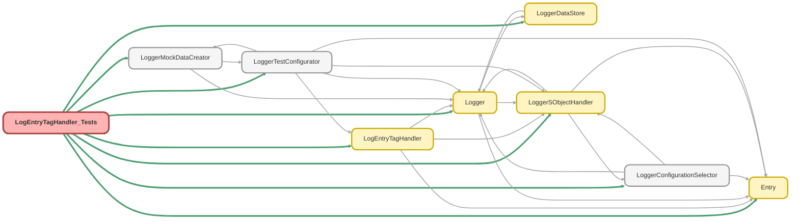

---
hide:
  - path
---

# LogEntryTagHandler_Tests Class

`SUPPRESSWARNINGS`
`ISTEST`

## Class Diagram



<!-- Apex description -->

## Apex Code

```java
//------------------------------------------------------------------------------------------------//
// This file is part of the Nebula Logger project, released under the MIT License.                //
// See LICENSE file or go to https://github.com/jongpie/NebulaLogger for full license details.    //
//------------------------------------------------------------------------------------------------//

@SuppressWarnings('PMD.ApexDoc, PMD.CyclomaticComplexity, PMD.ExcessiveParameterList, PMD.MethodNamingConventions, PMD.NcssMethodCount')
@IsTest(IsParallel=true)
private class LogEntryTagHandler_Tests {
  static {
    // Don't use the org's actual custom metadata records when running tests
    LoggerConfigurationSelector.useMocks();
  }

  @TestSetup
  static void setupData() {
    LoggerSObjectHandler.shouldExecute(false);

    Log__c log = (Log__c) LoggerMockDataCreator.createDataBuilder(Schema.Log__c.SObjectType).populateRequiredFields().getRecord();
    insert log;

    List<LogEntry__c> logEntries = new List<LogEntry__c>();
    for (Integer i = 0; i < 3; i++) {
      LogEntry__c logEntry = new LogEntry__c(Log__c = log.Id, TransactionEntryNumber__c = i + 1);
      LoggerMockDataCreator.createDataBuilder(logEntry).populateRequiredFields().getRecord();
      logEntries.add(logEntry);
    }
    insert logEntries;

    insert LoggerMockDataCreator.createDataBuilder(Schema.LoggerTag__c.SObjectType).populateRequiredFields().getRecord();
  }

  @IsTest
  static void it_generates_a_unique_composite_id() {
    Id logEntryId = LoggerMockDataCreator.createId(Schema.LogEntry__c.SObjectType);
    Id loggerTagId = LoggerMockDataCreator.createId(Schema.LoggerTag__c.SObjectType);
    LogEntryTag__c logEntryTag = new LogEntryTag__c(LogEntry__c = logEntryId, Tag__c = loggerTagId);
    String expectedUniqueId = logEntryTag.LogEntry__c + '' + logEntryTag.Tag__c;

    String generatedUniqueId = LogEntryTagHandler.generateUniqueId(logEntryTag);

    System.Assert.areEqual(expectedUniqueId, generatedUniqueId);
  }

  @IsTest
  static void it_should_return_the_logEntryTag_sobjectType() {
    System.Assert.areEqual(Schema.LogEntryTag__c.SObjectType, new LogEntryTagHandler().getSObjectType());
  }

  @IsTest
  static void it_should_not_run_when_disabled_via_configuration() {
    LoggerTestConfigurator.setupMockSObjectHandlerConfigurations(false);
    LogEntry__c logEntry = [SELECT Id FROM LogEntry__c LIMIT 1];
    LoggerTag__c tag = [SELECT Id FROM LoggerTag__c LIMIT 1];
    LoggerTestConfigurator.setupMockSObjectHandlerConfigurations(true);
    LoggerTestConfigurator.getSObjectHandlerConfiguration(Schema.LogEntryTag__c.SObjectType).IsEnabled__c = false;
    LogEntryTag__c logEntryTag = new LogEntryTag__c(LogEntry__c = logEntry.Id, Tag__c = tag.Id);

    LoggerDataStore.getDatabase().insertRecord(logEntryTag);

    System.Assert.areEqual(
      0,
      LoggerSObjectHandler.getExecutedHandlers().get(Schema.LogEntryTag__c.SObjectType).size(),
      'Handler class should not have executed'
    );
  }

  @IsTest
  static void it_should_set_unique_id_on_insert() {
    LogEntry__c logEntry = [SELECT Id FROM LogEntry__c LIMIT 1];
    LoggerTag__c tag = [SELECT Id FROM LoggerTag__c LIMIT 1];
    LogEntryTag__c logEntryTag = new LogEntryTag__c(LogEntry__c = logEntry.Id, Tag__c = tag.Id);

    LoggerDataStore.getDatabase().insertRecord(logEntryTag);

    System.Assert.areEqual(
      2,
      LoggerSObjectHandler.getExecutedHandlers().get(Schema.LogEntryTag__c.SObjectType).size(),
      'Handler class should have executed two times - once for BEFORE_INSERT and once for AFTER_INSERT'
    );
    logEntryTag = [SELECT Id, LogEntry__c, Tag__c, UniqueId__c FROM LogEntryTag__c WHERE Id = :logEntryTag.Id];
    System.Assert.areEqual(logEntry.Id + '' + tag.Id, logEntryTag.UniqueId__c);
  }

  @IsTest
  static void it_should_set_unique_id_on_update() {
    LogEntry__c logEntry = [SELECT Id FROM LogEntry__c LIMIT 1];
    LoggerTag__c tag = [SELECT Id FROM LoggerTag__c LIMIT 1];
    LogEntryTag__c logEntryTag = new LogEntryTag__c(LogEntry__c = logEntry.Id, Tag__c = tag.Id);
    LoggerDataStore.getDatabase().insertRecord(logEntryTag);
    logEntryTag = [SELECT Id, LogEntry__c, Tag__c, UniqueId__c FROM LogEntryTag__c WHERE Id = :logEntryTag.Id];
    System.Assert.areEqual(logEntry.Id + '' + tag.Id, logEntryTag.UniqueId__c);
    logEntryTag.UniqueId__c = 'something else';

    update logEntryTag;

    System.Assert.areEqual(
      4,
      LoggerSObjectHandler.getExecutedHandlers().get(Schema.LogEntryTag__c.SObjectType).size(),
      'Handler class should have executed four times - two times for BEFORE_INSERT/AFTER_INSERT' + ' and two more times for BEFORE_UPDATE/AFTER_UPDATE'
    );
    logEntryTag = [SELECT Id, LogEntry__c, Tag__c, UniqueId__c FROM LogEntryTag__c WHERE Id = :logEntryTag.Id];
    System.Assert.areEqual(logEntry.Id + '' + tag.Id, logEntryTag.UniqueId__c);
  }

  @IsTest
  static void it_should_not_insert_duplicate_tag() {
    LogEntry__c logEntry = [SELECT Id FROM LogEntry__c LIMIT 1];
    LoggerTag__c tag = [SELECT Id FROM LoggerTag__c LIMIT 1];
    LogEntryTag__c logEntryTag = new LogEntryTag__c(LogEntry__c = logEntry.Id, Tag__c = tag.Id);
    LoggerDataStore.getDatabase().insertRecord(logEntryTag);
    LogEntryTag__c duplicateLogEntryTag = new LogEntryTag__c(LogEntry__c = logEntry.Id, Tag__c = tag.Id);
    System.Exception thrownException;

    try {
      insert duplicateLogEntryTag;
      System.Assert.fail('System.Exception expected on previous line');
    } catch (System.Exception ex) {
      thrownException = ex;
    }

    System.Assert.areEqual(
      3,
      LoggerSObjectHandler.getExecutedHandlers().get(Schema.LogEntryTag__c.SObjectType).size(),
      'Handler class should have executed three times - once for BEFORE_INSERT and once for AFTER_INSERT for the first record,' +
      ' and once for BEFORE_INSERT on the errored duplicate'
    );
    System.Assert.isNotNull(thrownException, 'An exception should have been thrown');
    String expectedDuplicateError = 'DUPLICATE_VALUE';
    System.Assert.isTrue(thrownException.getMessage().contains(expectedDuplicateError), thrownException.getMessage());
  }
}
```

## Methods
### `setupData()`

`TESTSETUP`

#### Signature
```apex
private static void setupData()
```

#### Return Type
**void**

---

### `it_generates_a_unique_composite_id()`

`ISTEST`

#### Signature
```apex
private static void it_generates_a_unique_composite_id()
```

#### Return Type
**void**

---

### `it_should_return_the_logEntryTag_sobjectType()`

`ISTEST`

#### Signature
```apex
private static void it_should_return_the_logEntryTag_sobjectType()
```

#### Return Type
**void**

---

### `it_should_not_run_when_disabled_via_configuration()`

`ISTEST`

#### Signature
```apex
private static void it_should_not_run_when_disabled_via_configuration()
```

#### Return Type
**void**

---

### `it_should_set_unique_id_on_insert()`

`ISTEST`

#### Signature
```apex
private static void it_should_set_unique_id_on_insert()
```

#### Return Type
**void**

---

### `it_should_set_unique_id_on_update()`

`ISTEST`

#### Signature
```apex
private static void it_should_set_unique_id_on_update()
```

#### Return Type
**void**

---

### `it_should_not_insert_duplicate_tag()`

`ISTEST`

#### Signature
```apex
private static void it_should_not_insert_duplicate_tag()
```

#### Return Type
**void**