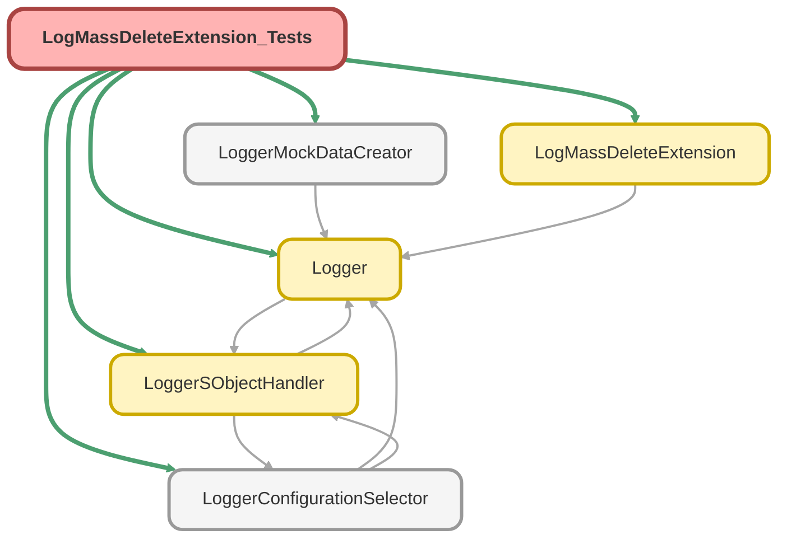

---
hide:
  - path
---

# LogMassDeleteExtension_Tests Class

`SUPPRESSWARNINGS`
`ISTEST`

## Class Diagram



<!-- Apex description -->

## Apex Code

```java
//------------------------------------------------------------------------------------------------//
// This file is part of the Nebula Logger project, released under the MIT License.                //
// See LICENSE file or go to https://github.com/jongpie/NebulaLogger for full license details.    //
//------------------------------------------------------------------------------------------------//

@SuppressWarnings('PMD.ApexDoc, PMD.CyclomaticComplexity, PMD.ExcessiveParameterList, PMD.MethodNamingConventions, PMD.NcssMethodCount')
@IsTest(IsParallel=false)
private class LogMassDeleteExtension_Tests {
  static {
    // Don't use the org's actual custom metadata records when running tests
    LoggerConfigurationSelector.useMocks();
  }

  @TestSetup
  static void setupData() {
    LoggerSObjectHandler.shouldExecute(false);

    List<Log__c> logs = new List<Log__c>();
    for (Integer i = 0; i < 10; i++) {
      Log__c log = new Log__c(TransactionId__c = 'TXN-' + i);
      LoggerMockDataCreator.createDataBuilder(log).populateRequiredFields().getRecord();
      logs.add(log);
    }
    insert logs;
  }

  @IsTest
  static void it_should_add_error_to_page_when_user_does_not_have_delete_access() {
    List<Log__c> logs = [SELECT Id, Name FROM Log__c];
    List<Log__c> logsToDelete = new List<Log__c>();
    List<Log__c> logsToKeep = new List<Log__c>();
    Integer numberToKeep = 3;
    for (Integer i = 0; i < logs.size(); i++) {
      if (i < numberToKeep) {
        logsToDelete.add(logs.get(i));
      } else {
        logsToKeep.add(logs.get(i));
      }
    }
    ApexPages.StandardSetController controller = new ApexPages.StandardSetController(logs);
    controller.setSelected(logsToDelete);
    PageReference pageReference = Page.LogMassDelete;
    System.Test.setCurrentPage(pageReference);
    LogMassDeleteExtension.userHasLogDeleteAccess = false;

    new LogMassDeleteExtension(controller);

    System.Assert.isTrue(ApexPages.hasMessages(ApexPages.SEVERITY.ERROR));
    System.Assert.isNotNull(LogMassDeleteExtension.DELETE_ACCESS_ERROR);
    System.Assert.areEqual(LogMassDeleteExtension.DELETE_ACCESS_ERROR, ApexPages.getMessages().get(0).getSummary());
  }

  @IsTest
  static void it_should_return_deletable_logs() {
    List<Log__c> logs = [SELECT Id, Name FROM Log__c];
    List<String> logIds = new List<String>();
    for (Log__c selectedLog : logs) {
      logIds.add(selectedLog.Id);
    }
    List<Log__c> expectedDeletableLogs = new List<Log__c>();
    for (Schema.UserRecordAccess recordAccess : [
      SELECT RecordId
      FROM UserRecordAccess
      WHERE UserId = :System.UserInfo.getUserId() AND RecordId IN :logIds AND HasDeleteAccess = TRUE
    ]) {
      expectedDeletableLogs.add(new Log__c(Id = recordAccess.RecordId));
    }
    ApexPages.StandardSetController controller = new ApexPages.StandardSetController(logs);
    controller.setSelected(logs);
    PageReference pageReference = Page.LogMassDelete;
    System.Test.setCurrentPage(pageReference);

    LogMassDeleteExtension extension = new LogMassDeleteExtension(controller);
    List<Log__c> returnedDeletableLogs = extension.getDeletableLogs();

    System.Assert.areEqual(expectedDeletableLogs.size(), returnedDeletableLogs.size());
  }

  @IsTest
  static void it_should_delete_selected_log_records() {
    List<Log__c> logs = [SELECT Id, Name FROM Log__c];
    List<Log__c> logsToDelete = new List<Log__c>();
    List<Log__c> logsToKeep = new List<Log__c>();
    Integer numberToKeep = 3;
    for (Integer i = 0; i < logs.size(); i++) {
      if (i < numberToKeep) {
        logsToDelete.add(logs.get(i));
      } else {
        logsToKeep.add(logs.get(i));
      }
    }
    ApexPages.StandardSetController controller = new ApexPages.StandardSetController(logs);
    controller.setSelected(logsToDelete);
    PageReference pageReference = Page.LogMassDelete;
    System.Test.setCurrentPage(pageReference);

    LogMassDeleteExtension extension = new LogMassDeleteExtension(controller);
    extension.deleteSelectedLogs();

    logsToDelete = [SELECT Id, IsDeleted FROM Log__c WHERE Id IN :logsToDelete ALL ROWS];
    for (Log__c log : logsToDelete) {
      System.Assert.isTrue(log.IsDeleted, System.JSON.serializePretty(log));
    }
    logsToKeep = [SELECT Id, IsDeleted FROM Log__c WHERE Id IN :logsToKeep ALL ROWS];
    for (Log__c log : logsToKeep) {
      System.Assert.isFalse(log.IsDeleted, System.JSON.serializePretty(log));
    }
  }
}
```

## Methods
### `setupData()`

`TESTSETUP`

#### Signature
```apex
private static void setupData()
```

#### Return Type
**void**

---

### `it_should_add_error_to_page_when_user_does_not_have_delete_access()`

`ISTEST`

#### Signature
```apex
private static void it_should_add_error_to_page_when_user_does_not_have_delete_access()
```

#### Return Type
**void**

---

### `it_should_return_deletable_logs()`

`ISTEST`

#### Signature
```apex
private static void it_should_return_deletable_logs()
```

#### Return Type
**void**

---

### `it_should_delete_selected_log_records()`

`ISTEST`

#### Signature
```apex
private static void it_should_delete_selected_log_records()
```

#### Return Type
**void**