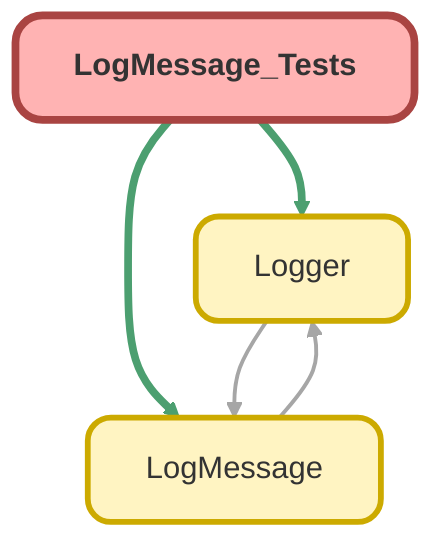

---
hide:
  - path
---

# LogMessage_Tests Class

`SUPPRESSWARNINGS`
`ISTEST`

## Class Diagram



<!-- Apex description -->

## Apex Code

```java
//------------------------------------------------------------------------------------------------//
// This file is part of the Nebula Logger project, released under the MIT License.                //
// See LICENSE file or go to https://github.com/jongpie/NebulaLogger for full license details.    //
//------------------------------------------------------------------------------------------------//

@SuppressWarnings(
  'PMD.ApexDoc, PMD.ApexAssertionsShouldIncludeMessage, PMD.CyclomaticComplexity, PMD.ExcessiveParameterList, PMD.MethodNamingConventions, PMD.NcssMethodCount'
)
@IsTest(IsParallel=true)
private class LogMessage_Tests {
  private static final String CUSTOM_MESSAGE_PREFIX = 'Just confirming that CustomLogMessage class is used';

  @IsTest
  static void it_should_support_extending_LogMessage_class() {
    // There's no override for getMessage() implemented to ensure no errors are thrown & null is returned
    String expectedMessage = null;

    String returnedMessage = new CustomLogMessageWithoutImplementation().getMessage();

    System.Assert.areEqual(expectedMessage, returnedMessage);
  }

  @IsTest
  static void it_should_support_overriding_getMessage_method() {
    String originalMessage = CUSTOM_MESSAGE_PREFIX + 'The current time is: ' + System.now();
    String expectedMessage = CUSTOM_MESSAGE_PREFIX + originalMessage;

    String returnedMessage = new CustomLogMessageWithMessageOverride(originalMessage).getMessage();

    System.Assert.areEqual(expectedMessage, returnedMessage);
  }

  @IsTest
  static void it_should_return_formatted_message_when_1_object_list_parameter_provided() {
    String unformattedMessage = 'my string with 1 input: {0}';
    List<Object> arguments = new List<Object>{ System.now() };
    String expectedMessage = String.format(unformattedMessage, arguments);

    String returnedMessage = new LogMessage(unformattedMessage, arguments).getMessage();

    System.Assert.areEqual(expectedMessage, returnedMessage);
  }

  @IsTest
  static void it_should_return_formatted_message_when_1_object_parameter_provided() {
    String unformattedMessage = 'my string with 1 input: {0}';
    Datetime argument1 = System.now();
    String expectedMessage = String.format(unformattedMessage, new List<Object>{ argument1 });

    String returnedMessage = new LogMessage(unformattedMessage, argument1).getMessage();

    System.Assert.areEqual(expectedMessage, returnedMessage);
  }

  @IsTest
  static void it_should_return_formatted_message_when_2_object_parameters_provided() {
    String unformattedMessage = 'my string with 1 input: {0}';
    Datetime argument1 = System.now();
    Date argument2 = System.today();
    String expectedMessage = String.format(unformattedMessage, new List<Object>{ argument1, argument2 });

    String returnedMessage = new LogMessage(unformattedMessage, argument1, argument2).getMessage();

    System.Assert.areEqual(expectedMessage, returnedMessage);
  }

  @IsTest
  static void it_should_return_formatted_message_when_3_object_parameters_provided() {
    String unformattedMessage = 'my string with 1 input: {0} and then {1} and finally {2}';
    Datetime argument1 = System.now();
    Date argument2 = System.today();
    Schema.User argument3 = new Schema.User(Id = System.UserInfo.getUserId());
    String expectedMessage = String.format(unformattedMessage, new List<Object>{ argument1, argument2, argument3 });

    String returnedMessage = new LogMessage(unformattedMessage, argument1, argument2, argument3).getMessage();

    System.Assert.areEqual(expectedMessage, returnedMessage);
  }

  private class CustomLogMessageWithoutImplementation extends LogMessage {
  }

  private class CustomLogMessageWithMessageOverride extends LogMessage {
    private String inputString;

    public CustomLogMessageWithMessageOverride(String inputString) {
      this.inputString = CUSTOM_MESSAGE_PREFIX + inputString;
    }

    public override String getMessage() {
      return inputString;
    }
  }
}
```

## Fields
### `CUSTOM_MESSAGE_PREFIX`

#### Signature
```apex
private static final CUSTOM_MESSAGE_PREFIX
```

#### Type
String

## Methods
### `it_should_support_extending_LogMessage_class()`

`ISTEST`

#### Signature
```apex
private static void it_should_support_extending_LogMessage_class()
```

#### Return Type
**void**

---

### `it_should_support_overriding_getMessage_method()`

`ISTEST`

#### Signature
```apex
private static void it_should_support_overriding_getMessage_method()
```

#### Return Type
**void**

---

### `it_should_return_formatted_message_when_1_object_list_parameter_provided()`

`ISTEST`

#### Signature
```apex
private static void it_should_return_formatted_message_when_1_object_list_parameter_provided()
```

#### Return Type
**void**

---

### `it_should_return_formatted_message_when_1_object_parameter_provided()`

`ISTEST`

#### Signature
```apex
private static void it_should_return_formatted_message_when_1_object_parameter_provided()
```

#### Return Type
**void**

---

### `it_should_return_formatted_message_when_2_object_parameters_provided()`

`ISTEST`

#### Signature
```apex
private static void it_should_return_formatted_message_when_2_object_parameters_provided()
```

#### Return Type
**void**

---

### `it_should_return_formatted_message_when_3_object_parameters_provided()`

`ISTEST`

#### Signature
```apex
private static void it_should_return_formatted_message_when_3_object_parameters_provided()
```

#### Return Type
**void**

## Classes
### CustomLogMessageWithoutImplementation Class

### CustomLogMessageWithMessageOverride Class

#### Fields
##### `inputString`

###### Signature
```apex
private inputString
```

###### Type
String

#### Constructors
##### `CustomLogMessageWithMessageOverride(inputString)`

###### Signature
```apex
public CustomLogMessageWithMessageOverride(String inputString)
```

###### Parameters
| Name | Type | Description |
|------|------|-------------|
| inputString | String |  |

#### Methods
##### `getMessage()`

###### Signature
```apex
public override String getMessage()
```

###### Return Type
**String**