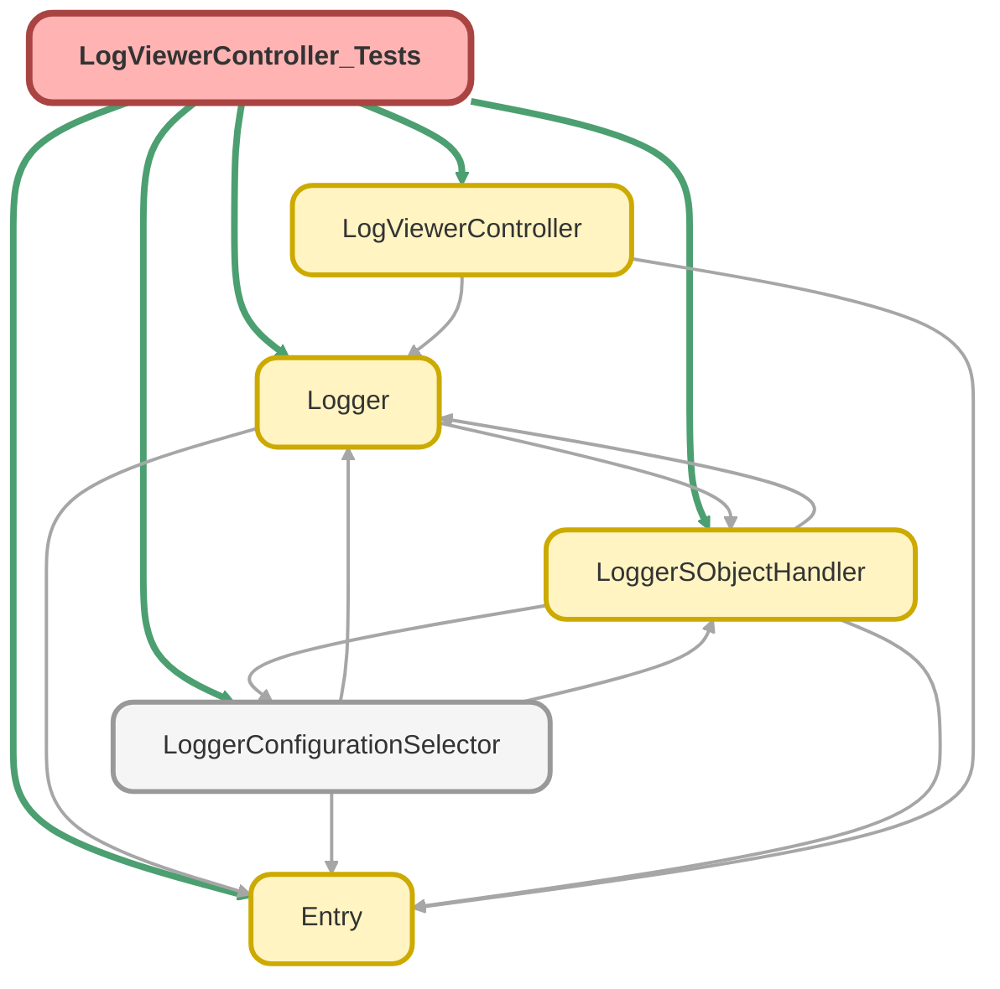

---
hide:
  - path
---

# LogViewerController_Tests Class

`SUPPRESSWARNINGS`
`ISTEST`

## Class Diagram



<!-- Apex description -->

## Apex Code

```java
//------------------------------------------------------------------------------------------------//
// This file is part of the Nebula Logger project, released under the MIT License.                //
// See LICENSE file or go to https://github.com/jongpie/NebulaLogger for full license details.    //
//------------------------------------------------------------------------------------------------//

@SuppressWarnings('PMD.ApexDoc, PMD.MethodNamingConventions')
@IsTest(IsParallel=true)
private class LogViewerController_Tests {
  static {
    // Don't use the org's actual custom metadata records when running tests
    LoggerConfigurationSelector.useMocks();
  }

  @TestSetup
  static void setupData() {
    LoggerSObjectHandler.shouldExecute(false);
    Log__c log = new Log__c(TransactionId__c = '1234');
    insert log;
    List<LogEntry__c> logEntries = new List<LogEntry__c>();
    for (Integer i = 0; i < 5; i++) {
      logEntries.add(new LogEntry__c(Log__c = log.Id, Message__c = 'some message, number ' + i));
    }
    insert logEntries;
  }

  @IsTest
  static void it_should_return_log_when_id_provided() {
    Log__c log = [SELECT Id, TransactionId__c FROM Log__c];
    Map<Id, LogEntry__c> logEntryIdToLogEntry = new Map<Id, LogEntry__c>([SELECT Id FROM LogEntry__c]);

    LogViewerController.LogDTO returnedLogDto = LogViewerController.getLog(log.Id);

    System.Assert.areEqual(log.Id, returnedLogDto.log.Id);
    System.Assert.areEqual(logEntryIdToLogEntry.size(), returnedLogDto.logEntries.size());
    String className = LogViewerController_Tests.class.getName();
    String namespacePrefix = className.contains('.') ? className.substringBefore('.') + '__' : '';
    System.Assert.areEqual(namespacePrefix + 'LogEntries__r', returnedLogDto.logEntriesRelationshipName);
    for (LogEntry__c logEntry : returnedLogDto.logEntries) {
      System.Assert.isTrue(logEntryIdToLogEntry.containsKey(logEntry.Id));
      System.Assert.areEqual(log.Id, logEntry.Log__c);
    }
  }
}
```

## Methods
### `setupData()`

`TESTSETUP`

#### Signature
```apex
private static void setupData()
```

#### Return Type
**void**

---

### `it_should_return_log_when_id_provided()`

`ISTEST`

#### Signature
```apex
private static void it_should_return_log_when_id_provided()
```

#### Return Type
**void**