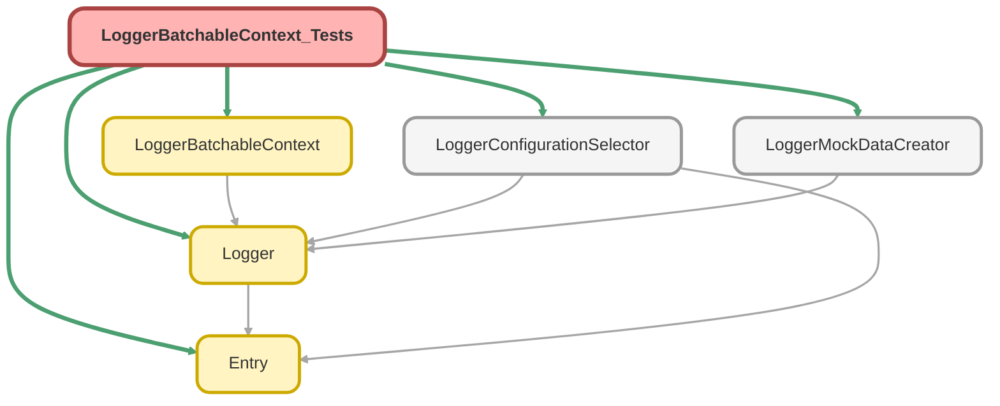

---
hide:
  - path
---

# LoggerBatchableContext_Tests Class

`SUPPRESSWARNINGS`
`ISTEST`

## Class Diagram



<!-- Apex description -->

## Apex Code

```java
//------------------------------------------------------------------------------------------------//
// This file is part of the Nebula Logger project, released under the MIT License.                //
// See LICENSE file or go to https://github.com/jongpie/NebulaLogger for full license details.    //
//------------------------------------------------------------------------------------------------//

@SuppressWarnings('PMD.MethodNamingConventions')
@IsTest(IsParallel=true)
private class LoggerBatchableContext_Tests {
  static {
    // Don't use the org's actual custom metadata records when running tests
    LoggerConfigurationSelector.useMocks();
  }

  @IsTest
  static void it_constructs_instance_when_both_parameters_provided() {
    Database.BatchableContext mockBatchableContext = new LoggerMockDataCreator.MockBatchableContext();
    Schema.SObjectType sobjectType = Schema.LogEntryEvent__e.SObjectType;

    LoggerBatchableContext context = new LoggerBatchableContext(mockBatchableContext, sobjectType);

    System.Assert.areEqual(mockBatchableContext, context.batchableContext);
    System.Assert.areEqual(sobjectType, context.sobjectType);
    System.Assert.areEqual(sobjectType.toString(), context.sobjectTypeName);
  }

  @IsTest
  static void it_constructs_instance_when_neither_parameters_provided() {
    Database.BatchableContext nullBatchableContext = null;
    Schema.SObjectType nullSObjectType = null;

    LoggerBatchableContext context = new LoggerBatchableContext(nullBatchableContext, nullSObjectType);

    System.Assert.isNull(context.batchableContext);
    System.Assert.isNull(context.sobjectType);
    System.Assert.isNull(context.sobjectTypeName);
  }
}
```

## Methods
### `it_constructs_instance_when_both_parameters_provided()`

`ISTEST`

#### Signature
```apex
private static void it_constructs_instance_when_both_parameters_provided()
```

#### Return Type
**void**

---

### `it_constructs_instance_when_neither_parameters_provided()`

`ISTEST`

#### Signature
```apex
private static void it_constructs_instance_when_neither_parameters_provided()
```

#### Return Type
**void**