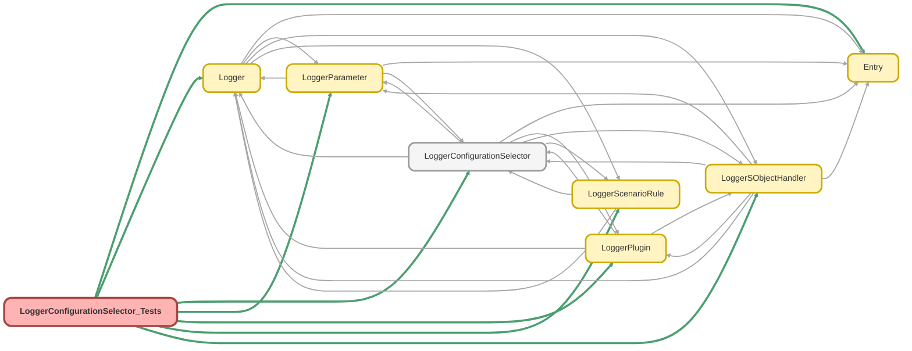

---
hide:
  - path
---

# LoggerConfigurationSelector_Tests Class

`SUPPRESSWARNINGS`
`ISTEST`

## Class Diagram



<!-- Apex description -->

## Apex Code

```java
//------------------------------------------------------------------------------------------------//
// This file is part of the Nebula Logger project, released under the MIT License.                //
// See LICENSE file or go to https://github.com/jongpie/NebulaLogger for full license details.    //
//------------------------------------------------------------------------------------------------//

@SuppressWarnings('PMD.ApexDoc, PMD.ApexAssertionsShouldIncludeMessage, PMD.MethodNamingConventions')
@IsTest(IsParallel=true)
private class LoggerConfigurationSelector_Tests {
  @IsTest
  static void it_initializes_mock_lists_when_use_mocks_is_called() {
    System.Assert.isNull(LoggerConfigurationSelector.mockLogEntryDataMaskRules);
    System.Assert.isNull(LoggerConfigurationSelector.mockLogEntryTagRules);
    System.Assert.isNull(LoggerConfigurationSelector.mockLoggerFieldMappings);
    System.Assert.isNull(LoggerConfigurationSelector.mockLoggerParameters);
    System.Assert.isNull(LoggerConfigurationSelector.mockLoggerPlugins);
    System.Assert.isNull(LoggerConfigurationSelector.mockLoggerScenarioRules);
    System.Assert.isNull(LoggerConfigurationSelector.mockLoggerSObjectHandlers);
    System.Assert.isNull(LoggerConfigurationSelector.mockLogStatuses);

    LoggerConfigurationSelector.useMocks();

    System.Assert.areEqual(new List<LogEntryDataMaskRule__mdt>(), LoggerConfigurationSelector.mockLogEntryDataMaskRules);
    System.Assert.areEqual(new List<LogEntryTagRule__mdt>(), LoggerConfigurationSelector.mockLogEntryTagRules);
    System.Assert.areEqual(new List<LoggerFieldMapping__mdt>(), LoggerConfigurationSelector.mockLoggerFieldMappings);
    System.Assert.areEqual(new Map<String, LoggerParameter__mdt>(), LoggerConfigurationSelector.mockLoggerParameters);
    System.Assert.areEqual(new List<LoggerPlugin__mdt>(), LoggerConfigurationSelector.mockLoggerPlugins);
    System.Assert.areEqual(new List<LoggerScenarioRule__mdt>(), LoggerConfigurationSelector.mockLoggerScenarioRules);
    System.Assert.areEqual(new List<LoggerSObjectHandler__mdt>(), LoggerConfigurationSelector.mockLoggerSObjectHandlers);
    System.Assert.areEqual(new List<LogStatus__mdt>(), LoggerConfigurationSelector.mockLogStatuses);
  }

  @IsTest
  static void it_returns_log_entry_data_mask_rules_from_database() {
    List<LogEntryDataMaskRule__mdt> expectedValues = LogEntryDataMaskRule__mdt.getAll().values().deepClone();

    List<LogEntryDataMaskRule__mdt> returnedValues = LoggerConfigurationSelector.getInstance().getLogEntryDataMaskRules();

    System.Assert.areEqual(expectedValues, returnedValues);
  }

  @IsTest
  static void it_returns_log_entry_data_mask_rules_from_provided_mocks() {
    LoggerConfigurationSelector.mockLogEntryDataMaskRules = new List<LogEntryDataMaskRule__mdt>{ new LogEntryDataMaskRule__mdt(DeveloperName = 'SomeDevName') };

    List<LogEntryDataMaskRule__mdt> returnedValues = LoggerConfigurationSelector.getInstance().getLogEntryDataMaskRules();

    System.Assert.areEqual(LoggerConfigurationSelector.mockLogEntryDataMaskRules, returnedValues);
  }

  @IsTest
  static void it_returns_log_entry_tag_rules_from_database() {
    List<LogEntryTagRule__mdt> expectedValues = [
      SELECT Id, SObjectField__r.QualifiedApiName, ComparisonType__c, ComparisonValue__c, Tags__c
      FROM LogEntryTagRule__mdt
      WHERE IsEnabled__c = TRUE AND SObjectType__r.DeveloperName = 'LogEntry'
    ];
    for (LogEntryTagRule__mdt rule : expectedValues) {
      rule.SObjectField__c = rule.SObjectField__r.QualifiedApiName;
    }

    List<LogEntryTagRule__mdt> returnedValues = LoggerConfigurationSelector.getInstance().getLogEntryTagRules();

    System.Assert.areEqual(expectedValues, returnedValues);
  }

  @IsTest
  static void it_returns_log_entry_tag_rules_from_provided_mocks() {
    LoggerConfigurationSelector.mockLogEntryTagRules = new List<LogEntryTagRule__mdt>{ new LogEntryTagRule__mdt(DeveloperName = 'SomeDevName') };

    List<LogEntryTagRule__mdt> returnedValues = LoggerConfigurationSelector.getInstance().getLogEntryTagRules();

    System.Assert.areEqual(LoggerConfigurationSelector.mockLogEntryTagRules, returnedValues);
  }

  @IsTest
  static void it_returns_logger_field_mappings_from_database() {
    List<LoggerFieldMapping__mdt> expectedValues = [
      SELECT
        DeveloperName,
        IsEnabled__c,
        SourceSObjectType__r.QualifiedApiName,
        SourceField__r.QualifiedApiName,
        TargetSObjectType__r.QualifiedApiName,
        TargetField__r.QualifiedApiName
      FROM LoggerFieldMapping__mdt
      WHERE IsEnabled__c = TRUE
    ];
    for (LoggerFieldMapping__mdt fieldMapping : expectedValues) {
      fieldMapping.SourceSObjectType__c = fieldMapping.SourceSObjectType__r.QualifiedApiName ?? fieldMapping.SourceSObjectType__c;
      fieldMapping.SourceField__c = fieldMapping.SourceField__r.QualifiedApiName ?? fieldMapping.SourceField__c;
      fieldMapping.TargetSObjectType__c = fieldMapping.TargetSObjectType__r.QualifiedApiName ?? fieldMapping.TargetSObjectType__c;
      fieldMapping.TargetField__c = fieldMapping.TargetField__r.QualifiedApiName ?? fieldMapping.TargetField__c;
    }

    List<LoggerFieldMapping__mdt> returnedValues = LoggerConfigurationSelector.getInstance().getLoggerFieldMappings();

    System.Assert.areEqual(expectedValues, returnedValues);
  }

  @IsTest
  static void it_returns_logger_field_mappings_from_provided_mocks() {
    LoggerConfigurationSelector.mockLoggerFieldMappings = new List<LoggerFieldMapping__mdt>{ new LoggerFieldMapping__mdt(DeveloperName = 'SomeDevName') };

    List<LoggerFieldMapping__mdt> returnedValues = LoggerConfigurationSelector.getInstance().getLoggerFieldMappings();

    System.Assert.areEqual(LoggerConfigurationSelector.mockLoggerFieldMappings, returnedValues);
  }

  @IsTest
  static void it_returns_logger_parameters_from_database() {
    Map<String, LoggerParameter__mdt> expectedValues = LoggerParameter__mdt.getAll().deepClone();

    Map<String, LoggerParameter__mdt> returnedValues = LoggerConfigurationSelector.getInstance().getLoggerParameters();

    System.Assert.areEqual(expectedValues, returnedValues);
  }

  @IsTest
  static void it_returns_logger_parameters_from_provided_mocks() {
    LoggerConfigurationSelector.mockLoggerParameters = new Map<String, LoggerParameter__mdt>{
      'SomeDevName' => new LoggerParameter__mdt(DeveloperName = 'SomeDevName')
    };

    Map<String, LoggerParameter__mdt> returnedValues = LoggerConfigurationSelector.getInstance().getLoggerParameters();

    System.Assert.areEqual(LoggerConfigurationSelector.mockLoggerParameters, returnedValues);
  }

  @IsTest
  static void it_returns_logger_plugins_from_database() {
    List<LoggerPlugin__mdt> expectedValues = LoggerPlugin__mdt.getAll().values().deepClone();

    List<LoggerPlugin__mdt> returnedValues = LoggerConfigurationSelector.getInstance().getLoggerPlugins();

    System.Assert.areEqual(expectedValues, returnedValues);
  }

  @IsTest
  static void it_returns_logger_plugins_from_provided_mocks() {
    LoggerConfigurationSelector.mockLoggerPlugins = new List<LoggerPlugin__mdt>{
      new LoggerPlugin__mdt(DeveloperName = 'SomeDevName', SObjectHandlerApexClass__c = 'SomeApexClass')
    };

    List<LoggerPlugin__mdt> returnedValues = LoggerConfigurationSelector.getInstance().getLoggerPlugins();

    System.Assert.areEqual(LoggerConfigurationSelector.mockLoggerPlugins, returnedValues);
  }

  @IsTest
  static void it_returns_logger_scenario_rules_from_database() {
    List<LoggerScenarioRule__mdt> expectedValues = LoggerScenarioRule__mdt.getAll().values().deepClone();

    List<LoggerScenarioRule__mdt> returnedValues = LoggerConfigurationSelector.getInstance().getLoggerScenarioRules();

    System.Assert.areEqual(expectedValues, returnedValues);
  }

  @IsTest
  static void it_returns_logger_scenario_rules_from_provided_mocks() {
    LoggerConfigurationSelector.mockLoggerScenarioRules = new List<LoggerScenarioRule__mdt>{ new LoggerScenarioRule__mdt(DeveloperName = 'SomeDevName') };

    List<LoggerScenarioRule__mdt> returnedValues = LoggerConfigurationSelector.getInstance().getLoggerScenarioRules();

    System.Assert.areEqual(LoggerConfigurationSelector.mockLoggerScenarioRules, returnedValues);
  }

  @IsTest
  static void it_returns_logger_sobject_handlers_from_database() {
    List<LoggerSObjectHandler__mdt> expectedValues = [
      SELECT IsEnabled__c, SObjectHandlerApexClass__c, SObjectType__r.QualifiedApiName, SObjectTypeOverride__c
      FROM LoggerSObjectHandler__mdt
      WHERE IsEnabled__c = TRUE
    ];

    List<LoggerSObjectHandler__mdt> returnedValues = LoggerConfigurationSelector.getInstance().getLoggerSObjectHandlers();

    System.Assert.areEqual(expectedValues, returnedValues);
  }

  @IsTest
  static void it_returns_logger_sobject_handlers_from_provided_mocks() {
    LoggerConfigurationSelector.mockLoggerSObjectHandlers = new List<LoggerSObjectHandler__mdt>{ new LoggerSObjectHandler__mdt(DeveloperName = 'SomeDevName') };

    List<LoggerSObjectHandler__mdt> returnedValues = LoggerConfigurationSelector.getInstance().getLoggerSObjectHandlers();

    System.Assert.areEqual(LoggerConfigurationSelector.mockLoggerSObjectHandlers, returnedValues);
  }

  @IsTest
  static void it_returns_log_statuses_from_database() {
    List<LogStatus__mdt> expectedValues = LogStatus__mdt.getAll().values().deepClone();

    List<LogStatus__mdt> returnedValues = LoggerConfigurationSelector.getInstance().getLogStatuses();

    System.Assert.areEqual(expectedValues, returnedValues);
  }

  @IsTest
  static void it_returns_log_statuses_from_provided_mocks() {
    LoggerConfigurationSelector.mockLogStatuses = new List<LogStatus__mdt>{ new LogStatus__mdt(DeveloperName = 'SomeDevName') };

    List<LogStatus__mdt> returnedValues = LoggerConfigurationSelector.getInstance().getLogStatuses();

    System.Assert.areEqual(LoggerConfigurationSelector.mockLogStatuses, returnedValues);
  }
}
```

## Methods
### `it_initializes_mock_lists_when_use_mocks_is_called()`

`ISTEST`

#### Signature
```apex
private static void it_initializes_mock_lists_when_use_mocks_is_called()
```

#### Return Type
**void**

---

### `it_returns_log_entry_data_mask_rules_from_database()`

`ISTEST`

#### Signature
```apex
private static void it_returns_log_entry_data_mask_rules_from_database()
```

#### Return Type
**void**

---

### `it_returns_log_entry_data_mask_rules_from_provided_mocks()`

`ISTEST`

#### Signature
```apex
private static void it_returns_log_entry_data_mask_rules_from_provided_mocks()
```

#### Return Type
**void**

---

### `it_returns_log_entry_tag_rules_from_database()`

`ISTEST`

#### Signature
```apex
private static void it_returns_log_entry_tag_rules_from_database()
```

#### Return Type
**void**

---

### `it_returns_log_entry_tag_rules_from_provided_mocks()`

`ISTEST`

#### Signature
```apex
private static void it_returns_log_entry_tag_rules_from_provided_mocks()
```

#### Return Type
**void**

---

### `it_returns_logger_field_mappings_from_database()`

`ISTEST`

#### Signature
```apex
private static void it_returns_logger_field_mappings_from_database()
```

#### Return Type
**void**

---

### `it_returns_logger_field_mappings_from_provided_mocks()`

`ISTEST`

#### Signature
```apex
private static void it_returns_logger_field_mappings_from_provided_mocks()
```

#### Return Type
**void**

---

### `it_returns_logger_parameters_from_database()`

`ISTEST`

#### Signature
```apex
private static void it_returns_logger_parameters_from_database()
```

#### Return Type
**void**

---

### `it_returns_logger_parameters_from_provided_mocks()`

`ISTEST`

#### Signature
```apex
private static void it_returns_logger_parameters_from_provided_mocks()
```

#### Return Type
**void**

---

### `it_returns_logger_plugins_from_database()`

`ISTEST`

#### Signature
```apex
private static void it_returns_logger_plugins_from_database()
```

#### Return Type
**void**

---

### `it_returns_logger_plugins_from_provided_mocks()`

`ISTEST`

#### Signature
```apex
private static void it_returns_logger_plugins_from_provided_mocks()
```

#### Return Type
**void**

---

### `it_returns_logger_scenario_rules_from_database()`

`ISTEST`

#### Signature
```apex
private static void it_returns_logger_scenario_rules_from_database()
```

#### Return Type
**void**

---

### `it_returns_logger_scenario_rules_from_provided_mocks()`

`ISTEST`

#### Signature
```apex
private static void it_returns_logger_scenario_rules_from_provided_mocks()
```

#### Return Type
**void**

---

### `it_returns_logger_sobject_handlers_from_database()`

`ISTEST`

#### Signature
```apex
private static void it_returns_logger_sobject_handlers_from_database()
```

#### Return Type
**void**

---

### `it_returns_logger_sobject_handlers_from_provided_mocks()`

`ISTEST`

#### Signature
```apex
private static void it_returns_logger_sobject_handlers_from_provided_mocks()
```

#### Return Type
**void**

---

### `it_returns_log_statuses_from_database()`

`ISTEST`

#### Signature
```apex
private static void it_returns_log_statuses_from_database()
```

#### Return Type
**void**

---

### `it_returns_log_statuses_from_provided_mocks()`

`ISTEST`

#### Signature
```apex
private static void it_returns_log_statuses_from_provided_mocks()
```

#### Return Type
**void**