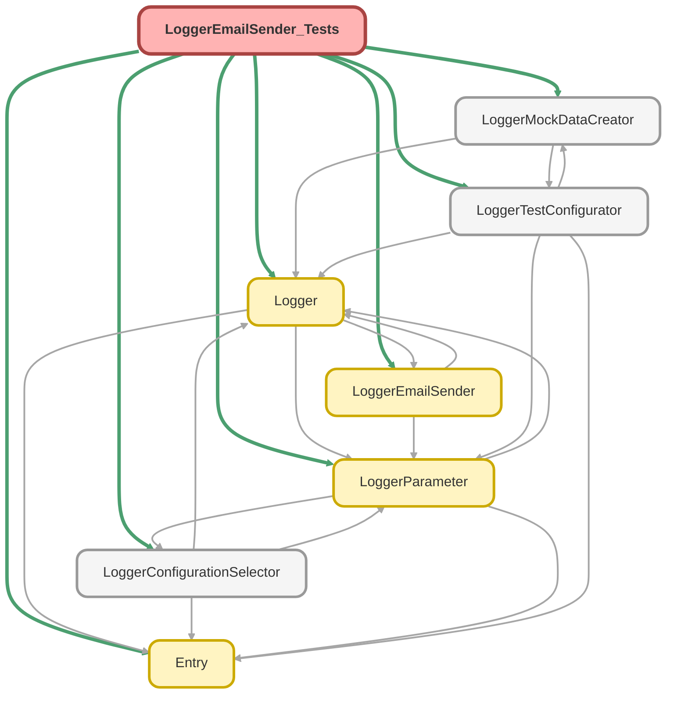

---
hide:
  - path
---

# LoggerEmailSender_Tests Class

`SUPPRESSWARNINGS`
`ISTEST`

## Class Diagram



<!-- Apex description -->

## Apex Code

```java
//------------------------------------------------------------------------------------------------//
// This file is part of the Nebula Logger project, released under the MIT License.                //
// See LICENSE file or go to https://github.com/jongpie/NebulaLogger for full license details.    //
//------------------------------------------------------------------------------------------------//

@SuppressWarnings('PMD.MethodNamingConventions, PMD.PropertyNamingConventions')
@IsTest(IsParallel=true)
private class LoggerEmailSender_Tests {
  private static final Boolean IS_EMAIL_DELIVERABILITY_ENABLED {
    get {
      if (IS_EMAIL_DELIVERABILITY_ENABLED == null) {
        try {
          System.Messaging.reserveSingleEmailCapacity(1);
          IS_EMAIL_DELIVERABILITY_ENABLED = true;
        } catch (System.NoAccessException e) {
          IS_EMAIL_DELIVERABILITY_ENABLED = false;
        }
      }
      return IS_EMAIL_DELIVERABILITY_ENABLED;
    }
    set;
  }

  static {
    // Don't use the org's actual custom metadata records when running tests
    LoggerConfigurationSelector.useMocks();
  }

  @IsTest
  static void it_should_indicate_email_deliverability_is_based_on_email_deliverability_when_org_limits_not_exceeded() {
    System.OrgLimit singleEmailOrgLimit = OrgLimits.getMap().get('SingleEmail');
    System.Assert.isTrue(singleEmailOrgLimit.getValue() < singleEmailOrgLimit.getLimit());

    System.Assert.areEqual(IS_EMAIL_DELIVERABILITY_ENABLED, LoggerEmailSender.IS_EMAIL_DELIVERABILITY_AVAILABLE);
  }

  @IsTest
  static void it_should_indicate_email_deliverability_is_not_available_when_org_limits_exceeded() {
    // No need to fail the test if it's running in an org that does not have email deliverability enabled
    if (IS_EMAIL_DELIVERABILITY_ENABLED == false) {
      return;
    }

    System.OrgLimit singleEmailOrgLimit = OrgLimits.getMap().get('SingleEmail');

    // Reserve all of the available single email capacity, which is the effectively
    // the same as the email limit being exceeded in the org
    System.Messaging.reserveSingleEmailCapacity(singleEmailOrgLimit.getLimit() - singleEmailOrgLimit.getValue() - 1);

    System.Assert.isFalse(LoggerEmailSender.IS_EMAIL_DELIVERABILITY_AVAILABLE);
  }

  @IsTest
  static void it_should_send_email_notification_for_saveResult_errors_when_enabled() {
    LoggerEmailSender.MOCK_NOTIFICATIONS.add(new Schema.ApexEmailNotification(Email = 'some.email@test.com'));
    LoggerEmailSender.MOCK_NOTIFICATIONS.add(new Schema.ApexEmailNotification(UserId = System.UserInfo.getUserId()));
    System.Assert.areEqual(0, System.Limits.getEmailInvocations(), 'No emails should have been sent yet');

    Database.SaveResult saveResultWithError = LoggerMockDataCreator.createDatabaseSaveResult(false);
    LoggerEmailSender.sendErrorEmail(Schema.LogEntry__c.SObjectType, new List<Database.SaveResult>{ saveResultWithError });

    System.Assert.isTrue(
      LoggerEmailSender.SENT_EMAILS.get(0).getHtmlBody().contains(saveResultWithError.errors.get(0).getMessage()),
      'Email message should contain SaveResult error message'
    );
    List<String> errorFields = saveResultWithError.getErrors().get(0).getFields();
    String expectedFieldsError = 'Field(s): [' + String.join(errorFields, ', ') + ']';
    System.Assert.isTrue(
      LoggerEmailSender.SENT_EMAILS.get(0).getHtmlBody().contains(expectedFieldsError),
      'Email message should contain SaveResult error fields: ' + expectedFieldsError
    );
    if (LoggerEmailSender.IS_EMAIL_DELIVERABILITY_AVAILABLE) {
      System.Assert.areEqual(1, System.Limits.getEmailInvocations(), 'Email should have been sent');
    } else {
      System.Assert.areEqual(0, System.Limits.getEmailInvocations(), 'Deliverability is not currently enabled');
    }
  }

  @IsTest
  static void it_should_not_send_email_notification_for_saveResult_errors_when_no_recipients_configured() {
    LoggerTestConfigurator.setMock(new LoggerParameter__mdt(DeveloperName = 'SendErrorEmailNotifications', Value__c = 'true'));
    System.Assert.isTrue(LoggerParameter.SEND_ERROR_EMAIL_NOTIFICATIONS);
    LoggerEmailSender.CACHED_APEX_ERROR_RECIPIENTS.clear();
    System.Assert.areEqual(0, System.Limits.getEmailInvocations(), 'No emails should have been sent yet');

    Database.SaveResult saveResultWithError = LoggerMockDataCreator.createDatabaseSaveResult(false);
    LoggerEmailSender.sendErrorEmail(Schema.LogEntry__c.SObjectType, new List<Database.SaveResult>{ saveResultWithError });

    System.Assert.isTrue(LoggerEmailSender.SENT_EMAILS.isEmpty(), 'No email messages should have been generated');
    System.Assert.areEqual(0, System.Limits.getEmailInvocations(), 'No emails should have been sent');
  }

  @IsTest
  static void it_should_not_send_email_notification_for_saveResult_errors_when_disabled() {
    LoggerTestConfigurator.setMock(new LoggerParameter__mdt(DeveloperName = 'SendErrorEmailNotifications', Value__c = 'false'));
    System.Assert.isFalse(LoggerParameter.SEND_ERROR_EMAIL_NOTIFICATIONS);
    LoggerEmailSender.MOCK_NOTIFICATIONS.add(new Schema.ApexEmailNotification(Email = 'some.email@test.com'));
    LoggerEmailSender.MOCK_NOTIFICATIONS.add(new Schema.ApexEmailNotification(UserId = System.UserInfo.getUserId()));
    System.Assert.areEqual(0, System.Limits.getEmailInvocations(), 'No emails should have been sent yet');

    Database.SaveResult saveResultWithError = LoggerMockDataCreator.createDatabaseSaveResult(false);
    LoggerEmailSender.sendErrorEmail(Schema.LogEntry__c.SObjectType, new List<Database.SaveResult>{ saveResultWithError });

    System.Assert.isTrue(LoggerEmailSender.SENT_EMAILS.isEmpty(), 'No email messages should have been generated');
    System.Assert.areEqual(0, System.Limits.getEmailInvocations(), 'No emails should have been sent');
  }

  @IsTest
  static void it_should_send_email_notification_for_upsertResult_errors_when_enabled() {
    LoggerEmailSender.MOCK_NOTIFICATIONS.add(new Schema.ApexEmailNotification(Email = 'some.email@test.com'));
    LoggerEmailSender.MOCK_NOTIFICATIONS.add(new Schema.ApexEmailNotification(UserId = System.UserInfo.getUserId()));
    System.Assert.areEqual(0, System.Limits.getEmailInvocations(), 'No emails should have been sent yet');

    Database.UpsertResult upsertResultWithError = LoggerMockDataCreator.createDatabaseUpsertResult(false, false);
    LoggerEmailSender.sendErrorEmail(Schema.LogEntry__c.SObjectType, new List<Database.UpsertResult>{ upsertResultWithError });

    System.Assert.isTrue(
      LoggerEmailSender.SENT_EMAILS.get(0).getHtmlBody().contains(upsertResultWithError.errors.get(0).getMessage()),
      'Email message should contain UpsertResult error message'
    );
    List<String> errorFields = upsertResultWithError.getErrors().get(0).getFields();
    String expectedFieldsError = 'Field(s): [' + String.join(errorFields, ', ') + ']';
    System.Assert.isTrue(
      LoggerEmailSender.SENT_EMAILS.get(0).getHtmlBody().contains(expectedFieldsError),
      'Email message should contain UpsertResult error fields: ' + expectedFieldsError
    );
    if (LoggerEmailSender.IS_EMAIL_DELIVERABILITY_AVAILABLE) {
      System.Assert.areEqual(1, System.Limits.getEmailInvocations(), 'Email should have been sent');
    } else {
      System.Assert.areEqual(0, System.Limits.getEmailInvocations(), 'Deliverability is not currently enabled');
    }
  }

  @IsTest
  static void it_should_not_send_email_notification_for_upsertResult_errors_when_no_recipients_configured() {
    LoggerTestConfigurator.setMock(new LoggerParameter__mdt(DeveloperName = 'SendErrorEmailNotifications', Value__c = 'true'));
    System.Assert.isTrue(LoggerParameter.SEND_ERROR_EMAIL_NOTIFICATIONS);
    LoggerEmailSender.CACHED_APEX_ERROR_RECIPIENTS.clear();
    System.Assert.areEqual(0, System.Limits.getEmailInvocations(), 'No emails should have been sent yet');

    Database.UpsertResult upsertResultWithError = LoggerMockDataCreator.createDatabaseUpsertResult(false, false);
    LoggerEmailSender.sendErrorEmail(Schema.LogEntry__c.SObjectType, new List<Database.UpsertResult>{ upsertResultWithError });

    System.Assert.isTrue(LoggerEmailSender.SENT_EMAILS.isEmpty(), 'No email messages should have been generated');
    System.Assert.areEqual(0, System.Limits.getEmailInvocations(), 'No emails should have been sent');
  }

  @IsTest
  static void it_should_not_send_email_notification_for_upsertResult_errors_when_disabled() {
    LoggerTestConfigurator.setMock(new LoggerParameter__mdt(DeveloperName = 'SendErrorEmailNotifications', Value__c = 'false'));
    System.Assert.isFalse(LoggerParameter.SEND_ERROR_EMAIL_NOTIFICATIONS);
    LoggerEmailSender.MOCK_NOTIFICATIONS.add(new Schema.ApexEmailNotification(Email = 'some.email@test.com'));
    LoggerEmailSender.MOCK_NOTIFICATIONS.add(new Schema.ApexEmailNotification(UserId = System.UserInfo.getUserId()));
    System.Assert.areEqual(0, System.Limits.getEmailInvocations(), 'No emails should have been sent yet');

    Database.UpsertResult upsertResultWithError = LoggerMockDataCreator.createDatabaseUpsertResult(false, false);
    LoggerEmailSender.sendErrorEmail(Schema.LogEntry__c.SObjectType, new List<Database.UpsertResult>{ upsertResultWithError });

    System.Assert.areEqual(0, System.Limits.getEmailInvocations(), 'No emails should have been sent');
    System.Assert.isTrue(LoggerEmailSender.SENT_EMAILS.isEmpty(), 'No email messages should have been generated');
  }
}
```

## Properties
### `IS_EMAIL_DELIVERABILITY_ENABLED`

#### Signature
```apex
private static final IS_EMAIL_DELIVERABILITY_ENABLED
```

#### Type
Boolean

## Methods
### `it_should_indicate_email_deliverability_is_based_on_email_deliverability_when_org_limits_not_exceeded()`

`ISTEST`

#### Signature
```apex
private static void it_should_indicate_email_deliverability_is_based_on_email_deliverability_when_org_limits_not_exceeded()
```

#### Return Type
**void**

---

### `it_should_indicate_email_deliverability_is_not_available_when_org_limits_exceeded()`

`ISTEST`

#### Signature
```apex
private static void it_should_indicate_email_deliverability_is_not_available_when_org_limits_exceeded()
```

#### Return Type
**void**

---

### `it_should_send_email_notification_for_saveResult_errors_when_enabled()`

`ISTEST`

#### Signature
```apex
private static void it_should_send_email_notification_for_saveResult_errors_when_enabled()
```

#### Return Type
**void**

---

### `it_should_not_send_email_notification_for_saveResult_errors_when_no_recipients_configured()`

`ISTEST`

#### Signature
```apex
private static void it_should_not_send_email_notification_for_saveResult_errors_when_no_recipients_configured()
```

#### Return Type
**void**

---

### `it_should_not_send_email_notification_for_saveResult_errors_when_disabled()`

`ISTEST`

#### Signature
```apex
private static void it_should_not_send_email_notification_for_saveResult_errors_when_disabled()
```

#### Return Type
**void**

---

### `it_should_send_email_notification_for_upsertResult_errors_when_enabled()`

`ISTEST`

#### Signature
```apex
private static void it_should_send_email_notification_for_upsertResult_errors_when_enabled()
```

#### Return Type
**void**

---

### `it_should_not_send_email_notification_for_upsertResult_errors_when_no_recipients_configured()`

`ISTEST`

#### Signature
```apex
private static void it_should_not_send_email_notification_for_upsertResult_errors_when_no_recipients_configured()
```

#### Return Type
**void**

---

### `it_should_not_send_email_notification_for_upsertResult_errors_when_disabled()`

`ISTEST`

#### Signature
```apex
private static void it_should_not_send_email_notification_for_upsertResult_errors_when_disabled()
```

#### Return Type
**void**