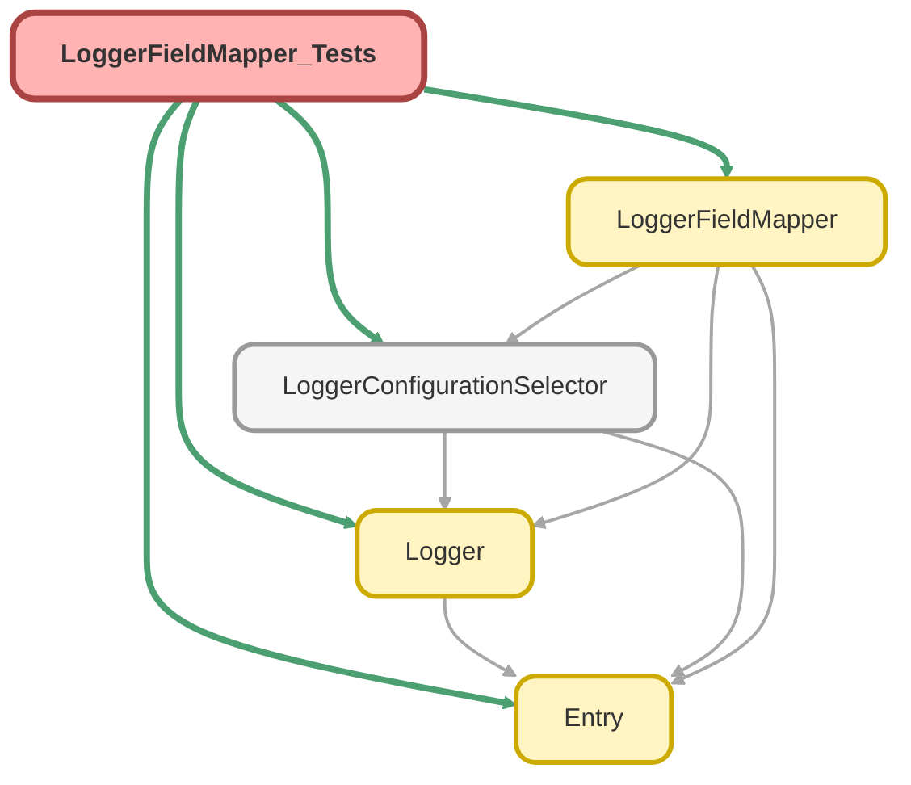

---
hide:
  - path
---

# LoggerFieldMapper_Tests Class

`SUPPRESSWARNINGS`
`ISTEST`

## Class Diagram



<!-- Apex description -->

## Apex Code

```java
//------------------------------------------------------------------------------------------------//
// This file is part of the Nebula Logger project, released under the MIT License.                //
// See LICENSE file or go to https://github.com/jongpie/NebulaLogger for full license details.    //
//------------------------------------------------------------------------------------------------//

@SuppressWarnings('PMD.MethodNamingConventions, PMD.PropertyNamingConventions')
@IsTest(IsParallel=true)
private class LoggerFieldMapper_Tests {
  static {
    // Don't use the org's actual custom metadata records when running tests
    LoggerConfigurationSelector.useMocks();
  }

  // DELETEME Deprecated method, remove in a future release
  @IsTest
  static void it_should_throw_exception_when_mock_record_developer_name_is_null() {
    LoggerFieldMapping__mdt mockFieldMapping = new LoggerFieldMapping__mdt(DeveloperName = null);
    System.Exception thrownIllegalArgumentException;

    try {
      LoggerFieldMapper.setMock(mockFieldMapping);
    } catch (System.IllegalArgumentException ex) {
      thrownIllegalArgumentException = ex;
    }

    System.Assert.isNotNull(thrownIllegalArgumentException);
  }

  @IsTest
  static void it_safely_returns_when_no_field_mappings_are_configured() {
    LogEntryEvent__e logEntryEvent = new LogEntryEvent__e(Message__c = 'Some value');
    LogEntry__c logEntry = new LogEntry__c();

    LoggerFieldMapper.mapFieldValues(logEntryEvent, logEntry);

    System.Assert.isTrue(logEntry.getPopulatedFieldsAsMap().isEmpty(), System.JSON.serialize(logEntry));
  }

  @IsTest
  static void it_safely_returns_when_target_record_is_null() {
    LoggerConfigurationSelector.mockLoggerFieldMappings.add(
      new LoggerFieldMapping__mdt(
        DeveloperName = 'SomeDevName',
        IsEnabled__c = true,
        SourceSObjectType__c = Schema.LogEntryEvent__e.SObjectType.toString(),
        SourceField__c = Schema.LogEntryEvent__e.Message__c.toString(),
        TargetSObjectType__c = Schema.LogEntry__c.SObjectType.toString(),
        TargetField__c = Schema.LogEntry__c.Message__c.toString()
      )
    );
    LogEntryEvent__e logEntryEvent = new LogEntryEvent__e(Message__c = 'Some value');
    LogEntry__c logEntry = null;

    LoggerFieldMapper.mapFieldValues(logEntryEvent, logEntry);

    System.Assert.isNull(logEntry, System.JSON.serialize(logEntry));
  }

  @IsTest
  static void it_safely_returns_when_source_record_is_null() {
    LoggerConfigurationSelector.mockLoggerFieldMappings.add(
      new LoggerFieldMapping__mdt(
        DeveloperName = 'SomeDevName',
        IsEnabled__c = true,
        SourceSObjectType__c = Schema.LogEntryEvent__e.SObjectType.toString(),
        SourceField__c = Schema.LogEntryEvent__e.Message__c.toString(),
        TargetSObjectType__c = Schema.LogEntry__c.SObjectType.toString(),
        TargetField__c = Schema.LogEntry__c.Message__c.toString()
      )
    );
    LogEntryEvent__e logEntryEvent = null;
    LogEntry__c logEntry = new LogEntry__c();

    LoggerFieldMapper.mapFieldValues(logEntryEvent, logEntry);

    System.Assert.isTrue(logEntry.getPopulatedFieldsAsMap().isEmpty(), System.JSON.serialize(logEntry));
  }

  // DELETEME Deprecated method, remove in a future release
  @IsTest
  static void it_maps_field_value_when_configured_with_deprecated_set_mock_method() {
    LoggerFieldMapper.setMock(
      new LoggerFieldMapping__mdt(
        DeveloperName = 'SomeDevName',
        IsEnabled__c = true,
        SourceSObjectType__c = Schema.LogEntryEvent__e.SObjectType.toString(),
        SourceField__c = Schema.LogEntryEvent__e.Message__c.toString(),
        TargetSObjectType__c = Schema.LogEntry__c.SObjectType.toString(),
        TargetField__c = Schema.LogEntry__c.Message__c.toString()
      )
    );
    LogEntryEvent__e logEntryEvent = new LogEntryEvent__e(Message__c = 'Some value');
    LogEntry__c logEntry = new LogEntry__c();

    LoggerFieldMapper.mapFieldValues(logEntryEvent, logEntry);

    System.Assert.isTrue(logEntry.getPopulatedFieldsAsMap().containsKey(Schema.LogEntry__c.Message__c.toString()), System.JSON.serialize(logEntry));
    System.Assert.areEqual(logEntryEvent.Message__c, logEntry.Message__c);
  }

  @IsTest
  static void it_maps_field_value_when_configured() {
    LoggerConfigurationSelector.mockLoggerFieldMappings.add(
      new LoggerFieldMapping__mdt(
        DeveloperName = 'SomeDevName',
        IsEnabled__c = true,
        SourceSObjectType__c = Schema.LogEntryEvent__e.SObjectType.toString(),
        SourceField__c = Schema.LogEntryEvent__e.Message__c.toString(),
        TargetSObjectType__c = Schema.LogEntry__c.SObjectType.toString(),
        TargetField__c = Schema.LogEntry__c.Message__c.toString()
      )
    );
    LogEntryEvent__e logEntryEvent = new LogEntryEvent__e(Message__c = 'Some value');
    LogEntry__c logEntry = new LogEntry__c();

    LoggerFieldMapper.mapFieldValues(logEntryEvent, logEntry);

    System.Assert.isTrue(logEntry.getPopulatedFieldsAsMap().containsKey(Schema.LogEntry__c.Message__c.toString()), System.JSON.serialize(logEntry));
    System.Assert.areEqual(logEntryEvent.Message__c, logEntry.Message__c);
  }

  @IsTest
  static void it_maps_field_values_for_multiple_target_sobject_types_when_configured() {
    LoggerConfigurationSelector.mockLoggerFieldMappings.add(
      new LoggerFieldMapping__mdt(
        DeveloperName = 'AnotherDevName',
        IsEnabled__c = true,
        SourceSObjectType__c = Schema.LogEntryEvent__e.SObjectType.toString(),
        SourceField__c = Schema.LogEntryEvent__e.HttpRequestEndpoint__c.toString(),
        TargetSObjectType__c = Schema.Log__c.SObjectType.toString(),
        TargetField__c = Schema.Log__c.Comments__c.toString()
      )
    );
    LoggerConfigurationSelector.mockLoggerFieldMappings.add(
      new LoggerFieldMapping__mdt(
        DeveloperName = 'SomeDevName',
        IsEnabled__c = true,
        SourceSObjectType__c = Schema.LogEntryEvent__e.SObjectType.toString(),
        SourceField__c = Schema.LogEntryEvent__e.Message__c.toString(),
        TargetSObjectType__c = Schema.LogEntry__c.SObjectType.toString(),
        TargetField__c = Schema.LogEntry__c.Message__c.toString()
      )
    );
    LogEntryEvent__e logEntryEvent = new LogEntryEvent__e(
      HttpRequestEndpoint__c = 'https://some-endpoint-mapped-to-comments.for.some.reason.com',
      Message__c = 'Some value'
    );
    Log__c log = new Log__c();
    LogEntry__c logEntry = new LogEntry__c();

    LoggerFieldMapper.mapFieldValues(logEntryEvent, log);
    LoggerFieldMapper.mapFieldValues(logEntryEvent, logEntry);

    System.Assert.isTrue(log.getPopulatedFieldsAsMap().containsKey(Schema.Log__c.Comments__c.toString()), System.JSON.serialize(log));
    System.Assert.areEqual(logEntryEvent.HttpRequestEndpoint__c, log.Comments__c);
    System.Assert.isTrue(logEntry.getPopulatedFieldsAsMap().containsKey(Schema.LogEntry__c.Message__c.toString()), System.JSON.serialize(logEntry));
    System.Assert.areEqual(logEntryEvent.Message__c, logEntry.Message__c);
  }

  @IsTest
  static void it_truncates_string_value_when_mapping_string_field_value() {
    LoggerConfigurationSelector.mockLoggerFieldMappings.add(
      new LoggerFieldMapping__mdt(
        DeveloperName = 'SomeDevName',
        IsEnabled__c = true,
        SourceSObjectType__c = Schema.LogEntryEvent__e.SObjectType.toString(),
        SourceField__c = Schema.LogEntryEvent__e.Message__c.toString(),
        TargetSObjectType__c = Schema.LogEntry__c.SObjectType.toString(),
        TargetField__c = Schema.LogEntry__c.Message__c.toString()
      )
    );
    Integer messageMaxLength = Schema.LogEntryEvent__e.Message__c.getDescribe().getLength();
    LogEntryEvent__e logEntryEvent = new LogEntryEvent__e(Message__c = 'A'.repeat(messageMaxLength + 1));
    LogEntry__c logEntry = new LogEntry__c();

    LoggerFieldMapper.mapFieldValues(logEntryEvent, logEntry);

    System.Assert.isTrue(logEntry.getPopulatedFieldsAsMap().containsKey(Schema.LogEntry__c.Message__c.toString()), System.JSON.serialize(logEntry));
    System.Assert.areEqual(
      logEntryEvent.Message__c.left(messageMaxLength),
      logEntry.Message__c,
      'Expected length of ' + logEntryEvent.Message__c.left(messageMaxLength).length() + ', received length ' + logEntry.Message__c.length()
    );
  }

  @IsTest
  static void it_handles_when_field_mappings_are_not_configured_for_current_target_sobject_type_but_do_exist_for_other_types() {
    LoggerConfigurationSelector.mockLoggerFieldMappings.add(
      new LoggerFieldMapping__mdt(
        DeveloperName = 'SomeDevName',
        IsEnabled__c = true,
        SourceSObjectType__c = Schema.LogEntryEvent__e.SObjectType.toString(),
        SourceField__c = Schema.LogEntryEvent__e.TransactionId__c.toString(),
        TargetSObjectType__c = Schema.Log__c.SObjectType.toString(),
        TargetField__c = Schema.Log__c.TransactionId__c.toString()
      )
    );
    LogEntryEvent__e logEntryEvent = new LogEntryEvent__e(Message__c = 'Some value');
    LogEntry__c logEntry = new LogEntry__c();

    LoggerFieldMapper.mapFieldValues(logEntryEvent, logEntry);

    System.Assert.isTrue(logEntry.getPopulatedFieldsAsMap().isEmpty(), System.JSON.serialize(logEntry));
  }

  @IsTest
  static void it_safely_skips_field_mappings_for_incompatible_field_mappings() {
    LoggerConfigurationSelector.mockLoggerFieldMappings.add(
      new LoggerFieldMapping__mdt(
        DeveloperName = '🥳 Some Valid Mapping',
        IsEnabled__c = true,
        SourceSObjectType__c = Schema.LogEntryEvent__e.SObjectType.toString(),
        SourceField__c = Schema.LogEntryEvent__e.EntryScenario__c.toString(),
        TargetSObjectType__c = Schema.LogEntry__c.SObjectType.toString(),
        TargetField__c = Schema.LogEntry__c.EntryScenario__c.toString()
      )
    );
    LoggerConfigurationSelector.mockLoggerFieldMappings.add(
      new LoggerFieldMapping__mdt(
        DeveloperName = '😭 An Incompatible Mapping (mapping a String to a Datetime)',
        IsEnabled__c = true,
        SourceSObjectType__c = Schema.LogEntryEvent__e.SObjectType.toString(),
        SourceField__c = Schema.LogEntryEvent__e.Message__c.toString(),
        TargetSObjectType__c = Schema.LogEntry__c.SObjectType.toString(),
        TargetField__c = Schema.LogEntry__c.Timestamp__c.toString()
      )
    );
    LoggerConfigurationSelector.mockLoggerFieldMappings.add(
      new LoggerFieldMapping__mdt(
        DeveloperName = '😀 Another Valid Mapping',
        IsEnabled__c = true,
        SourceSObjectType__c = Schema.LogEntryEvent__e.SObjectType.toString(),
        SourceField__c = Schema.LogEntryEvent__e.TransactionEntryNumber__c.toString(),
        TargetSObjectType__c = Schema.LogEntry__c.SObjectType.toString(),
        TargetField__c = Schema.LogEntry__c.TransactionEntryNumber__c.toString()
      )
    );
    LogEntryEvent__e logEntryEvent = new LogEntryEvent__e(
      EntryScenario__c = 'Some entry scenario',
      Message__c = 'Some value',
      TransactionEntryNumber__c = 9999
    );
    LogEntry__c logEntry = new LogEntry__c(Message__c = 'Some string value that definitely will fail to map to LogEntry__c.Timestamp__c');

    LoggerFieldMapper.mapFieldValues(logEntryEvent, logEntry);

    System.Assert.areEqual(logEntryEvent.EntryScenario__c, logEntry.EntryScenario__c, System.JSON.serialize(logEntry));
    System.Assert.isNull(logEntry.Timestamp__c, System.JSON.serialize(logEntry));
    System.Assert.areEqual(logEntryEvent.TransactionEntryNumber__c, logEntry.TransactionEntryNumber__c, System.JSON.serialize(logEntry));
  }
}
```

## Methods
### `it_should_throw_exception_when_mock_record_developer_name_is_null()`

`ISTEST`

#### Signature
```apex
private static void it_should_throw_exception_when_mock_record_developer_name_is_null()
```

#### Return Type
**void**

---

### `it_safely_returns_when_no_field_mappings_are_configured()`

`ISTEST`

#### Signature
```apex
private static void it_safely_returns_when_no_field_mappings_are_configured()
```

#### Return Type
**void**

---

### `it_safely_returns_when_target_record_is_null()`

`ISTEST`

#### Signature
```apex
private static void it_safely_returns_when_target_record_is_null()
```

#### Return Type
**void**

---

### `it_safely_returns_when_source_record_is_null()`

`ISTEST`

#### Signature
```apex
private static void it_safely_returns_when_source_record_is_null()
```

#### Return Type
**void**

---

### `it_maps_field_value_when_configured_with_deprecated_set_mock_method()`

`ISTEST`

#### Signature
```apex
private static void it_maps_field_value_when_configured_with_deprecated_set_mock_method()
```

#### Return Type
**void**

---

### `it_maps_field_value_when_configured()`

`ISTEST`

#### Signature
```apex
private static void it_maps_field_value_when_configured()
```

#### Return Type
**void**

---

### `it_maps_field_values_for_multiple_target_sobject_types_when_configured()`

`ISTEST`

#### Signature
```apex
private static void it_maps_field_values_for_multiple_target_sobject_types_when_configured()
```

#### Return Type
**void**

---

### `it_truncates_string_value_when_mapping_string_field_value()`

`ISTEST`

#### Signature
```apex
private static void it_truncates_string_value_when_mapping_string_field_value()
```

#### Return Type
**void**

---

### `it_handles_when_field_mappings_are_not_configured_for_current_target_sobject_type_but_do_exist_for_other_types()`

`ISTEST`

#### Signature
```apex
private static void it_handles_when_field_mappings_are_not_configured_for_current_target_sobject_type_but_do_exist_for_other_types()
```

#### Return Type
**void**

---

### `it_safely_skips_field_mappings_for_incompatible_field_mappings()`

`ISTEST`

#### Signature
```apex
private static void it_safely_skips_field_mappings_for_incompatible_field_mappings()
```

#### Return Type
**void**