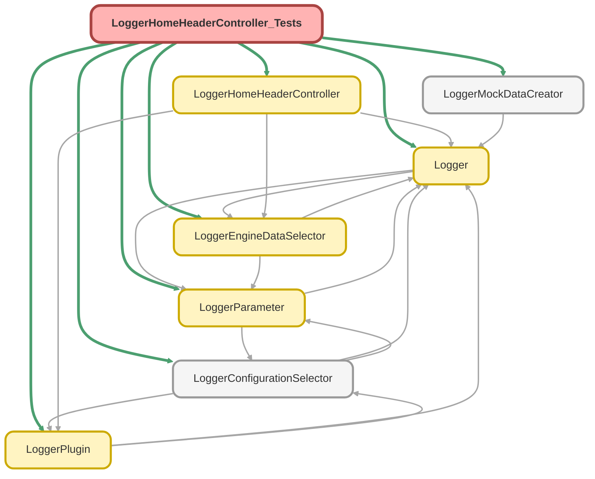

---
hide:
  - path
---

# LoggerHomeHeaderController_Tests Class

`SUPPRESSWARNINGS`
`ISTEST`

## Class Diagram



<!-- Apex description -->

## Apex Code

```java
//------------------------------------------------------------------------------------------------//
// This file is part of the Nebula Logger project, released under the MIT License.                //
// See LICENSE file or go to https://github.com/jongpie/NebulaLogger for full license details.    //
//------------------------------------------------------------------------------------------------//

@SuppressWarnings('PMD.MethodNamingConventions')
@IsTest(IsParallel=true)
private class LoggerHomeHeaderController_Tests {
  static {
    // Don't use the org's actual custom metadata records when running tests
    LoggerConfigurationSelector.useMocks();
  }

  @IsTest
  public static void it_returns_environment_details_when_status_api_callout_is_enabled() {
    LoggerParameter.setMock(new LoggerParameter__mdt(DeveloperName = 'CallStatusApi', Value__c = System.JSON.serialize(true)));
    Logger.StatusApiResponse mockApiResponse = createMockStatusApiResponse();
    Logger.StatusApiResponseProduct mockProduct1 = new Logger.StatusApiResponseProduct();
    mockProduct1.name = 'The first product listed';
    Logger.StatusApiResponseProduct mockProduct2 = new Logger.StatusApiResponseProduct();
    mockProduct2.name = 'The second product listed';
    mockApiResponse.Products = new List<Logger.StatusApiResponseProduct>{ mockProduct1, mockProduct2 };
    System.Test.setMock(
      System.HttpCalloutMock.class,
      LoggerMockDataCreator.createHttpCallout().setStatusCode(200).setResponseBody(System.JSON.serialize(mockApiResponse))
    );

    LoggerHomeHeaderController.Environment returnedEnvironment = LoggerHomeHeaderController.getEnvironmentDetails();

    Schema.Organization organization = LoggerEngineDataSelector.getInstance().getCachedOrganization();
    System.Assert.areEqual(0, returnedEnvironment.loggerEnabledPluginsCount);
    System.Assert.isNull(returnedEnvironment.loggerEnabledPlugins);
    System.Assert.areEqual(String.isNotBlank(Logger.getNamespacePrefix()) ? Logger.getNamespacePrefix() : '(none)', returnedEnvironment.loggerNamespacePrefix);
    System.Assert.areEqual(Logger.getVersionNumber(), returnedEnvironment.loggerVersionNumber);
    System.Assert.areEqual(Logger.getOrganizationApiVersion(), returnedEnvironment.organizationApiVersion);
    System.Assert.areEqual(organization.CreatedBy.Username, returnedEnvironment.organizationCreatedByUsername);
    System.Assert.areEqual(System.URL.getOrgDomainUrl()?.toExternalForm(), returnedEnvironment.organizationDomainUrl);
    System.Assert.areEqual(organization.CreatedDate.format(), returnedEnvironment.organizationFormattedCreatedDate);
    System.Assert.areEqual(System.UserInfo.getOrganizationId(), returnedEnvironment.organizationId);
    System.Assert.areEqual(mockApiResponse.location, returnedEnvironment.organizationInstanceLocation);
    System.Assert.areEqual(organization.InstanceName, returnedEnvironment.organizationInstanceName);
    System.Assert.areEqual(mockProduct1.name + ', ' + mockProduct2.name, returnedEnvironment.organizationInstanceProducts);
    System.Assert.areEqual(mockApiResponse.maintenanceWindow, returnedEnvironment.organizationMaintenanceWindow);
    System.Assert.areEqual(System.UserInfo.getOrganizationName(), returnedEnvironment.organizationName);
    System.Assert.areEqual(mockApiResponse.releaseNumber, returnedEnvironment.organizationReleaseNumber);
    System.Assert.areEqual(mockApiResponse.releaseVersion, returnedEnvironment.organizationReleaseVersion);
    System.Assert.areEqual(organization.OrganizationType, returnedEnvironment.organizationType);
  }

  @IsTest
  public static void it_returns_environment_details_when_status_api_callout_does_not_provide_instance_products_list() {
    LoggerParameter.setMock(new LoggerParameter__mdt(DeveloperName = 'CallStatusApi', Value__c = System.JSON.serialize(true)));
    Logger.StatusApiResponse mockApiResponse = createMockStatusApiResponse();
    mockApiResponse.Products = null;
    System.Test.setMock(
      System.HttpCalloutMock.class,
      LoggerMockDataCreator.createHttpCallout().setStatusCode(200).setResponseBody(System.JSON.serialize(mockApiResponse))
    );

    LoggerHomeHeaderController.Environment returnedEnvironment = LoggerHomeHeaderController.getEnvironmentDetails();

    Schema.Organization organization = LoggerEngineDataSelector.getInstance().getCachedOrganization();
    System.Assert.areEqual(0, returnedEnvironment.loggerEnabledPluginsCount);
    System.Assert.isNull(returnedEnvironment.loggerEnabledPlugins);
    System.Assert.areEqual(String.isNotBlank(Logger.getNamespacePrefix()) ? Logger.getNamespacePrefix() : '(none)', returnedEnvironment.loggerNamespacePrefix);
    System.Assert.areEqual(Logger.getVersionNumber(), returnedEnvironment.loggerVersionNumber);
    System.Assert.areEqual(Logger.getOrganizationApiVersion(), returnedEnvironment.organizationApiVersion);
    System.Assert.areEqual(organization.CreatedBy.Username, returnedEnvironment.organizationCreatedByUsername);
    System.Assert.areEqual(System.URL.getOrgDomainUrl()?.toExternalForm(), returnedEnvironment.organizationDomainUrl);
    System.Assert.areEqual(organization.CreatedDate.format(), returnedEnvironment.organizationFormattedCreatedDate);
    System.Assert.areEqual(System.UserInfo.getOrganizationId(), returnedEnvironment.organizationId);
    System.Assert.areEqual(mockApiResponse.location, returnedEnvironment.organizationInstanceLocation);
    System.Assert.areEqual('Unknown', returnedEnvironment.organizationInstanceProducts);
    System.Assert.areEqual(organization.InstanceName, returnedEnvironment.organizationInstanceName);
    System.Assert.areEqual(mockApiResponse.maintenanceWindow, returnedEnvironment.organizationMaintenanceWindow);
    System.Assert.areEqual(System.UserInfo.getOrganizationName(), returnedEnvironment.organizationName);
    System.Assert.areEqual(mockApiResponse.releaseNumber, returnedEnvironment.organizationReleaseNumber);
    System.Assert.areEqual(mockApiResponse.releaseVersion, returnedEnvironment.organizationReleaseVersion);
    System.Assert.areEqual(organization.OrganizationType, returnedEnvironment.organizationType);
  }

  @IsTest
  public static void it_returns_environment_details_when_status_api_callout_is_disabled() {
    LoggerParameter.setMock(new LoggerParameter__mdt(DeveloperName = 'CallStatusApi', Value__c = System.JSON.serialize(false)));

    LoggerHomeHeaderController.Environment returnedEnvironment = LoggerHomeHeaderController.getEnvironmentDetails();

    Schema.Organization organization = LoggerEngineDataSelector.getInstance().getCachedOrganization();
    System.Assert.areEqual(0, returnedEnvironment.loggerEnabledPluginsCount);
    System.Assert.isNull(returnedEnvironment.loggerEnabledPlugins);
    System.Assert.areEqual(String.isNotBlank(Logger.getNamespacePrefix()) ? Logger.getNamespacePrefix() : '(none)', returnedEnvironment.loggerNamespacePrefix);
    System.Assert.areEqual(Logger.getVersionNumber(), returnedEnvironment.loggerVersionNumber);
    System.Assert.areEqual(Logger.getOrganizationApiVersion(), returnedEnvironment.organizationApiVersion);
    System.Assert.areEqual(organization.CreatedBy.Username, returnedEnvironment.organizationCreatedByUsername);
    System.Assert.areEqual(System.URL.getOrgDomainUrl()?.toExternalForm(), returnedEnvironment.organizationDomainUrl);
    System.Assert.areEqual(organization.CreatedDate.format(), returnedEnvironment.organizationFormattedCreatedDate);
    System.Assert.areEqual(System.UserInfo.getOrganizationId(), returnedEnvironment.organizationId);
    System.Assert.areEqual('Unknown', returnedEnvironment.organizationInstanceLocation);
    System.Assert.areEqual(organization.InstanceName, returnedEnvironment.organizationInstanceName);
    System.Assert.areEqual('Unknown', returnedEnvironment.organizationInstanceProducts);
    System.Assert.areEqual('Unknown', returnedEnvironment.organizationMaintenanceWindow);
    System.Assert.areEqual(System.UserInfo.getOrganizationName(), returnedEnvironment.organizationName);
    System.Assert.areEqual('Unknown', returnedEnvironment.organizationReleaseNumber);
    System.Assert.areEqual('Unknown', returnedEnvironment.organizationReleaseVersion);
    System.Assert.areEqual(organization.OrganizationType, returnedEnvironment.organizationType);
  }

  @IsTest
  public static void it_returns_environment_details_when_plugins_are_installed() {
    LoggerParameter.setMock(new LoggerParameter__mdt(DeveloperName = 'CallStatusApi', Value__c = System.JSON.serialize(false)));
    LoggerPlugin__mdt firstMockPluginConfiguration = createMockPluginConfiguration('Some_Mock_Plugin_Configuration');
    LoggerPlugin.setMock(firstMockPluginConfiguration);
    LoggerPlugin__mdt secondMockPluginConfiguration = createMockPluginConfiguration('Another_Mock_Plugin_Configuration');
    LoggerPlugin.setMock(secondMockPluginConfiguration);
    List<LoggerPlugin__mdt> expectedPluginConfigurations = LoggerPlugin.getPluginConfigurations();
    System.Assert.areEqual(2, expectedPluginConfigurations.size());

    LoggerHomeHeaderController.Environment returnedEnvironment = LoggerHomeHeaderController.getEnvironmentDetails();

    List<String> pluginLabels = new List<String>();
    for (LoggerPlugin__mdt pluginConfiguration : expectedPluginConfigurations) {
      pluginLabels.add(pluginConfiguration.Label);
    }
    pluginLabels.sort();
    System.Assert.areEqual(pluginLabels.size(), returnedEnvironment.loggerEnabledPluginsCount);
    System.Assert.areEqual(String.join(pluginLabels, ', '), returnedEnvironment.loggerEnabledPlugins);
  }

  private static LoggerPlugin__mdt createMockPluginConfiguration(String developerName) {
    return new LoggerPlugin__mdt(DeveloperName = developerName, IsEnabled__c = true);
  }

  private static Logger.StatusApiResponse createMockStatusApiResponse() {
    Logger.StatusApiResponse mockApiResponse = new Logger.StatusApiResponse();
    mockApiResponse.location = 'NA';
    mockApiResponse.maintenanceWindow = 'Saturdays 07:00 PM - 11:00 PM PST';
    mockApiResponse.releaseNumber = '242.19.17';
    mockApiResponse.releaseVersion = 'Spring \'23 Patch 19.17';
    return mockApiResponse;
  }
}
```

## Methods
### `it_returns_environment_details_when_status_api_callout_is_enabled()`

`ISTEST`

#### Signature
```apex
public static void it_returns_environment_details_when_status_api_callout_is_enabled()
```

#### Return Type
**void**

---

### `it_returns_environment_details_when_status_api_callout_does_not_provide_instance_products_list()`

`ISTEST`

#### Signature
```apex
public static void it_returns_environment_details_when_status_api_callout_does_not_provide_instance_products_list()
```

#### Return Type
**void**

---

### `it_returns_environment_details_when_status_api_callout_is_disabled()`

`ISTEST`

#### Signature
```apex
public static void it_returns_environment_details_when_status_api_callout_is_disabled()
```

#### Return Type
**void**

---

### `it_returns_environment_details_when_plugins_are_installed()`

`ISTEST`

#### Signature
```apex
public static void it_returns_environment_details_when_plugins_are_installed()
```

#### Return Type
**void**

---

### `createMockPluginConfiguration(developerName)`

#### Signature
```apex
private static LoggerPlugin__mdt createMockPluginConfiguration(String developerName)
```

#### Parameters
| Name | Type | Description |
|------|------|-------------|
| developerName | String |  |

#### Return Type
**LoggerPlugin__mdt**

---

### `createMockStatusApiResponse()`

#### Signature
```apex
private static Logger.StatusApiResponse createMockStatusApiResponse()
```

#### Return Type
**Logger.StatusApiResponse**