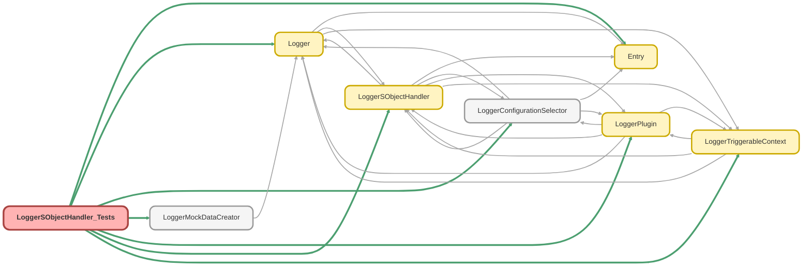

---
hide:
  - path
---

# LoggerSObjectHandler_Tests Class

`SUPPRESSWARNINGS`
`ISTEST`

Test class for LoggerSObjectHandler, the trigger-handler framework used by Nebula Logger. 
To demonstrate that the framework is standalone/would work with any SObject, these test methods 
all use mock implementations of the handler, using the `Schema.User` SObject

## Class Diagram



<!-- Apex description -->

## Apex Code

```java
//------------------------------------------------------------------------------------------------//
// This file is part of the Nebula Logger project, released under the MIT License.                //
// See LICENSE file or go to https://github.com/jongpie/NebulaLogger for full license details.    //
//------------------------------------------------------------------------------------------------//

/**
 * @description Test class for LoggerSObjectHandler, the trigger-handler framework used by Nebula Logger.
 *              To demonstrate that the framework is standalone/would work with any SObject, these test methods
 *              all use mock implementations of the handler, using the `Schema.User` SObject
 */
@SuppressWarnings('PMD.ApexDoc, PMD.ApexAssertionsShouldIncludeMessage, PMD.MethodNamingConventions')
@IsTest(IsParallel=true)
private class LoggerSObjectHandler_Tests {
  private static final String FAKE_PROFILE_NAME = 'Some String';

  static {
    // Don't use the org's actual custom metadata records when running tests
    LoggerConfigurationSelector.useMocks();
  }

  @IsTest
  static void it_should_return_configured_sobject_handler() {
    Schema.SObjectType sobjectType = new MockSObjectHandler().getSObjectType();
    LoggerSObjectHandler.setMock(
      new LoggerSObjectHandler__mdt(
        IsEnabled__c = true,
        SObjectHandlerApexClass__c = MockSObjectHandler.class.getName(),
        SObjectType__c = sobjectType.toString()
      )
    );

    LoggerSObjectHandler configuredInstance = LoggerSObjectHandler.getHandler(sobjectType);

    System.Assert.isInstanceOfType(
      configuredInstance,
      MockSObjectHandler.class,
      'The returned handler should be an instance of the configured class, MockSObjectHandler'
    );
  }

  @IsTest
  static void it_should_return_handler_via_override() {
    Schema.SObjectType sobjectType = new MockSObjectHandler().getSObjectType();
    LoggerSObjectHandler.setMock(
      new LoggerSObjectHandler__mdt(
        IsEnabled__c = true,
        SObjectHandlerApexClass__c = MockSObjectHandler.class.getName(),
        SObjectTypeOverride__c = sobjectType.toString()
      )
    );

    LoggerSObjectHandler configuredInstance = LoggerSObjectHandler.getHandler(sobjectType);

    System.Assert.isInstanceOfType(
      configuredInstance,
      MockSObjectHandler.class,
      'The handler returned via override should be an instance of the configured class, MockSObjectHandler'
    );
  }

  @IsTest
  static void it_should_return_default_sobject_handler_implementation_when_no_configuration_provided() {
    Schema.SObjectType sobjectType = new MockDefaultImplementationSObjectHandler().getSObjectType();
    LoggerSObjectHandler defaultImplementation = new MockDefaultImplementationSObjectHandler();

    LoggerSObjectHandler configuredInstance = LoggerSObjectHandler.getHandler(sobjectType, defaultImplementation);

    System.Assert.isInstanceOfType(
      configuredInstance,
      MockDefaultImplementationSObjectHandler.class,
      'The returned handler should be an instance of the default implementation class, MockDefaultImplementationSObjectHandler'
    );
  }

  @IsTest
  static void it_should_override_triggerable_context() {
    MockSObjectHandler mockHandler = new MockSObjectHandler(Schema.User.SObjectType);
    LoggerTriggerableContext originalContext = mockHandler.input;
    LoggerTriggerableContext customContext = new LoggerTriggerableContext(
      Schema.User.SObjectType,
      System.TriggerOperation.BEFORE_INSERT,
      new List<Schema.User>{ new Schema.User(Id = System.UserInfo.getUserId(), Email = System.UserInfo.getUserEmail()) }
    );
    System.Assert.areNotEqual(originalContext, customContext);

    mockHandler.overrideTriggerableContext(customContext);

    System.Assert.areNotEqual(originalContext, mockHandler.input);
    System.Assert.areEqual(customContext, mockHandler.input);
  }

  @IsTest
  static void it_should_not_run_when_disabled_via_logger_parameter() {
    Schema.User mockUser = (Schema.User) LoggerMockDataCreator.createUser();
    mockUser.Id = LoggerMockDataCreator.createId(Schema.User.SObjectType);
    List<SObject> records = new List<Schema.User>{ mockUser };
    MockSObjectHandler mockHandler = new MockSObjectHandler(Schema.User.SObjectType);
    mockHandler.handlerConfiguration = new LoggerSObjectHandler__mdt(IsEnabled__c = false);
    mockHandler.triggerOperationType = System.TriggerOperation.BEFORE_INSERT;
    mockHandler.triggerNew = records;
    mockHandler.triggerNewMap = null;
    mockHandler.triggerOldMap = null;

    mockHandler.execute();

    System.Assert.areEqual(0, mockHandler.executionCount, mockHandler.toString());
  }

  @IsTest
  static void it_should_not_run_when_disabled_via_private_method() {
    Schema.User mockUser = (Schema.User) LoggerMockDataCreator.createUser();
    mockUser.Id = LoggerMockDataCreator.createId(Schema.User.SObjectType);
    List<SObject> records = new List<Schema.User>{ mockUser };
    MockSObjectHandler mockHandler = new MockSObjectHandler(Schema.User.SObjectType);
    mockHandler.handlerConfiguration = new LoggerSObjectHandler__mdt(IsEnabled__c = true);
    mockHandler.triggerOperationType = System.TriggerOperation.BEFORE_INSERT;
    mockHandler.triggerNew = records;
    mockHandler.triggerNewMap = null;
    mockHandler.triggerOldMap = null;

    LoggerSObjectHandler.shouldExecute(false);
    mockHandler.execute();

    System.Assert.areEqual(0, mockHandler.executionCount, mockHandler.toString());
  }

  @IsTest
  static void it_should_run_before_insert_method() {
    Schema.User mockUser = (Schema.User) LoggerMockDataCreator.createUser();
    mockUser.Id = LoggerMockDataCreator.createId(Schema.User.SObjectType);
    List<SObject> records = new List<Schema.User>{ mockUser };
    MockSObjectHandler mockHandler = new MockSObjectHandler(Schema.User.SObjectType);
    mockHandler.triggerOperationType = System.TriggerOperation.BEFORE_INSERT;
    mockHandler.triggerNew = records;
    mockHandler.triggerNewMap = null;
    mockHandler.triggerOldMap = null;

    mockHandler.execute();

    System.Assert.areEqual(1, mockHandler.executionCount);
    System.Assert.areEqual(System.TriggerOperation.BEFORE_INSERT, mockHandler.executedTriggerOperationType);
    System.Assert.areEqual(mockHandler.triggerNew, mockHandler.executedTriggerNew);
    System.Assert.isNull(mockHandler.executedTriggerNewMap);
    System.Assert.isNull(mockHandler.executedTriggerOldMap);
  }

  @IsTest
  static void it_should_run_before_update_method() {
    Schema.User mockUser = (Schema.User) LoggerMockDataCreator.createUser();
    mockUser.Id = LoggerMockDataCreator.createId(Schema.User.SObjectType);
    List<SObject> records = new List<Schema.User>{ mockUser };
    MockSObjectHandler mockHandler = new MockSObjectHandler(Schema.User.SObjectType);
    mockHandler.triggerOperationType = System.TriggerOperation.BEFORE_UPDATE;
    mockHandler.triggerNew = null;
    mockHandler.triggerNewMap = new Map<Id, SObject>(records);
    mockHandler.triggerOldMap = new Map<Id, SObject>(records);

    mockHandler.execute();

    System.Assert.areEqual(1, mockHandler.executionCount);
    System.Assert.areEqual(System.TriggerOperation.BEFORE_UPDATE, mockHandler.executedTriggerOperationType);
    System.Assert.isNull(mockHandler.executedTriggerNew);
    System.Assert.areEqual(mockHandler.triggerNewMap, mockHandler.executedTriggerNewMap);
    System.Assert.areEqual(mockHandler.triggerOldMap, mockHandler.executedTriggerOldMap);
  }

  @IsTest
  static void it_should_run_before_delete_method() {
    Schema.User mockUser = (Schema.User) LoggerMockDataCreator.createUser();
    mockUser.Id = LoggerMockDataCreator.createId(Schema.User.SObjectType);
    List<SObject> records = new List<Schema.User>{ mockUser };
    MockSObjectHandler mockHandler = new MockSObjectHandler(Schema.User.SObjectType);
    mockHandler.triggerOperationType = System.TriggerOperation.BEFORE_DELETE;
    mockHandler.triggerNew = null;
    mockHandler.triggerNewMap = new Map<Id, SObject>(records);
    mockHandler.triggerOldMap = null;

    mockHandler.execute();

    System.Assert.areEqual(1, mockHandler.executionCount);
    System.Assert.areEqual(System.TriggerOperation.BEFORE_DELETE, mockHandler.executedTriggerOperationType);
    System.Assert.isNull(mockHandler.executedTriggerNew);
    System.Assert.areEqual(mockHandler.triggerNewMap, mockHandler.executedTriggerNewMap);
    System.Assert.isNull(mockHandler.executedTriggerOldMap);
  }

  @IsTest
  static void it_should_run_after_insert_methods() {
    // To handle AFTER_INSERT on LogEntryEvent__e, LoggerSObjectHandler has 2 methods - one with
    // a list of SObject records (triggerNew), and another with a map of SObject records (triggerNewMap)
    Schema.User mockUser = (Schema.User) LoggerMockDataCreator.createUser();
    mockUser.Id = LoggerMockDataCreator.createId(Schema.User.SObjectType);
    List<SObject> records = new List<Schema.User>{ mockUser };
    MockSObjectHandler mockHandler = new MockSObjectHandler(Schema.User.SObjectType);
    mockHandler.triggerOperationType = System.TriggerOperation.AFTER_INSERT;
    mockHandler.triggerNew = records;
    mockHandler.triggerNewMap = new Map<Id, SObject>(records);
    mockHandler.triggerOldMap = null;

    mockHandler.execute();

    System.Assert.areEqual(2, mockHandler.executionCount);
    System.Assert.areEqual(System.TriggerOperation.AFTER_INSERT, mockHandler.executedTriggerOperationType);
    System.Assert.areEqual(mockHandler.triggerNew, mockHandler.executedTriggerNew);
    System.Assert.areEqual(mockHandler.triggerNewMap, mockHandler.executedTriggerNewMap);
    System.Assert.isNull(mockHandler.executedTriggerOldMap);
  }

  @IsTest
  static void it_should_run_after_update_method() {
    Schema.User mockUser = (Schema.User) LoggerMockDataCreator.createUser();
    mockUser.Id = LoggerMockDataCreator.createId(Schema.User.SObjectType);
    List<SObject> records = new List<Schema.User>{ mockUser };
    MockSObjectHandler mockHandler = new MockSObjectHandler(Schema.User.SObjectType);
    mockHandler.triggerOperationType = System.TriggerOperation.AFTER_UPDATE;
    mockHandler.triggerNew = null;
    mockHandler.triggerNewMap = new Map<Id, SObject>(records);
    mockHandler.triggerOldMap = new Map<Id, SObject>(records);

    mockHandler.execute();

    System.Assert.areEqual(1, mockHandler.executionCount);
    System.Assert.areEqual(System.TriggerOperation.AFTER_UPDATE, mockHandler.executedTriggerOperationType);
    System.Assert.isNull(mockHandler.executedTriggerNew);
    System.Assert.areEqual(mockHandler.triggerNewMap, mockHandler.executedTriggerNewMap);
    System.Assert.areEqual(mockHandler.triggerOldMap, mockHandler.executedTriggerOldMap);
  }

  @IsTest
  static void it_should_run_after_delete_method() {
    Schema.User mockUser = (Schema.User) LoggerMockDataCreator.createUser();
    mockUser.Id = LoggerMockDataCreator.createId(Schema.User.SObjectType);
    List<SObject> records = new List<Schema.User>{ mockUser };
    MockSObjectHandler mockHandler = new MockSObjectHandler(Schema.User.SObjectType);
    mockHandler.triggerOperationType = System.TriggerOperation.AFTER_DELETE;
    mockHandler.triggerNew = null;
    mockHandler.triggerNewMap = new Map<Id, SObject>(records);
    mockHandler.triggerOldMap = null;

    mockHandler.execute();

    System.Assert.areEqual(1, mockHandler.executionCount);
    System.Assert.areEqual(System.TriggerOperation.AFTER_DELETE, mockHandler.executedTriggerOperationType);
    System.Assert.isNull(mockHandler.executedTriggerNew);
    System.Assert.areEqual(mockHandler.triggerNewMap, mockHandler.executedTriggerNewMap);
    System.Assert.isNull(mockHandler.executedTriggerOldMap);
  }

  @IsTest
  static void it_should_run_after_undelete_method() {
    Schema.User mockUser = (Schema.User) LoggerMockDataCreator.createUser();
    mockUser.Id = LoggerMockDataCreator.createId(Schema.User.SObjectType);
    List<SObject> records = new List<Schema.User>{ mockUser };
    MockSObjectHandler mockHandler = new MockSObjectHandler(Schema.User.SObjectType);
    mockHandler.triggerOperationType = System.TriggerOperation.AFTER_UNDELETE;
    mockHandler.triggerNew = null;
    mockHandler.triggerNewMap = new Map<Id, SObject>(records);
    mockHandler.triggerOldMap = null;

    mockHandler.execute();

    System.Assert.areEqual(1, mockHandler.executionCount);
    System.Assert.areEqual(System.TriggerOperation.AFTER_UNDELETE, mockHandler.executedTriggerOperationType);
    System.Assert.isNull(mockHandler.executedTriggerNew);
    System.Assert.areEqual(mockHandler.triggerNewMap, mockHandler.executedTriggerNewMap);
    System.Assert.isNull(mockHandler.executedTriggerOldMap);
  }

  @IsTest
  static void it_should_gracefully_skip_non_existent_apex_plugin() {
    Schema.User mockUser = (Schema.User) LoggerMockDataCreator.createUser();
    mockUser.Id = LoggerMockDataCreator.createId(Schema.User.SObjectType);
    List<SObject> records = new List<Schema.User>{ mockUser };
    MockSObjectHandler mockHandler = new MockSObjectHandler(Schema.User.SObjectType);
    mockHandler.triggerOperationType = System.TriggerOperation.BEFORE_INSERT;
    mockHandler.triggerNew = records;
    mockHandler.triggerNewMap = null;
    mockHandler.triggerOldMap = null;
    LoggerPlugin__mdt pluginConfiguration = new LoggerPlugin__mdt(
      DeveloperName = 'Mock_Plugin',
      IsEnabled__c = true,
      SObjectHandlerApexClass__c = 'Some_Fake_Apex_Class'
    );
    mockHandler.getPluginConfigurations().add(pluginConfiguration);

    mockHandler.execute();

    System.Assert.areEqual(1, mockHandler.executionCount);
    System.Assert.areEqual(1, mockHandler.getPluginConfigurations().size(), mockHandler.getPluginConfigurations().toString());
    System.Assert.areEqual(0, mockHandler.getExecutedApexPlugins().size(), mockHandler.getExecutedApexPlugins().toString());
  }

  @IsTest
  static void it_should_execute_apex_plugin() {
    Schema.User mockUser = (Schema.User) LoggerMockDataCreator.createUser();
    mockUser.Id = LoggerMockDataCreator.createId(Schema.User.SObjectType);
    List<SObject> records = new List<Schema.User>{ mockUser };
    MockSObjectHandler mockHandler = new MockSObjectHandler(Schema.User.SObjectType);
    mockHandler.triggerOperationType = System.TriggerOperation.BEFORE_INSERT;
    mockHandler.triggerNew = records;
    mockHandler.triggerNewMap = null;
    mockHandler.triggerOldMap = null;
    LoggerPlugin__mdt mockPluginConfiguration = new LoggerPlugin__mdt(
      DeveloperName = 'ExampleApexPlugin',
      IsEnabled__c = true,
      SObjectHandlerApexClass__c = MockTriggerablePlugin.class.getName()
    );
    mockHandler.getPluginConfigurations().add(mockPluginConfiguration);

    mockHandler.execute();

    System.Assert.areEqual(1, mockHandler.executionCount);
    System.Assert.areEqual(1, mockHandler.getPluginConfigurations().size(), mockHandler.getPluginConfigurations().toString());
    System.Assert.areEqual(1, mockHandler.getExecutedApexPlugins().size(), mockHandler.getExecutedApexPlugins().toString());
    MockTriggerablePlugin executedApexPlugin = (MockTriggerablePlugin) mockHandler.getExecutedApexPlugins().get(0);
    System.Assert.areEqual(mockPluginConfiguration, executedApexPlugin.configuration);
    System.Assert.areEqual(mockHandler.input, executedApexPlugin.input);
  }

  @IsTest
  static void it_should_gracefully_skip_non_existent_flow_plugin() {
    Schema.User mockUser = (Schema.User) LoggerMockDataCreator.createUser();
    mockUser.Id = LoggerMockDataCreator.createId(Schema.User.SObjectType);
    List<SObject> records = new List<Schema.User>{ mockUser };
    MockSObjectHandler mockHandler = new MockSObjectHandler(Schema.User.SObjectType);
    mockHandler.triggerOperationType = System.TriggerOperation.BEFORE_INSERT;
    mockHandler.triggerNew = records;
    mockHandler.triggerNewMap = null;
    mockHandler.triggerOldMap = null;
    LoggerPlugin__mdt pluginConfiguration = new LoggerPlugin__mdt(
      DeveloperName = 'Mock_Plugin',
      IsEnabled__c = true,
      SObjectHandlerFlowName__c = 'Some_Fake_Flow'
    );
    mockHandler.getPluginConfigurations().add(pluginConfiguration);

    mockHandler.execute();

    System.Assert.areEqual(1, mockHandler.executionCount);
    System.Assert.areEqual(1, mockHandler.getPluginConfigurations().size(), mockHandler.getPluginConfigurations().toString());
    System.Assert.areEqual(0, mockHandler.getExecutedApexPlugins().size(), mockHandler.getExecutedApexPlugins().toString());
  }

  public class MockDefaultImplementationSObjectHandler extends LoggerSObjectHandler {
    public override Schema.SObjectType getSObjectType() {
      return Schema.User.SObjectType;
    }
  }

  public class MockSObjectHandler extends LoggerSObjectHandler {
    public Integer executionCount = 0;
    public System.TriggerOperation executedTriggerOperationType;
    public List<SObject> executedTriggerNew;
    public Map<Id, SObject> executedTriggerNewMap;
    public Map<Id, SObject> executedTriggerOldMap;

    private Schema.SObjectType sobjectType;

    public MockSObjectHandler() {
      this.sobjectType = Schema.User.SObjectType;
    }

    public MockSObjectHandler(Schema.SObjectType sobjectType) {
      this.sobjectType = sobjectType;
    }

    public override Schema.SObjectType getSObjectType() {
      return this.sobjectType;
    }

    protected override void executeBeforeInsert(List<SObject> triggerNew) {
      this.executionCount++;
      this.executedTriggerOperationType = System.TriggerOperation.BEFORE_INSERT;
      this.executedTriggerNew = triggerNew;
      super.executeBeforeInsert(triggerNew);
    }

    protected override void executeBeforeUpdate(Map<Id, SObject> triggerNewMap, Map<Id, SObject> triggerOldMap) {
      this.executionCount++;
      this.executedTriggerOperationType = System.TriggerOperation.BEFORE_UPDATE;
      this.executedTriggerNewMap = triggerNewMap;
      this.executedTriggerOldMap = triggerOldMap;
      super.executeBeforeUpdate(triggerNewMap, triggerOldMap);
    }

    protected override void executeBeforeDelete(Map<Id, SObject> triggerNewMap) {
      this.executionCount++;
      this.executedTriggerOperationType = System.TriggerOperation.BEFORE_DELETE;
      this.executedTriggerNewMap = triggerNewMap;
      super.executeBeforeDelete(triggerNewMap);
    }

    protected override void executeAfterInsert(List<SObject> triggerNew) {
      this.executionCount++;
      this.executedTriggerOperationType = System.TriggerOperation.AFTER_INSERT;
      this.executedTriggerNew = triggerNew;
      super.executeAfterInsert(triggerNew);
    }

    protected override void executeAfterInsert(Map<Id, SObject> triggerNewMap) {
      this.executionCount++;
      this.executedTriggerOperationType = System.TriggerOperation.AFTER_INSERT;
      this.executedTriggerNewMap = triggerNewMap;
      super.executeAfterInsert(triggerNewMap);
    }

    protected override void executeAfterUpdate(Map<Id, SObject> triggerNewMap, Map<Id, SObject> triggerOldMap) {
      this.executionCount++;
      this.executedTriggerOperationType = System.TriggerOperation.AFTER_UPDATE;
      this.executedTriggerNewMap = triggerNewMap;
      this.executedTriggerOldMap = triggerOldMap;
      super.executeAfterUpdate(triggerNewMap, triggerOldMap);
    }

    protected override void executeAfterDelete(Map<Id, SObject> triggerNewMap) {
      this.executionCount++;
      this.executedTriggerOperationType = System.TriggerOperation.AFTER_DELETE;
      this.executedTriggerNewMap = triggerNewMap;
      super.executeAfterDelete(triggerNewMap);
    }

    protected override void executeAfterUndelete(Map<Id, SObject> triggerNewMap) {
      this.executionCount++;
      this.executedTriggerOperationType = System.TriggerOperation.AFTER_UNDELETE;
      this.executedTriggerNewMap = triggerNewMap;
      super.executeAfterUndelete(triggerNewMap);
    }
  }

  public class MockTriggerablePlugin implements LoggerPlugin.Triggerable {
    public Boolean hasExecuted { get; private set; }
    public LoggerPlugin__mdt configuration { get; private set; }
    public LoggerTriggerableContext input { get; private set; }

    public void execute(LoggerPlugin__mdt configuration, LoggerTriggerableContext input) {
      this.hasExecuted = true;
      this.configuration = configuration;
      this.input = input;
    }
  }
}
```

## Fields
### `FAKE_PROFILE_NAME`

#### Signature
```apex
private static final FAKE_PROFILE_NAME
```

#### Type
String

## Methods
### `it_should_return_configured_sobject_handler()`

`ISTEST`

#### Signature
```apex
private static void it_should_return_configured_sobject_handler()
```

#### Return Type
**void**

---

### `it_should_return_handler_via_override()`

`ISTEST`

#### Signature
```apex
private static void it_should_return_handler_via_override()
```

#### Return Type
**void**

---

### `it_should_return_default_sobject_handler_implementation_when_no_configuration_provided()`

`ISTEST`

#### Signature
```apex
private static void it_should_return_default_sobject_handler_implementation_when_no_configuration_provided()
```

#### Return Type
**void**

---

### `it_should_override_triggerable_context()`

`ISTEST`

#### Signature
```apex
private static void it_should_override_triggerable_context()
```

#### Return Type
**void**

---

### `it_should_not_run_when_disabled_via_logger_parameter()`

`ISTEST`

#### Signature
```apex
private static void it_should_not_run_when_disabled_via_logger_parameter()
```

#### Return Type
**void**

---

### `it_should_not_run_when_disabled_via_private_method()`

`ISTEST`

#### Signature
```apex
private static void it_should_not_run_when_disabled_via_private_method()
```

#### Return Type
**void**

---

### `it_should_run_before_insert_method()`

`ISTEST`

#### Signature
```apex
private static void it_should_run_before_insert_method()
```

#### Return Type
**void**

---

### `it_should_run_before_update_method()`

`ISTEST`

#### Signature
```apex
private static void it_should_run_before_update_method()
```

#### Return Type
**void**

---

### `it_should_run_before_delete_method()`

`ISTEST`

#### Signature
```apex
private static void it_should_run_before_delete_method()
```

#### Return Type
**void**

---

### `it_should_run_after_insert_methods()`

`ISTEST`

#### Signature
```apex
private static void it_should_run_after_insert_methods()
```

#### Return Type
**void**

---

### `it_should_run_after_update_method()`

`ISTEST`

#### Signature
```apex
private static void it_should_run_after_update_method()
```

#### Return Type
**void**

---

### `it_should_run_after_delete_method()`

`ISTEST`

#### Signature
```apex
private static void it_should_run_after_delete_method()
```

#### Return Type
**void**

---

### `it_should_run_after_undelete_method()`

`ISTEST`

#### Signature
```apex
private static void it_should_run_after_undelete_method()
```

#### Return Type
**void**

---

### `it_should_gracefully_skip_non_existent_apex_plugin()`

`ISTEST`

#### Signature
```apex
private static void it_should_gracefully_skip_non_existent_apex_plugin()
```

#### Return Type
**void**

---

### `it_should_execute_apex_plugin()`

`ISTEST`

#### Signature
```apex
private static void it_should_execute_apex_plugin()
```

#### Return Type
**void**

---

### `it_should_gracefully_skip_non_existent_flow_plugin()`

`ISTEST`

#### Signature
```apex
private static void it_should_gracefully_skip_non_existent_flow_plugin()
```

#### Return Type
**void**

## Classes
### MockDefaultImplementationSObjectHandler Class

#### Methods
##### `getSObjectType()`

###### Signature
```apex
public override Schema.SObjectType getSObjectType()
```

###### Return Type
**Schema.SObjectType**

### MockSObjectHandler Class

#### Fields
##### `executionCount`

###### Signature
```apex
public executionCount
```

###### Type
Integer

---

##### `executedTriggerOperationType`

###### Signature
```apex
public executedTriggerOperationType
```

###### Type
System.TriggerOperation

---

##### `executedTriggerNew`

###### Signature
```apex
public executedTriggerNew
```

###### Type
List<SObject>

---

##### `executedTriggerNewMap`

###### Signature
```apex
public executedTriggerNewMap
```

###### Type
Map<Id,SObject>

---

##### `executedTriggerOldMap`

###### Signature
```apex
public executedTriggerOldMap
```

###### Type
Map<Id,SObject>

---

##### `sobjectType`

###### Signature
```apex
private sobjectType
```

###### Type
Schema.SObjectType

#### Constructors
##### `MockSObjectHandler()`

###### Signature
```apex
public MockSObjectHandler()
```

---

##### `MockSObjectHandler(sobjectType)`

###### Signature
```apex
public MockSObjectHandler(Schema.SObjectType sobjectType)
```

###### Parameters
| Name | Type | Description |
|------|------|-------------|
| sobjectType | Schema.SObjectType |  |

#### Methods
##### `getSObjectType()`

###### Signature
```apex
public override Schema.SObjectType getSObjectType()
```

###### Return Type
**Schema.SObjectType**

### MockTriggerablePlugin Class

**Implements**

LoggerPlugin.Triggerable

#### Properties
##### `hasExecuted`

###### Signature
```apex
public hasExecuted
```

###### Type
Boolean

---

##### `configuration`

###### Signature
```apex
public configuration
```

###### Type
LoggerPlugin__mdt

---

##### `input`

###### Signature
```apex
public input
```

###### Type
[LoggerTriggerableContext](../configuration/LoggerTriggerableContext.md)

#### Methods
##### `execute(configuration, input)`

###### Signature
```apex
public void execute(LoggerPlugin__mdt configuration, LoggerTriggerableContext input)
```

###### Parameters
| Name | Type | Description |
|------|------|-------------|
| configuration | LoggerPlugin__mdt |  |
| input | [LoggerTriggerableContext](../configuration/LoggerTriggerableContext.md) |  |

###### Return Type
**void**