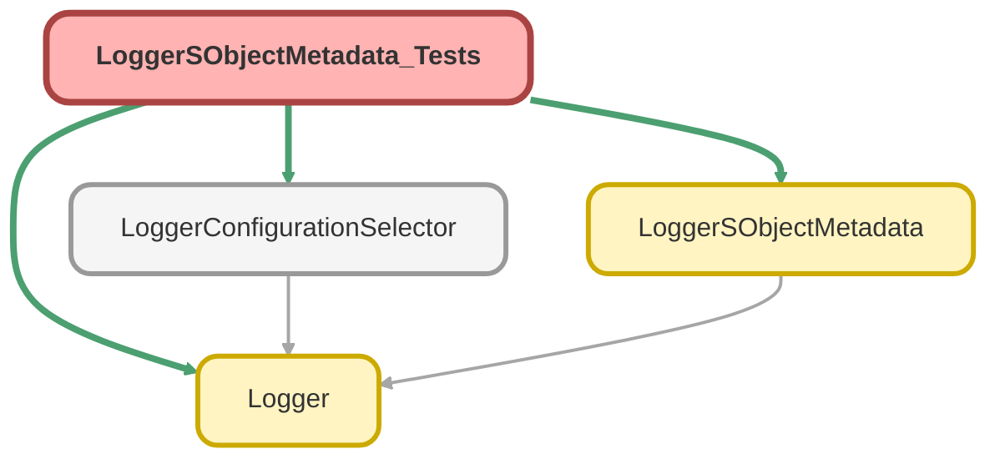

---
hide:
  - path
---

# LoggerSObjectMetadata_Tests Class

`SUPPRESSWARNINGS`
`ISTEST`

Test class for LoggerSObjectMetadata, used for dynamically converting SObject describe details 
into `@AuraEnabled` objects that can be used in LWCs 
To demonstrate that the class is standalone/would work with any SObject, these test methods 
all use the `Schema.User` SObject

## Class Diagram



<!-- Apex description -->

## Apex Code

```java
//------------------------------------------------------------------------------------------------//
// This file is part of the Nebula Logger project, released under the MIT License.                //
// See LICENSE file or go to https://github.com/jongpie/NebulaLogger for full license details.    //
//------------------------------------------------------------------------------------------------//

/**
 * @description Test class for LoggerSObjectMetadata, used for dynamically converting SObject describe details
 *              into `@AuraEnabled` objects that can be used in LWCs
 *              To demonstrate that the class is standalone/would work with any SObject, these test methods
 *              all use the `Schema.User` SObject
 */
@SuppressWarnings('PMD.ApexDoc, PMD.ApexUnitTestClassShouldHaveAsserts, PMD.MethodNamingConventions')
@IsTest(IsParallel=true)
private class LoggerSObjectMetadata_Tests {
  static {
    // Don't use the org's actual custom metadata records when running tests
    LoggerConfigurationSelector.useMocks();
  }

  @IsTest
  static void it_should_return_schema_for_specified_sobject_api_name() {
    Schema.SObjectType userSObjectType = Schema.User.SObjectType;
    String userSObjectApiName = userSObjectType.toString();
    // TODO Add `Schema.` prefix if the string API name doesn't include `.` (unqualified)
    LoggerSObjectMetadata.SObjectSchema sobjectSchema = LoggerSObjectMetadata.getSchemaForName(userSObjectApiName);
    validateSObjectDetails(userSObjectType, sobjectSchema);
  }

  @IsTest
  static void it_should_return_schema_for_specified_sobject_type() {
    Schema.SObjectType userSObjectType = Schema.User.SObjectType;
    LoggerSObjectMetadata.SObjectSchema sobjectSchema = LoggerSObjectMetadata.getSchema(userSObjectType);
    validateSObjectDetails(userSObjectType, sobjectSchema);
  }

  private static void validateSObjectDetails(Schema.SObjectType sobjectType, LoggerSObjectMetadata.SObjectSchema sobjectSchema) {
    // SObject details
    System.Assert.areEqual(sobjectType.getDescribe().getLabel(), sobjectSchema.label);
    System.Assert.areEqual(sobjectType.getDescribe().getLabelPlural(), sobjectSchema.labelPlural);
    System.Assert.areEqual(sobjectType.getDescribe().getLocalName(), sobjectSchema.localApiName);
    System.Assert.areEqual(sobjectType.toString(), sobjectSchema.apiName);
    System.Assert.areEqual(sobjectType.getDescribe().fields.getMap().size(), sobjectSchema.fields.size());

    // Field details
    for (Schema.SObjectField field : sobjectType.getDescribe().fields.getMap().values()) {
      System.Assert.isTrue(sobjectSchema.fields.containsKey(field.getDescribe().getLocalName()));
    }
    for (LoggerSObjectMetadata.FieldSchema fieldSchema : sobjectSchema.fields.values()) {
      Schema.SObjectField matchingField = sobjectType.getDescribe().fields.getMap().get(fieldSchema.apiName);
      System.Assert.areEqual(matchingField.getDescribe().getLocalName(), fieldSchema.localApiName);
      System.Assert.areEqual(matchingField.getDescribe().getInlineHelpText(), fieldSchema.inlineHelpText);
      System.Assert.areEqual(matchingField.getDescribe().getLabel(), fieldSchema.label);
      System.Assert.areEqual(matchingField.getDescribe().getType().name().toLowerCase(), fieldSchema.type);
    }
  }
}
```

## Methods
### `it_should_return_schema_for_specified_sobject_api_name()`

`ISTEST`

#### Signature
```apex
private static void it_should_return_schema_for_specified_sobject_api_name()
```

#### Return Type
**void**

---

### `it_should_return_schema_for_specified_sobject_type()`

`ISTEST`

#### Signature
```apex
private static void it_should_return_schema_for_specified_sobject_type()
```

#### Return Type
**void**

---

### `validateSObjectDetails(sobjectType, sobjectSchema)`

#### Signature
```apex
private static void validateSObjectDetails(Schema.SObjectType sobjectType, LoggerSObjectMetadata.SObjectSchema sobjectSchema)
```

#### Parameters
| Name | Type | Description |
|------|------|-------------|
| sobjectType | Schema.SObjectType |  |
| sobjectSchema | LoggerSObjectMetadata.SObjectSchema |  |

#### Return Type
**void**